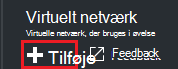
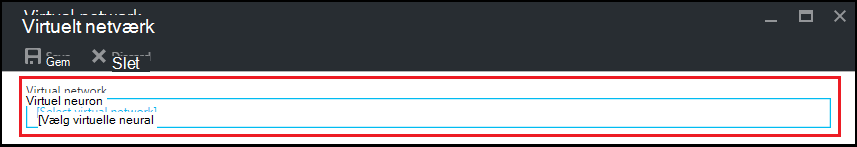
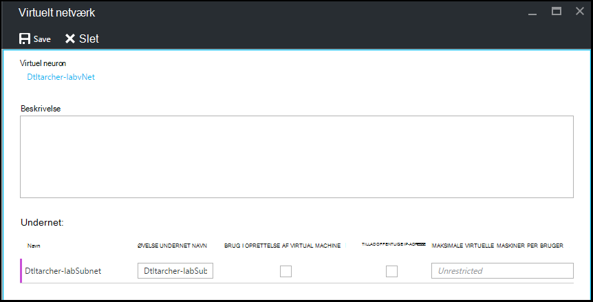

<properties
    pageTitle="Konfigurere et virtuelt netværk i Azure DevTest øvelser | Microsoft Azure"
    description="Lær, hvordan du konfigurerer en eksisterende virtuelt netværk og undernet og bruge dem i en VM med Azure DevTest øvelser"
    services="devtest-lab,virtual-machines"
    documentationCenter="na"
    authors="tomarcher"
    manager="douge"
    editor=""/>

<tags
    ms.service="devtest-lab"
    ms.workload="na"
    ms.tgt_pltfrm="na"
    ms.devlang="na"
    ms.topic="article"
    ms.date="09/06/2016"
    ms.author="tarcher"/>

# Konfigurere et virtuelt netværk i Azure DevTest øvelser

Som beskrevet i artiklen, [Tilføj en VM med elementer til en øvelse](devtest-lab-add-vm-with-artifacts.md), når du opretter en VM i en øvelse, kan du angive et konfigureret virtuelt netværk. Et scenarie for at gøre dette er, hvis du har brug at få adgang til dine corpnet ressourcer fra din FOS ved hjælp af det virtuelle netværk, der blev konfigureret med ExpressRoute eller VPN-websted til websted. I de følgende afsnit viser, hvordan du tilføjer din eksisterende virtuelt netværk i en øvelse virtuelle netværksindstillinger, så det er muligt at vælge, når du opretter FOS.

## Konfigurere et virtuelt netværk for en øvelse ved hjælp af portalen Azure
Følgende trin hjælper dig med at tilføje en eksisterende virtuelt netværk (og undernet) til en øvelse, så den kan bruges, når du opretter en VM i den samme øvelse. 

1. Log på [Azure-portalen](http://go.microsoft.com/fwlink/p/?LinkID=525040).

1. Vælg **Flere tjenester**, og vælg derefter **DevTest øvelser** på listen.

1. Vælg den ønskede øvelse på listen over øvelser. 

1. Vælg **konfiguration**på den øvelse blade.

1. Vælg **virtuelle netværk**på den øvelse **konfiguration** blade.

1. På bladet **virtuelle netværk** , kan du se en liste over virtuelle netværk konfigureret til den aktuelle øvelse samt det virtuelle netværk, der er oprettet for dine øvelse. 

1. Vælg **+ Tilføj**.

    
    
1. Vælg **[Vælg virtuelt netværk]**bladet **virtuelle netværk** .

    
    
1. Vælg det ønskede virtuelle netværk bladet **Vælg virtuelt netværk** . Bladet viser de virtuelle netværk, der er under det samme område i abonnementet, som øvelse.  

1. Når du har valgt et virtuelt netværk, du vender tilbage til bladet **virtuelle netværk** og flere felter er aktiveret.  

    

1. Angive en beskrivelse til netværket virtuel / øvelse kombination.

1. For at give et undernet skal bruges i øvelse VM oprettelse, markere **Brug i VIRTUELT oprettelse**.

1. For at give offentlige IP-adresser i et undernet, skal du markere **Tillad offentlige IP-adresse**.

1. Angiv de maksimale FOS per bruger for hvert undernet, i feltet **Maksimalt VIRTUELLE maskiner PER bruger** . Hvis du vil et ubegrænset antal FOS, Lad dette felt stå tomt.

1. Vælg **Gem**.

1. Nu, hvor det virtuelle netværk er konfigureret, kan det være markeret når du opretter en VM. Hvis du vil se, hvordan du opretter en VM og angive et virtuelt netværk skal referere til i artiklen, [tilføje en VM med elementer til en øvelse](devtest-lab-add-vm-with-artifacts.md). 

[AZURE.INCLUDE [devtest-lab-try-it-out](../../includes/devtest-lab-try-it-out.md)]

## Næste trin

Når du har føjet det ønskede virtuelle netværk til din øvelse, er næste trin at [tilføje en VM til din øvelse](devtest-lab-add-vm-with-artifacts.md).