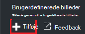
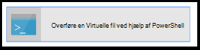
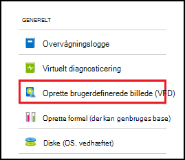
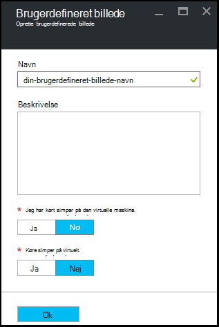

<properties
    pageTitle="Administrere Azure DevTest øvelser brugerdefinerede billeder for at oprette FOS | Microsoft Azure"
    description="Lær at oprette et brugerdefineret billede fra en Virtuelle fil eller fra en eksisterende VM i Azure DevTest øvelser"
    services="devtest-lab,virtual-machines"
    documentationCenter="na"
    authors="tomarcher"
    manager="douge"
    editor=""/>

<tags
    ms.service="devtest-lab"
    ms.workload="na"
    ms.tgt_pltfrm="na"
    ms.devlang="na"
    ms.topic="article"
    ms.date="09/07/2016"
    ms.author="tarcher"/>

# Administrere Azure DevTest øvelser brugerdefinerede billeder for at oprette FOS

I Azure DevTest øvelser kan brugerdefinerede billeder du oprette FOS hurtigt uden at vente al den nødvendige software skal være installeret på maskinen mål. Brugerdefinerede billeder gør det muligt at installere alle de programmer, du skal bruge i filen Virtuelle, og brug derefter filen Virtuelle til at oprette en VM. Da softwaren allerede er installeret, er det meget hurtigere oprettelsestidspunkt VM. Desuden bruges brugerdefinerede billeder til at klone FOS ved at oprette et brugerdefineret billede fra en VM og derefter oprette FOS fra den brugerdefinerede billede.

I denne artikel kan du lære, hvordan du:

- [Oprette et brugerdefineret billede fra en Virtuelle fil](#create-a-custom-image-from-a-vhd-file) så du kan derefter oprette en VM fra den brugerdefinerede billede. 
- [Oprette et brugerdefineret billede fra en VM](#create-a-custom-image-from-a-vm) til hurtig VM klone.

## Oprette et brugerdefineret billede fra en Virtuelle fil

I dette afsnit, skal se du, hvordan til at oprette et brugerdefineret billede fra en Virtuelle fil.
Du skal have adgang til en gyldig Virtuelle fil til at udføre alle trinnene i dette afsnit.   

1. Log på [Azure-portalen](http://go.microsoft.com/fwlink/p/?LinkID=525040).

1. Vælg **flere tjenester**, og vælg derefter **DevTest øvelser** på listen.

1. Vælg den ønskede øvelse på listen over øvelser.  

1. Vælg **konfiguration**på den øvelse blade. 

1. Vælg **brugerdefineret billeder**på bladet øvelse **konfiguration** .

1. Vælg **+ brugerdefineret billede**på bladet **brugerdefineret billeder** .

    

1. Skriv navnet på det brugerdefinerede billede. Dette navn vises på listen over grundlæggende billeder, når du opretter en VM.

1. Indtast en beskrivelse af det brugerdefinerede billede. Beskrivelsen vises på listen over grundlæggende billeder, når du opretter en VM.

1. Vælg **Virtuelle fil**.

1. Hvis du har adgang til en Virtuelle-fil, der ikke vises, tilføje dem ved at følge vejledningen i afsnittet [overføre en Virtuelle fil](#upload-a-vhd-file) , og vend tilbage her, når du er færdig.

1. Vælg den ønskede Virtuelle-fil.

1. Vælg **OK** for at lukke bladet **Virtuelle fil** .

1. Vælg **OS konfiguration**.

1. Vælg enten **Windows** eller **Linux**under fanen **OS konfiguration** .

1. Hvis **Windows** er markeret, angive via afkrydsningsfeltet om *Sysprep* er kørt på computeren.

1. Vælg **OK** for at lukke bladet **OS konfiguration** .

1. Vælg **OK** for at oprette det brugerdefinerede billede.

1. Gå til afsnittet [Næste trin](#next-steps) .

###Overføre en Virtuelle fil

Hvis du vil tilføje et brugerdefineret billede, skal du have adgang til en Virtuelle fil.

1. Vælg **Overfør en Virtuelle fil ved hjælp af PowerShell**bladet **Virtuelle fil** .

    

1. Bladet næste vises instruktionerne for at ændre og køre en PowerShell-script, som overfører til abonnementet Azure en Virtuelle fil. 
**Note:** Denne proces kan være længerevarende afhængigt af størrelsen på den Virtuelle fil og internetforbindelsen.

## Oprette et brugerdefineret billede fra en VM
Hvis du har en VM, der allerede er konfigureret, kan du oprette et brugerdefineret billede fra VM og bagefter bruge brugerdefinerede billedet til at oprette andre identiske FOS. Følgende trin viser, hvordan du opretter et brugerdefineret billede fra en VM:

1. Log på [Azure-portalen](http://go.microsoft.com/fwlink/p/?LinkID=525040).

1. Vælg **flere tjenester**, og vælg derefter **DevTest øvelser** på listen.

1. Vælg den ønskede øvelse på listen over øvelser.  

1. Vælg **Min virtuelle maskiner**på den øvelse blade.
 
1. Vælg den VM, hvorfra du vil oprette det brugerdefinerede billede på bladet **Min virtuelle computere** .

1. Vælg **Opret brugerdefineret billede (Virtuelle)**på den VM blade.

    

1. Angiv et navn og beskrivelse til den brugerdefinerede afbildning på bladet **Opret billede** . Disse oplysninger vises på listen over databaser, når du opretter en VM.

    

1. Vælg, om sysprep blev kørt på VM. Hvis kommandoen sysprep ikke blev køre på VM, kan du angive, om du vil sysprep køres, når en VM er oprettet ud fra dette brugerdefinerede billede.

1. Vælg **OK** når du er færdig til at oprette det brugerdefinerede billede.

[AZURE.INCLUDE [devtest-lab-try-it-out](../../includes/devtest-lab-try-it-out.md)]

## Relaterede blogindlæg

- [Brugerdefinerede billeder eller formler?](https://blogs.msdn.microsoft.com/devtestlab/2016/04/06/custom-images-or-formulas/)
- [Kopiere brugerdefinerede afbildninger mellem Azure DevTest øvelser](http://www.visualstudiogeeks.com/blog/DevOps/How-To-Move-CustomImages-VHD-Between-AzureDevTestLabs#copying-custom-images-between-azure-devtest-labs)

##Næste trin

Når du har tilføjet et brugerdefineret billede til brug, når du opretter en VM, er næste trin at [tilføje en VM til din øvelse](./devtest-lab-add-vm-with-artifacts.md).