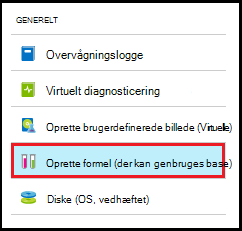

<properties
    pageTitle="Administrere formler i Azure DevTest øvelser til at oprette FOS | Microsoft Azure"
    description="Lær at oprette, opdatere, og fjerne Azure DevTest øvelser formler og bruge dem til at oprette nye FOS."
    services="devtest-lab,virtual-machines"
    documentationCenter="na"
    authors="tomarcher"
    manager="douge"
    editor=""/>

<tags
    ms.service="devtest-lab"
    ms.workload="na"
    ms.tgt_pltfrm="na"
    ms.devlang="na"
    ms.topic="article"
    ms.date="08/30/2016"
    ms.author="tarcher"/>

# Administrere DevTest øvelser formler til at oprette FOS

En formel i Azure DevTest øvelser er en liste over standardværdier egenskaben bruges til at oprette en virtuel maskine (VM). Når du opretter en VM fra en formel, standardværdierne kan bruges som-er, eller ændret. Formler med en funktion til hurtig klargøring af VM som [brugerdefinerede billeder](./devtest-lab-create-template.md) og [Marketplace billeder](./devtest-lab-configure-marketplace-images.md).  

I denne artikel lærer du, hvordan du kan udføre følgende opgaver:

- [Oprette en formel](#create-a-formula)
- [Bruge en formel til at klargøre en VM](#use-a-formula-to-provision-a-vm)
- [Redigere en formel](#modify-a-formula)
- [Slette en formel](#delete-a-formula)

> [AZURE.NOTE] Formler - som [brugerdefineret billeder](./devtest-lab-create-template.md) - gør det muligt at oprette en grundlæggende afbildning fra en Virtuelle fil. Den grundlæggende afbildning kan derefter bruges til at klargøre en ny VM. Beslutte hvilken er bedst for dit miljø, skal du henvise til artiklen, [sammenligne brugerdefinerede billeder og formler i DevTest øvelser](./devtest-lab-comparing-vm-base-image-types.md).

## Oprette en formel
Alle med DevTest øvelser *brugere* tilladelser er i stand til at oprette FOS ved hjælp af en formel som udgangspunkt. Der er to måder at oprette formler: 

- Fra en base - brug, når du vil definere alle karakteristika af formlen.
- Brug den, når du vil oprette en formel fra en eksisterende øvelse VM - baseret på indstillingerne for en eksisterende VM.

### Oprette en formel fra en base
Følgende trin fører dig gennem processen med at oprette en formel fra en brugerdefineret afbildning, Marketplace billede eller en anden formel.

1. Log på [Azure-portalen](http://go.microsoft.com/fwlink/p/?LinkID=525040).

1. Vælg **Flere tjenester**, og vælg derefter **DevTest øvelser** på listen.

1. Vælg den ønskede øvelse på listen over øvelser.  

1. Vælg den øvelse blade **formler (der kan genbruges grundtal)**.

    

1. Vælg **+ Tilføj**bladet **Øvelse formler** .

    

1. Vælg det grundtal (brugerdefinerede afbildning, Marketplace billede eller formel), hvorfra du vil oprette formlen på bladet **Vælg udgangspunkt** .

    

1. Angiv følgende værdier under bladet **Opret formel** :

    - **Formel navn** - Angiv et navn til formlen. Denne værdi vises på listen over grundlæggende billeder, når du opretter en VM. Navnet valideres, mens du skriver det, og hvis det er ikke er gyldig, en meddelelse vil angive kravene til et gyldigt navn.
    - **Beskrivelse** – Angiv et beskrivende navn til formlen. Denne værdi er tilgængelige i formlens genvejsmenu, når du opretter en VM.
    - **Brugernavn** - angive et brugernavn, der skal tildeles administratorrettigheder.
    - **Adgangskode** - Angiv en værdi, der er knyttet til hemmeligt (adgangskode), du vil bruge til den angivne bruger - eller Vælg på rullelisten -.  
    - **Billede af** – dette felt viser navnet på den grundlæggende afbildning, du har valgt på bladet forrige. 
    - **Virtuelt størrelse** - Vælg en af de foruddefinerede varer, angiver processorer, RAM størrelse og harddisk størrelsen af VM til at oprette.
    - **Virtuel netværk** - Angiv det ønskede virtuelle netværk.
    - **Undernet** - Angiv det ønskede undernet.
    - **Offentlige IP-adresse** - Hvis politikken øvelse er indstillet til Tillad offentlige IP-adresser for det valgte undernet skal du angive, om du vil IP-adressen, der skal være offentlig ved at vælge **Ja** eller **Nej**. Ellers skal er denne indstilling deaktiveret og valgt som **ingen**.
    - **Elementer** – Vælg og Konfigurer de elementer, du vil føje til den grundlæggende afbildning. Sikker streng værdier ikke gemmes sammen med formlen. Derfor vises genstand parametre, der er sikker strenge ikke. 

        

1. Vælg **Opret** for at oprette formlen.

### Oprette en formel fra en VM
Følgende trin fører dig gennem processen med at oprette en formel, der er baseret på en eksisterende VM. 

> [AZURE.NOTE] Hvis du vil oprette en formel fra en VM, har hvor VM oprettet efter 30 marts 2016. 

1. Log på [Azure-portalen](http://go.microsoft.com/fwlink/p/?LinkID=525040).

1. Vælg **Flere tjenester**, og vælg derefter **DevTest øvelser** på listen.

1. Vælg den ønskede øvelse på listen over øvelser.  

1. Vælg den VM, hvorfra du vil oprette formlen på den øvelse **Oversigt** blade.

    

1. Vælg den VM blade **oprette formel (der kan genbruges base)**.

    

1. Angiv et **navn** og en **Beskrivelse** for nye formlen på bladet **Opret formel** .

    

1. Vælg **OK** for at oprette formlen.

## Bruge en formel til at klargøre en VM
Når du har oprettet en formel, kan du oprette en VM, der er baseret på denne formel. Afsnittet [tilføje en VM med elementer](devtest-lab-add-vm-with-artifacts.md#add-a-vm-with-artifacts) vejleder dig gennem processen.

## Redigere en formel
Hvis du vil ændre en formel, skal du følge disse trin:

1. Log på [Azure-portalen](http://go.microsoft.com/fwlink/p/?LinkID=525040).

1. Vælg **Flere tjenester**, og vælg derefter **DevTest øvelser** på listen.

1. Vælg den ønskede øvelse på listen over øvelser.  

1. Vælg den øvelse blade **formler (der kan genbruges grundtal)**.

    

1. Marker den formel, du vil ændre, på bladet **Øvelse formler** .

1. Foretag de ønskede ændringer på bladet **opdaterer formel** , og vælg **Opdater**.

## Slette en formel 
Hvis du vil slette en formel, skal du følge disse trin:

1. Log på [Azure-portalen](http://go.microsoft.com/fwlink/p/?LinkID=525040).

1. Vælg **Flere tjenester**, og vælg derefter **DevTest øvelser** på listen.

1. Vælg den ønskede øvelse på listen over øvelser.  

1. Vælg **formler**bladet øvelse **Indstillinger** .

    

1. Vælg ellipsen til højre for den formel, du vil slette, på bladet **Øvelse formler** .

    

1. Vælg **Slet**i genvejsmenuen for den formel.

    

1. Vælg **Ja** i dialogboksen sletningen bekræftelse.

[AZURE.INCLUDE [devtest-lab-try-it-out](../../includes/devtest-lab-try-it-out.md)]

## Relaterede blogindlæg

- [Brugerdefinerede billeder eller formler?](https://blogs.msdn.microsoft.com/devtestlab/2016/04/06/custom-images-or-formulas/)

## Næste trin
Når du har oprettet en formel til brug, når du opretter en VM, er næste trin at [tilføje en VM til din øvelse](./devtest-lab-add-vm-with-artifacts.md).