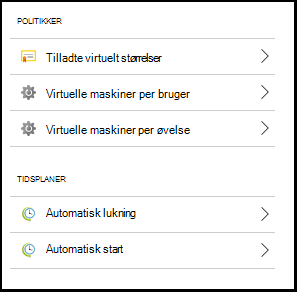
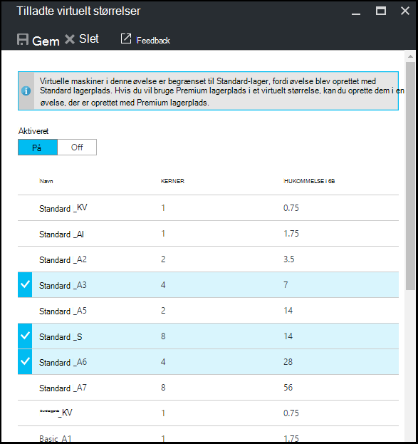
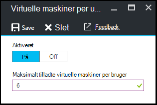
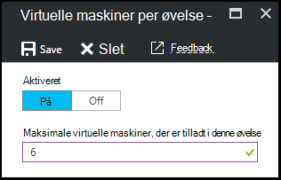
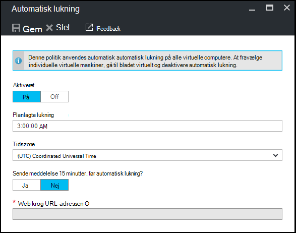
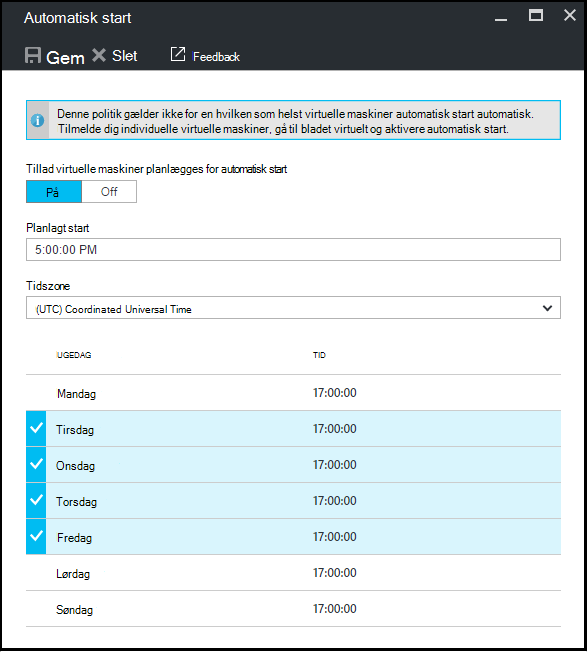

<properties
    pageTitle="Definere øvelse politikker i Azure DevTest øvelser | Microsoft Azure"
    description="Lær at definere øvelse politikker som VM størrelser, maksimale FOS per bruger og lukning automatisering."
    services="devtest-lab,virtual-machines"
    documentationCenter="na"
    authors="tomarcher"
    manager="douge"
    editor=""/>

<tags
    ms.service="devtest-lab"
    ms.workload="na"
    ms.tgt_pltfrm="na"
    ms.devlang="na"
    ms.topic="article"
    ms.date="09/12/2016"
    ms.author="tarcher"/>

# Definere øvelse politikker i Azure DevTest øvelser

> [AZURE.VIDEO how-to-set-vm-policies-in-a-devtest-lab]

Azure DevTest øvelser kan du angive produktnøglen politikker, der hjælper dig med at styre omkostninger og minimere affald i din øvelser. Politikkerne øvelse medtage det maksimale antal FOS oprettet per bruger og per øvelse og forskellige indstillinger for automatisk lukning og automatisk start. 

## Få adgang til en øvelse politikker i Azure DevTest øvelser

Følgende trin hjælper dig med at konfigurere politikker for en øvelse i Azure DevTest øvelser:

For at få vist (og ændre) politikker for en øvelse skal du følge disse trin:

1. Log på [Azure-portalen](http://go.microsoft.com/fwlink/p/?LinkID=525040).

1. Vælg **flere tjenester**, og vælg derefter **DevTest øvelser** på listen.

1. Vælg den ønskede øvelse på listen over øvelser.   

1. Vælg **Indstillinger for politik**.

1. Bladet **politikindstillinger** indeholder en menu med indstillinger, som du kan angive: 

    

    Hvis du vil vide mere om at angive en politik, skal du markere den på listen nedenfor:

    - [Tilladte virtuelt størrelser](#set-allowed-virtual-machine-sizes) - Vælg på listen over VM størrelser tilladt i øvelse. En bruger kan oprette FOS kun fra denne liste.

    - [Virtuelle maskiner per bruger](#set-virtual-machines-per-user) – Angiv det maksimale antal VM'er, der kan oprettes af en bruger. 

    - [Virtuelle maskiner per øvelse](#set-virtual-machines-per-lab) - Angiv det maksimale antal VM'er, der kan oprettes for en øvelse. 

    - [Automatisk lukning](#set-auto-shutdown) - Angiv det klokkeslæt, når den aktuelle øvelse persons FOS lukkes automatisk.

    - [Automatisk start](#set-auto-start) - Angiv det klokkeslæt, når den aktuelle øvelse FOS automatisk starter op.

## Angiv tilladt virtuel maskine størrelser

Politikken for at angive de tilladte VM størrelser hjælper med at minimere øvelse affald ved at gøre det muligt at angive, hvilke VM størrelser er tilladt i øvelse. Hvis denne politik er aktiveret, kan kun VM størrelser fra denne liste kan bruges til at oprette FOS.

1. Vælg **tilladte virtuelle maskiner størrelser**på den øvelse **politikindstillinger** blade.

    
 
1. Vælg **på** til at aktivere denne politik og **fra** at deaktivere den.

1. Hvis du aktiverer denne politik skal skrives, kan du vælge en eller flere VM-størrelser, der kan oprettes i din øvelse.

1. Vælg **Gem**.

## Sæt virtuelle maskiner per bruger

Politikken for **virtuelle maskiner per bruger** kan du angive det maksimale antal VM'er, der kan oprettes ved en individuel bruger. Hvis en bruger forsøger at oprette en VM, når brugergrænsen er opfyldt, angiver en fejlmeddelelse om, at VM ikke kan oprettes. 

1. Vælg **virtuelle maskiner per bruger**på de øvelse **politikindstillinger** blade.

    

1. Vælg **på** til at aktivere denne politik og **fra** at deaktivere den.

1. Hvis du aktiverer denne politik skal skrives, kan du angive en numerisk værdi, der angiver det maksimale antal VM'er, der kan oprettes af en bruger. Hvis du angiver et tal, der ikke er gyldige, viser Brugergrænsefladen det maksimale antal, der er tilladt for dette felt.

1. Vælg **Gem**.

## Sæt virtuelle maskiner per øvelse

Politikken for **virtuelle maskiner per øvelse** kan du angive det maksimale antal VM'er, der kan oprettes for den aktuelle øvelse. Hvis en bruger forsøger at oprette en VM, når grænsen for øvelse er opfyldt, angiver en fejlmeddelelse om, at VM ikke kan oprettes. 

1. Vælg **virtuelle maskiner per øvelse**på den øvelse **politikindstillinger** blade.

    

1. Vælg **på** til at aktivere denne politik og **fra** at deaktivere den.

1. Hvis du aktiverer denne politik skal skrives, kan du angive en numerisk værdi, der angiver det maksimale antal VM'er, der kan oprettes for den aktuelle øvelse. Hvis du angiver et tal, der ikke er gyldige, viser Brugergrænsefladen det maksimale antal, der er tilladt for dette felt.

1. Vælg **Gem**.

## Konfigurere automatisk-lukning

Politikken automatisk lukning hjælper med at minimere øvelse affald ved at gøre det muligt at angive det tidspunkt, hvor denne øvelse FOS lukkes.

1. Vælg **automatisk lukning**på den øvelse **politikindstillinger** blade.

    

1. Vælg **på** til at aktivere denne politik og **fra** at deaktivere den.

1. Hvis du aktiverer denne politik skal skrives, kan du angive den lokale tid til at lukke alle FOS i den aktuelle øvelse.

1. Vælg **Gem**.

1. Når aktiveret, gælder denne politik skal skrives som standard for alle FOS i den aktuelle øvelse. Hvis du vil fjerne denne indstilling fra en bestemt VM, åbne den VM blade og ændre dens **Auto lukning** indstilling 

## Konfigurere automatisk-start

Politikken automatisk start kan du angive, hvornår FOS i den aktuelle øvelse skal startes.  

1. Vælg **automatisk start**på den øvelse **politikindstillinger** blade.

    

1. Vælg **på** til at aktivere denne politik og **fra** at deaktivere den.

1. Hvis du aktiverer denne politik, angive den lokale planlagt starttidspunkt og dagene i ugen, tid, der gælder. 

1. Vælg **Gem**.

1. Når aktiveret, anvendes denne politik automatisk ikke på en hvilken som helst FOS i den aktuelle øvelse. Hvis du vil anvende denne indstilling til en bestemt VM, åbne den VM blade og ændre dens **Auto-start** -indstilling 

[AZURE.INCLUDE [devtest-lab-try-it-out](../../includes/devtest-lab-try-it-out.md)]

## Næste trin

Når du har defineret og anvendt de forskellige VM politikindstillinger for din øvelse, er her nogle ting, du skal foretage dig:

- [Konfigurer omkostningsstyring](./devtest-lab-configure-cost-management.md) – viser, hvordan du skal bruge **Månedlige anslået omkostninger tendens** diagram  
for at få vist den aktuelle måned er beregnede omkostninger-til-dato og det planlagte omkostninger i slutningen af måneden.
- [Opret brugerdefinerede billede](./devtest-lab-create-template.md) – når du opretter en VM, du angiver en base, der kan være et brugerdefineret billede eller et billede af Marketplace. I denne artikel viser, hvordan til at oprette et brugerdefineret billede fra en Virtuelle fil.
- [Konfigurere Marketplace billeder](./devtest-lab-configure-marketplace-images.md) - Azure DevTest øvelser understøtter oprettelse af FOS baseret på Azure Marketplace billeder. I denne artikel viser, hvordan at angive, hvilke eventuelt Azure Marketplace billeder kan være bruges ved oprettelse af FOS i en øvelse.
- [Opret en VM i en øvelse](./devtest-lab-add-vm-with-artifacts.md) - illustrerer, hvordan du opretter en VM fra en grundlæggende afbildning (enten brugerdefineret eller Marketplace), og hvordan du arbejder med elementer i din VM.
