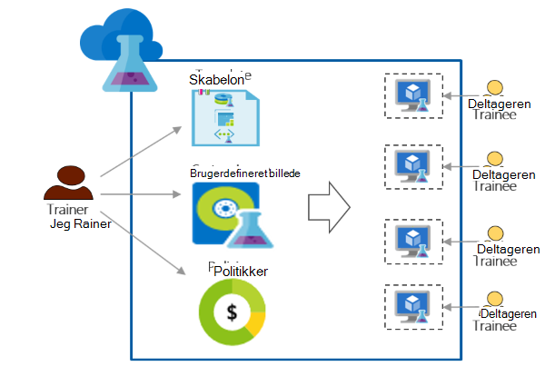

<properties
    pageTitle="Bruge Azure DevTest øvelser til uddannelse | Microsoft Azure"
    description="Lær at bruge Azure DevTest øvelser til uddannelse scenarier."
    services="devtest-lab,virtual-machines"
    documentationCenter="na"
    authors="steved0x"
    manager="douge"
    editor=""/>

<tags
    ms.service="devtest-lab"
    ms.workload="na"
    ms.tgt_pltfrm="na"
    ms.devlang="na"
    ms.topic="article"
    ms.date="09/12/2016"
    ms.author="sdanie"/>

# Bruge Azure DevTest øvelser til uddannelse

Azure DevTest øvelser kan bruges til at implementere mange nøglescenarier ud over Udviklingscenter/test. En af disse scenarier er at konfigurere en øvelse for kursus. Azure DevTest øvelser kan du oprette en øvelse, hvor du kan angive brugerdefinerede skabeloner, som hver deltageren kan bruge til at oprette identiske og isolerede miljøer til uddannelse. Du kan sikre, at kursus miljøer er tilgængelige for hver deltageren kun, når de har brug for dem og indeholder nok ressourcer - såsom virtuelle maskiner - påkrævet til uddannelse. Endelig, kan du nemt dele øvelse med deltagere, som de kan få adgang til med ét klik.   

Azure DevTest øvelser opfylder følgende krav, der kræves til at gennemføre uddannelse i et virtuelt miljø: 

-   Deltagere kan ikke se VM'er, der er oprettet af andre deltagere
-   Hver kursus maskine skal være identiske
-   Deltagere kan hurtigt Klargør miljøerne kursus
-   Styre omkostninger ved at sikre, at deltagere kan få flere FOS end de skal bruge til uddannelse og også lukning FOS, når de ikke bruger dem.
-   Nemt dele kursus øvelse med hver eksamen
-   Genbruge kursus øvelse igen og igen

I denne artikel kan lære du om forskellige Azure DevTest øvelser funktioner, som kan bruges til at imødekomme beskrevet tidligere kursus krav og detaljeret vejledning, som du kan følge for at konfigurere en øvelse til uddannelse.  

## Implementere kursus med Azure DevTest øvelser

1. **Oprette øvelse** 

    Øvelser er udgangspunktet i Azure DevTest øvelser. Du kan udføre opgaver, når du opretter en øvelse, sådan som tilføje brugere (deltagere) til øvelse, indstille politikker til at styre omkostninger, definere VM billeder, der kan hurtigt oprette og meget mere.   

    Få mere at vide ved at klikke på linkene i den følgende tabel:

  	| Opgave                                                            | Hvad du lærer                                                    |
|-----------------------------------------------------------------|----------------------------------------------------------------------|
| [Oprette en øvelse i Azure DevTest øvelser](devtest-lab-create-lab.md) | Få mere at vide, hvordan du opretter en øvelse i Azure DevTest øvelser i portalen Azure. |

2. **Oprette kursus FOS i minutter i færdige marketplace billeder og brugerdefinerede billeder** 
    
    Du kan vælge færdige billeder fra en lang række billeder i Azure Marketplace og gøre dem tilgængelige til personalet i øvelse. Hvis de færdige billeder ikke opfylder dine behov, kan du oprette et brugerdefineret billede ved at oprette en øvelse VM ved hjælp af et færdige billede fra Azure Marketplace, installation af software, du skal bruge til uddannelse og gemmer VM som brugerdefineret billede i øvelse. 

    Få mere at vide ved at klikke på linkene i den følgende tabel:

  	| Opgave                                                                              | Hvad du lærer                                                                                                                                  |
|-----------------------------------------------------------------------------------|-------------------------------------------------------------------------------------------------------------------------------------------------|
| [Konfigurere Azure Marketplace billeder](devtest-lab-configure-marketplace-images.md) | Få mere at vide, hvordan du kan whitelist Azure Marketplace billeder. gøre tilgængelige for markerede kun billederne, du vil til uddannelse.                 |
| [Oprette et brugerdefineret billede](devtest-lab-create-template.md)                           | Oprette et brugerdefineret billede ved før installation af software, du skal bruge til uddannelse, så deltagere kan hurtigt oprette en VM ved hjælp af det brugerdefinerede billede. |

3. **Oprette der kan genbruges skabeloner til uddannelse computere** 

    En formel i Azure DevTest øvelser er en liste over standardværdier egenskaben bruges til at oprette en VM. Du kan oprette en formel i øvelse ved at vælge et billede, en VM størrelse (en kombination af CPU og RAM) og et virtuelt netværk. Hver deltageren kan se formlen i øvelse og bruge det til at oprette en VM. 

    Få mere at vide ved at klikke på linkene i den følgende tabel:

  	| Opgave                                                                         | Hvad du lærer                                                                                                          |
|------------------------------------------------------------------------------|-------------------------------------------------------------------------------------------------------------------------|
| [Administrere DevTest øvelser formler til at oprette FOS](devtest-lab-manage-formulas.md) | Lær, hvordan du kan oprette en formel ved at vælge et billede, VM størrelse (kombination af CPU og RAM) og et virtuelt netværk. |

4. **Styre omkostninger**

    Azure DevTest øvelser kan du angive en politik i øvelse til at angive det maksimale antal VM'er, der kan oprettes ved en deltageren i øvelse. 

    Hvis du kører flere dage kursus og vil ikke alle FOS på et bestemt tidspunkt på dagen og derefter genstarte automatisk dem følgende dag, kan du nemt udføre, ved at angive automatisk lukning og automatisk-start politikker i øvelse. 

    Til sidst, når kursus er fuldført du kan slette alle FOS på én gang ved at køre en enkelt PowerShell-script. 

    Få mere at vide ved at klikke på linkene i den følgende tabel:

  	| Opgave                                                                                                                                    | Hvad du lærer                                                      |
|-----------------------------------------------------------------------------------------------------------------------------------------|---------------------------------------------------------------------|
| [Definere øvelse politikker](devtest-lab-set-lab-policy.md)                                                                                    | Styre omkostninger ved at angive regler i øvelse.                       |
| [Slette alle øvelse FOS ved hjælp af en PowerShell-script](devtest-lab-faq.md#how-can-i-automate-the-process-of-deleting-all-the-vms-in-my-lab) | Slette alle øvelser på én gang, når uddannelsen er fuldført. |

5. **Dele øvelse med hver eksamen**

    Øvelser kan være direkte adgang til dem via et link, du deler med din deltagere. Din deltagere behøver ikke selv at har en Azure-konto, som de har en [Microsoft-konto](devtest-lab-faq.md#what-is-a-microsoft-account). Deltagere kan ikke se VM'er, der er oprettet af andre deltagere.  

    Få mere at vide ved at klikke på linkene i den følgende tabel:

  	| Opgave                                                                                                                                | Hvad du lærer                                                   |
|-------------------------------------------------------------------------------------------------------------------------------------|------------------------------------------------------------------|
| [Føje en deltageren til en øvelse i Azure DevTest øvelser](devtest-lab-add-devtest-user.md)                                                     | Brug portalen Azure til at føje deltagere til dine kursus øvelse.       |
| [Føje deltagere til øvelse ved hjælp af en PowerShell-script](devtest-lab-add-devtest-user.md#add-an-external-user-to-a-lab-using-powershell) | Bruge PowerShell til at automatisere at føje deltagere til dine kursus øvelse. |
| [Få et link til øvelse](devtest-lab-faq.md#how-do-i-share-a-direct-link-to-my-lab)                                                  | Få mere at vide, hvordan en øvelse være direkte adgang til via et link.        |

6. **Genbruge øvelse igen og igen** 

    Du kan automatisere øvelse oprettelse, herunder brugerdefinerede indstillinger ved at oprette en ressourcestyring skabelon og bruge det til at oprette identiske øvelser igen og igen. 

    Få mere at vide ved at klikke på linkene i den følgende tabel:

  	| Opgave                                                                                                                               | Hvad du lærer                                                      |
|------------------------------------------------------------------------------------------------------------------------------------|---------------------------------------------------------------------|
| [Oprette en øvelse ved hjælp af en ressourcestyring skabelon](devtest-lab-faq.md#how-do-i-create-a-lab-from-an-azure-resource-manager-template) | Oprette øvelser i Azure DevTest øvelser ved hjælp af Ressourcestyring skabeloner. |

[AZURE.INCLUDE [devtest-lab-try-it-out](../../includes/devtest-lab-try-it-out.md)]  

