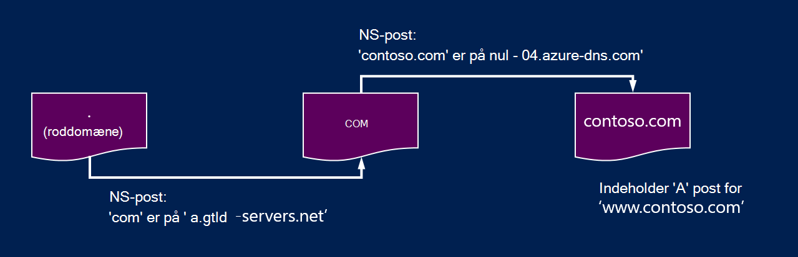
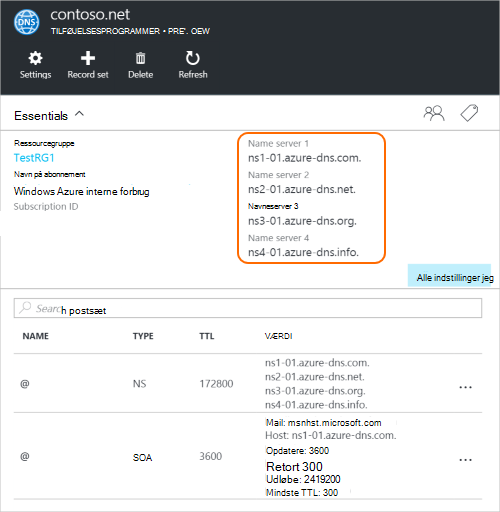

<properties
   pageTitle="Uddelegere dit domæne til Azure DNS | Microsoft Azure"
   description="Forstå, hvordan du ændrer domæne delegering og bruge Azure DNS-navneservere til at levere domæne vært."
   services="dns"
   documentationCenter="na"
   authors="sdwheeler"
   manager="carmonm"
   editor=""/>

<tags
   ms.service="dns"
   ms.devlang="na"
   ms.topic="get-started-article"
   ms.tgt_pltfrm="na"
   ms.workload="infrastructure-services"
   ms.date="06/30/2016"
   ms.author="sewhee"/>

# Uddelegere et domæne til Azure DNS

Azure DNS gør det muligt at administrere DNS-posterne for et domæne i Azure og være vært en DNS-zone. Hvis DNS-forespørgsler for et domæne til at nå Azure DNS, skal domænet, har der skal uddelegeres til Azure DNS fra det overordnede domæne. Husk Azure DNS er ikke domæneregistratoren. I denne artikel beskrives det, hvordan domæne delegering fungerer, og Sådan uddelegere domæner til Azure DNS.

## Hvordan fungerer DNS delegering

### Domæner og zoner

Domain Name System er et hierarki af domæner. Hierarkiet starter fra ' roddomænet ', hvis navn er blot**.**.  Komme topdomæner, såsom 'com', 'net', 'Organisationsdiagram', 'Storbritannien' eller 'jp' under dette.  Under disse er andet niveau domæner, som 'org.uk' eller 'co.jp'.  Og så videre. Domæner i DNS-hierarkiet er hostet ved hjælp af separat DNS zones. Disse zoner distribueres globalt, hostet af DNS-navneservere over hele verden.

**DNS-zone**

Et domæne er et entydigt navn i Domain Name System, for eksempel 'contoso.com'. En DNS-zone bruges til at være vært for DNS-posterne for et bestemt domæne. Domænet 'contoso.com' kan for eksempel indeholder et antal DNS-poster som 'mail.contoso.com' (for en e-mail-server) og 'www.contoso.com' (for et websted).

**Domæneregistrator**

En anden domæneregistrator er en virksomhed, der kan give internetdomænenavne. De vil bekræfte, hvis det Internet-domæne, du vil bruge er tilgængelig, så du kan købe det. Når domænenavnet er registreret, skal du være juridiske ejer for domænenavnet. Hvis du allerede har et internetdomæne, bruger du den nuværende domæneregistrator delegere til Azure DNS.

>[AZURE.NOTE] For at få flere oplysninger til hvem der ejer et bestemt domænenavn eller oplysninger om, hvordan du kan købe et domæne, skal du se [Internet domæneadministration i Azure AD](https://msdn.microsoft.com/library/azure/hh969248.aspx).

### Opløsning og delegering

Der er to typer af DNS-servere:

- En _autoritative_ DNS-server vært DNS zones. Det svar DNS-forespørgsler til poster i zonerne kun.
- En _rekursiv_ DNS-server er ikke vært DNS zones. Det svar alle DNS-forespørgsler ved at ringe til autoritative DNS-servere for at indsamle de nødvendige data.

>[AZURE.NOTE] Azure DNS indeholder en autoritative DNS-tjenesten.  Det giver ikke en rekursiv DNS-tjeneste.

> Cloud Services og FOS i Azure er automatisk konfigureret til at bruge en rekursiv DNS-tjenester, der leveres særskilt som en del af Azures infrastruktur.  Du kan finde oplysninger om, hvordan du kan ændre disse DNS-indstillingerne, [Navneoversættelse i Azure](../virtual-network/virtual-networks-name-resolution-for-vms-and-role-instances.md#name-resolution-using-your-own-dns-server).

DNS-klienter i pc'er eller mobilenheder ringe typisk en rekursiv DNS-server for at udføre alle DNS-forespørgsler klientprogrammerne har brug for.

Når en rekursiv DNS-server modtager en forespørgsel til en DNS-post, som 'www.contoso.com', skal den først at finde det servernavn, der er vært for zonen for domænet, 'contoso.com'. For at gøre dette, det starter ved navneservere roden og finder DNS-servere, der er vært for zonen 'com' derfra. Det derefter forespørgsler 'com' navneservere til at finde DNS-servere, der er vært for zonen 'contoso.com'.  Det er til sidst skal kunne forespørgsel disse navneservere til 'www.contoso.com'.

Dette kaldes løse DNS-navnet. Absolut set DNS-opløsning indeholder flere trin som følgende CNAMEs, men, der ikke er vigtigt at forstå, hvordan uddelegering af DNS fungerer.

Hvordan en overordnet zone 'Peg' navneservere for en underordnet zone? Dette sker ved hjælp af en speciel type DNS-post, som kaldes en NS-post (NS repræsenterer 'name server'). For eksempel rod zonen indeholder NS-poster for 'com' og viser navneservere for zonen 'com'. 'Com' zonen indeholder også NS-posterne for 'contoso.com', som viser navneservere for zonen 'contoso.com'. Konfiguration af NS-posterne for en underordnet zone i en overordnet zone hedder delegering af domænet.

Hver delegering har faktisk to kopier af NS-poster et i den overordnede zone, der peger på underordnede, og en anden i den underordnede zone sig selv. 'Contoso.com' zonen indeholder NS-posterne for 'contoso.com' (ud over NS-posterne i 'com'). Disse kaldes autoritative NS-poster, og de sidde i toppen af den underordnede zone.

## Delegering af et domæne til Azure DNS

Når du opretter din DNS-zone i Azure DNS, skal du konfigurere NS-poster i den overordnede zone til at foretage Azure DNS autoritative kilden til navneoversættelse for zonen. For domæner, der har købt hos en domæneregistrator, vil din domæneregistrator giver mulighed for at konfigurere disse NS-poster.

>[AZURE.NOTE] Du behøver ikke at eje et domæne for at oprette en DNS-zone med pågældende domænenavn i Azure DNS. Men, behøver du ejer domænet til at konfigurere uddelegering til Azure DNS med registrator.

Antag f.eks, at du køber domænet 'contoso.com' og oprette en zone med navnet 'contoso.com' i Azure DNS. Som ejer af domænenavn, dig din domæneregistrator tilbyder mulighed for at konfigurere name serveradresser (det vil sige, NS-poster) for dit domæne. Registrator lagrer disse NS-poster i det overordnede domæne i dette tilfælde '.com'. Kunder over hele verden, derefter omdirigeret til dit domæne i Azure DNS-zone, når du forsøger at løse DNS-poster i 'contoso.com'.

### Finde servernavne navn

Før du kan uddelegere din DNS-zone til Azure DNS, skal du først kende servernavne navn for zonen. Azure DNS allokerer navneservere fra en gruppe, hver gang du opretter en zone.

Den nemmeste måde at se på DNS-serverne, der er tildelt til din zone er via Azure-portalen.  I dette eksempel zonen 'contoso.net' har fået tildelt navneservere ' ns1-01.azure-dns.com', 'ns2-01.azure-dns .net', ' ns3-01.azure-dns.org', og ' ns4-01.azure-dns.info':

 

Azure DNS opretter automatisk autoritative NS-poster i din zone, der indeholder de tildelte navneservere.  For at få vist navn servernavne via Azure PowerShell eller Azure CLI, skal du blot til at hente disse poster.

Brug af Azure PowerShell, kan autoritative NS-posterne hentes på følgende måde. Bemærk, at navnet på posten “@” bruges til at referere til poster i toppen af zonen.

    PS> $zone = Get-AzureRmDnsZone –Name contoso.net –ResourceGroupName MyResourceGroup
    PS> Get-AzureRmDnsRecordSet –Name “@” –RecordType NS –Zone $zone

    Name              : @
    ZoneName          : contoso.net
    ResourceGroupName : MyResourceGroup
    Ttl               : 3600
    Etag              : 5fe92e48-cc76-4912-a78c-7652d362ca18
    RecordType        : NS
    Records           : {ns1-01.azure-dns.com, ns2-01.azure-dns.net, ns3-01.azure-dns.org,
                        ns4-01.azure-dns.info}
    Tags              : {}

Du kan også bruge på tværs af platforme Azure CLI til at hente autoritative NS-posterne og dermed finde DNS-servere, der er tildelt til din zone:

    C:\> azure network dns record-set show MyResourceGroup contoso.net @ NS
    info:    Executing command network dns record-set show
        + Looking up the DNS Record Set "@" of type "NS"
    data:    Id                              : /subscriptions/.../resourceGroups/MyResourceGroup/providers/Microsoft.Network/dnszones/contoso.net/NS/@
    data:    Name                            : @
    data:    Type                            : Microsoft.Network/dnszones/NS
    data:    Location                        : global
    data:    TTL                             : 172800
    data:    NS records
    data:        Name server domain name     : ns1-01.azure-dns.com.
    data:        Name server domain name     : ns2-01.azure-dns.net.
    data:        Name server domain name     : ns3-01.azure-dns.org.
    data:        Name server domain name     : ns4-01.azure-dns.info.
    data:
    info:    network dns record-set show command OK

### Konfigurere delegering

Hver registrator har deres egne DNS-administrationsværktøjer til at ændre navneserverposter for et domæne. Redigere NS-posterne i den registrator DNS-administrationssiden, og Erstat NS-posterne med dem Azure DNS oprettet.

Når delegering af et domæne til Azure DNS, skal du bruge servernavne navn fra Azure DNS.  Du bør altid bruge alle 4 navn servernavne, uanset navnet på dit domæne.  Domæne delegering kræver ikke servernavnet navn for at bruge den samme topdomæner som dit domæne.

Du skal ikke bruge 'fastklæbe poster' til at pege på den Azure DNS-navnet server IP-adresser, da disse IP-adresser kan blive ændret fremover. Delegeringer ved hjælp af navnet servernavne i din egen zone, også kaldet 'vanity name servers', understøttes ikke i øjeblikket i Azure DNS.

### At bekræfte navneoversættelse fungerer

Når du er færdig delegation, kan du kontrollere, at navneoversættelse fungerer ved hjælp af et værktøj som 'nslookup' forespørge SOA posten for dit zone (der oprettes også automatisk, når zonen oprettes).

Bemærk, at du ikke behøver at angive Azure DNS-navneservere, da normal DNS-opløsning processen kan finde navneserverne automatisk, hvis delegation er konfigureret korrekt.

    nslookup –type=SOA contoso.com

    Server: ns1-04.azure-dns.com
    Address: 208.76.47.4

    contoso.com
    primary name server = ns1-04.azure-dns.com
    responsible mail addr = msnhst.microsoft.com
    serial = 1
    refresh = 900 (15 mins)
    retry = 300 (5 mins)
    expire = 604800 (7 days)
    default TTL = 300 (5 mins)

## Delegering underdomæner i Azure DNS

Hvis du vil konfigurere en separat underordnede zone, kan du uddelegere et underdomæne i Azure DNS. Eksempelvis har du konfigurere og delegeret 'contoso.com' i Azure DNS Antag, at du vil konfigurere en separat underordnede zone 'partners.contoso.com'.

Konfiguration af et underdomæne følger en lignende proces som en normal delegation. Den eneste forskel er det i trin 3, der skal oprettes NS-posterne i den overordnede zone 'contoso.com' i Azure DNS i stedet for at blive konfigurere via en domæneregistrator.

1. Oprette underordnede zone 'partners.contoso.com' i Azure DNS.
2. Slå op autoritative NS-posterne i den underordnede zone til at hente navneservere, der er vært for zonen underordnet i Azure DNS.
3. Uddelegere zonen underordnede ved at konfigurere NS-poster i den overordnede zone, der peger på den underordnede zone.

### Uddelegere et underdomæne

I følgende PowerShell-eksempel vises, hvordan det fungerer. De samme trin kan udføres via Azure-portalen eller via på tværs af platforme Azure CLI.

#### Trin 1. Opret overordnede og underordnede zoner

Først skal oprette vi overordnede og underordnede zoner. Det kan være i samme ressourcegruppe eller en anden ressourcegrupper.

    $parent = New-AzureRmDnsZone -Name contoso.com -ResourceGroupName RG1
    $child = New-AzureRmDnsZone -Name partners.contoso.com -ResourceGroupName RG1

#### Trin 2. Hent NS-poster

Dernæst skal henter vi autoritative NS-posterne fra underordnede zone som vist i det næste eksempel.  Indeholder denne DNS-servere, der er tildelt til zonen underordnede.

    $child_ns_recordset = Get-AzureRmDnsRecordSet -Zone $child -Name "@" -RecordType NS

#### Trin 3. Stedfortræder zonen underordnede

Oprette tilsvarende NS-post, der er angivet i zonen overordnede at fuldføre delegation. Bemærk, at postsæt navnet i den overordnede zone svarer til det underordnede zonenavn i dette tilfælde "partnere".

    $parent_ns_recordset = New-AzureRmDnsRecordSet -Zone $parent -Name "partners" -RecordType NS -Ttl 3600
    $parent_ns_recordset.Records = $child_ns_recordset.Records
    Set-AzureRmDnsRecordSet -RecordSet $parent_ns_recordset

### At bekræfte navneoversættelse fungerer

Du kan kontrollere, at alt er korrekt konfigureret ved at søge efter posten SOA i den underordnede zone.

    nslookup –type=SOA partners.contoso.com

    Server: ns1-08.azure-dns.com
    Address: 208.76.47.8

    partners.contoso.com
        primary name server = ns1-08.azure-dns.com
        responsible mail addr = msnhst.microsoft.com
        serial = 1
        refresh = 900 (15 mins)
        retry = 300 (5 mins)
        expire = 604800 (7 days)
        default TTL = 300 (5 mins)

## Næste trin

[Administrere DNS-zoner](dns-operations-dnszones.md)

[Administrere DNS-poster](dns-operations-recordsets.md)

