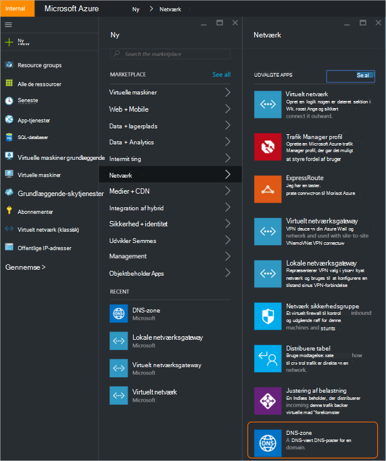
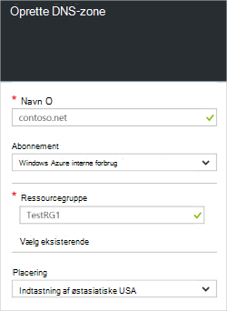
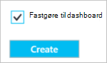
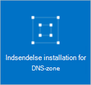
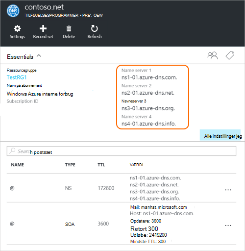
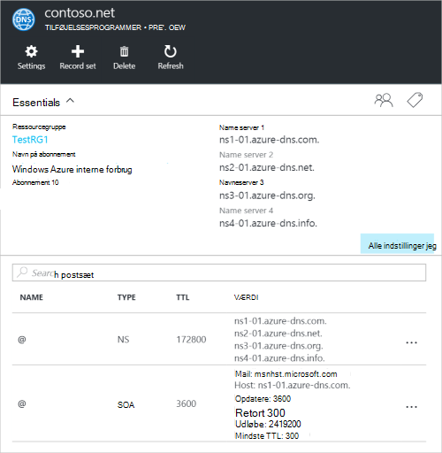

<properties
   pageTitle="Hvordan du kan oprette og administrere en DNS-zone på portalen Azure | Microsoft Azure"
   description="Lær at oprette DNS-zoner til Azure DNS. Dette er en trinvis vejledning til at oprette og administrere din første DNS og starte vært for din DNS-domæne, ved hjælp af portalen Azure."
   services="dns"
   documentationCenter="na"
   authors="sdwheeler"
   manager="carmonm"
   editor=""
   tags="azure-resource-manager"/>

<tags
   ms.service="dns"
   ms.devlang="na"
   ms.topic="article"
   ms.tgt_pltfrm="na"
   ms.workload="infrastructure-services"
   ms.date="08/16/2016"
   ms.author="sewhee"/>

# Oprette en DNS-zone på portalen Azure

> [AZURE.SELECTOR]
- [Azure-portalen](dns-getstarted-create-dnszone-portal.md)
- [PowerShell](dns-getstarted-create-dnszone.md)
- [Azure CLI](dns-getstarted-create-dnszone-cli.md)

I denne artikel fører dig gennem trinnene til at oprette en DNS-zone ved hjælp af portalen Azure. Du kan også oprette en DNS-zone, ved hjælp af PowerShell eller CLI.

[AZURE.INCLUDE [dns-create-zone-about](../../includes/dns-create-zone-about-include.md)]

### Om mærker til Azure DNS

Mærker er en liste over navne værdipar og bruges ved Azure ressourcestyring til etiket ressourcer til fakturerings- og grupperingsniveau formål. Du kan finde flere oplysninger om mærker, i artiklen [Brug af mærker til at organisere dine Azure ressourcer](../resource-group-using-tags.md).

Du kan føje mærker i portalen Azure ved hjælp af bladet **Indstillinger** for din DNS-zone.

## Oprette en DNS-zone

1. Log på portalen Azure

2. Klik på menuen Hub og klikke på **Ny > netværk >** og klik derefter på **DNS-zone** for at åbne bladet DNS-zone.

    

3. Klik på **Opret** nederst på bladet **DNS zone** . Dette åbner bladet **oprette DNS-zone** .

    

4. Navngiv din DNS-zone på bladet **oprette DNS-zone** . For eksempel, *contoso.com*. Se [Om DNS-Zone navne](#names) i ovenstående afsnit.

5. Derefter skal du angive den ressourcegruppe, du vil bruge. Du kan enten oprette en ny ressourcegruppe, eller Vælg en, der allerede findes.

6. Angive placeringen af ressourcegruppen rullelisten **placering** . Bemærk, at denne indstilling, der refererer til sted, hvor ressourcegruppen, ikke en placering til DNS-zone. Den faktiske DNS-zone ressource er automatisk "globale" og er ikke noget, du kan (eller skal) angive i portalen.

7. Du kan lade afkrydsningsfeltet **Fastgør til dashboard** , der er markeret, hvis du vil nemt finde din nye zone på dit dashboard. Klik derefter på **Opret**.

    

8. Når du klikker på Opret, får du vist din nye zone konfigureres på dashboardet.

    

9. Når din nye zone er blevet oprettet, åbnes bladet for den nye zone på dashboardet.

## Få vist poster

Oprette en DNS-zone, oprettes der også følgende poster:

- "Start af nøglecenter" (SOA) post. SOA findes i roden af alle DNS-zone.
- Autoritative (NS) navneserverposter. Disse viser, hvilke navneservere er vært for zonen. Azure DNS bruger en samling af navneservere og så forskellige navneservere kan tildeles til forskellige zoner i Azure DNS. Du kan få flere oplysninger i [stedfortræder et domæne til Azure DNS](dns-domain-delegation.md) .

Du kan få vist posterne fra Azure-portalen

1. Klik på **alle indstillinger** for at åbne **Indstillinger blade** til DNS-zonen din **DNS-zone** blade.

    

2. I den nederste del af ruden Essentials, kan du se posten, der angiver for DNS-zone.

    

## Test

Du kan teste din DNS-zone ved hjælp af DNS-funktioner som nslookup, grave ud eller [Løs DnsName PowerShell-cmdlet](https://technet.microsoft.com/library/jj590781.aspx).

Hvis du endnu ikke har uddelegeret domænet til at bruge den nye zone i Azure DNS, skal du dirigere forespørgslen DNS direkte til en navneservere for zonen. På DNS-serverne for zonen fremgår NS-poster, som vises ved `Get-AzureRmDnsRecordSet` ovenfor. Sørg for, på Udskift de korrekte værdier for zonen til kommandoen nedenfor.

    nslookup
    > set type=SOA
    > server ns1-01.azure-dns.com
    > contoso.com

    Server: ns1-01.azure-dns.com
    Address:  208.76.47.1

    contoso.com
            primary name server = ns1-01.azure-dns.com
            responsible mail addr = msnhst.microsoft.com
            serial  = 1
            refresh = 900 (15 mins)
            retry   = 300 (5 mins)
            expire  = 604800 (7 days)
            default TTL = 300 (5 mins)

## Slette en DNS-zone

Du kan slette DNS-zonen direkte fra portalen. Før du sletter en DNS-zone i Azure DNS, skal du slette alle poster sæt, med undtagelse af de NS og SOA poster i roden af zonen, der er oprettet automatisk, når zonen blev oprettet.

1. Find **DNS-zone** blade for zonen, du vil slette, og klik derefter på **Slet** øverst i bladet.

2. Der vises en meddelelse, der giver dig besked, skal du slette alle poster sæt, undtagen de NS og SOA poster, der er oprettet automatisk. Hvis du har slettet din postsæt, skal du klikke på **Ja**. Bemærk, at når du sletter en DNS-zone fra portalen, vil ikke blive slettet gruppen ressource, som er tilknyttet DNS-zonen.

## Næste trin

Når du har oprettet en DNS-zone, oprette [post sæt og poster](dns-getstarted-create-recordset-portal.md) for at starte navnekonflikter for dit domæne på internettet.
