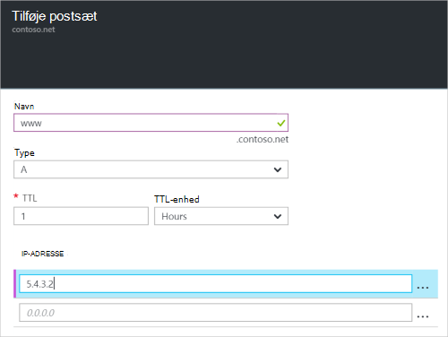

<properties
   pageTitle="Oprette et postsæt og poster til en DNS-Zone, ved hjælp af portalen Azure | Microsoft Azure"
   description="Sådan oprettes host records til Azure DNS og oprette postsæt og poster ved hjælp af portalen Azure"
   services="dns"
   documentationCenter="na"
   authors="sdwheeler"
   manager="carmonm"
   editor=""
   tags="azure-resource-manager"/>

<tags
   ms.service="dns"
   ms.devlang="na"
   ms.topic="article"
   ms.tgt_pltfrm="na"
   ms.workload="infrastructure-services"
   ms.date="08/16/2016"
   ms.author="sewhee"/>

# Oprette DNS-post sæt og poster ved hjælp af portalen Azure

> [AZURE.SELECTOR]
- [Azure-portalen](dns-getstarted-create-recordset-portal.md)
- [PowerShell](dns-getstarted-create-recordset.md)
- [Azure CLI](dns-getstarted-create-recordset-cli.md)

I denne artikel fører dig gennem processen med at oprette poster og poster sæt ved hjælp af portalen Azure. Når du opretter din DNS-zone, kan du tilføje DNS-posterne for dit domæne. For at gøre dette, skal du først forstå DNS-poster og postsæt.

[AZURE.INCLUDE [dns-about-records-include](../../includes/dns-about-records-include.md)]

## Oprette et postsæt og en post

I følgende eksempel vejleder dig gennem processen med at oprette et postsæt og post ved hjælp af portalen Azure. Vi bruger posttypen DNS "A".

1. Log på portalen.

2. Gå til bladet **DNS-zone** , hvor du vil oprette et postsæt.

3. Vælg **post angive** at åbne bladet **Add record angive** øverst i bladet **DNS zone** .

    

4. Navngiv din postsæt på bladet **angive Add record** . For eksempel kan du navngive din postsæt "**www**".

    

5. Vælg typen post, du vil oprette. For eksempel vælge **A**.

6. Angiv **TTL**. Standard tid til live i portalen er en time.

7. Tilføj IP-adresser, en IP-adresse hver linje. Når du bruger den foreslåede postsæt navn og en post af typen beskrevet tidligere, kan du føje IPv4-IP-adresser til **A** -posten for www postsæt.

8. Når du har tilføjet IP-adresser, skal du vælge **OK** i nederst del af bladet. DNS-postsæt oprettes.

## Næste trin

For at administrere din postsæt og poster skal du se [administrere DNS-poster og post angives ved hjælp af portalen Azure](dns-operations-recordsets-portal.md).

Du kan finde flere oplysninger om Azure DNS, [Azure DNS oversigt](dns-overview.md).
