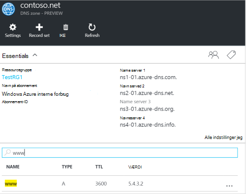
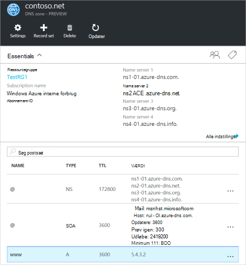
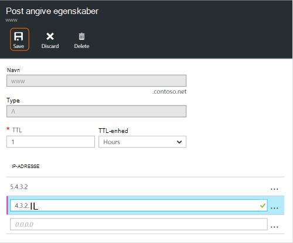
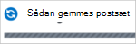
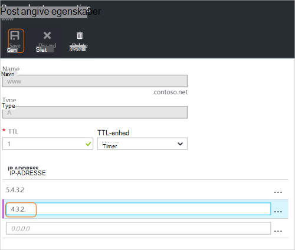
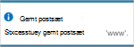
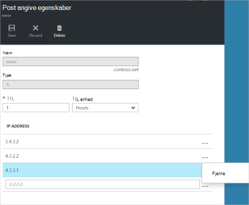
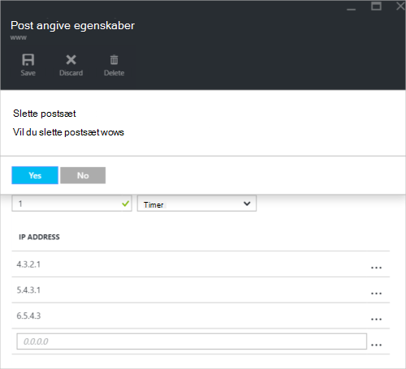

<properties
   pageTitle="Administrere DNS-post sæt og poster ved hjælp af portalen Azure | Microsoft Azure"
   description="Administrere DNS record angiver og når vært for dit domæne på Azure DNS-poster."
   services="dns"
   documentationCenter="na"
   authors="sdwheeler"
   manager="carmonm"
   editor=""
   tags="azure-resource-manager"/>

<tags
   ms.service="dns"
   ms.devlang="na"
   ms.topic="article"
   ms.tgt_pltfrm="na"
   ms.workload="infrastructure-services"
   ms.date="08/16/2016"
   ms.author="sewhee"/>

# Administrere DNS-poster og post angives ved hjælp af portalen Azure

> [AZURE.SELECTOR]
- [Azure-portalen](dns-operations-recordsets-portal.md)
- [Azure CLI](dns-operations-recordsets-cli.md)
- [PowerShell](dns-operations-recordsets.md)

I denne artikel beskrives, hvordan du administrerer post sæt og -posterne for din DNS-zone ved hjælp af portalen Azure.

Det er vigtigt at forstå forskellen mellem DNS-post sæt og enkelte DNS-poster. Et postsæt er en samling af poster i en zone, der har samme navn og er af samme type. Få mere at vide under [oprette DNS-post sæt og poster ved hjælp af portalen Azure](dns-getstarted-create-recordset-portal.md).

## Oprette en ny postsæt og post

Hvis du vil oprette en post, der er angivet i portalen Azure, skal du se [oprette DNS-poster ved hjælp af portalen Azure](dns-getstarted-create-recordset-portal.md).

## Få vist et postsæt

1. Gå til bladet **DNS zone** i portalen Azure.

2. Søge efter den postsæt og vælge den. Dette åbner egenskaberne postsæt.

    

## Tilføje en ny post til et postsæt

Du kan føje op til 20 poster til en hvilken som helst postsæt. Et postsæt kan ikke indeholde to identiske poster. Tom postsæt (med nul records) kan oprettes, men vises ikke i Azure DNS-navneservere. Optage sæt af typen CNAME kan højst indeholde én post.

1. Klik på sættet post, du vil tilføje en post for at blade **post angive egenskaber** for din DNS-zone.

    

2. Angive posten egenskaberne ved at udfylde felterne.

    

2. Klik på **Gem** øverst på bladet for at gemme indstillingerne. Luk derefter bladet.

3. I hjørnet, vil du se, at posten, bliver gemt.

    

Når posten er blevet gemt, vil værdierne på bladet **DNS zone** afspejle den nye post.

## Opdatere en post

Når du opdaterer en post i en eksisterende postsæt, afhænger af de felter, du kan opdatere typen post, du arbejder med.

1. Søg efter posten på bladet **post angive egenskaber** for din postsæt.

2. Redigere posten. Når du ændrer en post, kan du ændre de tilgængelige indstillinger for posten. Feltet **IP-adresse** er markeret i eksemplet nedenfor, og IP-adressen er ved at blive ændret.

    

3. Klik på **Gem** øverst på bladet for at gemme indstillingerne. I øverste højre hjørne, får du vist meddelelsen, som posten er blevet gemt.

    

Når posten er blevet gemt, vil værdierne for den post, der er angivet på bladet **DNS zone** afspejle den opdaterede post.

## Fjerne en post fra et postsæt

Du kan bruge portalen Azure til at fjerne poster fra et postsæt. Bemærk, at fjerne den sidste post fra et postsæt ikke sletter den postsæt.

1. Søg efter posten på bladet **post angive egenskaber** for din postsæt.

2. Klik på den post, du vil fjerne. Vælg derefter **Fjern**.

    

3. Klik på **Gem** øverst på bladet for at gemme indstillingerne.

3. Når posten er blevet fjernet, afspejler værdierne for posten på **DNS-zone** blade fjernelse.

## Slette et postsæt

1. På den **post angive egenskaber** blade til din post angive skal du klikke på **Slet**.

    

2. Du bliver spurgt, om du vil slette den postsæt.

3. Kontrollér, at navnet svarer til det postsæt, du vil slette, og klik derefter på **Ja**.

4. Kontrollér, at den postsæt er ikke længere er synlig på bladet **DNS zone** .

## Arbejde med NS og SOA poster

NS og SOA poster, der oprettes automatisk administreres forskelligt fra andre posttyper.

### Ændre SOA poster

Du kan ikke tilføje eller fjerne poster fra den automatisk oprettede SOA-post, der er angivet i zone af toppen (navn = "@"). Du kan ændre nogen af parametrene i posten SOA (undtagen "Host"), og posten set TTL.

### Ændre NS-poster i zone af toppen

Du kan ikke tilføje, fjerne eller redigere poster i den automatisk oprettede NS-post, der er angivet i zone af toppen (navn = "@"). Der er den eneste ændring, der er tilladt at ændre postsæt TTL.

### Slette SOA eller NS postsæt

Du kan ikke slette SOA og NS-post angiver i zone af toppen (navn = "@") , der er oprettet automatisk, når zonen oprettes. De slettes automatisk, når du sletter zonen.

## Næste trin

-   Du kan finde flere oplysninger om Azure DNS, [Azure DNS oversigt](dns-overview.md).
-   Du kan finde flere oplysninger om automatisering DNS, kan du se [oprette DNS-zoner og post angiver ved hjælp af .NET SDK](dns-sdk.md).
-   Se, [hvordan du administrerer modsat DNS-poster for dine tjenester, ved hjælp af PowerShell](dns-reverse-dns-record-operations-ps.md)kan finde flere oplysninger om modsat DNS-poster.
