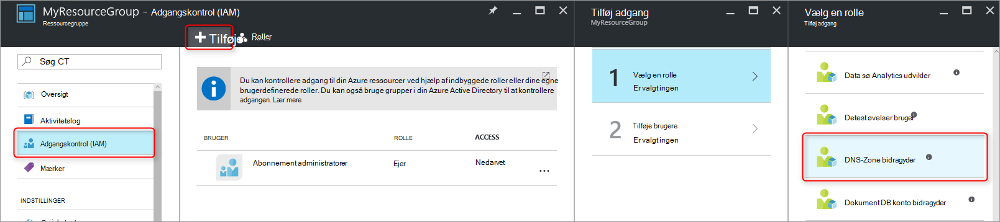
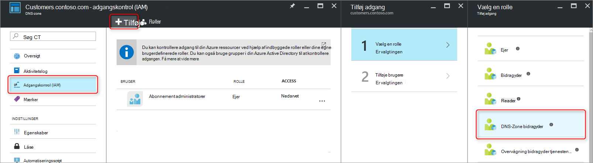
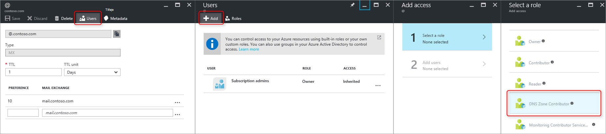
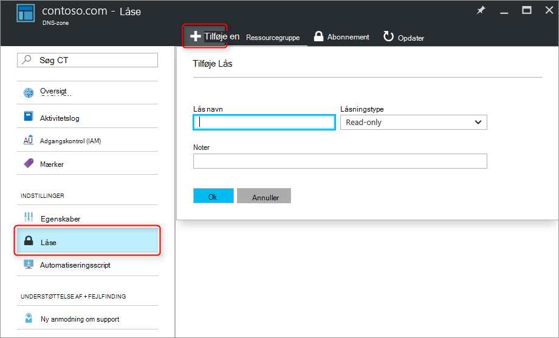

<properties 
   pageTitle="Beskyttelse af DNS-zoner og poster | Microsoft Azure" 
   description="Sådan beskytter du DNS-zoner og postsæt i Microsoft Azure DNS." 
   services="dns" 
   documentationCenter="na" 
   authors="jtuliani" 
   manager="carmonm" 
   editor=""/>

<tags
   ms.service="dns"
   ms.devlang="na"
   ms.topic="article"
   ms.tgt_pltfrm="na"
   ms.workload="infrastructure-services" 
   ms.date="10/20/2016"
   ms.author="jtuliani"/>

# Sådan beskytter du DNS-zoner og poster

DNS-zoner og poster er vigtige ressourcer. Slette en DNS-zone eller bare en enkelt DNS-post, kan det medføre en samlet service afbrydelse.  Det er derfor vigtigt, at kritiske DNS-zoner og poster er beskyttet mod uautoriseret eller utilsigtede ændringer.

Denne artikel forklares, hvordan Azure DNS gør det muligt at beskytte din DNS-zoner og poster mod disse ændringer.  Vi anvende to effektive sikkerhedsfunktioner, der leveres af Azure ressourcestyring: [Rollebaseret adgangskontrol](../active-directory/role-based-access-control-what-is.md) og [låse på websteder ressource](../resource-group-lock-resources.md).

## Rollebaseret adgangskontrol

Azure rollebaseret Access kontrolelement (RBAC) gør det muligt for administration af detaljerede adgang til Azure brugere, grupper og ressourcer. Brug af RBAC, kan du give nøjagtigt mængden af access, at brugerne skal udføre deres arbejde. Du kan finde flere oplysninger om, hvordan RBAC hjælper dig med at administrere adgang, kan du se [Hvad er rollebaseret adgangskontrol](../active-directory/role-based-access-control-what-is.md).

### Rollen 'DNS-Zone bidragyder'

Rollen 'DNS-Zone bidragyder' er en indbygget rolle, der leveres af Azure til administration af DNS-ressourcer.  Tildeler en bruger eller gruppe DNS-Zone bidragyder tilladelser, kan denne gruppe til at administrere DNS-ressourcer, men ikke ressourcer for en anden type.

Lad os antage, ressource gruppe 'myzones' indeholder fem zoner for Contoso Corporation. Give DNS-administratoren 'DNS-Zone bidragyder' tilladelser til ressourcegruppen, gør det muligt for fuld kontrol over zonerne DNS. Den undgår også give unødvendige tilladelser, for eksempel DNS-administratoren ikke kan oprette eller stoppe virtuelle computere.

Den nemmeste måde at tildele RBAC tilladelser er [via Azure-portalen](../active-directory/role-based-access-control-configure.md).  Åbne bladet 'Adgangskontrol (IAM)' for ressourcegruppen, klik på "Tilføj", og Vælg rollen, 'DNS-Zone bidragyder' og vælg derefter de nødvendige brugere eller grupper til at give tilladelser.

Tilladelser kan også være [tildelt ved hjælp af Azure PowerShell](../active-directory/role-based-access-control-manage-access-powershell.md):

    # Grant 'DNS Zone Contributor' permissions to all zones in a resource group
    New-AzureRmRoleAssignment -SignInName <user email address> -RoleDefinitionName "DNS Zone Contributor" -ResourceGroupName <resource group name>

Kommandoen tilsvarende er også [tilgængelig via Azure CLI](../active-directory/role-based-access-control-manage-access-azure-cli.md):

    # Grant 'DNS Zone Contributor' permissions to all zones in a resource group
    azure role assignment create --signInName  <user email address> --roleName "DNS Zone Contributor" --resourceGroup <resource group name>

### Zone niveau RBAC

Azure RBAC regler kan anvendes til et abonnement, en ressourcegruppe eller til en enkelt ressource. I forbindelse med Azure DNS kan denne ressource være en enkelte DNS-zone eller endda en individuelle postsæt.

Lad os antage, ressource gruppe 'myzones' indeholder zone 'contoso.com' og en subzone 'customers.contoso.com', der er oprettet CNAME-poster for hver kundekonto.  Den konto, der bruges til at administrere disse CNAME-poster skal have tildelt tilladelser til at oprette poster i zonen 'customers.contoso.com', den skal ikke have adgang til de andre zoner.

Du kan tildele zone niveau RBAC tilladelser via Azure-portalen.  Åbne bladet 'Adgangskontrol (IAM)' for zonen, klik på "Tilføj", og Vælg rollen, 'DNS-Zone bidragyder' og vælg derefter de nødvendige brugere eller grupper til at give tilladelser.

Tilladelser kan også være [tildelt ved hjælp af Azure PowerShell](../active-directory/role-based-access-control-manage-access-powershell.md):

    # Grant 'DNS Zone Contributor' permissions to a specific zone
    New-AzureRmRoleAssignment -SignInName <user email address> -RoleDefinitionName "DNS Zone Contributor" -ResourceGroupName <resource group name> -ResourceName <zone name> -ResourceType Microsoft.Network/DNSZones

Kommandoen tilsvarende er også [tilgængelig via Azure CLI](../active-directory/role-based-access-control-manage-access-azure-cli.md):

    # Grant 'DNS Zone Contributor' permissions to a specific zone
    azure role assignment create --signInName <user email address> --roleName "DNS Zone Contributor" --resource-name <zone name> --resource-type Microsoft.Network/DNSZones --resource-group <resource group name>

### Post angive niveau RBAC

Vi kan gå et skridt videre. Overvej mailadministrator for Contoso Corporation, der skal have adgang til MX- og TXT-poster i toppen af zonen 'contoso.com'.  Hun ikke skal have adgang til andre MX- eller TXT poster eller til en hvilken som helst poster for en anden type.  Azure DNS kan du tildele tilladelser på niveauet postsæt til nøjagtigt de poster, e-mail-administratoren skal have adgang til.  E-mail-administratoren er tildelt nøjagtigt kontrolelementet hun skal, og ikke kan foretage andre eventuelle ændringer.
  
Post angive niveau RBAC tilladelser kan konfigureres via portalen Azure, ved hjælp af knappen "Brugere" i bladet postsæt:

Post angive niveau RBAC tilladelser kan også være [tildelt ved hjælp af Azure PowerShell](../active-directory/role-based-access-control-manage-access-powershell.md):

    # Grant permissions to a specific record set
    New-AzureRmRoleAssignment -SignInName <user email address> -RoleDefinitionName "DNS Zone Contributor" -Scope "/subscriptions/<subscription id>/resourceGroups/<resource group name>/providers/Microsoft.Network/dnszones/<zone name>/<record type>/<record name>" 

Kommandoen tilsvarende er også [tilgængelig via Azure CLI](../active-directory/role-based-access-control-manage-access-azure-cli.md):

    # Grant permissions to a specific record set
    azure role assignment create --signInName <user email address> --roleName "DNS Zone Contributor" --scope "/subscriptions/<subscription id>/resourceGroups/<resource group name>/providers/Microsoft.Network/dnszones/<zone name>/<record type>/<record name>"

### Brugerdefinerede roller

Rollen indbyggede 'DNS-Zone bidragyder' gør det muligt for fuld kontrol over en DNS-ressource. Du kan også oprette din egen kunde Azure roller, for at få endnu mere finmaskede kontrol.

Overvej igen eksemplet, som oprettes en CNAME-post i zonen 'customers.contoso.com' for hver Contoso Corporation kundekonto.  Kontoen bruges til at administrere disse CNAMEs skal tildeles tilladelse til at administrere CNAME-poster.  Derefter er det ikke kan redigere poster af andre typer (såsom ændre MX-poster) eller udføre zone funktioner som zone Slet.

I følgende eksempel viser en brugerdefineret rolledefinition for at administrere CNAME-poster:

    {
        "Name": "DNS CNAME Contributor",
        "Id": "",
        "IsCustom": true,
        "Description": "Can manage DNS CNAME records only.",
        "Actions": [
            "Microsoft.Network/dnsZones/CNAME/*",
            "Microsoft.Network/dnsZones/read",
            "Microsoft.Authorization/*/read",
            "Microsoft.Insights/alertRules/*",
            "Microsoft.ResourceHealth/availabilityStatuses/read",
            "Microsoft.Resources/deployments/*",
            "Microsoft.Resources/subscriptions/resourceGroups/read",
            "Microsoft.Support/*"
        ],
        "NotActions": [
        ],
        "AssignableScopes": [
            "/subscriptions/ c276fc76-9cd4-44c9-99a7-4fd71546436e"
        ]
    }

Egenskaben handlinger definerer de følgende DNS-specifikke tilladelser:

- `Microsoft.Network/dnsZones/CNAME/*`giver fuld kontrol over CNAME-poster
- `Microsoft.Network/dnsZones/read`giver tilladelse til at læse DNS zones, men ikke at ændre dem, så du kan se den zone, hvor CNAME oprettes.

Resten af handlingerne er kopieret fra den [DNS-Zone bidragyder indbyggede rolle](../active-directory/role-based-access-built-in-roles.md#dns-zone-contributor).

>[AZURE.NOTE] Brug af en brugerdefineret RBAC rolle til at forhindre, at hvis du sletter postsæt, mens stadig så de kan opdateres ikke er en effektiv kontrol. Post sæt forhindres i at blive slettet, men den forhindrer ikke dem mod at blive ændret.  Tilladte ændringer omfatter tilføje og fjerne poster fra postsæt, herunder at fjerne alle poster for at forlade en 'empty' postsæt. Dette er den samme effekt som at slette posterne fra et DNS-opløsning synspunkt.

Brugerdefineret rolledefinitioner kan aktuelt ikke defineres via Azure-portalen. En brugerdefineret rolle, der er baseret på denne rolledefinition kan oprettes med Azure PowerShell:

    # Create new role definition based on input file
    New-AzureRmRoleDefinition -InputFile <file path>

Det kan også oprettes via Azure CLI:

    # Create new role definition based on input file
    azure role create –inputfile <file path>

Rollen kan derefter tildeles på samme måde som indbyggede roller, som beskrevet tidligere i denne artikel.

Du kan finde flere oplysninger om, hvordan du opretter, administrere, og tildele brugerdefinerede roller, skal du se [Brugerdefinerede roller i Azure RBAC](../active-directory/role-based-access-control-custom-roles.md).

## Ressourcelåse

Ud over RBAC understøtter Azure ressourcestyring to forskellige typer sikkerhedskontrol, nemlig muligheden for at 'lock' ressourcer. Hvor RBAC regler gør det muligt at styre handlinger for bestemte brugere og grupper, ressourcelåse anvendes til ressourcen og er effektive på tværs af alle brugere og roller. Du kan finde yderligere oplysninger finder [Lås ressourcer med Azure ressourcestyring](../resource-group-lock-resources.md).

Der findes to typer ressource Lås: **DoNotDelete** og **skrivebeskyttet**. Disse kan anvendes til en DNS-zone eller til en enkelt postsæt.  I nedenstående afsnit beskrives flere almindelige scenarier, og hvordan i kan understøtte dem ved hjælp af ressourcelåse.

### Beskytte mod alle ændringer

For at undgå eventuelle ændringer skal du anvende en skrivebeskyttet Lås til zonen.  Dette forhindrer, at nye postsæt der oprettes og eksisterende postsæt fra blive ændret eller slettet.

Zone udjævne ressourcernes låse kan oprettes via Azure-portalen.  Klik på "Låse" fra bladet DNS-zone derefter 'Tilføj':

Zone niveau ressource, som du kan også oprette låse via Azure PowerShell:

    # Lock a DNS zone
    New-AzureRmResourceLock -LockLevel <lock level> -LockName <lock name> -ResourceName <zone name> -ResourceType Microsoft.Network/DNSZones -ResourceGroupName <resource group name> 

Konfiguration af Azure ressourcelåse understøttes ikke i øjeblikket via Azure CLI.

### Beskytte individuelle poster
For at forhindre en eksisterende DNS-post, angive mod ændringer, skal du anvende en skrivebeskyttet Lås på postsættet.

>[AZURE.NOTE] Anvende en DoNotDelete Lås på et postsæt er ikke en effektiv kontrol. Den forhindrer postsættet slettes, men den forhindrer ikke den bliver ændret.  Tilladte ændringer omfatter tilføje og fjerne poster fra postsæt, herunder at fjerne alle poster for at forlade en 'empty' postsæt. Dette er den samme effekt som at slette posterne fra et DNS-opløsning synspunkt.

Postsæt udjævne ressourcernes låse kan aktuelt kun være konfigureret ved hjælp af Azure PowerShell.  De understøttes ikke i Azure portal eller Azure CLI.

    # Lock a DNS record set
    New-AzureRmResourceLock -LockLevel <lock level> -LockName <lock name> -ResourceName <zone name>/<record set name> -ResourceType Microsoft.Network/DNSZones/<record type> -ResourceGroupName <resource group name> 

### Beskyttelse mod zone sletning

Når en zone slettes i Azure DNS, slettes også alle postsæt i zonen.  Denne handling kan ikke fortrydes.  Slette en kritiske zone ved et uheld har mulighed for at have indvirkning betydeligt business.  Det er derfor meget vigtigt at beskytte mod utilsigtede zone sletningen.

Anvende en DoNotDelete Lås til en zone forhindrer zonen i at blive slettet.  Men da låse nedarves af underordnede ressourcer, forhindrer det også et postsæt i zonen slettes, hvilket kan være uønsket.  Desuden som beskrevet i ovenstående noten, er det også ineffektiv da poster kan stadig fjernes fra de eksisterende post sæt.

Overvej at anvende en DoNotDelete Lås på en post, der er angivet i zonen, såsom SOA postsæt som et alternativ.  Da zonen kan ikke slettes uden også at slette de postsæt, er det beskytter mod zone sletningen, samtidig med at optage sæt i zonen ændres frit. Hvis der gøres et forsøg på at slette zonen, registrerer Azure ressourcestyring dette vil også slette SOA postsæt og blokerer opkaldet, fordi SOA er låst.  Ingen postsæt slettes.

Den følgende PowerShell-kommando opretter en DoNotDelete Lås mod SOA posten for den angivne zone:

    # Protect against zone delete with DoNotDelete lock on the record set
    New-AzureRmResourceLock -LockLevel DoNotDelete -LockName <lock name> -ResourceName <zone name>/@ -ResourceType Microsoft.Network/DNSZones/SOA -ResourceGroupName <resource group name> 

En anden måde at undgå utilsigtede zone sletningen er ved at bruge en brugerdefineret rolle at sikre, at operatoren, og tjenestekonti, der bruges til at administrere dine zoner har ikke slettetilladelser zone. Når du har brug for at slette en zone, kan du gennemtvinge en to-trins Slet, første udstedelse zone slettetilladelser (i området zone at forhindre, at slette en forkert zone) og andet for at slette zonen.

Denne anden metode har den fordel, at det fungerer for alle zoner åbnes af kontiene, uden at skulle huske at oprette en hvilken som helst låse. Den har den ulempe, at alle konti med zone slettetilladelser, som ejeren af abonnementet, stadig ved et uheld kan slette en kritiske zone.

Det er muligt at bruge begge tilgange – ressourcelåse og brugerdefinerede roller – på samme tid, som en forsvarslinjer i dybde tilgang til DNS-zone beskyttelse.

## Næste trin

- Du kan finde flere oplysninger om at arbejde med RBAC, kan du se [komme i gang med administration af adgang i portalen Azure](../active-directory/role-based-access-control-what-is.md). 
- Du kan finde flere oplysninger om at arbejde med ressourcelåse se [Lås ressourcer med Azure ressourcestyring](../resource-group-lock-resources.md).
- Du kan finde flere oplysninger om sikring af ressourcerne Azure, [overvejelser om sikkerheden for Azure ressourcestyring](../best-practices-resource-manager-security.md).
