<properties 
    pageTitle="DocumentDB ændre meddelelser ved hjælp af logik Apps | Microsoft Azure" 
    description="." 
    keywords="besked om ændring"
    services="documentdb" 
    authors="hedidin" 
    manager="jhubbard" 
    editor="mimig" 
    documentationCenter=""/>

<tags 
    ms.service="documentdb" 
    ms.workload="data-services" 
    ms.tgt_pltfrm="na" 
    ms.devlang="rest-api" 
    ms.topic="article" 
    ms.date="09/23/2016" 
    ms.author="b-hoedid"/>

# <a name="notifications-for-new-or-changed-documentdb-resources-using-logic-apps"></a>Meddelelser om nye eller ændrede DocumentDB ressourcer ved hjælp af logik Apps

I denne artikel stammer fra et spørgsmål, jeg fik vist skrevet en af communityforummer Azure DocumentDB. Spørgsmålet var **betyder DocumentDB understøtter meddelelser om ressourcer, der er ændret**?

Jeg har arbejdet med F.eks i mange år, og dette er en meget almindelige scenarie, når du bruger [WCF LOB Adapter](https://msdn.microsoft.com/library/bb798128.aspx). Så jeg besluttede dig for at se, hvis jeg kan duplikere denne funktionalitet i DocumentDB for nye og/eller ændrede dokumenter.

I denne artikel indeholder en oversigt over komponenterne i løsningen Skift meddelelse, som omfatter en [udløser](documentdb-programming.md#trigger) og en [Logik App](../app-service-logic/app-service-logic-what-are-logic-apps.md). Vigtige kodestykker angivet indbygget og hele løsningen er tilgængelige under [GitHub](https://github.com/HEDIDIN/DocDbNotifications).

## <a name="use-case"></a>Brug af store og små bogstaver

Følgende tekstenheden er use case til denne artikel.

DocumentDB er lager for systemtilstand niveau syv International (HL7) hurtigt sundhedssektoren interoperabilitet ressourcer (FHIR) dokumenter. Lad os antage, at databasen DocumentDB kombineres med din API og logik App udgør en HL7 FHIR Server.  En sundhedssektoren facilitet gemmer patienter data i DocumentDB "Patienter" database. Der er flere samlinger i patienter databasen. Kliniske, identifikation osv. Patienter oplysninger falder under identifikation.  Du har en samling med navnet "Tålmodig".

Afdelingen Cardiology registrerer personlige områder og øvelse data. Det er lang tid at søge efter nye eller ændrede patienter poster. De spurgte IT-afdelingen, hvis der var en måde, kan de modtager en meddelelse for nye eller ændrede patienter poster.  

IT-afdelingen siger, at de kan nemt giver dette. De sagde også, at de kan push dokumenterne [Azure Blob-lager](https://azure.microsoft.com/services/storage/) , så afdelingen Cardiology kan nemt åbne dem.

## <a name="how-the-it-department-solved-the-problem"></a>Hvordan IT-afdelingen løser problemet

For at oprette dette program, IT-afdelingen besluttet at model det først.  Dejligt om brug af Forretningsprocesmodellen og Notation (BPMN) er, at både tekniske og ikke-teknisk personer, nemt kan forstå den. Denne proces for hele meddelelse betragtes som en forretningsproces. 

## <a name="high-level-view-of-notification-process"></a>Overordnet oversigt over processen

1. Du starter med en logik App, der har en timer udløser. Som standard kører udløseren hver time.
2. Derefter skal du gøre en HTTP-POST til Appen logik.
3. Logik App understøtter alt arbejde.

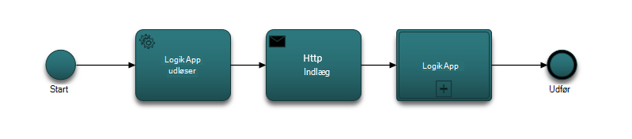

### <a name="lets-take-a-look-at-what-this-logic-app-does"></a>Lad os se nærmere på denne logik App gør
Hvis du ser på i følgende figur vises er der flere trin i arbejdsprocessen for LogicApp.

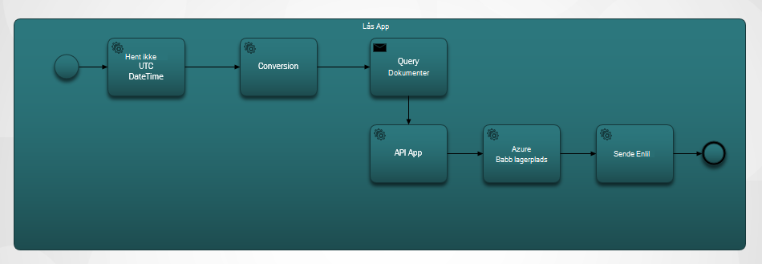

Trinnene er som følger:

1. Du har brug at få den aktuelle UTC DateTime fra en API-App.  Standardværdien er en time forrige.

2. Den UTC DateTime konverteres til et tidsstempel Unix-format. Dette er standardformatet for tidsstempler i DocumentDB.

3. Du UDGIVER værdien på en API-App, som indeholder en DocumentDB forespørgsel. Værdien, der bruges i en forespørgsel.

    ```SQL
        SELECT * FROM Patients p WHERE (p._ts >= @unixTimeStamp)
    ```

    > [AZURE.NOTE] _Ts repræsenterer tidsstempel metadata for alle ressourcer, DocumentDB.

4. Hvis der er fundet dokumenter skal sendes svar brødteksten til Azure Blob-lager.

    > [AZURE.NOTE] BLOB-lager kræver en Azure-lager-konto. Du har brug for til at klargøre en Azure Blob storage konto og tilføje en ny Blob med navnet patienter. Se Få mere at vide [om Azure lagerplads konti](../storage/storage-create-storage-account.md) og [komme i gang med Azure Blob-lager](../storage/storage-dotnet-how-to-use-blobs.md).

5. Til sidst skal sendes en mail, der giver besked om modtageren af antallet af dokumenter, der er fundet. Hvis ikke der blev fundet nogen dokumenter, der mail brødteksten ville være "0 dokumenter fundet". 

Nu hvor du har en ide om, hvad arbejdsprocessen gør, Lad os se nærmere på hvordan du implementerer den.

### <a name="lets-start-with-the-main-logic-app"></a>Lad os starte med den primære logik-App

Hvis du ikke er fortrolig med logik Apps, de er tilgængelige i [Azure Marketplace](https://portal.azure.com/), og du kan læse mere om dem i [Hvad er logik Apps?](../app-service-logic/app-service-logic-what-are-logic-apps.md)

Når du opretter en ny App logik, bliver du bedt om **hvordan vil du starte?**

Når du klikker på inde i tekstfeltet, har du et valg af hændelser. Vælg **Manuel - når en HTTP-anmodning modtages** for denne logik App, som vist nedenfor.

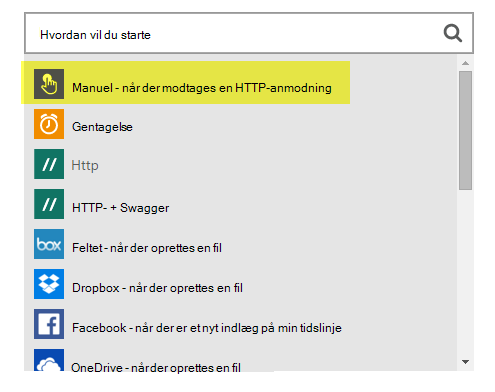

### <a name="design-view-of-your-completed-logic-app"></a>Designvisning af din færdige logik-App
Lad os gå videre og kig på den færdige designvisning til den logik, som hedder DocDB.


Når du redigerer handlingerne i logik App Designer, har du mulighed for at vælge **output** fra HTTP-anmodningen eller fra den forrige handling, som vist i handlingen sendMail nedenfor.

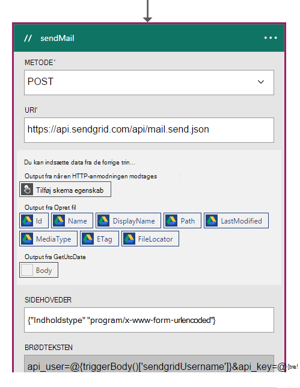

Før hver handling i arbejdsprocessen, kan du foretage en beslutning; **Føj en handling** eller **Tilføj en betingelse** , som vist i følgende figur.

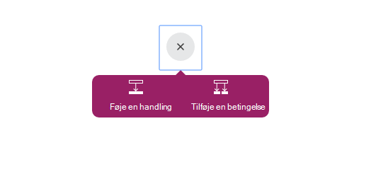

Hvis du vælger **Tilføj en betingelse**, får du vist med en formular, som vist i følgende figur til at angive din logik.  Dette er egentlig en forretningsregel.  Hvis du har klikket i et felt, har du et valg på valg af parametre fra den forrige handling. Du kan også angive værdierne direkte.

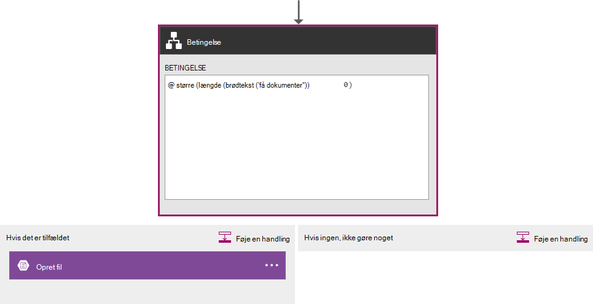

> [AZURE.NOTE] Du har også muligheden for at angive alt i kodevisning.

Lad os se nærmere på Appen færdige logik i kodevisning.  

```JSON
   
    "$schema": "https://schema.management.azure.com/providers/Microsoft.Logic/schemas/2015-08-01-preview/workflowdefinition.json#",
    "actions": {
        "Conversion": {
            "conditions": [
                {
                    "dependsOn": "GetUtcDate"
                }
            ],
            "inputs": {
                "method": "post",
                "queries": {
                    "currentdateTime": "@{body('GetUtcDate')}"
                },
                "uri": "https://docdbnotificationapi-debug.azurewebsites.net/api/Conversion"
            },
            "metadata": {
                "apiDefinitionUrl": "https://docdbnotificationapi-debug.azurewebsites.net/swagger/docs/v1",
                "swaggerSource": "custom"
            },
            "type": "Http"
        },
        "Createfile": {
            "conditions": [
                {
                    "expression": "@greater(length(body('GetDocuments')), 0)"
                },
                {
                    "dependsOn": "GetDocuments"
                }
            ],
            "inputs": {
                "body": "@body('GetDocuments')",
                "host": {
                    "api": {
                        "runtimeUrl": "https://logic-apis-westus.azure-apim.net/apim/azureblob"
                    },
                    "connection": {
                        "name": "@parameters('$connections')['azureblob']['connectionId']"
                    }
                },
                "method": "post",
                "path": "/datasets/default/files",
                "queries": {
                    "folderPath": "/patients",
                    "name": "Patient_@{guid()}.json"
                }
            },
            "type": "ApiConnection"
        },
        "GetDocuments": {
            "conditions": [
                {
                    "dependsOn": "Conversion"
                }
            ],
            "inputs": {
                "method": "post",
                "queries": {
                    "unixTimeStamp": "@body('Conversion')"
                },
                "uri": "https://docdbnotificationapi-debug.azurewebsites.net/api/Patient"
            },
            "metadata": {
                "apiDefinitionUrl": "https://docdbnotificationapi-debug.azurewebsites.net/swagger/docs/v1",
                "swaggerSource": "custom"
            },
            "type": "Http"
        },
        "GetUtcDate": {
            "conditions": [],
            "inputs": {
                "method": "get",
                "queries": {
                    "hoursBack": "@{int(triggerBody()['GetUtcDate_HoursBack'])}"
                },
                "uri": "https://docdbnotificationapi-debug.azurewebsites.net/api/Authorization"
            },
            "metadata": {
                "apiDefinitionUrl": "https://docdbnotificationapi-debug.azurewebsites.net/swagger/docs/v1",
                "swaggerSource": "custom"
            },
            "type": "Http"
        },
        "sendMail": {
            "conditions": [
                {
                    "dependsOn": "GetDocuments"
                }
            ],
            "inputs": {
                "body": "api_user=@{triggerBody()['sendgridUsername']}&api_key=@{triggerBody()['sendgridPassword']}&from=@{parameters('fromAddress')}&to=@{triggerBody()['EmailTo']}&subject=@{triggerBody()['Subject']}&text=@{int(length(body('GetDocuments')))} Documents Found",
                "headers": {
                    "Content-type": "application/x-www-form-urlencoded"
                },
                "method": "POST",
                "uri": "https://api.sendgrid.com/api/mail.send.json"
            },
            "type": "Http"
        }
    },
    "contentVersion": "1.0.0.0",
    "outputs": {
        "Results": {
            "type": "String",
            "value": "@{int(length(body('GetDocuments')))} Records Found"
        }
    },
    "parameters": {
        "$connections": {
            "defaultValue": {},
            "type": "Object"
        },
        "fromAddress": {
            "defaultValue": "user@msn.com",
            "type": "String"
        },
        "toAddress": {
            "defaultValue": "XXXXX@XXXXXXX.net",
            "type": "String"
        }
    },
    "triggers": {
        "manual": {
            "inputs": {
                "schema": {
                    "properties": {},
                    "required": [],
                    "type": "object"
                }
            },
            "type": "Manual"
        }
    
```

Hvis du ikke kender, hvad de forskellige sektioner i koden repræsenterer, kan du få vist [Logik App arbejdsproces Definition Language](http://aka.ms/logicappsdocs) dokumentation.

Du bruger en [HTTP Webhook udløser](https://sendgrid.com/blog/whats-webhook/)for denne arbejdsproces. Hvis du ser på ovenstående kode, får du vist parametre som i følgende eksempel.

```C#

    =@{triggerBody()['Subject']}

```

Den `triggerBody()` repræsenterer de parametre, der er inkluderet i brødteksten i en RESTEN INDLÆG til logik App REST-API. Den `()['Subject']` repræsenterer feltet. Alle disse parametre udgør JSON formateret brødtekst. 

> [AZURE.NOTE] Ved hjælp af en Web krog, har du fuld adgang til brevhovedet og meddelelsesteksten for den udløser anmodning. I dette program vil du brødteksten.

Som nævnt tidligere, kan du bruge designer til at tildele parametre eller gøre det i kodevisning.
Hvis du gør det i kodevisning, angive du egenskaberne, der kræver en værdi, som vist i følgende eksempel-kode. 

```JSON

    "triggers": {
        "manual": {
            "inputs": {
            "schema": {
                "properties": {
            "Subject": {
                "type" : "String"   

            }
            },
                "required": [
            "Subject"
                 ],
                "type": "object"
            }
            },
            "type": "Manual"
        }
        }
```

Hvad du laver opretter et JSON-skema, der overføres i fra brødteksten i HTTP POST.
Hvis du vil brand din udløser, skal du en tilbagekald URL-adresse.  Du lærer at generere den senere i selvstudiet.  

## <a name="actions"></a>Handlinger
Lad os se, hvad hver handling i vores logik App betyder.

### <a name="getutcdate"></a>GetUTCDate

**Visningen i Forespørgselsdesigner**

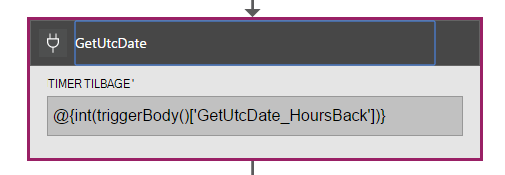

**Kodevisning**

```JSON

    "GetUtcDate": {
            "conditions": [],
            "inputs": {
            "method": "get",
            "queries": {
                "hoursBack": "@{int(triggerBody()['GetUtcDate_HoursBack'])}"
            },
            "uri": "https://docdbnotificationapi-debug.azurewebsites.net/api/Authorization"
            },
            "metadata": {
            "apiDefinitionUrl": "https://docdbnotificationapi-debug.azurewebsites.net/swagger/docs/v1"
            },
            "type": "Http"
        },

```

Handlingen HTTP udfører en GET-handling.  Den kalder metoden API APP GetUtcDate. Uri bruger egenskaben 'GetUtcDate_HoursBack' overføres til udløser brødteksten.  Værdien 'GetUtcDate_HoursBack' er angivet i den første logik App. Du kan lære mere om udløser logik App senere i selvstudiet.

Denne handling kalder din API App for at vende tilbage strengværdi UTC-dato.

#### <a name="operations"></a>Handlinger

**Anmode om**

```JSON

    {
        "uri": "https://docdbnotificationapi-debug.azurewebsites.net/api/Authorization",
        "method": "get",
        "queries": {
          "hoursBack": "24"
        }
    }

```

**Svar**

```JSON

    {
        "statusCode": 200,
        "headers": {
          "pragma": "no-cache",
          "cache-Control": "no-cache",
          "date": "Fri, 26 Feb 2016 15:47:33 GMT",
          "server": "Microsoft-IIS/8.0",
          "x-AspNet-Version": "4.0.30319",
          "x-Powered-By": "ASP.NET"
        },
        "body": "Fri, 15 Jan 2016 23:47:33 GMT"
    }

```

Næste trin er at konvertere UTC DateTime-værdien til Unix-tidsstempel, som er en .NET dobbelte type.

### <a name="conversion"></a>Konvertering

##### <a name="designer-view"></a>Visningen i Forespørgselsdesigner

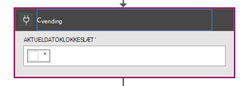

##### <a name="code-view"></a>Kodevisning

```JSON

    "Conversion": {
        "conditions": [
        {
            "dependsOn": "GetUtcDate"
        }
        ],
        "inputs": {
        "method": "post",
        "queries": {
            "currentDateTime": "@{body('GetUtcDate')}"
        },
        "uri": "https://docdbnotificationapi-debug.azurewebsites.net/api/Conversion"
        },
        "metadata": {
        "apiDefinitionUrl": "https://docdbnotificationapi-debug.azurewebsites.net/swagger/docs/v1"
        },
        "type": "Http"
    },

```

I dette trin kan du overføre i den værdi, returneres fra GetUTCDate.  Der findes en dependsOn betingelse, hvilket betyder, at handlingen GetUTCDate skal fuldført. Hvis ikke, derefter denne handling er ignoreret. 

Denne handling kalder din API App for at håndtere konverteringen.

#### <a name="operations"></a>Handlinger

##### <a name="request"></a>Anmode om

```JSON

    {
        "uri": "https://docdbnotificationapi-debug.azurewebsites.net/api/Conversion",
        "method": "post",
        "queries": {
        "currentDateTime": "Fri, 15 Jan 2016 23:47:33 GMT"
        }
    }   
```

##### <a name="response"></a>Svar

```JSON

    {
        "statusCode": 200,
        "headers": {
          "pragma": "no-cache",
          "cache-Control": "no-cache",
          "date": "Fri, 26 Feb 2016 15:47:33 GMT",
          "server": "Microsoft-IIS/8.0",
          "x-AspNet-Version": "4.0.30319",
          "x-Powered-By": "ASP.NET"
        },
        "body": 1452901653
    }
```

I den næste handling, vil du udføre en handling af INDLÆG til vores API-App.

### <a name="getdocuments"></a>GetDocuments 

##### <a name="designer-view"></a>Visningen i Forespørgselsdesigner


##### <a name="code-view"></a>Kodevisning

```JSON

    "GetDocuments": {
        "conditions": [
        {
            "dependsOn": "Conversion"
        }
        ],
        "inputs": {
        "method": "post",
        "queries": {
            "unixTimeStamp": "@{body('Conversion')}"
        },
        "uri": "https://docdbnotificationapi-debug.azurewebsites.net/api/Patient"
        },
        "metadata": {
        "apiDefinitionUrl": "https://docdbnotificationapi-debug.azurewebsites.net/swagger/docs/v1"
        },
        "type": "Http"
    },

```

Du skal overføre i brødteksten svar fra handlingen konvertering for handlingen GetDocuments. Dette er en parameter i Uri:

 
```C#

    unixTimeStamp=@{body('Conversion')}

```

Handlingen QueryDocuments understøtter handlingen HTTP POST til API-App. 

Metoden kaldet er **QueryForNewPatientDocuments**.

#### <a name="operations"></a>Handlinger

##### <a name="request"></a>Anmode om

```JSON

    {
        "uri": "https://docdbnotificationapi-debug.azurewebsites.net/api/Patient",
        "method": "post",
        "queries": {
        "unixTimeStamp": "1452901653"
        }
    }
```

##### <a name="response"></a>Svar

```JSON

    {
        "statusCode": 200,
        "headers": {
        "pragma": "no-cache",
        "cache-Control": "no-cache",
        "date": "Fri, 26 Feb 2016 15:47:35 GMT",
        "server": "Microsoft-IIS/8.0",
        "x-AspNet-Version": "4.0.30319",
        "x-Powered-By": "ASP.NET"
        },
        "body": [
        {
            "id": "xcda",
            "_rid": "vCYLAP2k6gAXAAAAAAAAAA==",
            "_self": "dbs/vCYLAA==/colls/vCYLAP2k6gA=/docs/vCYLAP2k6gAXAAAAAAAAAA==/",
            "_ts": 1454874620,
            "_etag": "\"00007d01-0000-0000-0000-56b79ffc0000\"",
            "resourceType": "Patient",
            "text": {
            "status": "generated",
            "div": "<div>\n      \n      <p>Henry Levin the 7th</p>\n    \n    </div>"
            },
            "identifier": [
            {
                "use": "usual",
                "type": {
                "coding": [
                    {
                    "system": "http://hl7.org/fhir/v2/0203",
                    "code": "MR"
                    }
                ]
                },
                "system": "urn:oid:2.16.840.1.113883.19.5",
                "value": "12345"
            }
            ],
            "active": true,
            "name": [
            {
                    "family": [
                        "Levin"
                    ],
                    "given": [
                        "Henry"
                    ]
                }
            ],
            "gender": "male",
            "birthDate": "1932-09-24",
            "managingOrganization": {
                "reference": "Organization/2.16.840.1.113883.19.5",
                "display": "Good Health Clinic"
            }
        },

```

Den næste handling er at gemme dokumenterne til [Azure Blog-lager](https://azure.microsoft.com/services/storage/). 

> [AZURE.NOTE] BLOB-lager kræver en Azure-lager-konto. Du har brug for til at klargøre en Azure Blob storage konto og tilføje en ny Blob med navnet patienter. Yderligere oplysninger finder du se [Introduktion til Azure Blob-lager](../storage/storage-dotnet-how-to-use-blobs.md).

### <a name="create-file"></a>Opret fil

##### <a name="designer-view"></a>Visningen i Forespørgselsdesigner

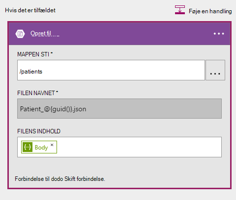

##### <a name="code-view"></a>Kodevisning

```JSON

    {
    "host": {
        "api": {
            "runtimeUrl": "https://logic-apis-westus.azure-apim.net/apim/azureblob"
        },
        "connection": {
            "name": "subscriptions/fxxxxxc079-4e5d-b002-xxxxxxxxxx/resourceGroups/Api-Default-Central-US/providers/Microsoft.Web/connections/azureblob"
        }
    },
    "method": "post",
    "path": "/datasets/default/files",
    "queries": {
        "folderPath": "/patients",
        "name": "Patient_17513174-e61d-4b56-88cb-5cf383db4430.json"
    },
    "body": [
        {
            "id": "xcda",
            "_rid": "vCYLAP2k6gAXAAAAAAAAAA==",
            "_self": "dbs/vCYLAA==/colls/vCYLAP2k6gA=/docs/vCYLAP2k6gAXAAAAAAAAAA==/",
            "_ts": 1454874620,
            "_etag": "\"00007d01-0000-0000-0000-56b79ffc0000\"",
            "resourceType": "Patient",
            "text": {
                "status": "generated",
                "div": "<div>\n      \n      <p>Henry Levin the 7th</p>\n    \n    </div>"
            },
            "identifier": [
                {
                    "use": "usual",
                    "type": {
                        "coding": [
                            {
                                "system": "http://hl7.org/fhir/v2/0203",
                                "code": "MR"
                            }
                        ]
                    },
                    "system": "urn:oid:2.16.840.1.113883.19.5",
                    "value": "12345"
                }
            ],
            "active": true,
            "name": [
                {
                    "family": [
                        "Levin"
                    ],
                    "given": [
                        "Henry"
                    ]
                }
            ],
            "gender": "male",
            "birthDate": "1932-09-24",
            "managingOrganization": {
                "reference": "Organization/2.16.840.1.113883.19.5",
                "display": "Good Health Clinic"
            }
        },

```

Koden er dannet ud fra handling i designer. Du behøver ikke at ændre koden.

Hvis du ikke er vant til at bruge Azure Blob API, kan du se [Introduktion til Azure blob-lager API](../connectors/connectors-create-api-azureblobstorage.md).

#### <a name="operations"></a>Handlinger

##### <a name="request"></a>Anmode om

```JSON

    "host": {
        "api": {
            "runtimeUrl": "https://logic-apis-westus.azure-apim.net/apim/azureblob"
        },
        "connection": {
            "name": "subscriptions/fxxxxxc079-4e5d-b002-xxxxxxxxxx/resourceGroups/Api-Default-Central-US/providers/Microsoft.Web/connections/azureblob"
        }
    },
    "method": "post",
    "path": "/datasets/default/files",
    "queries": {
        "folderPath": "/patients",
        "name": "Patient_17513174-e61d-4b56-88cb-5cf383db4430.json"
    },
    "body": [
        {
            "id": "xcda",
            "_rid": "vCYLAP2k6gAXAAAAAAAAAA==",
            "_self": "dbs/vCYLAA==/colls/vCYLAP2k6gA=/docs/vCYLAP2k6gAXAAAAAAAAAA==/",
            "_ts": 1454874620,
            "_etag": "\"00007d01-0000-0000-0000-56b79ffc0000\"",
            "resourceType": "Patient",
            "text": {
                "status": "generated",
                "div": "<div>\n      \n      <p>Henry Levin the 7th</p>\n    \n    </div>"
            },
            "identifier": [
                {
                    "use": "usual",
                    "type": {
                        "coding": [
                            {
                                "system": "http://hl7.org/fhir/v2/0203",
                                "code": "MR"
                            }
                        ]
                    },
                    "system": "urn:oid:2.16.840.1.113883.19.5",
                    "value": "12345"
                }
            ],
            "active": true,
            "name": [
                {
                    "family": [
                        "Levin"
                    ],
                    "given": [
                        "Henry"
                    ]
                }
            ],
            "gender": "male",
            "birthDate": "1932-09-24",
            "managingOrganization": {
                "reference": "Organization/2.16.840.1.113883.19.5",
                "display": "Good Health Clinic"
            }
        },….


```

##### <a name="response"></a>Svar

```JSON

    {
        "statusCode": 200,
        "headers": {
        "pragma": "no-cache",
        "x-ms-request-id": "2b2f7c57-2623-4d71-8e53-45c26b30ea9d",
        "cache-Control": "no-cache",
        "date": "Fri, 26 Feb 2016 15:47:36 GMT",
        "set-Cookie": "ARRAffinity=29e552cea7db23196f7ffa644003eaaf39bc8eb6dd555511f669d13ab7424faf;Path=/;Domain=127.0.0.1",
        "server": "Microsoft-HTTPAPI/2.0",
        "x-AspNet-Version": "4.0.30319",
        "x-Powered-By": "ASP.NET"
        },
        "body": {
        "Id": "0B0nBzHyMV-_NRGRDcDNMSFAxWFE",
        "Name": "Patient_47a2a0dc-640d-4f01-be38-c74690d085cb.json",
        "DisplayName": "Patient_47a2a0dc-640d-4f01-be38-c74690d085cb.json",
        "Path": "/Patient/Patient_47a2a0dc-640d-4f01-be38-c74690d085cb.json",
        "LastModified": "2016-02-26T15:47:36.215Z",
        "Size": 65647,
        "MediaType": "application/octet-stream",
        "IsFolder": false,
        "ETag": "\"c-g_a-1OtaH-kNQ4WBoXLp3Zv9s/MTQ1NjUwMTY1NjIxNQ\"",
        "FileLocator": "0B0nBzHyMV-_NRGRDcDNMSFAxWFE"
        }
    }
```

Det sidste trin er at sende besked via mail

### <a name="sendemail"></a>sendEmail

##### <a name="designer-view"></a>Visningen i Forespørgselsdesigner

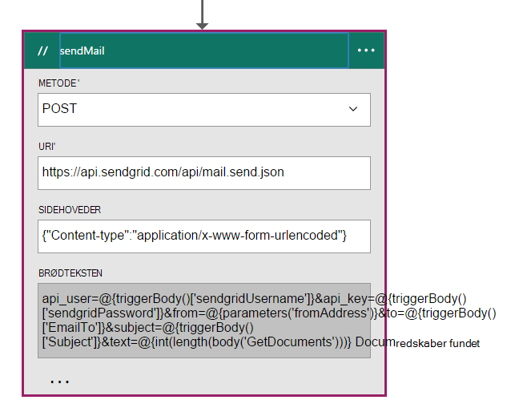

##### <a name="code-view"></a>Kodevisning

```JSON


    "sendMail": {
        "conditions": [
        {
            "dependsOn": "GetDocuments"
        }
        ],
        "inputs": {
        "body": "api_user=@{triggerBody()['sendgridUsername']}&api_key=@{triggerBody()['sendgridPassword']}&from=@{parameters('fromAddress')}&to=@{triggerBody()['EmailTo']}&subject=@{triggerBody()['Subject']}&text=@{int(length(body('GetDocuments')))} Documents Found",
        "headers": {
            "Content-type": "application/x-www-form-urlencoded"
        },
        "method": "POST",
        "uri": "https://api.sendgrid.com/api/mail.send.json"
        },
        "type": "Http"
    }
```

I denne handling, du sender en mailmeddelelse.  Du bruger [SendGrid](https://sendgrid.com/marketing/sendgrid-services?cvosrc=PPC.Bing.sendgrib&cvo_cid=SendGrid%20-%20US%20-%20Brand%20-%20&mc=Paid%20Search&mcd=BingAds&keyword=sendgrib&network=o&matchtype=e&mobile=&content=&search=1&utm_source=bing&utm_medium=cpc&utm_term=%5Bsendgrib%5D&utm_content=%21acq%21v2%2134335083397-8303227637-1649139544&utm_campaign=SendGrid+-+US+-+Brand+-+%28English%29).   

Koden for dette blev oprettet ved hjælp af en skabelon til logik App og SendGrid, der er i [101-logik-app-sendgrid Github lager](https://github.com/Azure/azure-quickstart-templates/tree/master/101-logic-app-sendgrid).
 
HTTP-handling er et INDLÆG. 

Parametrene godkendelse er i Udløseregenskaberne

```JSON

    },
        "sendgridPassword": {
             "type": "SecureString"
         },
         "sendgridUsername": {
            "type": "String"
         }

        In addition, other parameters are static values set in the Parameters section of the Logic App. These are:
        },
        "toAddress": {
            "defaultValue": "XXXX@XXXX.com",
            "type": "String"
        },
        "fromAddress": {
            "defaultValue": "XXX@msn.com",
            "type": "String"
        },
        "emailBody": {
            "defaultValue": "@{string(concat(int(length(actions('QueryDocuments').outputs.body)) Records Found),'/n', actions('QueryDocuments').outputs.body)}",
            "type": "String"
        },

```

EmailBody er sammenkæde antallet af dokumenter, der returneres fra den forespørgsel, som kan være flere sammen med eller "0", "Ikke fundet poster". Resten af parametrene, der er angivet fra parametrene udløser.

Denne handling, afhænger af handlingen **GetDocuments** .

#### <a name="operations"></a>Handlinger

##### <a name="request"></a>Anmode om
```JSON

    {
        "uri": "https://api.sendgrid.com/api/mail.send.json",
        "method": "POST",
        "headers": {
        "Content-type": "application/x-www-form-urlencoded"
        },
        "body": "api_user=azureuser@azure.com&api_key=Biz@Talk&from=user@msn.com&to=XXXX@XXXX.com&subject=New Patients&text=37 Documents Found"
    }

```

##### <a name="response"></a>Svar

```JSON

    {
        "statusCode": 200,
        "headers": {
        "connection": "keep-alive",
        "x-Frame-Options": "DENY,DENY",
        "access-Control-Allow-Origin": "https://sendgrid.com",
        "date": "Fri, 26 Feb 2016 15:47:35 GMT",
        "server": "nginx"
        },
        "body": {
        "message": "success"
        }
    }
```

Endelig vil du kunne se resultaterne fra din logik App på Azure-portalen. For at gøre det, føjer du en parameter til afsnittet output.


```JSON

    "outputs": {
        "Results": {
            "type": "String",
            "value": "@{int(length(actions('QueryDocuments').outputs.body))} Records Found"
        }

```

Dette returnerer samme værdi, der sendes i brødteksten mail. I følgende figur vises et eksempel, hvor "29 poster fundet".

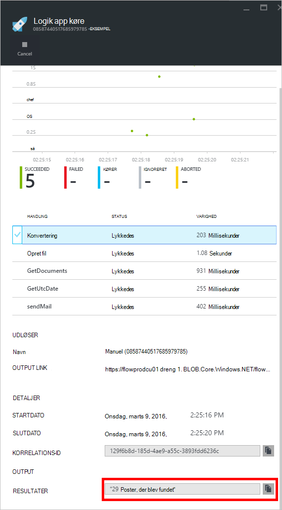

## <a name="metrics"></a>Målepunkter
Du kan konfigurere overvågning for den primære logik App på portalen. Dette gør det muligt at få vist den køre ventetid og andre begivenheder, som vises i følgende figur.

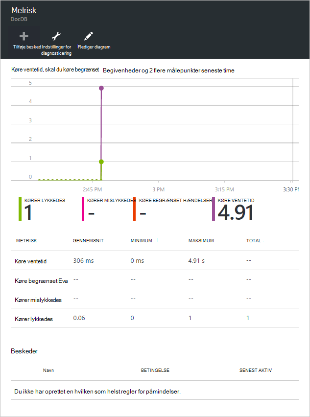

## <a name="docdb-trigger"></a>DocDb udløser

Denne logik App er den udløser, der starter arbejdsprocessen i din primære logik App.

I følgende figur vises visningen Designer.

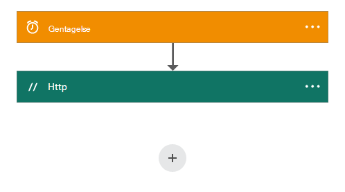

```JSON

    {
        "$schema": "https://schema.management.azure.com/providers/Microsoft.Logic/schemas/2015-08-01-preview/workflowdefinition.json#",
        "actions": {
        "Http": {
            "conditions": [],
            "inputs": {
            "body": {
                "EmailTo": "XXXXXX@XXXXX.net",
                "GetUtcDate_HoursBack": "24",
                "Subject": "New Patients",
                "sendgridPassword": "********",
                "sendgridUsername": "azureuser@azure.com"
            },
            "method": "POST",
            "uri": "https://prod-01.westus.logic.azure.com:443/workflows/12a1de57e48845bc9ce7a247dfabc887/triggers/manual/run?api-version=2015-08-01-preview&sp=%2Ftriggers%2Fmanual%2Frun&sv=1.0&sig=ObTlihr529ATIuvuG-dhxOgBL4JZjItrvPQ8PV6973c"
            },
            "type": "Http"
        }
        },
        "contentVersion": "1.0.0.0",
        "outputs": {
        "Results": {
            "type": "String",
            "value": "@{body('Http')['status']}"
        }
        },
        "parameters": {},
        "triggers": {
        "recurrence": {
            "recurrence": {
            "frequency": "Hour",
            "interval": 24
            },
            "type": "Recurrence"
        }
        }
    }

```

Udløseren er indstillet til en gentagelse af 24 timer. Handlingen, der er en HTTP-POST, som bruger tilbagekald URL-adressen til den primære logik App. Brødteksten indeholder de parametre, der er angivet i JSON skemaet. 

#### <a name="operations"></a>Handlinger

##### <a name="request"></a>Anmode om

```JSON

    {
        "uri": "https://prod-01.westus.logic.azure.com:443/workflows/12a1de57e48845bc9ce7a247dfabc887/triggers/manual/run?api-version=2015-08-01-preview&sp=%2Ftriggers%2Fmanual%2Frun&sv=1.0&sig=ObTlihr529ATIuvuG-dhxOgBL4JZjItrvPQ8PV6973c",
        "method": "POST",
        "body": {
        "EmailTo": "XXXXXX@XXXXX.net",
        "GetUtcDate_HoursBack": "24",
        "Subject": "New Patients",
        "sendgridPassword": "********",
        "sendgridUsername": "azureuser@azure.com"
        }
    }

```

##### <a name="response"></a>Svar

```JSON

    {
        "statusCode": 202,
        "headers": {
        "pragma": "no-cache",
        "x-ms-ratelimit-remaining-workflow-writes": "7486",
        "x-ms-ratelimit-burst-remaining-workflow-writes": "1248",
        "x-ms-request-id": "westus:2d440a39-8ba5-4a9c-92a6-f959b8d2357f",
        "cache-Control": "no-cache",
        "date": "Thu, 25 Feb 2016 21:01:06 GMT"
        }
    }
```

Nu Lad os se på Appen API.

## <a name="docdbnotificationapi"></a>DocDBNotificationApi

Selvom der er flere handlinger i appen, skal du kun bruge tre.

* GetUtcDate
* ConvertToTimeStamp
* QueryForNewPatientDocuments

### <a name="docdbnotificationapi-operations"></a>DocDBNotificationApi handlinger
Lad os se nærmere på Swagger dokumentation

> [AZURE.NOTE] Tillader dig at ringe handlingerne eksternt, skal du tilføje en CORS tilladt origin værdien af "*" (uden anførselstegn) i indstillingerne for din API-App som vist i følgende figur.

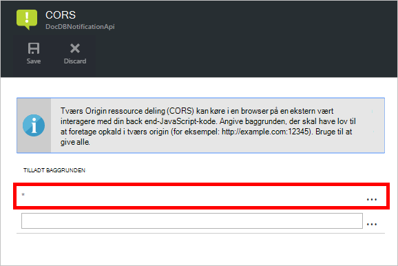

#### <a name="getutcdate"></a>GetUtcDate

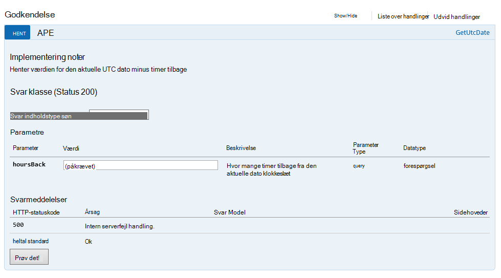

#### <a name="converttotimestamp"></a>ConvertToTimeStamp

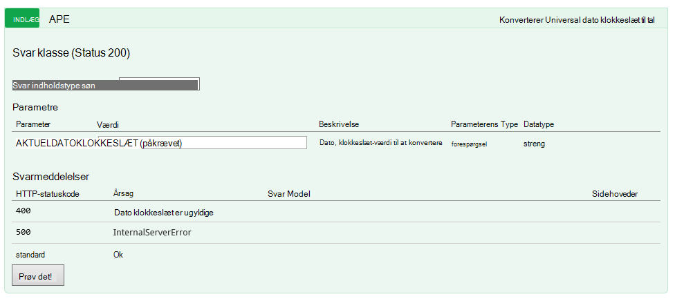

#### <a name="queryfornewpatientdocuments"></a>QueryForNewPatientDocuments

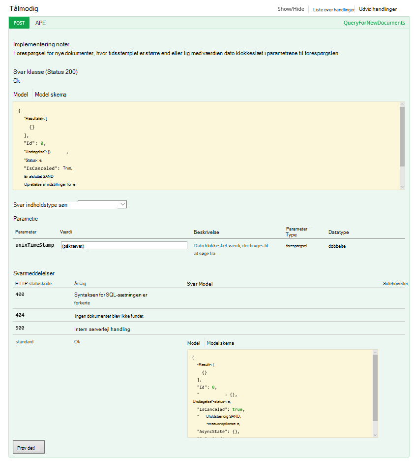

Lad os se nærmere på koden bag ved denne handling.

#### <a name="getutcdate"></a>GetUtcDate

```C#

    /// <summary>
    /// Gets the current UTC Date value
    /// </summary>
    /// <returns></returns>
    [H ttpGet]
    [Metadata("GetUtcDate", "Gets the current UTC Date value minus the Hours Back")]
    [SwaggerOperation("GetUtcDate")]
    [SwaggerResponse(HttpStatusCode.OK, type: typeof (string))]
    [SwaggerResponse(HttpStatusCode.InternalServerError, "Internal Server Operation Error")]
    public string GetUtcDate(
       [Metadata("Hours Back", "How many hours back from the current Date Time")] int hoursBack)
    {


        return DateTime.UtcNow.AddHours(-hoursBack).ToString("r");
    }
```

Denne handling returnerer blot returnerer den aktuelle UTC DateTime minus værdien HoursBack.

#### <a name="converttotimestamp"></a>ConvertToTimeStamp

``` C#

        /// <summary>
        ///     Converts DateTime to double
        /// </summary>
        /// <param name="currentdateTime"></param>
        /// <returns></returns>
        [Metadata("Converts Universal DateTime to number")]
        [SwaggerResponse(HttpStatusCode.OK, null, typeof (double))]
        [SwaggerResponse(HttpStatusCode.BadRequest, "DateTime is invalid")]
        [SwaggerResponse(HttpStatusCode.InternalServerError)]
        [SwaggerOperation(nameof(ConvertToTimestamp))]
        public double ConvertToTimestamp(
            [Metadata("currentdateTime", "DateTime value to convert")] string currentdateTime)
        {
            double result;

            try
            {
                var uncoded = HttpContext.Current.Server.UrlDecode(currentdateTime);

                var newDateTime = DateTime.Parse(uncoded);
                //create Timespan by subtracting the value provided from the Unix Epoch
                var span = newDateTime - new DateTime(1970, 1, 1, 0, 0, 0, 0).ToLocalTime();

                //return the total seconds (which is a UNIX timestamp)
                result = span.TotalSeconds;
            }
            catch (Exception e)
            {
                throw new Exception("unable to convert to Timestamp", e.InnerException);
            }

            return result;
        }

```

Denne handling konverterer svaret fra handlingen GetUtcDate til en dobbelt værdi.

#### <a name="queryfornewpatientdocuments"></a>QueryForNewPatientDocuments

```C#

        /// <summary>
        ///     Query for new Patient Documents
        /// </summary>
        /// <param name="unixTimeStamp"></param>
        /// <returns>IList</returns>
        [Metadata("QueryForNewDocuments",
            "Query for new Documents where the Timestamp is greater than or equal to the DateTime value in the query parameters."
            )]
        [SwaggerOperation("QueryForNewDocuments")]
        [SwaggerResponse(HttpStatusCode.OK, type: typeof (Task<IList<Document>>))]
        [SwaggerResponse(HttpStatusCode.BadRequest, "The syntax of the SQL Statement is incorrect")]
        [SwaggerResponse(HttpStatusCode.NotFound, "No Documents were found")]
        [SwaggerResponse(HttpStatusCode.InternalServerError, "Internal Server Operation Error")]
        // ReSharper disable once ConsiderUsingAsyncSuffix
        public IList<Document> QueryForNewPatientDocuments(
            [Metadata("UnixTimeStamp", "The DateTime value used to search from")] double unixTimeStamp)
        {
            var context = new DocumentDbContext();
            var filterQuery = string.Format(InvariantCulture, "SELECT * FROM Patient p WHERE p._ts >=  {0}",
                unixTimeStamp);
            var options = new FeedOptions {MaxItemCount = -1};


            var collectionLink = UriFactory.CreateDocumentCollectionUri(DocumentDbContext.DatabaseId,
                DocumentDbContext.CollectionId);

            var response =
                context.Client.CreateDocumentQuery<Document>(collectionLink, filterQuery, options).AsEnumerable();

            return response.ToList();
    }

```

Denne handling bruger [DocumentDB.NET SDK](documentdb-sdk-dotnet.md) til at oprette en forespørgsel til dokumentet. 

```C#
     CreateDocumentQuery<Document>(collectionLink, filterQuery, options).AsEnumerable();
```

Svar fra handlingen ConvertToTimeStamp (unixTimeStamp) er overskredet i. Handlingen returnerer en liste over dokumenter, `IList<Document>`.

Tidligere talt vi om CallbackURL. For at starte arbejdsprocessen i din primære logik App, skal du ringe til den med CallbackURL.

## <a name="callbackurl"></a>CallbackURL

Hvis du vil starte, skal du din Azure AD-Token.  Det kan være svært at få dette token. Jeg ude efter en nem metode og Jeff Hollan, der er en Azure logik App program manager, anbefales ved hjælp af [armclient](http://blog.davidebbo.com/2015/01/azure-resource-manager-client.html) i PowerShell.  Du kan installere det følge anvisningerne.

Handlinger, du vil bruge er logon og ringe ARM API.
 
Login: Du bruger de samme legitimationsoplysninger til at logge på Azure-portalen. 

Handlingen ringe ARM Api er det, der genereres din CallBackURL.

I PowerShell ringe du til den på følgende måde:  

```powershell

    ArmClient.exe post https://management.azure.com/subscriptions/[YOUR SUBSCRIPTION ID/resourcegroups/[YOUR RESOURCE GROUP]/providers/Microsoft.Logic/workflows/[YOUR LOGIC APP NAME/triggers/manual/listcallbackurl?api-version=2015-08-01-preview

```

Resultatet ser sådan ud:

```powershell

    https://prod-02.westus.logic.azure.com:443/workflows/12a1de57e48845bc9ce7a247dfabc887/triggers/manual/run?api-version=2015-08-01-prevaiew&sp=%2Ftriggers%2Fmanual%2Frun&sv=1.0&sig=XXXXXXXXXXXXXXXXXXX

```

Du kan bruge et værktøj som [postman](http://www.getpostman.com/) til at teste primære logik App, som vist i følgende figur.

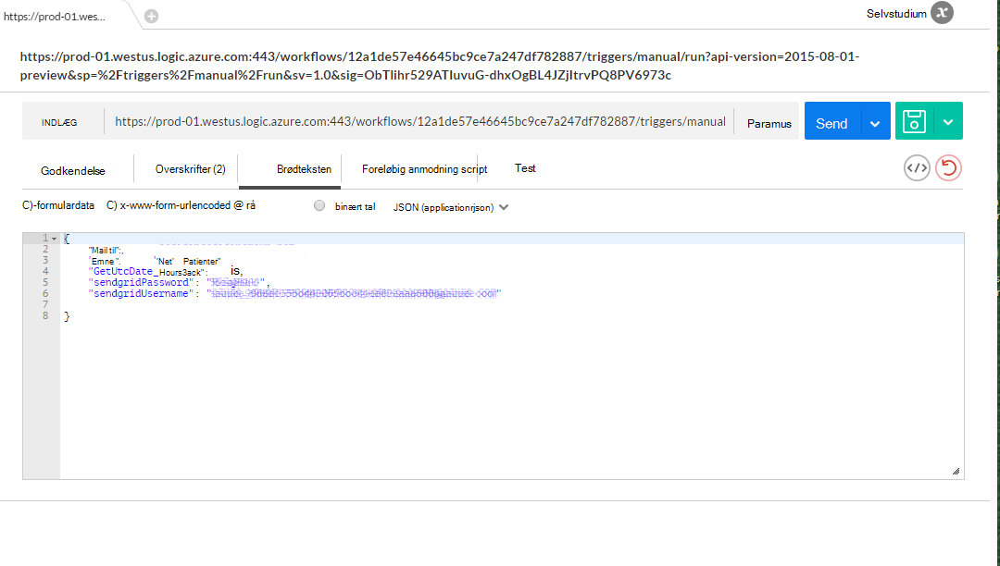

I følgende tabel vises de udløser parametre, der udgør brødteksten i DocDB udløser logik App.

Parameter | Beskrivelse 
--- | --- 
GetUtcDate_HoursBack | Bruges til at angive antallet timer for startdatoen søgning
sendgridUsername | Bruges til at angive antallet timer for startdatoen søgning
sendgridPassword | Brugernavnet for sende gitter mail
Mail | Den mailadresse, der skal modtage besked mail
Emne | Emnet for e-mailen

## <a name="viewing-the-patient-data-in-the-azure-blob-service"></a>Få vist patienter dataene i Azure Blob-tjenesten

Gå til kontoen Azure-lager, og vælg BLOB under tjenester, som vist i følgende figur.

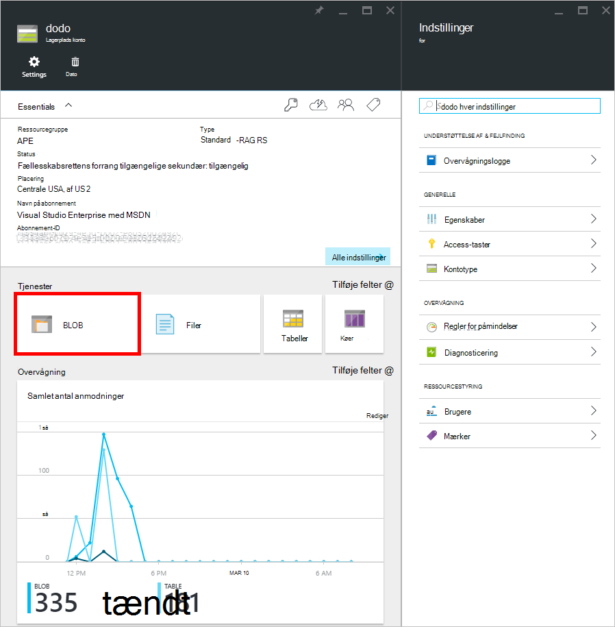 

Du vil kunne se patienter blob oplysningerne som vist nedenfor.

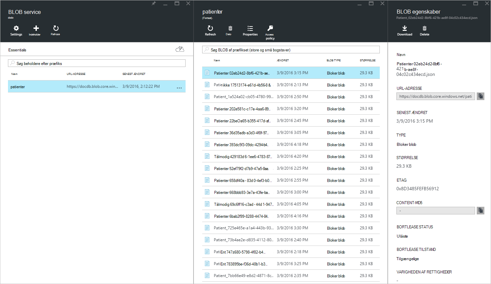


## <a name="summary"></a>Oversigt

I denne gennemgang, du har lært følgende:

* Det er muligt at implementere meddelelser i DocumentDB.
* Ved hjælp af logik Apps, kan du automatisere processen.
* Ved hjælp af logik Apps, kan du reducere den tid, det tager for at levere et program.
* Du kan nemt forbruge en API-App i en logik App ved hjælp af HTTP.
* Du kan nemt oprette en CallBackURL, der erstatter HTTP lytteren.
* Du kan nemt oprette brugerdefinerede arbejdsprocesser med logik Apps Designer.

Nøglen er til at planlægge og modellere arbejdsprocessen.

## <a name="next-steps"></a>Næste trin
Hente, og brug den logik App-kode, der er angivet i [Github](https://github.com/HEDIDIN/DocDbNotifications). Jeg inviterer dig til at opbygge på programmet og sende ændringer til repo. 

Hvis du vil vide mere om DocumentDB skal du besøge [Læringssti](https://azure.microsoft.com/documentation/learning-paths/documentdb/).
