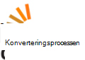

<properties
  pageTitle="DocumentDB community & nyheder | Microsoft Azure"
  description="Deltage i community'et Azure DocumentDB for at opbygge relationer, vise dit arbejde og forbedre dine færdigheder."
  services="documentdb"
  documentationCenter=""
  authors="aliuy"
  manager="johnmac"
  editor="mimig"/>

<tags
  ms.service="documentdb"
  ms.devlang="na"
  ms.topic="article"
  ms.tgt_pltfrm="na"
  ms.workload="data-services"
  ms.date="09/26/2016"
  ms.author="andrl"/>

# Communityportal

## Community-spotlight

Lad os hæve projektet! Vis os telefonbog projektet du arbejder på, med DocumentDB, og vi kan hjælpe med at dele din genius med hele verden. Hvis du vil sende dit projekt, sende os en e-mail til: [askdocdb@microsoft.com](mailto:askdocdb@microsoft.com).

### documentdb-lumenize

*ved Larry Maccherone*

Sammenlægninger (Group by-Pivot-tabel, og N-flerdimensionale kube) og tilpasse tidspunktet for serien transformationer som lagrede procedurer i DocumentDB.

Tjekke filen ud på [Github](https://github.com/lmaccherone/documentdb-lumenize) og [npm](https://www.npmjs.com/package/lumenize).

### DocumentDB Studio

*ved Ming Liu*

En klient management viewer/explorer til Microsoft Azure DocumentDB tjeneste.

Tjekke filen ud på [Github](https://github.com/mingaliu/DocumentDBStudio).

### DoQmentDB

*ved Ariel Mashraki*

DoQmentDB er en Node.js løftet-baseret klient, der indeholder et synes godt om MongoDB lag oven på DocumentDB.

Tjekke filen ud på [Github](https://github.com/a8m/doqmentdb) og [npm](https://www.npmjs.com/package/doqmentdb).

### Swagger REST-API til DocumentDB

*ved Howard Edidin*

En DocumentDB RESTEN API Swagger fil, der nemt kan installeres som en API-App.

Tjekke filen ud på [Github](https://github.com/HEDIDIN/DocumentDB-REST/tree/master/DocumentDBRestApi).

### Fluent-plug-in-documentdb

*ved Yoichi Kawasaki*

Fluent-plug-in-documentdb er et Fluentd plug-in til output til Azure DocumentDB.

Tjekke filen ud på [Github](https://github.com/yokawasa/fluent-plugin-documentdb) og [rubygems](https://rubygems.org/gems/fluent-plugin-documentdb).

*Find flere Åbn kilde DocumentDB projekter på [GitHub](https://github.com/search?p=4&q=documentdb&type=Repositories).*

## Nyheder, blogge og artikler

Du kan være opdateret med de seneste nyheder og DocumentDB og funktioner ved følgende [bloggen](https://azure.microsoft.com/blog/tag/documentdb/).

**Community indlæg:**

- [**Gå sociale med DocumentDB**](https://blogs.msdn.microsoft.com/mvpawardprogram/2016/03/15/going-social-with-documentdb/) - *ved Matias Quarantaas*

- [**UWP, Azure App tjenester og DocumentDB suppe: en beregnet til fotodeling app**](https://blogs.windows.com/buildingapps/2016/03/17/uwp-azure-app-services-and-documentdb-soup-a-photo-sharing-app/) - *ved Eric Langland*

- [**Meddelelser om nye eller ændrede DocumentDB ressourcer ved hjælp af logik Apps**](documentdb-change-notification.md) - *ved Howard Edidin*

- [**Indsamling af logfiler i til Azure DocumentDB ved hjælp af fluent-plug-in-documentdb**](http://unofficialism.info/posts/collecting-logs-into-azure-documentdb-using-fluent-plugin-documentdb/) - *ved Yoichi Kawasaki*

- [**DocumentDB igen del 1/2 – ANSVARSTEORI**](https://peterintheazuresky.wordpress.com/2016/02/19/documentdb-revisited-part-12-the-theory/) - *ved Peter Mannerhult*

- [**Hvad kan du elsker og bruger meget tid om Azure's DocumentDB**](http://blog.falafel.com/4-what-to-love-and-hate-about-azures-documentdb/) - *ved Jens Saadeh*

- [**Azure DocumentDB serversiden Scripting**](https://www.simple-talk.com/cloud/cloud-data/azure-documentdb-server-side-scripting/) - *af Robert Sheldon*

- [**Synkronisere DocumentDB som en data for Azure Stream analyser**](http://janatdevelopment.com/2015/12/11/documentdb-as-a-data-sink-for-azure-stream-analytics/?utm_source=twitterfeed&utm_medium=twitter) - *ved Jan Hentschel*

- [**Azure DocumentDB fremstilling!** ](http://blog.nexapp.ca/2015/11/30/azure-documentdb-in-production/)  -  *ved Alexandre Walsh og presserester Olivier Duval*

- [**Azure Søg indeks – DocumentDB forespørgsler (spansk)**](http://www.ealsur.com.ar/wp/index.php/2015/11/19/azure-search-indexers-documentdb-queries/) - *ved Matthias Quaranta*

- [**Azure DocumentDB SQL-forespørgsel grundlæggende (japansk)**](http://beachside.hatenablog.com/entry/2015/12/06/000045) - *ved Atsushi Yokohama*

- [**Datapunkter - Aurelia opfylder DocumentDB: En Matchmaker rejse**](https://msdn.microsoft.com/magazine/mt620011.aspx) - *ved Julie Lerman*

- [**Infrastructure som kode og fortløbende installation af en Node.js + Azure DocumentDB løsning**](http://www.talmeida.net/blog/2015/10/26/infrastructure-as-code-and-continuous-deployment-of-a-nodejs-azure-documentdb-solution) - *ved Thiago Almedia*

- [**Hvorfor DocumentDb giver gode forretningsmæssige mening for nogle projekter**](http://www.iquestllc.com/blogs/read/405/why-documentdb-makes-good-business-sense-for-some-projects) - *ved Samuel Uresin*

- [**Azure DocumentDB udvikling glidende Videresend – udvikling af klassen klienten (1 af 2) (japansk)**](http://beachside.hatenablog.com/entry/2015/10/01/202734) - *ved Atsushi Yokohama*

- [**Ting, du bør vide, når du bruger Azure DocumentDB (japansk)**](http://beachside.hatenablog.com/entry/2015/10/01/202734) - *ved Atsushi Yokohama*

- [**Håndtere RequestRateTooLarge fejl i Azure DocumentDB og test af ydeevne**](http://blogs.msdn.com/b/bigdatasupport/archive/2015/09/02/dealing-with-requestratetoolarge-errors-in-azure-documentdb-and-testing-documentdb-performance.aspx) - *ved Azim Uddin*

- [**Datapunkter - en oversigt over Microsoft Azure DocumentDB**](https://msdn.microsoft.com/magazine/mt147238.aspx) - *ved Julie Lerman*

- [**Brug af DocumentDB med F #**](https://jamessdixon.wordpress.com/2014/12/30/using-documentdb-with-f/) - *ved Jens Dixon*

- [**Analyse programmet logger med DocumentDB**](http://vincentlauzon.com/2015/09/06/analysing-application-logs-with-documentdb/) - *ved Vincent Philippe Lauzon*

- [**Azure DocumentDB – punkt i tid sikkerhedskopier**](http://softwarejuancarlos.com/2015/09/06/azure-documentdb-point-in-time-backups/) - *ved skov Jensen Carlos Sanchez*

*Har du et blogindlæg, eksempel-kode eller Casestudie du gerne vil dele? [Fortæl os](mailto:askdocdb@microsoft.com)!*

## Begivenheder og optagelser

### Seneste og kommende begivenheder

| Navn på denne begivenhed                                                                                                                 | Højttaler                                                     | Placering             | Dato                     | Mærke |
| -------------------------------------------------------------------------------------------------------------------------- | ----------------------------------------------------------- | -------------------- | ------------------------ | ------- |
| [Antændes 2016](https://myignite.microsoft.com/sessions?q=documentdb)  [Keynote: Aktivere digital transformation ved hjælp af urimelige effektiviteten af A.C.I.D med Joseph Sirosh](https://myignite.microsoft.com/sessions/34953)  [Session: Azure DocumentDB massive skaleres: succes og design mønstre med Syam Kumar Nair og Andrew Liu](https://myignite.microsoft.com/sessions/3066)  [Session: Administrere IoT Aktiver med Node.js og DocumentDB med Joshua Davis](https://myignite.microsoft.com/sessions/39704)  [Session: Opbygge smartere og SVG-programmer, der bruger Microsoft Azure-Database Services med Tara Jana og Moshe Gutman](https://myignite.microsoft.com/sessions/2633)| Andrew Liu, Syam Kumar Nair og Tara Jana | Atlanta, GA | September 26-30, 2016 | [#MSIgnite](https://twitter.com/MS_Ignite) |
| [Meetup på Ignite: DocumentDB: avancerede funktioner til store-Apps](http://www.meetup.com/Azure-in-the-ATL/events/234252070/) | Andrew Liu, Syam Kumar Nair |  Atlanta, GA | September 27 2016 | [#MSIgnite](https://twitter.com/MS_Ignite)[@FlatironCity](https://twitter.com/FlatironCity) |
| [Lag + Hadoop verden](http://conferences.oreilly.com/strata/hadoop-big-data-ny/?cmp=kn-data-confreg-home-stny16_bing_branded) | Kom Besøg vores booth! | New York, NY | September 26-29, 2016 | [#StrataConf](https://twitter.com/strataconf) |
| [Kapital by .NET-brugergruppen](http://www.meetup.com/tally-dot-net/events/233768568/) | Santosh Hari | Tallahassee, FL | 3 november 2016 | i/t. |

*Er du taler på eller vært for en begivenhed? [Fortæl os,](mailto:askdocdb@microsoft.com) hvordan vi kan hjælpe!*

### Tidligere hændelser og optagelser

| Navn på denne begivenhed                                                                                                                 | Højttaler                                                     | Placering             | Dato                   | Optagelse |
| -------------------------------------------------------------------------------------------------------------------------- | ----------------------------------------------------------- | -------------------- | ---------------------- | --------- |
| [DevTeach](http://devteach.com/) | Mads Cenerelli  | Montreal, Canada | Juli 4-8, 2016 | [NoSQL, ikke noget Problem, ved hjælp af Azure DocumentDB](http://www.slideshare.net/KenCenerelli) |
| [Integration og IoT](http://www.btug.be/events) | Eldert Grootenboer | Kontich, Belgien | Juni 30 2016 | i/t. |
| [MongoDB verden 2016](https://www.mongodb.com/world16) | Kirill Gavrylyuk | New York, New York | Juni 28-29, 2016 | i/t. |
| [Integration af brugergruppe](http://www.integrationusergroup.com/do-logic-apps-support-error-handling/) | Howard S. Edidin | Webcast | 20 juni 2016 | [Understøtter logik Apps fejlhåndtering?](http://www.integrationusergroup.com/do-logic-apps-support-error-handling/) |
| [Meetup: Storbritannien Azure-brugergruppen](http://www.meetup.com/UKAzureUserGroup/events/229673468/)| Andrew Liu  | London, Storbritannien | Maj 12 2016 | i/t.
|[Meetup: ONETUG - Orlando .NET-brugergruppen](http://www.meetup.com/ONETUG/events/230797164/)| Santosh Hari| Orlando, FL| Maj 12 2016| i/t. 
| [SQLBits XV](https://sqlbits.com/)                                                                                         | Andrew Liu, Aravind Ramachandran                            | Hesselager, Storbritannien        | Maj 4-7, 2016            | i/t.| 
| [Meetup: NYC .NET udviklere gruppe](http://www.meetup.com/NYC-NET-Developers/events/230396260/)                            | Leonard Lobel                                               | New York City, NY    | April 21 2016           | i/t. |
| [Integration af brugergruppe](http://www.integrationusergroup.com/#)                                                            | Howard Edidin                                               | Webinar              | April 25 2016           | i/t. |
| [Global Azure Bootcamp: SoCal](http://xprs.imcreator.com/free/vishalishere/gab2016)                                        | Leonard Lobel                                               | Orange, CA           | April 16 2016           | i/t. |
| [Global Azure Bootcamp: Redmond](https://www.eventbrite.com/e/2016-global-azure-bootcamp-redmond-wa-tickets-21387752343)   | David Makogon                                               | København          | April 16 2016           | i/t. |
| [SQL lørdag #481 - Israel 2016](http://www.sqlsaturday.com/481/Sessions/Details.aspx?sid=40912)                          | Leonard Lobel                                               | HaMerkaz, Israel     | April 04 2016         | i/t. |
| [Opbyg 2016](https://build.microsoft.com/)                                                                                 | John Macintyre                                              | SAN Francisco, CA    | Marts 31 2016         | [Fremvisning af programmer skaleres til brug med DocumentDB, Azure's NoSQL dokument-Database](https://channel9.msdn.com/Events/Build/2016/B840)
| [SQL lørdag #505 - Belgien 2016](http://www.sqlsaturday.com/505/Sessions/Details.aspx?sid=44217)                         | Mihail Mateev                                               | Antwerp, Belgien     | Marts 19 2016         | i/t. |
| [Meetup: CloudTalk](http://www.meetup.com/CloudTalk/events/227963695/)                                                     | Kirat Pandya                                                | Storeby, WA         | Marts 3 2016          | i/t. |
| [Meetup: Azure Austin](http://www.meetup.com/azureaustin/events/228209275/)                                                | Merwan Chinta                                               | Austin, TX           | Januar 28 2016       | i/t. |
| [Meetup: msdevmtl](http://www.meetup.com/msdevmtl/events/223839818/)                                                       | Vincent Philippe Lauzon                                     | Montreal, QC, Canada | 1 december 2015       | i/t. |
| [Meetup: SeattleJS](http://www.meetup.com/seattlejs/events/220102664/)                                                     | David Makogon                                               | Seattle, WA          | November 12 2015      | i/t. |
| [OVERFØRE Summit 2015](http://www.sqlpass.org/summit/2015/)                                                                    | Jeff Renz Andrew Hoh Aravind Ramachandran, og John Macintyre | Seattle, WA          | Oktober 27-30 2015    | [Moderne udviklingsprogrammer på Azure](https://www.youtube.com/watch?v=k5Z24HX-RyQ) |
| [CloudDevelop 2015](http://www.clouddevelop.org/)                                                                          | David Makogon, Ryan Crawcour                                | Columbus, OH         | Oktober 23 2015       | i/t. |
| [SQL lørdag #454 - Turin 2015](http://www.sqlsaturday.com/454/Sessions/Details.aspx?sid=40130)                           | Makroprojektmappe De Nittis                                             | Turin, Italien         | 10 oktober 2015       | i/t. |
| [SQL lørdag #430 - Sofia 2015](http://www.sqlsaturday.com/430/Sessions/Details.aspx?sid=36090)                           | Leonard Lobel                                               | Sofia, Bulgarien      | 10 oktober 2015       | i/t. |
| [SQL lørdag #444 - Kansas City 2015](http://www.sqlsaturday.com/444/Sessions/Details.aspx?sid=38576)                     | Jeff Renz                                                   | Kansas City, må      | 3 oktober 2015        | i/t. |
| [SQL lørdag #429 - Oporto 2015](http://www.sqlsaturday.com/429/Sessions/Details.aspx?sid=36089)                          | Leonard Lobel                                               | Oporto, Portugal     | 3 oktober 2015        | i/t. |
| [AzureCon](https://azure.microsoft.com/azurecon/)                                                                          | David Makogon, Ryan Crawcour, John Macintyre                | Virtuel begivenhed        | September 29 2015     | [Azure data og analytics-platformen](https://channel9.msdn.com/events/Microsoft-Azure/AzureCon-2015/ACON207) [Arbejde med NoSQL Data i DocumentDB](https://channel9.msdn.com/Events/Microsoft-Azure/AzureCon-2015/ACON338) |
| [SQL lørdag #434 - Holland 2015](http://www.sqlsaturday.com/434/Sessions/Details.aspx?sid=36413)                         | Leonard Lobel                                               | Utrecht, Nederlandene | September 26 2015     | [Introduktion til Azure DocumentDB](https://channel9.msdn.com/Blogs/Windows-Azure/SQL-Saturday-Holland-2015-Introduction-to-Azure-DocumentDB) |
| [SQL lørdag #441 - Denver 2015](http://www.sqlsaturday.com/441/Sessions/Details.aspx?sid=39191)                          | Jeff Renz                                                   | Denver, CO           | September 19 2015     | i/t. |
| [Meetup: San Francisco plads område Azure udviklere](http://www.meetup.com/bayazure/events/223943785/)                        | Andrew Liu                                                  | SAN Francisco, CA    | September 15 2015     | i/t. |
| [Belarus Azure brugergruppe møde op](https://www.facebook.com/events/786540124800276/)                                       | Alex Zyl                                                    | Minsk, Belarus       | September 9 2015      | [Introduktion til DocumentDB som repræsenterer oversigt, konsistens niveauer, sharding strategier](https://www.youtube.com/watch?v=Uc_qwWzJKH8) |
| [NoSQL nu!](http://nosql2015.dataversity.net/)                                                                            | David Makogon, Ryan Crawcour                                | SAN Jose, CA         | August 18-20 2015     | i/t. |
| [@ScaleSeattle](http://www.atscaleconference.com/)                                                                        | Dharma Shukla                                               | Seattle, WA          | Juni 17 2015          | [Skema Agnostic indeksering med Azure DocumentDB](https://www.youtube.com/watch?v=VJQ_5qFFVP4) |
| [Teknisk opdatering 2015](https://channel9.msdn.com/Events/DXPortugal/Tech-Refresh-2015)                                         | Bruno Lopes                                                 | Lissabon, Portugal     | Juni 15 2015          | [DocumentDB 101](https://channel9.msdn.com/Events/DXPortugal/Tech-Refresh-2015/DPDEV01) |
| [SQL lørdag #417 - Sri Lanka 2015](http://www.sqlsaturday.com/417/Sessions/Details.aspx?sid=21415)                       | Mihail Mateev                                               | Colombo, Sri Lanka   | Juni 06 2015          | i/t. |
| [Meetup: Seattle skalerbarhed Meetup](http://www.meetup.com/Seattle-Scalability-Meetup/events/204010442/)                    | Dharma Shukla                                               | Seattle, WA          | 27 maj 2015           | i/t. |
| [SQL lørdag #377 - Kiev 2015](http://www.sqlsaturday.com/377/Sessions/Details.aspx?sid=20322)                            | Mihail Mateev                                               | Kiev, Ukraine        | 23 maj 2015           | i/t. |
| [Database måned](http://www.databasemonth.com/database/azure-documentdb)                                                   | Dharma Shukla                                               | New York, NY         | 19 maj 2015           | [Azure DocumentDB: Stort omfang SVG, med flere lejer dokument Database Service](https://www.youtube.com/watch?v=iZsqBc3Dkbk) |
| [Meetup: London SQL Server-brugergruppen](http://www.meetup.com/London-SQL-Server-User-Group/events/221525058/)               | Allan Mitchell                                              | London, Storbritannien           | 19 maj 2015           | i/t. |
| [DevIntersection](https://devintersection.com/)                                                                            | Andrew Liu                                                  | Scottsdale s       | Maj 18-21 2015        | i/t. |
| [Meetup: Seattle Web App udviklere gruppe](http://www.meetup.com/Seattle-Web-App-Developers-Group/events/220591071/)       | Andrew Liu                                                  | Seattle, WA          | 14 maj 2015           | i/t. |
| [Antændes](http://ignite.microsoft.com/)                                                                                     | Andrew Hoh, John Macintyre                                  | Chicago, IL          | Maj 4-8 2015          | [Vælg seneste fra DocumentDB video](https://azure.microsoft.com/documentation/videos/microsoft-ignite-2015-select-latest-from-microsoft-azure-documentdb/) [DocumentDB og Azure HDInsight: bedre sammen video](https://azure.microsoft.com/documentation/videos/microsoft-ignite-2015-microsoft-azure-documentdb-and-azure-hdinsight-better-together/) |
| [Opbyg 2015](http://www.buildwindows.com/)                                                                                 | Ryan Crawcour                                               | SAN Francisco, CA    | 29 april - 1 maj 2015 | [Oprette den næste stor ting med Azure's NoSQL Service: DocumentDB](https://channel9.msdn.com/Events/Build/2015/2-729) |
| [Global Azure Bootcamp 2015 - Spanien](http://azurebootcamp.es/)                                                             | Mikkel Ruiz Pavon, Roberto Gonzalez                           | Madrid, Spanien        | 25 april 2015         | [#DEAN DocumentDB + Express + AngularJS + NodeJS, der kører på Azure](https://channel9.msdn.com/events/Developers-Spain-Events/Global-Azure-Bootcamp-2015/DEAN-DocumentDB--Express--AngularJS--NodeJS-running-on-Azure) |
| [Meetup: Azure Usergroup Danmark](http://www.meetup.com/Azure-Usergroup-Denmark/events/221026670/)                         | Christian Holm Diget                                        | København, Danmark  | 16 april 2015         | i/t. |
| [Meetup: Charlotte Microsoft Cloud](http://www.meetup.com/Charlotte-Microsoft-Cloud/events/221503519/)                     | Jens Rance                                                 | Charlotte, AK        | 8 april 2015          | i/t. |
| [SQL lørdag #375 - Silicon Valley 2015](http://www.sqlsaturday.com/375/Sessions/Details.aspx?sid=15289)                  | IKE Ellis                                                   | Få vist Mountain, CA    | 28 marts 2015         | i/t. |
| [Meetup: Istanbul Azure Meetup](http://www.meetup.com/istanbul-azure-meetup/events/220325538/)                             | Daron Yondem                                                | Istanbul, Tyrkiet     | 7 marts 2015          | i/t. |
| [Meetup: store søer område .net brugergruppe](http://www.meetup.com/Great-Lakes-Area-NET-User-Group-MIGANG/events/220364576/) | Michael Collier                                             | Southfield, MI       | 18 februar 2015      | i/t. |
| [TechX Azure](https://www.youtube.com/channel/UCDRlI2E4z5qmHsBXTrFOE2Q)                                                    | Magnus Mårtensson                                           | Stockholm, Sverige    | Januar 28-29 2015    | [DocumentDB i Azure nye NoSQL alternativ til skyen](https://www.youtube.com/watch?v=Hw7hDYoChNI) |

### Videoer og Podcasts

| Vis                                        | Højttaler                     | Dato               | Afsnit |
| ------------------------------------------- | --------------------------- | ------------------ | ------- |
| Kanal 9: Microsoft + Open Source          | Douglas Miguel Parrella         | April 14 2016    | [Fra MIDDELVÆRDI til DEAN i Azure med Bitnami, VM skala sæt og DocumentDB](https://channel9.msdn.com/Blogs/Open/From-MEAN-to-DEAN-in-Azure-with-Bitnami-VM-Scale-Sets-and-DocumentDB) |
| Wired2WinWebinar                            | Sai Sankar Kunnathukuzhiyil | Marts 9 2016      | [Udvikling af løsninger med Azure DocumentDB](https://www.youtube.com/watch?v=xKttEwXv_bs)
| Integration af brugergruppe                      | Han Wong                    | Februar 17 2016  | [Analysere og visualisere ikke-relationelle data med DocumentDB + Power BI](http://www.integrationusergroup.com/analyze-visualize-non-relational-data-documentdb-power-bi/) |
| Azure Podcast                           | Kaler Teeter                 | Januar 14 2016   | [Afsnit 110: Ved hjælp af DocumentDB og søgning](http://azpodcast.azurewebsites.net/post/Episode-110-Using-DocumentDB-Search) |
| Kanal 9: Moderne programmer              | Tara Shankar Jana           | December 13 2016  | [Tage en moderne tilgang til data i dine apps](https://channel9.msdn.com/Series/Modern-Applications/Take-a-modern-approach-to-data-in-your-apps) |
| NinjaTips                                   | Miguel Quintero             | December 10 2015  | [DocumentDB - FN vistazo Generelt](https://channel9.msdn.com/Series/Ninja-Tips/31-NinjaTips-Desarrollo-DocumentDB-1-Vistazo-general) |
| Integration af brugergruppe                      | Howard Edidin               | November 9 2015   | [Azure DocumentDB til sundhedssektoren Integration – del 2](http://www.integrationusergroup.com/azure-documentdb-for-healthcare-integration-part-2/) |
| Integration af brugergruppe                      | Howard Edidin               | Oktober 5 2015    | [Azure DocumentDB til sundhedssektoren Integration](http://www.integrationusergroup.com/?event=azure-documentdb-and-biztalk) |
| DX Italien - #TecHeroes                       | Alessandro Melchiori        | 2 oktober 2015    | [#TecHeroes - DocumentDB](https://channel9.msdn.com/Shows/TecHeroes/TecHeroes-DocumentDB) |
| Microsoft Cloud Vis - Podcast              | Andrew Liu                  | 30 september 2015 | [Afsnit 099 - Azure DocumentDB med Andrew Liu](http://www.microsoftcloudshow.com/podcast/Episodes/099-azure-documentdb-with-andrew-liu) |
| .NET klipper!  -Podcast                      | Ryan Crawcour               | September 29 2015 | [Data i DocumentDB med Ryan CrawCour](https://www.dotnetrocks.com/?show=1197) |
| Data, der vises                                | Ryan Crawcour               | September 28 2015 | [Hvad er nyt i Azure DocumentDB siden GA](https://channel9.msdn.com/Shows/Data-Exposed/Whats-New-with-Azure-DocumentDB-Since-GA) |
| Azure Podcast                           | Kaler Teeter                 | September 17 2015 | [Afsnit 94: azpodcast.com nyt-arkitektur](http://azpodcast.azurewebsites.net/post/Episode-94-azpodcastcom-re-architecture) |
| Omslag til skyen                                 | Ryan Crawcour               | September 4 2015  | [Afsnit 185: DocumentDB opdateres med Ryan CrawCour](https://channel9.msdn.com/Shows/Cloud+Cover/Episode-185-DocDB-Updates-with-Ryan-CrawCour) |
| CodeChat 033                                | Greg Doerr                  | Juli 28 2015      | [Greg Doerr på Azure DocumentDB](https://channel9.msdn.com/Shows/codechat/033) |
| NoSql Central                               | Konge Wilder                 | 25 maj 2015       | [Golfafdelingen sporing af - en videooversigt om, hvordan du opretter et webprogram oven på AngularJS, WebApi 2 og DocumentDB.](http://www.nosqlcentral.net/Story/Details/videos/kahanu/1-documentdb-golf-tracker-overview) |
| I hukommelsen teknologier gang virtuelle kapitel | Stephen Baron               | 25 maj 2015       | [Hej DocumentDB](https://www.youtube.com/watch?v=itFXQCd9-dI) |
| Data, der vises                                | Ryan Crawcour               | 8 april 2015      | [DocumentDB generelle tilgængelighed og nyheder!](https://channel9.msdn.com/Shows/Data-Exposed/DocumentDB-General-Availability-and-Whats-New) |
| Data, der vises                                | Andrew Liu                  | 17 marts 2015     | [Java SDK for DocumentDB](https://channel9.msdn.com/Shows/Data-Exposed/Java-SDK-for-DocumentDB) |
| #DevHangout                                 | Gustav Alzate Sandoval     | 11 marts 2015     | [DocumentDB, la basere de datos NoSql de Microsoft Azure](https://www.youtube.com/watch?v=8Ud3jB8KOBA) |
| Data arkitektur virtuelle kapitel GENNEMLØB      | IKE Ellis                   | 25 februar 2015  | [Introduktion til DocumentDB](https://www.youtube.com/watch?v=7BQYdFUkz6s) |

### Online klasser

| Learning partner                                                                                                                                                                      | Beskrivelse |
| ------------------------------------------------------------------------------------------------------------------------------------------------------------------------------------- | ----------- |
|  | [**Microsoft Virtual Academy**](https://mva.microsoft.com/en-US/training-courses/deploying-web-apps-to-azure-app-service-16629) giver dig kurser fra de personer, der opbygger Azure DocumentDB. |
|                                                       | [**Pluralsight**](http://www.pluralsight.com/courses/azure-documentdb-introduction) er vigtige Microsoft-partner tilbyder Azure undervisning. Hvis du er en MSDN-abonnement, kan du bruge dine fordele til at få adgang til Microsoft Azure-kurser. |
|                                                  | [**OpsGility**](https://www.opsgility.com/courses/player/introduction_to_azure_documentdb) indeholder omfattende teknisk kurser på Microsoft Azure. Få instruktørledet uddannelse på stedet eller via en remote klasseværelse ved deres branche-bekræftet undervisere. |

## Diskussion

### Twitter

Følg os på twitter [@DocumentDB](https://twitter.com/DocumentDB) og holde dig opdateret med den seneste samtale på [#DocumentDB](https://twitter.com/hashtag/DocumentDB) -mærke.

### Online fora

| Forum udbyder                                                                                                                  | Beskrivelse |
| ------------------------------------------------------------------------------------------------------------------------------- | ----------- |
|  | Et sprog-uafhængige redigeres sammen spørgsmål og svar websted til programmører. Følge vores mærke: [azure-documentdb](http://stackoverflow.com/questions/tagged/azure-documentdb) |
|                                 | Et godt sted til support- og feedback på Microsoft Azure-funktioner og tjenester som websteder, DocumentDB osv. |

## Ringe til team

Har du brug for teknisk support? Har du spørgsmål? Undrer du dig over, om NoSQL er passer for dig? Du kan [planlægge en 1:1 chat direkte med DocumentDB engineering-teamet](http://www.askdocdb.com/). Du kan også tage os en [e-mail](mailto:askdocdb@microsoft.com) eller tweet os på [@DocumentDB](https://twitter.com/DocumentDB). 

## Åbn kildeprojekter

Disse projekter er aktivt udviklet af Azure DocumentDB team i samarbejde med vores open source community'et.

### SDK'er

| Platform | Github                                                                      | Pakke |
| -------- | --------------------------------------------------------------------------- | ------- |
| Node.js  | [Azure-documentdb-node](https://github.com/Azure/azure-documentdb-node)     | [npm](https://www.npmjs.com/package/documentdb) |
| Java     | [Azure-documentdb-java](https://github.com/Azure/azure-documentdb-java)     | [Maven](http://search.maven.org/#search%7Cga%7C1%7Ca%3A%22azure-documentdb%22) |
| Python   | [Azure-documentdb-python](https://github.com/Azure/azure-documentdb-python) | [PyPI](https://pypi.python.org/pypi/pydocumentdb) |

### Andre projekter

| Navn                | Github                                                                                            | Websted |
| ------------------- | ------------------------------------------------------------------------------------------------- | ------- |
| Dokumentation       | [Azure-indhold](https://github.com/Azure/azure-content/tree/master/articles/documentdb)           | [Dokumentation websted](https://azure.microsoft.com/documentation/services/documentdb/) |
| Hadoop-forbindelse    | [Azure-documentdb-hadoop](https://github.com/Azure/azure-documentdb-hadoop)                       | [Maven](http://search.maven.org/#search%7Cga%7C1%7Ca%3A%22azure-documentdb-hadoop%22) |
| Data overførselsværktøjet | [Azure-documentdb-datamigrationtool](https://github.com/Azure/azure-documentdb-datamigrationtool) | [Microsoft downloadcenter](http://www.microsoft.com/en-us/download/details.aspx?id=46436) |

## DocumentDB guider

DocumentDB guider er community fyldtegn, hvem der har dokumenteret et eksempler engagement til hjælp til andre få mest muligt ud af deres oplevelse med Azure DocumentDB. De dele deres særlige engagement, reale viden og teknisk ekspertise med community'et og med DocumentDB teamet.

Guiden | Billede 
 --- | --- 
 [Allan Mitchell](https://twitter.com/allansqlis) |  
 [Starter Stirrup](https://twitter.com/jenstirrup) |             
 [Lenni Lobel](https://twitter.com/lennilobel) |  |          
 [Mihail Mateev](https://twitter.com/mihailmateev) |  |
 [Lars Maccherone](https://twitter.com/lmaccherone) |  
 [Howard Edidin](https://twitter.com/hsedidin) |  
 [Santosh Hari](https://twitter.com/_s_hari) |  

Skal være en DocumentDB guide? Mens der ikke er nogen benchmark for blive en DocumentDB guide, omfatte nogle af de kriterier, vi evaluere betydningen af en nominel ejer bidrag til online fora som StackOverflow og MSDN; wikis og onlineindhold; konferencer og brugergrupper; podcasts, websteder, blogge og sociale medier og artikler og bøger. Du kan udpege dig selv eller andre ved at [sende os en mail](mailto:askdocdb@microsoft.com).
