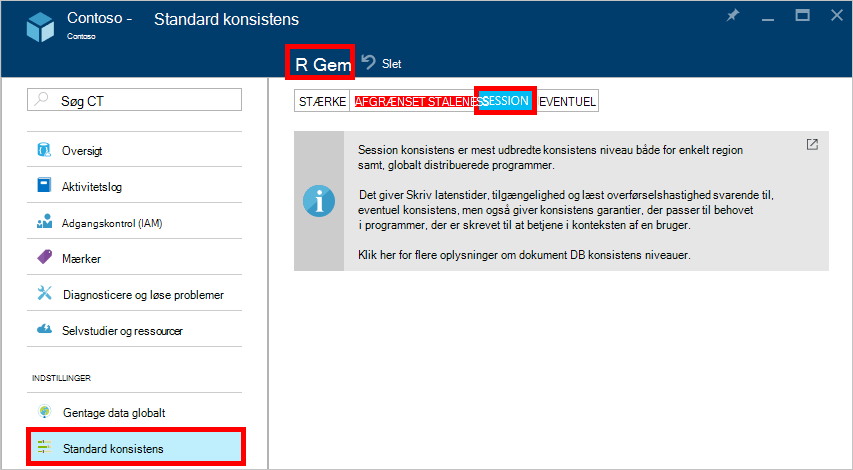

<properties
    pageTitle="Konsistens niveauer i DocumentDB | Microsoft Azure"
    description="DocumentDB har fire konsistens niveauer for at balance eventuel konsistens, tilgængelighed og ventetid kompromiser."
    keywords="eventuel konsistens, documentdb, azure, Microsoft azure"
    services="documentdb"
    authors="syamkmsft"
    manager="jhubbard"
    editor="cgronlun"
    documentationCenter=""/>

<tags
    ms.service="documentdb"
    ms.workload="data-services"
    ms.tgt_pltfrm="na"
    ms.devlang="na"
    ms.topic="article"
    ms.date="08/24/2016"
    ms.author="syamk"/>

# Konsistens niveauer i DocumentDB

Azure DocumentDB er udviklet fra bunden af med global fordeling huske. Det er udviklet til at tilbyde mere forudsigelige kort ventetid garantier, en 99,99% tilgængelighed SERVICENIVEAUAFTALE og flere klart defineret lavere konsistens modeller. I øjeblikket DocumentDB indeholder fire konsistens niveauer: stærke, afgrænset staleness, session, og eventuel. Ud over de **stærke** og **eventuel konsistens** , modeller ofte som andre NoSQL databaser DocumentDB også indeholder to omhyggeligt om og opgivet konsistens modeller – **indrammet staleness** og **session**, og har valideret forbliver anvendelige mod virkelige Brug sager. Samlet gør disse fire konsistens niveauer det muligt at foretage grundigt begrundet kompromiser mellem konsistens, tilgængelighed og ventetid. 

## Omfanget af konsistens

Granulariteten af konsistens er fastsat til en enkelt brugeranmodning. En anmodning om Skriv muligvis svarer til en Indsæt, Erstat, upsert eller slette transaktion (med eller uden udførelse af en tilknyttet pre eller indlæg udløser). Eller en anmodning om Skriv muligvis svarer til den transaktions udførelse af en JavaScript gemt procedure operativsystem over flere dokumenter i en partition. Som med skriver, er en læst/forespørgsel transaktion også fastsat til en enkelt brugeranmodning. Brugeren kan være nødvendigt at indstillinger over en stor-resultatsæt, der strækker sig over flere partitioner, men hver læse transaktion er fastsat til en enkelt side og leveres fra i en enkelt partition.

## Konsistens niveauer

Du kan konfigurere en konsistens Standardniveau for din database-konto, der gælder for alle websteder (på tværs af alle databaserne) under databasekontoen. Som standard bruger alle læser og forespørgsler, der udstedes i forhold til de brugerdefinerede ressourcer Standardniveau konsistens angivet på databasekontoen. Du kan dog slap af konsistens niveauet for en bestemt læst/forespørgsel ved at angive [[x-ms-konsistens-niveau]](https://msdn.microsoft.com/library/azure/mt632096.aspx) anmodning om sidehovedet. Der er fire typer af konsistens-niveauer, der understøttes af DocumentDB gentagelse protokollen, som giver en Ryd forholdet mellem bestemte konsistens garantier og ydeevne, som beskrevet nedenfor.

![DocumentDB tilbyder flere, godt defineret (lavere) konsistens modeller kan vælge mellem][1]

**Stærke**: 

- Stærke konsistens tilbyder en [linearizability](https://aphyr.com/posts/313-strong-consistency-models) garanti med læser garanti for, at returnere den seneste version af et dokument. 
- Stærke konsistens garanterer, at en skrivning kun er synlige, når det er anvendt solidt ved størstedelen quorum replikaer. En skrivning er enten synkront bekræftet solidt ved både primært og quorum af secondaries, eller det er afbrudt. Læse bekræftes altid ved de fleste læse quorum, en klient kan aldrig til at se et tilbageskrivningshandlinger eller delvise skal du skrive og er altid garanti for at læse de seneste anerkendte skrivning. 
- DocumentDB konti, der er konfigureret til at bruge stærke konsistens knytte ikke mere end én Azure område med deres DocumentDB-konto. 
- Omkostninger for en kvittering handling (med hensyn til [anmodning om enheder](documentdb-request-units.md) , der benyttes) med stærke konsistens er højere end session og eventuel, men den samme som afgrænset staleness.
 

**Bounded staleness**: 

- Afgrænset staleness konsistens garantier, som læser kan mellemliggende bag skriver ved højst *K* versioner eller præfikser af et dokument eller en *t* -tidsinterval. 
- Derfor når vælge afgrænset staleness, kan der være konfigureret "staleness" på to måder: 
    - Antal versioner *K* af det dokument, som læser mellemliggende bag skriver
    - Tidsinterval *t* 
- Afgrænset staleness tilbud samlede globale rækkefølge undtagen i "staleness vinduet". Bemærk, at afkrydsningsfeltet monotone Læs garanterer findes i et område både indvendig og udvendig "staleness vinduet". 
- Afgrænset staleness giver en stærkere konsistens garanti end session eller eventuel konsistens. Det anbefales globalt fordelt programmer, du bruger afgrænset staleness til scenarier, hvor du vil gerne have stærke konsistens, men også vil 99,99% tilgængelighed og lav ventetid. 
- DocumentDB konti, der er konfigureret med afgrænset staleness konsistens kan knytte en hvilken som helst antal Azure områder til deres DocumentDB-konto. 
- Omkostninger for en kvittering handling (med hensyn til RUs consumed) med afgrænset staleness er højere end session og eventuel konsistens, men den samme som stærke konsistens.

**Session**: 

- I modsætning til de globale konsistens modeller, som stærke og afgrænset staleness konsistens niveauer, er session konsistens fastsat til en klientsession. 
- Session konsistens er velegnet til alle scenarier, hvor en enhed eller bruger session er involveret, da det garanterer monotone læser, monotone skriver og læse din egen skriver (RYW) garanterer. 
- Session konsistens giver mere forudsigelige konsistens for en session og maksimum læse overførselshastighed mens tilbyder laveste ventetid skriver og læser. 
- DocumentDB konti, der er konfigureret med session konsistens kan knytte en hvilken som helst antal Azure områder til deres DocumentDB-konto. 
- Omkostninger for en kvittering handling (med hensyn til RUs consumed) med session konsistens niveau er mindre end stærke og afgrænset staleness, men mere end eventuel konsistens
 

**Eventuel**: 

- Eventuel konsistens garanterer, at i fravær af enhver yderligere skriver replikaer i gruppen vil til sidst konvergerer. 
- Eventuel konsistens er svageste form af konsistens, hvor en klient kan få de værdier, der er ældre end dem det havde set før.
- Eventuel konsistens giver svageste Læs konsistens men tilbyder den laveste ventetid for både læsning og skrivning.
- DocumentDB konti, der er konfigureret med en eventuel konsistens kan knytte en hvilken som helst antal Azure områder til deres DocumentDB-konto. 
- Omkostninger for en kvittering handling (med hensyn til RUs consumed) med den endelige konsistens niveau er det laveste af alle DocumentDB konsistens niveauer.

## Konsistens garantier

Den følgende tabel registrerer forskellige konsistens garantier, der svarer til de fire konsistens niveauer.

| GARANTIBRUD                                                         |    Stærke                                       |    Afgrænset Staleness                                                                           |    Session                                       |    Eventuel                                 |
|----------------------------------------------------------|-------------------------------------------------|------------------------------------------------------------------------------------------------|--------------------------------------------------|--------------------------------------------------|
|    **Samlede globale rækkefølge**                                |    Ja                                          |    Ja, uden for "staleness vinduet"                                                      |    Nej, delvis "session" rækkefølge                   |    Nej                                            |
|    **Ensartet præfiks GARANTIBRUD**                       |    Ja                                          |    Ja                                                                                         |    Ja                                           |    Ja                                           |
|    **Monotone læser**                                   |    Ja                                          |    Ja, på tværs af områder uden for vinduet staleness og inden for et område hele tiden.     |    Ja, til den angivne session                    |    Nej                                            |
|    **Monotone skriver**                                  |    Ja                                          |    Ja                                                                                         |    Ja                                           |    Ja                                           |
|    **Læs din skriver**                                  |    Ja                                          |    Ja                                                                                         |    Ja (i området, skriv)                      |    Nej                                            |

## Konfiguration af konsistens Standardniveau

1.  [Azure-portalen](https://portal.azure.com/), i Jumpbar, klik på **DocumentDB (NoSQL)**.

2. Vælg databasekontoen til at ændre i bladet **DocumentDB (NoSQL)** .

3. Klik på **standard konsistens**i bladet konto.

4. Vælg ny konsistens niveauet bladet **Standard konsistens** og klik på **Gem**.

    

## Konsistens niveauer for forespørgsler

Som standard for brugerdefinerede ressourcer er niveauet konsistens for forespørgsler i den samme som niveauet konsistens for læser. Som standard opdateres indekset synkront på hver Indsæt, Erstat eller sletning af et dokument til samlingen. Dette gør det muligt for forespørgsler imødekomme konsistens samme niveau som for dokument-læser. Mens DocumentDB skriveadgang optimeret og understøtter vedvarende mængder dokument skriver, synkron indeks vedligeholdelse og fungerer ensartet forespørgsler, kan du konfigurere visse af websteder for at opdatere deres indeks lazily. Fløde indeksering yderligere forstærker Skriv ydeevne og er velegnet til flere indtagelse scenarier, når en arbejdsbyrde er primært læst tunge.  

Indeksering tilstand|  Læser|  Forespørgsler  
-------------|-------|---------
Ensartede (standard)|   Vælge fra stærke, afgrænset staleness session, eller eventuel|    Vælge fra stærke, afgrænset staleness session, eller eventuel|
Fløde|   Vælge fra stærke, afgrænset staleness session, eller eventuel|    Eventuel  

Som læst anmodninger, kan du reducere konsistens niveauet for en bestemt forespørgsel ved at angive [x-ms-konsistens-niveau](https://msdn.microsoft.com/library/azure/mt632096.aspx) anmodning om sidehovedet.

## Næste trin

Hvis du vil gøre flere læse om konsistens niveauer og kompromiserne, anbefaler vi følgende ressourcer:

-   Doug Terry. Replikerede Data konsistens forklaring gennem fodbold (video).   
[https://www.YouTube.com/watch?v=gluIh8zd26I](https://www.youtube.com/watch?v=gluIh8zd26I)
-   Doug Terry. Replikerede Data konsistens forklaring gennem fodbold.   
[http://Research.Microsoft.com/pubs/157411/ConsistencyAndBaseballReport.PDF](http://research.microsoft.com/pubs/157411/ConsistencyAndBaseballReport.pdf)
-   Doug Terry. Session garantier for svagt ensartet replikerede Data.   
[http://DL.acm.org/citation.cfm?id=383631](http://dl.acm.org/citation.cfm?id=383631)
-   Daniel Abadi. Konsistens Kompromiserne i moderne distribueret systemer databasedesign: KNOP er kun en del af tekstenheden ".   
[http://computer.org/CSDL/mags/CO/2012/02/mco2012020037-ABS.HTML](http://computer.org/csdl/mags/co/2012/02/mco2012020037-abs.html)
-   Peter Bailis, Shivaram Venkataraman, Michael J. Franklin, Joseph m Hellerstein, Ion Stoica. Probabilistic afgrænset Staleness (PBS) til praktiske delvis Quorums.   
[http://vldb.org/pvldb/vol5/p776_peterbailis_vldb2012.PDF](http://vldb.org/pvldb/vol5/p776_peterbailis_vldb2012.pdf)
-   Werner Vogels. Eventuel ensartet - igen.    
[http://allthingsdistributed.com/2008/12/eventually_consistent.HTML](http://allthingsdistributed.com/2008/12/eventually_consistent.html)

[1]: ./media/documentdb-consistency-levels/consistency-tradeoffs.png
