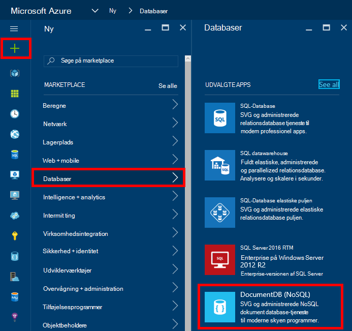
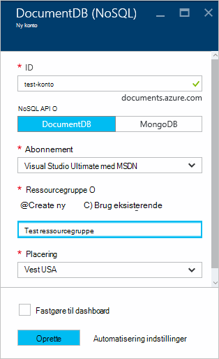
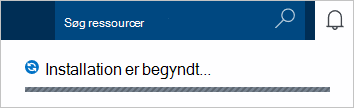
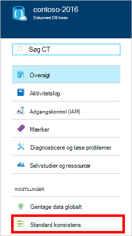
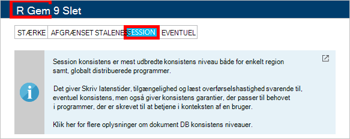

<properties
    pageTitle="Sådan oprettes en DocumentDB konto | Microsoft Azure"
    description="Oprette en NoSQL-database med Azure DocumentDB. Følg disse instruktioner til at oprette en DocumentDB konto og begynde at opbygge din forrygende hurtig og global NoSQL database." 
    keywords="oprette en database"
    services="documentdb"
    documentationCenter=""
    authors="mimig1"
    manager="jhubbard"
    editor="monicar"/>

<tags
    ms.service="documentdb"
    ms.workload="data-services"
    ms.tgt_pltfrm="na"
    ms.devlang="na"
    ms.topic="get-started-article"
    ms.date="10/17/2016"
    ms.author="mimig"/>

# Sådan oprettes en DocumentDB NoSQL konto ved hjælp af portalen Azure

> [AZURE.SELECTOR]
- [Azure-portalen](documentdb-create-account.md)
- [Azure CLI og Azure ressourcestyring](documentdb-automation-resource-manager-cli.md)

Hvis du vil oprette en database med Microsoft Azure DocumentDB, skal du:

- Har en Azure-konto. Du kan få en [gratis Azure-konto](https://azure.microsoft.com/free) , hvis du ikke allerede har et. 
- Oprette en DocumentDB-konto.  

Du kan oprette en DocumentDB konto ved hjælp af enten Azure-portalen, Azure ressourcestyring skabeloner eller Azure kommandolinjen (CLI). I denne artikel viser, hvordan du opretter en DocumentDB konto ved hjælp af portalen Azure. For at oprette en konto med Azure ressourcestyring eller Azure CLI skal du se [automatisere DocumentDB oprettelse af database-konto](documentdb-automation-resource-manager-cli.md).

Er du ny bruger af DocumentDB? Se [denne](https://azure.microsoft.com/documentation/videos/create-documentdb-on-azure/) fire minutters video ved Scott Hanselman at se, hvordan du udfører de mest almindelige opgaver i portalen online.

1.  Log på [Azure-portalen](https://portal.azure.com/).
2.  I Jumpbar, klik på **Ny**, skal du klikke på **databaser**og derefter klikke på **DocumentDB (NoSQL)**. 

      

3. Angiv den ønskede konfiguration for kontoen DocumentDB i bladet **ny konto** .

    

    - Angiv et navn til at identificere DocumentDB kontoen i boksen **ID** .  Når **ID** er blevet godkendt, vises en grøn markering i **feltet** . **Id-** værdien bliver værtsnavn inden for URI. **ID** kan indeholde kun små bogstaver, tal og '-' tegn, og skal være mellem 3 og 50 tegn. Bemærk denne *documents.azure.com* føjes til navnet på du vælger, bliver resultatet af som DocumentDB konto første eller sidste ark.

    - Vælg den programming der skal bruges i feltet **NoSQL API** :
        - **DocumentDB**: DocumentDB API'EN er tilgængelig via .NET, Java, Node.js, Python og JavaScript [SDK'er](documentdb-sdk-dotnet.md)samt HTTP [RESTEN](https://msdn.microsoft.com/library/azure/dn781481.aspx)og tilbyder programmeringsmæssig adgang til alle DocumentDB funktionalitet. 
       
        - **MongoDB**: DocumentDB tilbyder også [protocol niveau support](documentdb-protocol-mongodb.md) til **MongoDB** API'er. Når du vælger indstillingen MongoDB API, kan du bruge eksisterende MongoDB SDK'er og [værktøjer](documentdb-mongodb-mongochef.md) til at tale med DocumentDB. Du kan [flytte](documentdb-import-data.md) dine eksisterende MongoDB apps for at bruge DocumentDB, med [der kræves ingen kodeændringer](documentdb-connect-mongodb-account.md), og drage fordel af en fuldt administreret database som en tjeneste, med uendelig skala, globale gentagelse og andre funktioner.

    - Vælg det Azure abonnement, du vil bruge til kontoen DocumentDB **abonnement**. Hvis dit firma har kun ét abonnement, er denne konto som standard markeret.

    - Vælg i **Ressourcegruppe**, eller Opret en ressourcegruppe til kontoen DocumentDB.  Som standard oprettes en ny ressourcegruppe. Få mere at vide under [Brug af Azure portalen for at administrere dine Azure ressourcer](../articles/azure-portal/resource-group-portal.md).

    - Bruge **placering** til at angive den geografiske placering, hvor til at hoste din DocumentDB-konto. 

4.  Klik på **Opret**, når de nye indstillinger i DocumentDB konto er konfigureret. For at kontrollere status for installationen, se beskeder hubben.  

      

    

5.  Når kontoen DocumentDB er oprettet, er du klar til brug med standardindstillingerne. Standard konsistens DocumentDB konto er angivet til **Session**.  Du kan justere standard konsistens ved at klikke på **Standard konsistens** i menuen ressource. Hvis du vil vide mere om konsistens niveauer, som DocumentDB skal du se [konsistens niveauer i DocumentDB](documentdb-consistency-levels.md).

      

      

[How to: Create a DocumentDB account]: #Howto
[Next steps]: #NextSteps
[documentdb-manage]:../articles/documentdb/documentdb-manage.md

## Næste trin

Nu hvor du har en DocumentDB-konto, er næste trin at oprette en DocumentDB indsamling og database. 

Du kan oprette en ny indsamling og database ved hjælp af en af følgende:

- Azure portalen, som beskrevet i [oprette en DocumentDB af websteder ved hjælp af portalen Azure](documentdb-create-collection.md).
- Inkluderet selvstudier, som omfatter eksempeldata: [.NET](documentdb-get-started.md), [.NET MVC](documentdb-dotnet-application.md), [Java](documentdb-java-application.md), [Node.js](documentdb-nodejs-application.md)eller [Python](documentdb-python-application.md).
- [.NET](documentdb-dotnet-samples.md#database-examples), [Node.js](documentdb-nodejs-samples.md#database-examples)eller [Python](documentdb-python-samples.md#database-examples) eksempelkoden tilgængelig i GitHub.
- [.NET](documentdb-sdk-dotnet.md), [Node.js](documentdb-sdk-node.md), [Java](documentdb-sdk-java.md), [Python](documentdb-sdk-python.md)og [RESTEN](https://msdn.microsoft.com/library/azure/mt489072.aspx) SDK'er.

Når du har oprettet databasen og af websteder, skal du [tilføje dokumenter](documentdb-view-json-document-explorer.md) til samlingerne.

Når du har dokumenter i en samling, kan du bruge [DocumentDB SQL](documentdb-sql-query.md) til at [køre forespørgsler](documentdb-sql-query.md#executing-queries) mod dine dokumenter. Du kan udføre forespørgsler ved hjælp af [Explorer forespørgsel](documentdb-query-collections-query-explorer.md) i portalen, [REST-API](https://msdn.microsoft.com/library/azure/dn781481.aspx)eller en af [SDK'er](documentdb-sdk-dotnet.md).

### Lær mere

Hvis du vil vide mere om DocumentDB, kan du gennemse disse ressourcer:

-   [Læringssti til DocumentDB](https://azure.microsoft.com/documentation/learning-paths/documentdb/)
-   [DocumentDB hierarkiske ressource model og begreber](documentdb-resources.md)
