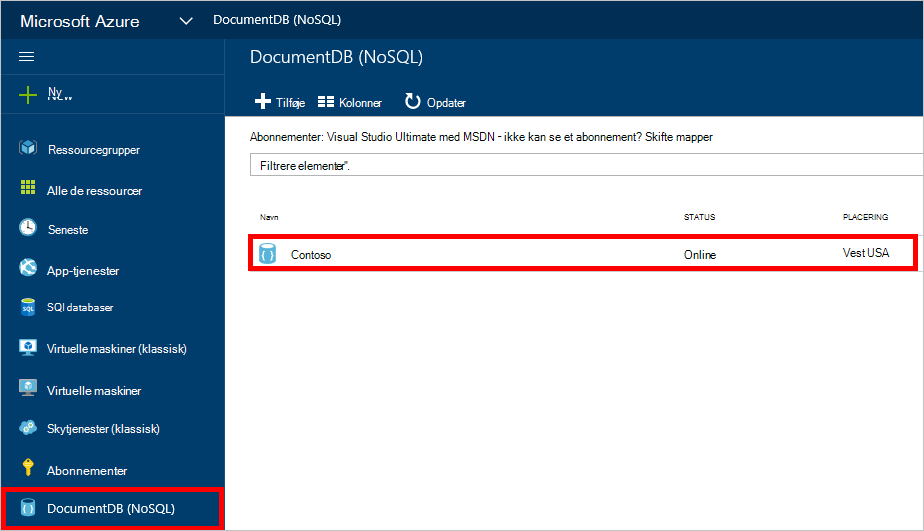
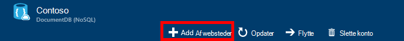
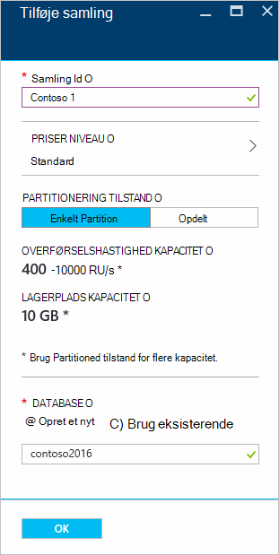
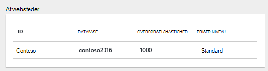
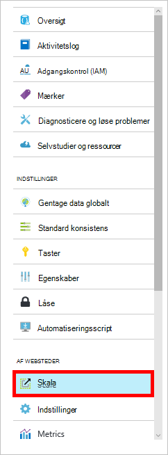

<properties 
    pageTitle="Oprette en DocumentDB database og samling | Microsoft Azure" 
    description="Lær, hvordan du opretter NoSQL databaser og JSON-dokument af websteder ved hjælp af portalen online-tjenesten til Azure DocumentDB, en skybaseret baseret dokument database. Få en gratis prøveversion i dag." 
    services="documentdb" 
    authors="mimig1" 
    manager="jhubbard" 
    editor="monicar" 
    documentationCenter=""/>

<tags 
    ms.service="documentdb" 
    ms.workload="data-services" 
    ms.tgt_pltfrm="na" 
    ms.devlang="na" 
    ms.topic="article" 
    ms.date="10/17/2016" 
    ms.author="mimig"/>

# Sådan oprettes en DocumentDB indsamling og ved hjælp af portalen Azure-database

Hvis du vil bruge Microsoft Azure DocumentDB, skal du have en [DocumentDB konto](documentdb-create-account.md), en database, en af websteder og dokumenter. Dette emne beskrives, hvordan du opretter en DocumentDB af websteder i portalen Azure. 

Ikke, hvad en samling er? Se [Hvad er en DocumentDB samling?](#what-is-a-documentdb-collection)

1.  Klik på **DocumentDB (NoSQL)**i [Azure-portalen](https://portal.azure.com/), i Jumpbar, og vælg derefter den konto, hvor du kan tilføje en samling i bladet **DocumentDB (NoSQL)** . Hvis du ikke har en hvilken som helst konti, der vises, skal du oprette [en DocumentDB-konto](documentdb-create-account.md).

    
    
    Hvis **DocumentDB (NoSQL)** ikke er synlig i Jumpbar, skal du klikke på **Flere tjenester** , og klik derefter på **DocumentDB (NoSQL)**. Hvis du ikke har en hvilken som helst konti, der vises, skal du oprette [en DocumentDB-konto](documentdb-create-account.md).

2. Klik på **Tilføj af websteder**i bladet **DocumentDB konto** for den valgte konto.

    

3. Angiv ID'ET for den nye samling i bladet **Tilføje af websteder** i boksen **ID** . Samling feltnavne skal være mellem 1 og 255 tegn og må ikke indeholde `/ \ # ?` eller et efterfølgende mellemrum. Når navnet er blevet godkendt, vises en grøn markering i feltet.

    

4. **Priser niveau** er som standard angivet til **Standard** , så du kan tilpasse overførselshastighed og lager til af websteder. Du kan finde flere oplysninger om det priser niveau, [ydeevneniveauer i DocumentDB](documentdb-performance-levels.md).  

5. Vælg en **partitionering tilstand** til samlingen, **Enkelt Partition** eller **Partitioned**. 

    En **enkelt partition** har en reserveret lagerkapacitet på 10 GB, og kan have overførselshastighed niveauer fra 400-10.000 anmodning enheder/anden (RU/s). Én RU svarer til overførsel af en læsning af et dokument med 1KB. Du kan finde flere oplysninger om anmodningen enheder, [anmodning om enheder](documentdb-request-units.md). 

    En **partitioneret af websteder** kan skaleres til at håndtere en ubegrænset mængde lagerplads over flere partitioner, og kan have overførselshastighed niveauer fra og med 10,100 RU/s. Den største lagerplads, kan du reservere er 250 GB i portalen, og de fleste overførselshastigheden kan du reservere er 250.000 RU/s. Indsende en anmodning for at øge enten kvote, som beskrevet i [anmodning øget DocumentDB konto kvoter](documentdb-increase-limits.md). Se [enkelt Partition og partitioneret af websteder](documentdb-partition-data.md#single-partition-and-partitioned-collections)for flere oplysninger om den partitioneret af websteder.

    Overførsel for en ny enkelt partition af websteder er som standard angivet til 1000 RU/s med en lagerkapacitet på 10 GB. Samling overførselshastigheden er angivet til 10100 RU/s med en lagerkapacitet på 250 GB for en partitioneret af websteder. Du kan ændre overførselshastighed og lager til samlingen efter samlingen er blevet oprettet. 

6. Hvis du opretter en partitioneret samling, Vælg den **Partitionsnøgle** til samlingen. Hvis du vælger den korrekte Partitionsnøgle er vigtigt i at oprette en performant af websteder. Se [designe for partitionering](documentdb-partition-data.md#designing-for-partitioning)kan finde flere oplysninger om at vælge en Partitionsnøgle.

7. Opret en ny database eller bruge en eksisterende i bladet **Database** . Databasenavne skal være mellem 1 og 255 tegn og må ikke indeholde `/ \ # ?` eller et efterfølgende mellemrum. Klik uden for tekstfeltet for at validere navnet. Når navnet er blevet godkendt, vises en grøn markering i feltet.

8. Klik på **OK** nederst på skærmen for at oprette den nye websteder. 

9. Den nye websteder nu vises i objektiv til **samlinger** på bladet **Oversigt** .
 
    

10. **Valgfrit:** Du kan ændre gennemløb af af websteder i portalen ved at klikke på **skala** i menuen ressource. 

    

## Hvad er en DocumentDB af websteder? 

En samling er en beholder af JSON dokumenter og den tilknyttede JavaScript-programlogik. En samling er en fakturerbar enhed, hvor [omkostninger](documentdb-performance-levels.md) , bestemmes af den klargjorte overførsel af gruppen af websteder. Af websteder kan strækker sig over en eller flere partitioner/servere og kan skaleres til at håndtere næsten ubegrænset mængde lagerplads eller overførselshastighed.

Samlinger er automatisk opdelt i en eller flere fysiske servere ved DocumentDB. Når du opretter en samling, kan du angive den klargjorte overførselshastighed med hensyn til anmodning om enheder hver anden og en partition vigtige egenskab. Værdien af denne egenskab bruges ved DocumentDB til at distribuere dokumenter mellem partitioner og distribuere anmodninger som forespørgsler. Den partition nøgleværdi fungerer også som posteringen grænsen for lagrede procedurer og udløsere. Hver af websteder har en reserveret mængde overførselshastighed, der er specifikke for den af websteder, som ikke deles med andre samlinger i den samme konto. Du kan derfor skalere ud af dit program både med hensyn til lager og overførselshastighed. 

Samlinger er ikke den samme som tabeller i relationsdatabaser. Samlinger gennemtvinger ikke skema, faktisk DocumentDB gennemtvinge ikke en hvilken som helst ved hjælp af skemaer, det er en gratis skema database. Derfor kan du gemme forskellige typer af dokumenter med forskellige skemaer i den samme websteder. Du kan vælge at bruge af websteder til at gemme objekter af en enkelt type, som du ville gøre med tabeller. Den bedste model afhænger af kun hvordan data vises sammen i forespørgsler og transaktioner.

## Andre måder at oprette en DocumentDB af websteder

Af websteder har ikke skal have oprettet ved hjælp af portalen, du kan også oprette dem ved hjælp af [DocumentDB SDK'er](documentdb-sdk-dotnet.md) og REST-API. 

- Du kan finde en C#-kode prøve og [C# samling eksempler](documentdb-dotnet-samples.md#collection-examples). 
- Du kan finde en Node.js kode prøve og [eksempler på Node.js af websteder](documentdb-nodejs-samples.md#collection-examples).
- Du kan finde en Python kode prøve og [Python samling eksempler](documentdb-python-samples.md#collection-examples).
- Du kan finde en REST-API prøve og [oprette en samling](https://msdn.microsoft.com/library/azure/mt489078.aspx).

## Fejlfinding i forbindelse med

Hvis **Tilføj af websteder** er deaktiveret i portalen Azure, betyder det din konto er deaktiveret, som normalt opstår, når alle fordele kredit for måneden anvendes.   

## Næste trin

Nu hvor du har en samling, er næste trin at føje dokumenter eller importere dokumenter til gruppen af websteder. Hvis du vil føje dokumenter til en samling, har du nogle valgmuligheder:

- Du kan [tilføje dokumenter](documentdb-view-json-document-explorer.md) ved hjælp af Stifinder dokument på portalen.
- Du kan [importere dokumenter og -data](documentdb-import-data.md) ved hjælp af DocumentDB Data overførselsværktøjet, som gør det muligt at importere JSON og CSV-filer samt data fra SQL Server, MongoDB, Azure Table storage og andre DocumentDB af websteder. 
- Eller du kan tilføje dokumenter ved hjælp af [DocumentDB SDK'er](documentdb-sdk-dotnet.md). DocumentDB består af .NET-Java, Python, Node.js og JavaScript API SDK'er. C#-kode eksempler viser, hvordan du arbejder med dokumenter ved hjælp af DocumentDB .NET SDK, skal du se [C# dokument eksempler](documentdb-dotnet-samples.md#document-examples). Du kan finde Node.js kodeeksempler, der viser, hvordan du arbejder med dokumenter ved hjælp af DocumentDB Node.js SDK, [Node.js dokument eksempler](documentdb-nodejs-samples.md#document-examples).

Når du har dokumenter i en samling, kan du bruge [DocumentDB SQL](documentdb-sql-query.md) til at [køre forespørgsler](documentdb-sql-query.md#executing-queries) mod dine dokumenter ved hjælp af [Stifinder forespørgsel](documentdb-query-collections-query-explorer.md) i portalen, [REST-API](https://msdn.microsoft.com/library/azure/dn781481.aspx)eller en af [SDK'er](documentdb-sdk-dotnet.md). 
