<properties 
    pageTitle="Installere DocumentDB og Azure App Service Web Apps ved hjælp af en skabelon til Azure ressourcestyring | Microsoft Azure" 
    description="Lær at implementere en DocumentDB-konto, Azure App Service Web Apps samt et eksempel webprogram ved hjælp af en skabelon til Azure ressourcestyring." 
    services="documentdb, app-service\web" 
    authors="h0n" 
    manager="jhubbard" 
    editor="monicar" 
    documentationCenter=""/>

<tags 
    ms.service="documentdb" 
    ms.workload="data-services" 
    ms.tgt_pltfrm="na" 
    ms.devlang="na" 
    ms.topic="article" 
    ms.date="08/02/2016" 
    ms.author="hawong"/>

# Installere DocumentDB og Azure App Service Web Apps ved hjælp af en Azure ressourcestyring skabelon

Dette selvstudium viser, hvordan du bruger en Azure ressourcestyring skabelon til at installere og integrere [Microsoft Azure DocumentDB](https://azure.microsoft.com/services/documentdb/), en [Azure App Service](http://go.microsoft.com/fwlink/?LinkId=529714) WebApp og et eksempel webprogram.

Brug af Azure ressourcestyring skabeloner, kan du nemt automatisere til installation og konfiguration af dine Azure ressourcer.  Dette selvstudium viser, hvordan du installerer et webprogram og automatisk konfigurere DocumentDB konto forbindelsesoplysninger.

Når du har fuldført dette selvstudium, vil du kunne besvare spørgsmål, der er følgende:  

-   Hvordan kan jeg bruge en skabelon til Azure ressourcestyring til at installere og integrere en DocumentDB-konto og en WebApp i Azure App Service?
-   Hvordan kan jeg bruge en skabelon til Azure ressourcestyring til at installere og integrere en DocumentDB-konto, en WebApp i App-tjenesten Web Apps og et Webdeploy program?

## Forudsætninger
> [AZURE.TIP] Mens dette selvstudium ikke overtager forudgående oplevelse med Azure ressourcestyring skabeloner eller JSON, vil Hvis du vil ændre der refereres til skabeloner eller installationsindstillinger derefter kendskab til hvert af disse områder blive krævet.

Før du følge vejledningen i dette selvstudium, kan du sikre dig, at du har følgende:

- Et Azure-abonnement. Azure er en abonnementsbaseret platform.  Du kan finde flere oplysninger om at få et abonnement, skal du se [Købsmuligheder](https://azure.microsoft.com/pricing/purchase-options/), [Medlem tilbyder](https://azure.microsoft.com/pricing/member-offers/)eller [Gratis prøveversion](https://azure.microsoft.com/pricing/free-trial/).

##Trin 1: Hente skabelonfilerne ##
Lad os starte ved at hente de skabelonfiler, vi vil bruge i dette selvstudium.

1. Hente skabelonen [oprette en DocumentDB-konto Web Apps, og installere en demo programmet stikprøve](https://portalcontent.blob.core.windows.net/samples/DocDBWebsiteTodo.json) til en lokal mappe (fx C:\DocumentDBTemplates). Denne skabelon vil installere en DocumentDB-konto, en App Service WebApp og et webprogram.  Det kan også automatisk konfigurere webprogrammet til at oprette forbindelse til kontoen DocumentDB.

2. Hente skabelonen [Opret en DocumentDB konto og Web Apps eksempel](https://portalcontent.blob.core.windows.net/samples/DocDBWebSite.json) til en lokal mappe (fx C:\DocumentDBTemplates). Denne skabelon vil installere en DocumentDB-konto, en App Service WebApp, og vil ændre webstedets programindstillinger for at nemt overflade DocumentDB forbindelsesoplysninger, men omfatter ikke et webprogram.  

##Trin 2: Installere DocumentDB firma, App Service web app og demo programmet eksempel

Nu Lad os installere vores første skabelon.

> [AZURE.TIP] Skabelonen validerer ikke, at web app-navn og DocumentDB kontonavn, der er angivet under er a) gyldige og b) tilgængelige.  Det anbefales, at du kontrollerer tilgængeligheden af de navne, du planlægger at levere før afsendelse af installationen.

1. Log på [Azure-portalen](https://portal.azure.com), klik på ny og Søg efter "Skabelon installation".
    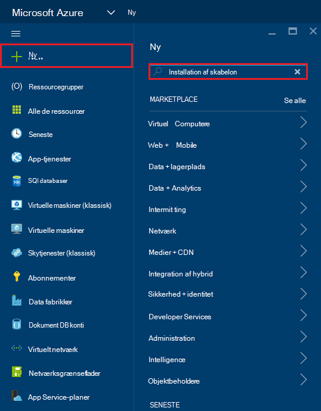

2. Vælg elementet, skabelon installation, og klik på **Opret**
    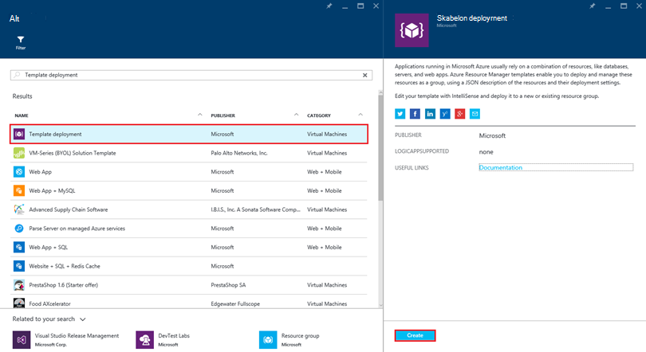

3.  Klik på **Rediger skabelon**, indsætte indholdet af DocDBWebsiteTodo.json skabelonfilen, og klik på **Gem**.
    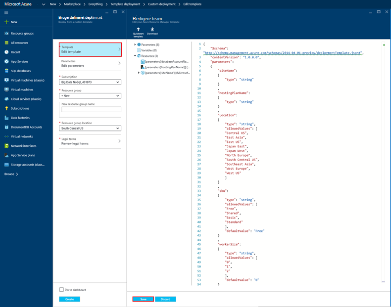

4. Klik på **Rediger parametre**, Angiv værdier for hver af de obligatoriske parametre, og klik på **OK**.  Parametrene, der er som følger:

    1. SITENAME: Angiver App Service web app-navn og bruges til at oprette den URL-adresse, du vil bruge til at få adgang til WebApp (f.eks. Hvis du angiver "mydemodocdbwebapp" og derefter URL-adressen, som du får adgang WebApp bliver mydemodocdbwebapp.azurewebsites.net).

    2. HOSTINGPLANNAME: Angiver navnet på App-hosting serviceaftale til at oprette.

    3. PLACERING: Angiver den Azure placering, hvor du opretter den DocumentDB og web app ressourcer.

    4. DATABASEACCOUNTNAME: Angiver navnet på DocumentDB kontoen til at oprette.   

    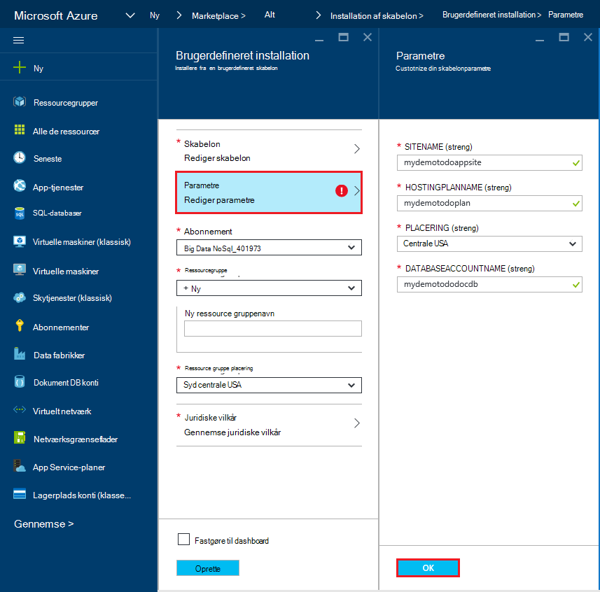

5. Vælg en eksisterende ressourcegruppe eller Angiv et navn til at foretage en ny ressourcegruppe, og vælg en placering for ressourcegruppen.
    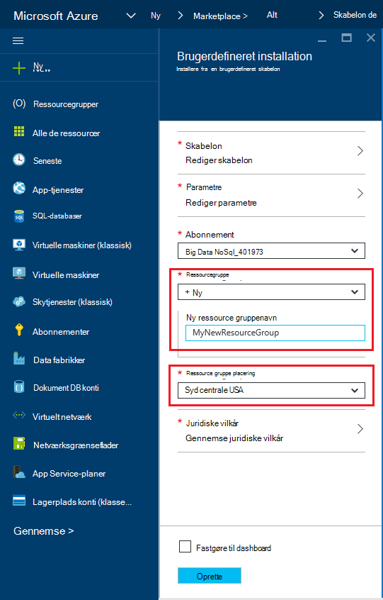
  
6.  Klik på **Gennemse juridiske begreber**, **Køb**, og klik derefter på **Opret** for at starte installationen.  Vælg **Fastgør til dashboard** , så den resulterende installation er synligt på Azure portalen startsiden.
    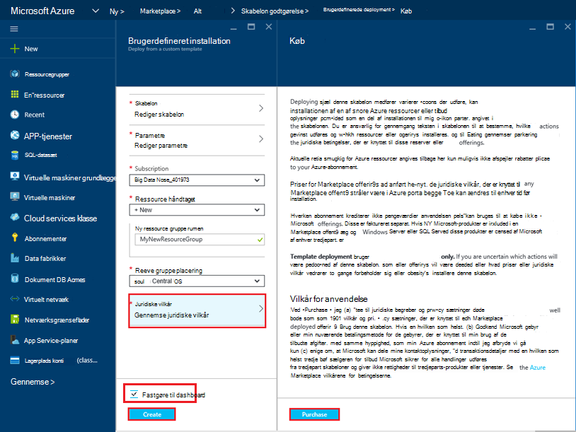

7.  Når installationen er færdig, åbnes bladet ressource gruppe.
    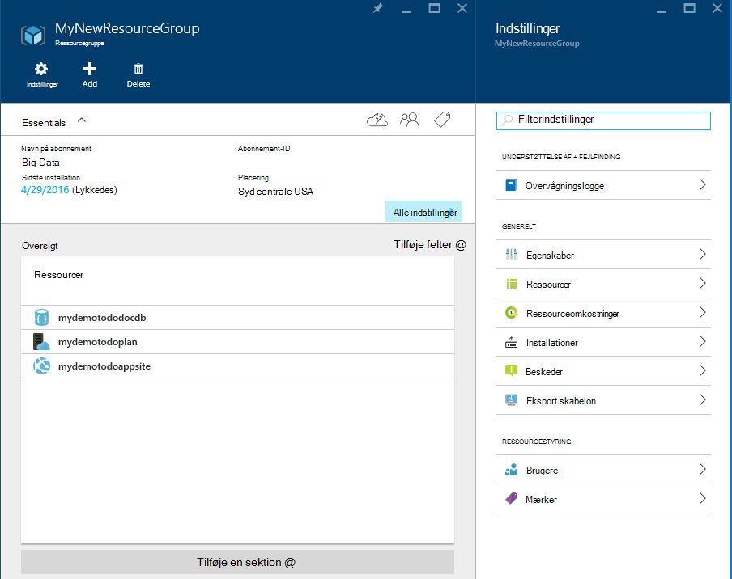  

8.  Hvis du vil bruge programmet, skal du blot gå til web app URL-adressen (i det foregående eksempel URL-adressen ville være http://mydemodocdbwebapp.azurewebsites.net).  Du får vist følgende webprogrammet:

    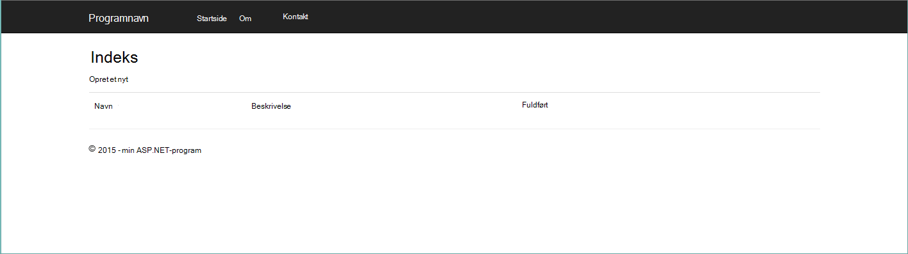

9. Gå videre og oprette et par opgaver i WebApp, og vend derefter tilbage til bladet ressource gruppe i portalen Azure. Klik på ressourcen konto DocumentDB på listen ressourcer, og klik derefter på **Forespørgsel Explorer**.
    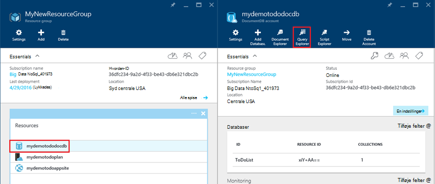  

10. Kør standardforespørgslen, "Vælg *fra c", og Undersøg resultaterne.  Bemærk, at forespørgslen har hentet JSON repræsentation af de opgaveliste elementer, du oprettede i trin 7 ovenfor.  Velkommen til at eksperimentere med forespørgsler; for eksempel prøve at køre Vælg* fra c hvor c.isComplete = true til at returnere alle opgaveliste elementer, der er markeret som fuldført.

    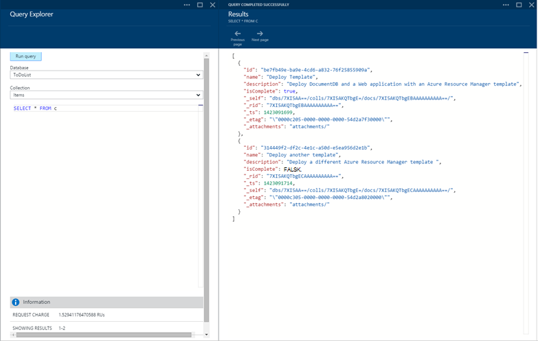

11. Velkommen til at udforske oplevelser med portalen DocumentDB eller ændre programmet eksempel opgaveliste.  Når du er klar, Lad os installere en anden skabelon.
    
 
## Trin 3: Installere eksemplet dokument-konto og web app

Nu Lad os installere vores anden skabelon.  Denne skabelon er gode til at vise, hvordan du kan indsætte DocumentDB forbindelsesoplysningerne som konto slutpunkt og master nøgle i en web-app, som programindstillinger eller som en brugerdefineret forbindelsesstreng. For eksempel, måske du har dit eget webprogram, du vil installere med en DocumentDB konto og har forbindelsesoplysningerne udfyldes automatisk under installationen.

> [AZURE.TIP] Skabelonen validerer ikke, at web app-navn og DocumentDB kontonavn, der er angivet under er a) gyldige og b) tilgængelige.  Det anbefales, at du kontrollerer tilgængeligheden af de navne, du planlægger at levere før afsendelse af installationen.

1. Klik på ny og Søg efter "Skabelon installation" i [Azure-portalen](https://portal.azure.com).
    

2. Vælg elementet, skabelon installation, og klik på **Opret**
    

3.  Klik på **Rediger skabelon**, indsætte indholdet af DocDBWebSite.json skabelonfilen, og klik på **Gem**.
    

4. Klik på **Rediger parametre**, Angiv værdier for hver af de obligatoriske parametre, og klik på **OK**.  Parametrene, der er som følger:

    1. SITENAME: Angiver App Service web app-navn og bruges til at oprette den URL-adresse, du vil bruge til at få adgang til WebApp (f.eks. Hvis du angiver "mydemodocdbwebapp" og derefter URL-adressen, som du får adgang WebApp bliver mydemodocdbwebapp.azurewebsites.net).

    2. HOSTINGPLANNAME: Angiver navnet på App-hosting serviceaftale til at oprette.

    3. PLACERING: Angiver den Azure placering, hvor du opretter den DocumentDB og web app ressourcer.

    4. DATABASEACCOUNTNAME: Angiver navnet på DocumentDB kontoen til at oprette.   

    

5. Vælg en eksisterende ressourcegruppe eller Angiv et navn til at foretage en ny ressourcegruppe, og vælg en placering for ressourcegruppen.
    
  
6.  Klik på **Gennemse juridiske begreber**, **Køb**, og klik derefter på **Opret** for at starte installationen.  Vælg **Fastgør til dashboard** , så den resulterende installation er synligt på Azure portalen startsiden.
    

7.  Når installationen er færdig, åbnes bladet ressource gruppe.
      

8. Klik på ressourcen Web App på listen ressourcer, og klik derefter på **Indstillinger for et webprogram**
      

9. Bemærk, hvor der er programindstillinger Præsenter for DocumentDB slutpunktet og hver DocumentDB master-nøgle.
    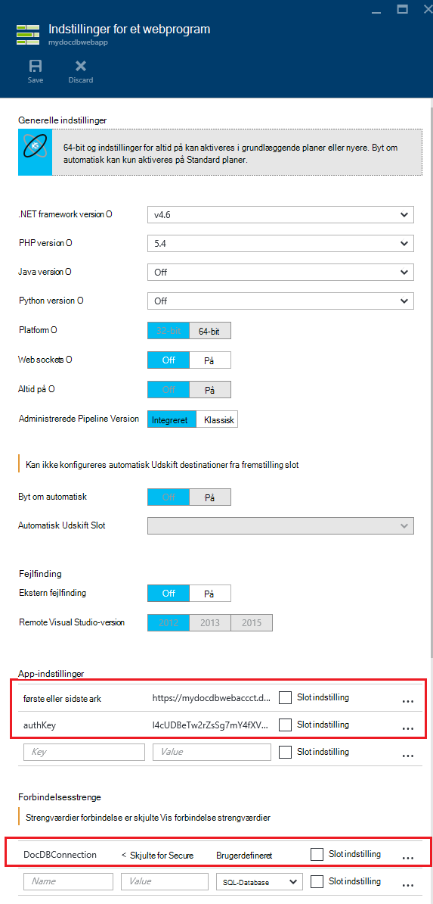  

10. Velkommen til at fortsætte med at udforske portalen Azure, eller Følg en af vores DocumentDB [prøver](http://go.microsoft.com/fwlink/?LinkID=402386) at oprette dine egne DocumentDB program.

    
    

## Næste trin

Tillykke! Du har installeret DocumentDB, App Service WebApp og et eksempel webprogram ved hjælp af Azure ressourcestyring skabeloner.

- Hvis du vil vide mere om DocumentDB, skal du klikke på [her](http://azure.com/docdb).
- Hvis du vil vide mere om Azure App Service Web apps, skal du klikke på [her](http://go.microsoft.com/fwlink/?LinkId=325362).
- Hvis du vil vide mere om Azure ressourcestyring skabeloner, skal du klikke på [her](https://msdn.microsoft.com/library/azure/dn790549.aspx).

## Hvad er ændret
* Finde en vejledning til ændring fra websteder til App-tjenesten: [Azure App Service og dets indvirkning på eksisterende Azure Services](http://go.microsoft.com/fwlink/?LinkId=529714)
* Finde en vejledning til ændring af portalen gamle til den nye portal: [Reference til at navigere i portalen Azure klassisk](http://go.microsoft.com/fwlink/?LinkId=529715)

>[AZURE.NOTE] Hvis du vil komme i gang med Azure App Service før tilmelding til en Azure-konto, skal du gå til [Prøve App Service](http://go.microsoft.com/fwlink/?LinkId=523751), hvor du straks kan oprette en forbigående starter WebApp i App-tjeneste. Ingen kreditkort, der kræves. ingen forpligtelser.
 
