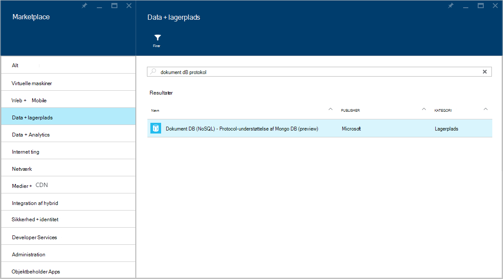
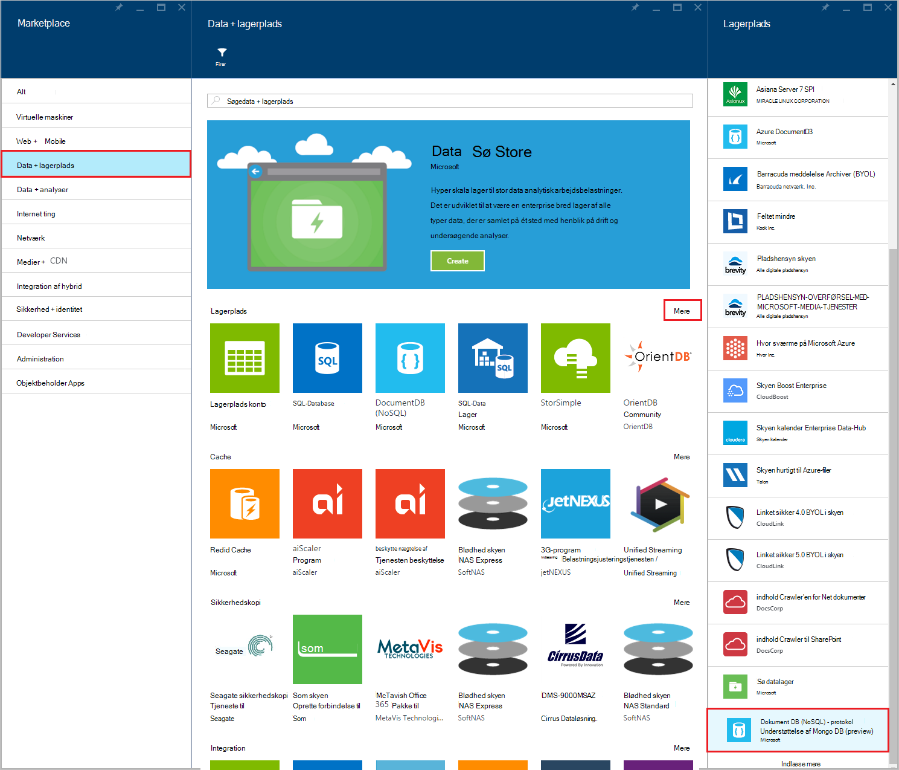
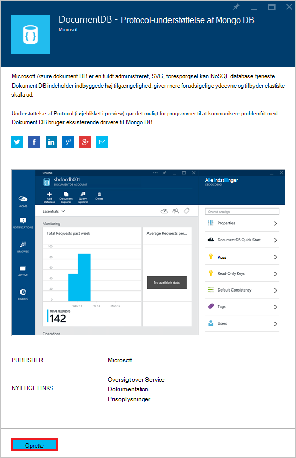
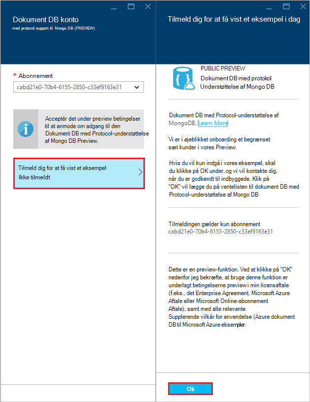
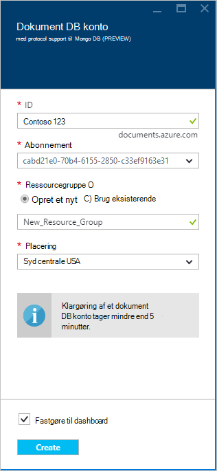
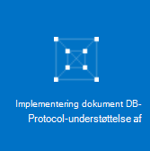
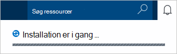
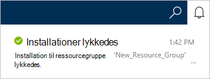
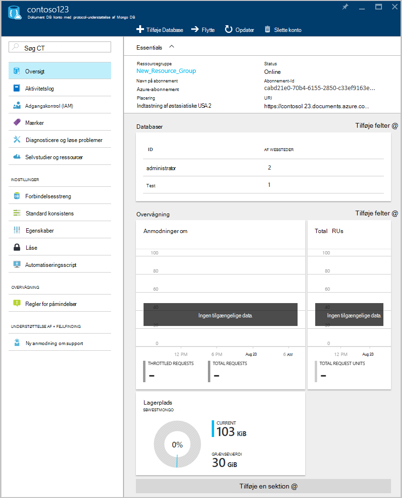

<properties 
    pageTitle="Oprette en DocumentDB konto med protocol-understøttelse af MongoDB | Microsoft Azure" 
    description="Lær, hvordan du opretter en DocumentDB konto med protocol-understøttelse af MongoDB, nu tilgængeligt for preview." 
    services="documentdb" 
    authors="AndrewHoh" 
    manager="jhubbard" 
    editor="" 
    documentationCenter=""/>

<tags 
    ms.service="documentdb" 
    ms.workload="data-services" 
    ms.tgt_pltfrm="na" 
    ms.devlang="na" 
    ms.topic="article" 
    ms.date="10/20/2016" 
    ms.author="anhoh"/>

# Sådan oprettes en DocumentDB konto med protocol-understøttelse af MongoDB ved hjælp af portalen Azure

Hvis du vil oprette en Azure DocumentDB konto med protocol-understøttelse af MongoDB, skal du:

- Har en Azure-konto. Du kan få en [gratis Azure-konto](https://azure.microsoft.com/free/) , hvis du ikke allerede har et.

## Oprette kontoen  

Hvis du vil oprette en DocumentDB konto med protocol-understøttelse af MongoDB, skal du udføre følgende trin.

1. Log på [Azure Portal](https://portal.azure.com)i et nyt vindue.
2. Klik på **Ny**, skal du klikke på **Data + lagerplads**, skal du klikke på **se alle**, og Søg kategorien **Data + lagerplads** "DocumentDB protocol". Klik på **DocumentDB - Protocol-understøttelse af MongoDB**.

    

3. Du kan også i kategorien **Data + lagerplads** under **lagerplads**, skal du klikke på **flere**, og klik **indlæse flere** én eller flere gange til at vise **DocumentDB - Protocol-understøttelse af MongoDB**. Klik på **DocumentDB - Protocol-understøttelse af MongoDB**.

    

4. Klik på **Opret** for at starte tilmeldingsprocessen preview bladet **DocumentDB - Protocol-understøttelse af MongoDB (preview)** .

    

5. Klik på **Tilmeld dig for at få vist et eksempel**i bladet **DocumentDB konto** . Læs oplysningerne, og klik derefter på **OK**.

    

6.  Når du har accepteret vilkårene preview, kommer du tilbage til bladet Opret.  Angiv den ønskede konfiguration for kontoen i bladet **DocumentDB konto** .

    

    - Angiv et navn til at identificere kontoen, i boksen **ID** .  Når **ID** er blevet godkendt, vises en grøn markering i **feltet** . **Id-** værdien bliver værtsnavn inden for URI. **ID** kan indeholde kun små bogstaver, tal og '-' tegn, og skal være mellem 3 og 50 tegn. Bemærk denne *documents.azure.com* føjes til navnet på du vælger, bliver resultatet af som din konto slutpunkt.

    - Vælg det Azure abonnement, du vil bruge til kontoen **abonnement**. Hvis dit firma har kun ét abonnement, er denne konto som standard markeret.

    - Vælg i **Ressourcegruppe**, eller Opret en ressourcegruppe for kontoen.  Som standard vælges en eksisterende ressourcegruppe under Azure abonnementet.  Du kan dog vælge skal vælges for at oprette en ny ressourcegruppe, du vil tilføje kontoen. Få mere at vide under [Brug af Azure portalen for at administrere dine Azure ressourcer](resource-group-portal.md).

    - Bruge **placering** til at angive den geografiske placering, hvor vært for kontoen.
    
    - Valgfrit: Kontrollér **Fastgør til dashboard**. Hvis fastgjort til dashboard, skal du følge **trin 8** , der nedenfor for at få vist din nye konto venstre navigationsrude.

7.  Når kontoindstillingerne for ny er konfigureret, kan du klikke på **Opret**.  Det kan tage et par minutter til at oprette kontoen.  Hvis fastgjort til dashboard, kan du overvåge klargøring status på Startboard.  
      

    Hvis ikke fastgjort til dashboard, kan du overvåge forløbet fra beskeder-hubben.  

      

    

8.  Klik på **DocumentDB (NoSQL)** i menuen til venstre for at få adgang til din nye konto. Klik på navnet på din nye konto i din liste over almindelige DocumentDB og DocumentDB med Mongo protocol support-konti.

9.  Det er nu klar til brug med standardindstillingerne. 

    
    

## Næste trin

- Få mere at vide hvordan til at [oprette forbindelse](documentdb-connect-mongodb-account.md) til en DocumentDB konto med protocol support til MongoDB.

 
