<properties 
    pageTitle="ASP.NET MVC selvstudium til DocumentDB: udvikling af webprogrammer | Microsoft Azure" 
    description="ASP.NET MVC selvstudium til at oprette en MVC webprogram ved hjælp af DocumentDB. Du skal gemme JSON og få adgang til data fra en opgaveliste app hostet på Azure websteder - ASP redskaber MVC selvstudium trin for trin." 
    keywords="ASP.NET mvc selvstudium, udvikling af webprogrammer, mvc webprogram, asp net mvc selvstudium trin for trin"
    services="documentdb" 
    documentationCenter=".net" 
    authors="syamkmsft" 
    manager="jhubbard" 
    editor="cgronlun"/>

<tags 
    ms.service="documentdb" 
    ms.workload="data-services" 
    ms.tgt_pltfrm="na" 
    ms.devlang="dotnet" 
    ms.topic="hero-article" 
    ms.date="08/25/2016" 
    ms.author="syamk"/>

# ASP.NET MVC Selvstudium: Udvikling af webprogrammer med DocumentDB

> [AZURE.SELECTOR]
- [.NET](documentdb-dotnet-application.md)
- [Node.js](documentdb-nodejs-application.md)
- [Java](documentdb-java-application.md)
- [Python](documentdb-python-application.md) 

Hvis du vil fremhæve, hvordan du kan udnytte Azure DocumentDB til at gemme effektivt og forespørgsel JSON dokumenter, indeholder denne artikel en til slut gennemgå viser dig, hvordan du opretter en opgaveliste app ved hjælp af Azure DocumentDB. Opgaverne, der gemmes som JSON dokumenter i Azure DocumentDB.

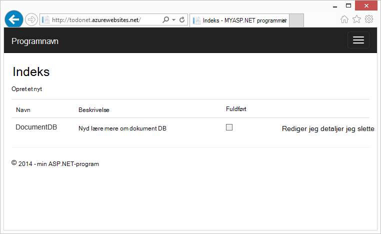

Denne gennemgang viser, hvordan du bruger tjenesten DocumentDB fra Azure til at gemme og få adgang til data fra en ASP.NET MVC webprogram hostes på Azure. Hvis du vil have et selvstudium, der fokuserer kun på DocumentDB og ikke ASP.NET MVC komponenterne, kan du se [opbygge et DocumentDB C# console-program](documentdb-get-started.md).

> [AZURE.TIP] Dette selvstudium antages det, at du har tidligere oplevelse ved hjælp af ASP.NET MVC og Azure websteder. Hvis du er ny bruger af ASP.NET eller de [nødvendige værktøjer](#_Toc395637760), anbefaler vi hente hele eksemplet projektet fra [GitHub][] og følge instruktionerne i dette eksempel. Når du har oprettet, kan du gennemse denne artikel for at få indsigt for koden i forbindelse med projektet.

## Forudsætninger for selvstudiet database

Før du følge vejledningen i denne artikel, skal du sikre dig, at du har følgende:

- En active Azure-konto. Hvis du ikke har en konto, kan du oprette en gratis prøveversion konto på blot et par minutter. Yderligere oplysninger finder du [Azure gratis prøveversion](https://azure.microsoft.com/pricing/free-trial/).
- [Visual Studio 2015](http://www.visualstudio.com/) eller Visual Studio 2013 opdatering 4 eller nyere. Hvis ved hjælp af Visual Studio 2013, skal du installere [Microsoft.Net.Compilers nuget pakke](https://www.nuget.org/packages/Microsoft.Net.Compilers/) for at tilføje understøttelse af C# 6.0. 
- Azure SDK til .NET version 2.5.1 eller højere, tilgængelige via [Microsoft Web Platform Installer][].

Alle skærmbilleder i denne artikel er blevet ført ved hjælp af Visual Studio 2013 med 4 anvendt og Azure SDK til .NET version 2.5.1. Det er muligt, at indstillingerne for dit skærme og ikke passer helt, men hvis du opfylder de ovenfor forudsætninger denne løsning skal fungere, hvis systemet er konfigureret med forskellige versioner.

## Trin 1: Oprette en DocumentDB database-konto

Lad os starte med at oprette en DocumentDB-konto. Hvis du allerede har en konto, kan du gå til [Opret et nyt ASP.NET MVC program](#_Toc395637762).

[AZURE.INCLUDE [documentdb-create-dbaccount](../../includes/documentdb-create-dbaccount.md)]

[AZURE.INCLUDE [documentdb-keys](../../includes/documentdb-keys.md)]

 
Vi fører nu gennem hvordan du opretter et nyt ASP.NET MVC program fra bunden. 

## Trin 2: Oprette et nyt ASP.NET MVC program

Nu hvor du har en konto, Lad os oprette vores nye ASP.NET-projekt.

1. Peg på **Ny**i Visual Studio, i menuen **filer** , og klik derefter på **projekt**.

    Dialogboksen **Nyt projekt** vises.
2. Udvid **skabeloner**, **Visual C#**, **Web**i ruden **projekttyper** , og vælg derefter **ASP.NET-webprogrammet**.

    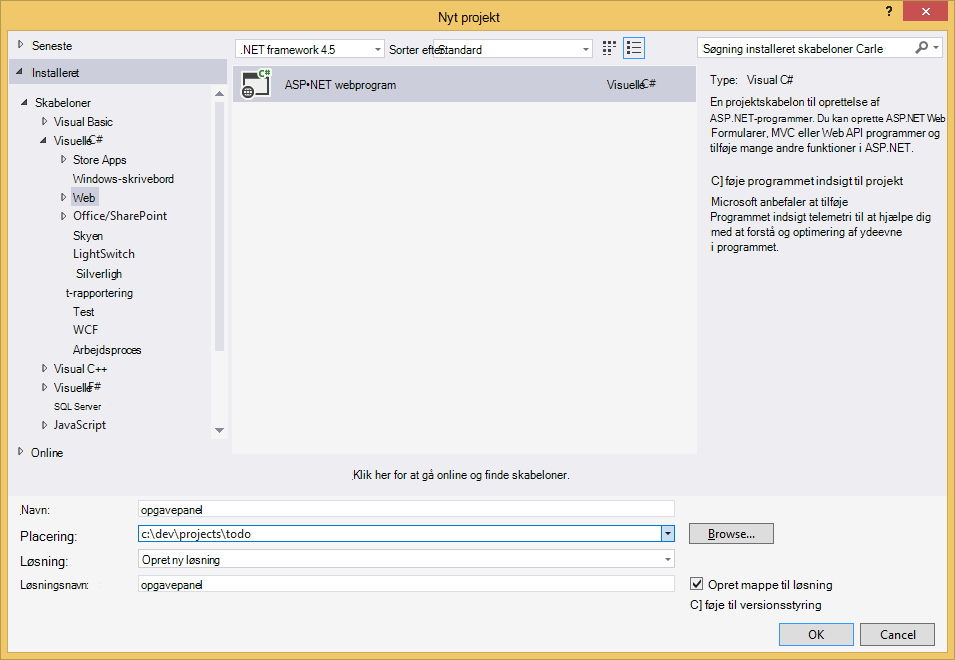

3. Skriv navnet på projektet i feltet **navn** . Dette selvstudium bruger navnet "opgave". Hvis du vælger at bruge et andet tal end det, uanset hvor selvstudiet taler om navneområdet for den opgaveliste, skal du justere de medfølgende kodeeksempler, hvis du vil bruge, hvad du har kaldt programmets. 

4. Klik på **Gennemse** for at gå til den mappe, hvor du vil have til at oprette projektet, og klik derefter på **OK**.

    Dialogboksen **Nyt ASP.NET projekt** vises.

    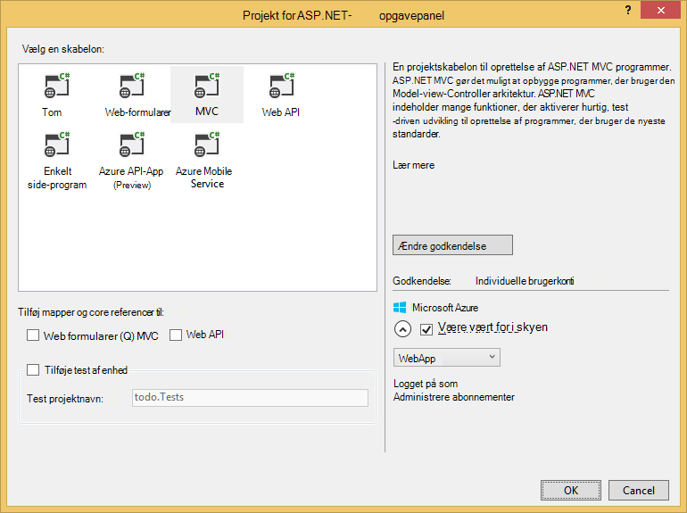

5. Vælg **MVC**i ruden skabeloner.

6. Hvis du planlægger at vært for dit program i Azure skal du vælge **Host i skyen** på nederst til højre skal have Azure, der er vært for programmet. Vi har valgt til at hoste i skyen og køre programmet en Azure-websted som vært. Hvis du vælger denne indstilling preprovision en Azure-websted for dig, og gør livet meget lettere, når det bliver tid til at installere programmet færdige arbejde. Hvis du ønsker at hoste denne et andet sted eller ikke kan konfigurere Azure forhånd, blot rydde **Host i skyen**.

7. Klik på **OK** , og lad Visual Studio gør dens ting omkring scaffolding skabelonen tom ASP.NET MVC. 

8. Hvis du har valgt at være vært for dette i skyen får du vist mindst ét ekstra skærmbillede, der beder dig om at logge på din Azure-konto og giver dig nogle værdier til dit nye websted. Leverer de ekstra værdier, og fortsæt. 

    Jeg ikke har valgt en "databaseserver" her, fordi vi ikke bruger en Azure SQL-databaseserver her, vi skal oprette en ny konto Azure DocumentDB senere i portalen Azure.

    Se [Azure App Service planer dybden oversigt](../app-service/azure-web-sites-web-hosting-plans-in-depth-overview.md)kan finde flere oplysninger om at vælge en **App-serviceaftale** og **ressourcegruppe**.

    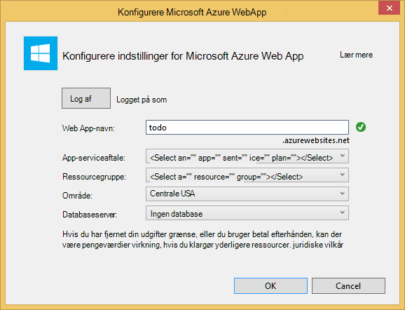

9. Når Visual Studio er færdig med at oprette standardteksten MVC program har du et tomt ASP.NET-program, du kan køre lokalt.

    Vi vil springe kører projektet lokalt, da jeg er sikker på, at vi har set alle ASP.NET "Hej verden" programmet på computeren. Lad os gå direkte til at føje DocumentDB til dette projekt og opbygning af vores program.

## Trin 3: Føje DocumentDB til projektet MVC web-program

Nu hvor vi har de fleste af de ASP.NET MVC sanitets, som vi brug for denne løsning, Lad os komme til reelle formålet med dette selvstudium, tilføje Azure DocumentDB til vores MVC webprogram.

1. DocumentDB .NET SDK er pakket og distribueret som en NuGet pakke. For at få pakken NuGet i Visual Studio skal du bruge Styring af pakke NuGet i Visual Studio ved at højreklikke på projektet i **Solution Explorer** og derefter klikke på **Administrer NuGet pakker**.

    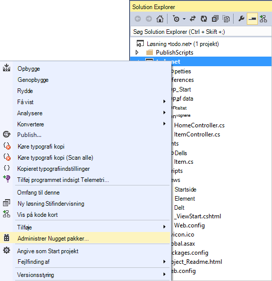

    Dialogboksen **Administrer NuGet pakker** vises.

2. Skriv ***Azure DocumentDB***i NuGet **Gennemse** .
    
    Installer **Microsoft Azure DocumentDB klient Library** pakken fra resultaterne. Dette vil hente og installere pakken DocumentDB samt alle afhængigheder, som Newtonsoft.Json. Klik på **OK** i vinduet **Vis udskrift** , og **jeg accepterer** i vinduet **Licensaftale** for at fuldføre installationen.

    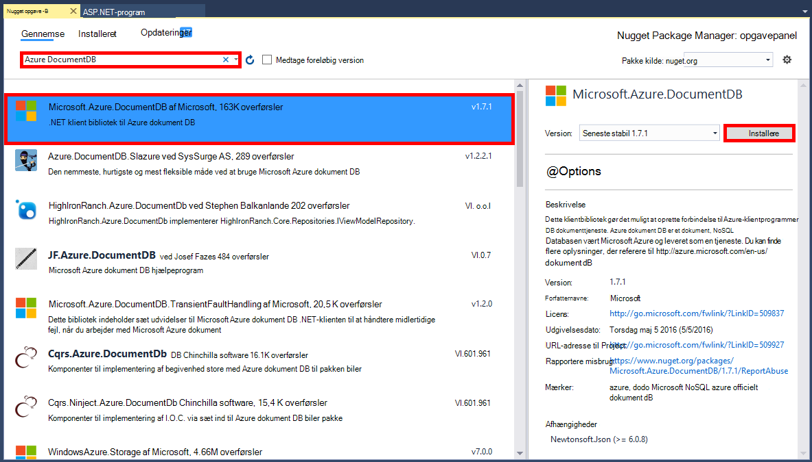

    Du kan også bruge konsollen Package Manager for at installere pakken. Gør det, skal du i menuen **Funktioner** , skal du klikke på **NuGet Package Manager**, og klik derefter på **Pakke Manager-konsollen**. Når du bliver spurgt, Skriv følgende.

        Install-Package Microsoft.Azure.DocumentDB

3. Når pakken er installeret, skal din løsning i Visual Studio minde om følgende med to nye referencer tilføjet, Microsoft.Azure.Documents.Client og Newtonsoft.Json.

    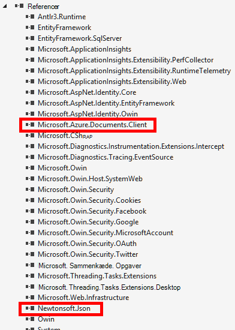

##Trin 4: Konfigurere programmet ASP.NET MVC
 
Nu Lad os tilføje modeller, visninger og enheder til dette MVC program:

- [Tilføj en model](#_Toc395637764).
- [Tilføj en controller](#_Toc395637765).
- [Tilføj visninger](#_Toc395637766).

### Tilføje en JSON-datamodel

Lad os starte med at oprette **M** i MVC, modellen. 

1. I **Solution Explorer**, skal du højreklikke på mappen **modeller** , klik på **Tilføj**og derefter klikke på **klasse**.

    Dialogboksen **Tilføj nyt element** vises.

2. Navngiv den nye klasse **Item.cs** , og klik på **Tilføj**. 

3. I denne nye **Item.cs** -fil, du tilføje følgende efter den sidste *ved hjælp af sætning*.
        
        using Newtonsoft.Json;
    
4. Erstat nu denne kode 
        
        public class Item
        {
        }

    med følgende kode.

        public class Item
        {
            [JsonProperty(PropertyName = "id")]
            public string Id { get; set; }
             
            [JsonProperty(PropertyName = "name")]
            public string Name { get; set; }

            [JsonProperty(PropertyName = "description")]
            public string Description { get; set; }

            [JsonProperty(PropertyName = "isComplete")]
            public bool Completed { get; set; }
        }

    Alle data i DocumentDB overføres over en netværksforbindelse og gemmes som JSON. For at styre måde, er dit objekter serialiseret/deserialiseret af JSON.NET, du kan bruge attributten **JsonProperty** , som vist i klassen **element** vi lige har oprettet. Du ikke **har** for at gøre dette men jeg vil sikre, at min egenskaber følge de JSON camelCase navngivningskonventioner. 
    
    Ikke kun kan du styre formatet for egenskabsnavnet når det er i JSON, men du kan helt omdøbe .NET egenskaber, som jeg gjorde med egenskaben **Beskrivelse** . 
    

### Tilføje en controller

Der tager sig af **M**, nu Lad os oprette **C** i MVC, en controller klasse.

1. I **Solution Explorer**, højreklik på mappen **enheder** , skal du klikke på **Tilføj**og derefter klikke på **Controller**.

    Dialogboksen **Tilføj Scaffold** vises.

2. Vælg **MVC 5 Controller - er tom** , og klik derefter på **Tilføj**.

    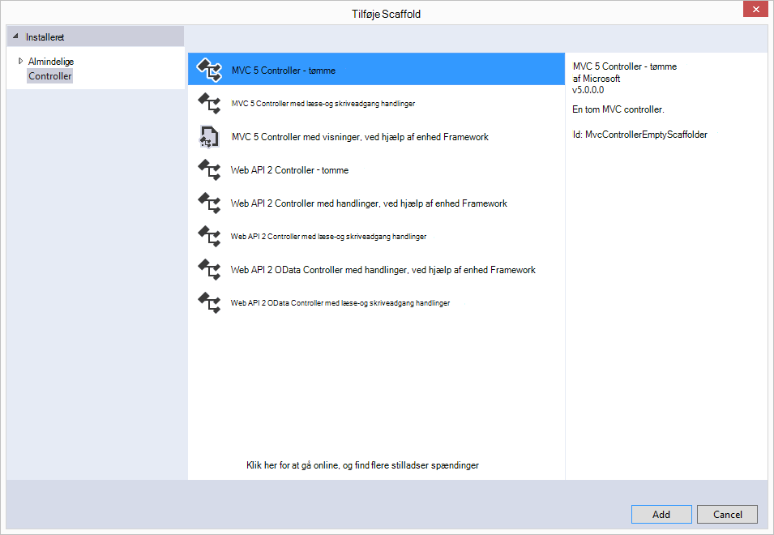

3. Navngiv din nye Controller **ItemController.**

    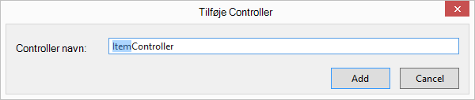

    Når filen er oprettet, skal din løsning i Visual Studio minde om følgende med den nye ItemController.cs-fil i **Solution Explorer**. Den nye Item.cs-fil, der har oprettet tidligere vises også.

    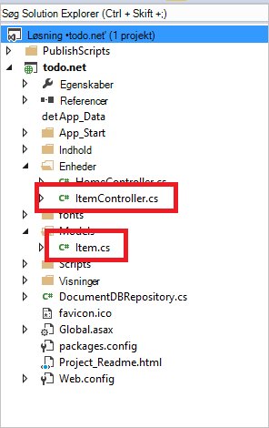

    Du kan lukke ItemController.cs, vi vil vende tilbage til det senere. 

### Tilføje visninger

Nu, Lad os oprette **V** i MVC, visningerne:

- [Tilføje et Elementindeks visning](#AddItemIndexView).
- [Tilføje et nyt element visning](#AddNewIndexView).
- [Tilføj en redigere elementvisning](#_Toc395888515).

#### Tilføje et Elementindeks-visning

1. I **Solution Explorer**, Udvid mappen **visninger** , skal du højreklikke på mappen tomme **element** , Visual Studio oprettes for dig, når du har tilføjet **ItemController** tidligere, klik på **Tilføj**og derefter klikke på **Vis**.

    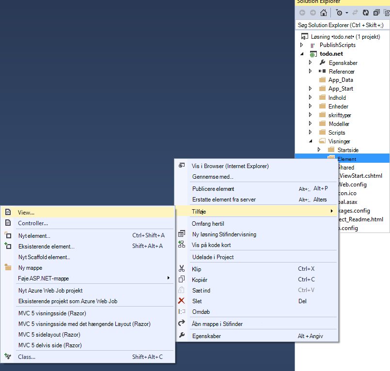

2. I dialogboksen **Tilføj visning** skal du gøre følgende:
    - Skriv ***indeks***i boksen **visningsnavn** .
    - Vælg ***liste***i boksen **skabelon** .
    - I feltet **Model klasse** vælge ***element (opgaveliste. Modeller)***.
    - Lad boksen **Data kontekst klasse** stå tomt. 
    - Skriv ***~/Views/Shared/_Layout.cshtml***i feltet layout side.
    
    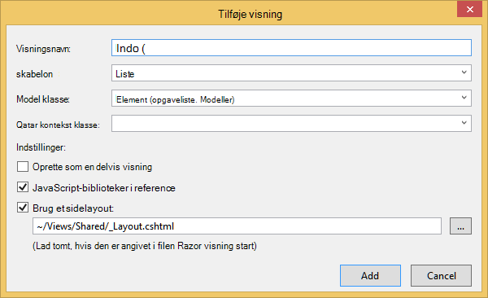

3. Når alle disse værdier er angivet, skal du klikke på **Tilføj** , og fortæl Visual Studio, oprette en ny skabelon visning. Når den er færdig, åbnes det filen cshtml, der blev oprettet. Vi kan lukke denne fil i Visual Studio, som vi kommer tilbage til den senere.

#### Tilføje et nyt element-visning

Svarer til hvordan vi oprettede overblik **Elementindeks** , vi vil nu oprette en ny visning til oprettelse af nye **elementer**.

1. I **Solution Explorer**, højreklik på mappen **element** igen, klik på **Tilføj**og derefter klikke på **Vis**.

2. I dialogboksen **Tilføj visning** skal du gøre følgende:
    - Skriv ***Opret***i feltet **visningsnavn** .
    - Vælg ***Opret***i feltet **skabelon** .
    - I feltet **Model klasse** vælge ***element (opgaveliste. Modeller)***.
    - Lad boksen **Data kontekst klasse** stå tomt.
    - Skriv ***~/Views/Shared/_Layout.cshtml***i feltet layout side.
    - Klik på **Tilføj**.

#### Tilføje en redigere elementvisning

Og til sidst skal tilføje én sidste visning for at redigere et **element** på samme måde som før.

1. I **Solution Explorer**, højreklik på mappen **element** igen, klik på **Tilføj**og derefter klikke på **Vis**.

2. I dialogboksen **Tilføj visning** skal du gøre følgende:
    - Skriv, ***redigere***, i feltet **visningsnavn** .
    - Klik på ***Rediger***i feltet **skabelon** .
    - I feltet **Model klasse** vælge ***element (opgaveliste. Modeller)***.
    - Lad boksen **Data kontekst klasse** stå tomt. 
    - Skriv ***~/Views/Shared/_Layout.cshtml***i feltet layout side.
    - Klik på **Tilføj**.

Når dette er færdigt, skal du lukke alle cshtml dokumenter i Visual Studio, som vi vil vende tilbage til disse visninger senere.

## Trin 5: Kabler op DocumentDB

Nu, hvor den standard MVC ting er gennemført, slå Lad os til at føje koden for DocumentDB. 

I dette afsnit tilføjer vi kode for at håndtere følgende:

- [Liste over ufuldstændige elementer](#_Toc395637770).
- [Føje elementer](#_Toc395637771).
- [Redigere elementer](#_Toc395637772).

### Liste over ufuldstændige elementer i dit MVC webprogram

Det første, du gør her er, tilføje en klasse, der indeholder alle logik for at oprette forbindelse til og bruge DocumentDB. I dette selvstudium skal vi omfatter alle denne logik i en lager klasse, kaldet DocumentDBRepository. 

1. I **Solution Explorer**, højreklik på projektet, klik på **Tilføj**, og klik derefter på **klasse**. Navngiv den nye klasse **DocumentDBRepository** , og klik på **Tilføj**.
 
2. I det nyoprettede **DocumentDBRepository** klasse og tilføje den følgende *ved hjælp af sætninger* over angivelsen *navneområde*
        
        using Microsoft.Azure.Documents; 
        using Microsoft.Azure.Documents.Client; 
        using Microsoft.Azure.Documents.Linq; 
        using System.Configuration;
        using System.Linq.Expressions;
        using System.Threading.Tasks;

    Erstat nu denne kode 

        public class DocumentDBRepository
        {
        }

    med følgende kode.

        public static class DocumentDBRepository<T> where T : class
        {
            private static readonly string DatabaseId = ConfigurationManager.AppSettings["database"];
            private static readonly string CollectionId = ConfigurationManager.AppSettings["collection"];
            private static DocumentClient client;
    
            public static void Initialize()
            {
                client = new DocumentClient(new Uri(ConfigurationManager.AppSettings["endpoint"]), ConfigurationManager.AppSettings["authKey"]);
                CreateDatabaseIfNotExistsAsync().Wait();
                CreateCollectionIfNotExistsAsync().Wait();
            }
    
            private static async Task CreateDatabaseIfNotExistsAsync()
            {
                try
                {
                    await client.ReadDatabaseAsync(UriFactory.CreateDatabaseUri(DatabaseId));
                }
                catch (DocumentClientException e)
                {
                    if (e.StatusCode == System.Net.HttpStatusCode.NotFound)
                    {
                        await client.CreateDatabaseAsync(new Database { Id = DatabaseId });
                    }
                    else
                    {
                        throw;
                    }
                }
            }
    
            private static async Task CreateCollectionIfNotExistsAsync()
            {
                try
                {
                    await client.ReadDocumentCollectionAsync(UriFactory.CreateDocumentCollectionUri(DatabaseId, CollectionId));
                }
                catch (DocumentClientException e)
                {
                    if (e.StatusCode == System.Net.HttpStatusCode.NotFound)
                    {
                        await client.CreateDocumentCollectionAsync(
                            UriFactory.CreateDatabaseUri(DatabaseId),
                            new DocumentCollection { Id = CollectionId },
                            new RequestOptions { OfferThroughput = 1000 });
                    }
                    else
                    {
                        throw;
                    }
                }
            }
        }

    > [AZURE.TIP] Når du opretter en ny DocumentCollection kan du angive en valgfri parameter RequestOptions af OfferType, som gør det muligt at angive den nye websteder præstationsniveau. Hvis denne parameter ikke overføres bruges tilbud standardtypen. Finde flere oplysninger om DocumentDB se tilbud typer [DocumentDB ydeevneniveauer](documentdb-performance-levels.md)

3. Vi læser nogle værdier fra konfiguration, så Åbn filen **Web.config** i dit program, og Tilføj følgende linjer under den `<AppSettings>` sektion.
    
        <add key="endpoint" value="enter the URI from the Keys blade of the Azure Portal"/>
        <add key="authKey" value="enter the PRIMARY KEY, or the SECONDARY KEY, from the Keys blade of the Azure  Portal"/>
        <add key="database" value="ToDoList"/>
        <add key="collection" value="Items"/>
    
4. Nu, opdatere værdierne for *slutpunkt* og *authKey* ved hjælp af bladet taster af portalen Azure. Brug **URI** fra bladet taster som værdien af indstillingen slutpunkt, og brug den **PRIMÆRNØGLE**, eller **Sekundær nøgle** fra bladet taster som værdien af indstillingen authKey.

    Træder omtanke af kabelføring op lager DocumentDB nu Lad os tilføje vores programlogik.

5. Det første, du vi vil kunne gøre med en opgaveliste listen program er at vise ufuldstændige elementer.  Kopiere og indsætte følgende kodestykke et vilkårligt sted i klassen **DocumentDBRepository** .

        public static async Task<IEnumerable<T>> GetItemsAsync(Expression<Func<T, bool>> predicate)
        {
            IDocumentQuery<T> query = client.CreateDocumentQuery<T>(
                UriFactory.CreateDocumentCollectionUri(DatabaseId, CollectionId))
                .Where(predicate)
                .AsDocumentQuery();

            List<T> results = new List<T>();
            while (query.HasMoreResults)
            {
                results.AddRange(await query.ExecuteNextAsync<T>());
            }

            return results;
        }

6. Åbn **ItemController** vi tilføjede tidligere og tilføje den følgende *ved hjælp af sætninger* over angivelsen navneområde.

        using System.Net;
        using System.Threading.Tasks;
        using todo.Models;

    Hvis dit projekt ikke er navngivet "opgave", skal du opdatere ved hjælp af "opgaveliste. Modeller". til at afspejle navnet på projektet.

    Erstat nu denne kode

        //GET: Item
        public ActionResult Index()
        {
            return View();
        }

    med følgende kode.

        [ActionName("Index")]
        public async Task<ActionResult> IndexAsync()
        {
            var items = await DocumentDBRepository<Item>.GetItemsAsync(d => !d.Completed);
            return View(items);
        }
    
7. Åbn **Global.asax.cs** og tilføje følgende linje til metoden **Application_Start** 
 
        DocumentDBRepository<todo.Models.Item>.Initialize();
    
På dette tidspunkt skal din løsning kunne bygge uden fejl.

Hvis du har kørt programmet nu, skal du gå til **HomeController** og visningen **indeks** for denne enhed. Dette er standardindstillingen for MVC skabelonprojektet vi valgte i starten, men vi vil have ikke! Lad os ændre routing på dette MVC program du ændrer denne funktionsmåde.

Åbn ***App\_Start\RouteConfig.cs*** og Find den linje, der starter med "standardindstillinger for:" og ændre den for at minde om følgende.

        defaults: new { controller = "Item", action = "Index", id = UrlParameter.Optional }

Denne nu fortæller ASP.NET MVC, hvis du ikke har angivet en værdi i URL-adressen til at styre routing funktionsmåden, i stedet for **Hjem**, bruger **element** som controller og bruger **indeks** som visning.

Nu hvis du kører programmet, det vil ringe op til dine **ItemController** som skal ringe til klassen lager og bruge metoden GetItems til at returnere alle ufuldstændig elementerne til **visninger**\\**element**\\**indeks** visning. 

Hvis du opretter og kører dette projekt nu, bør du nu se noget, der ser ud.    

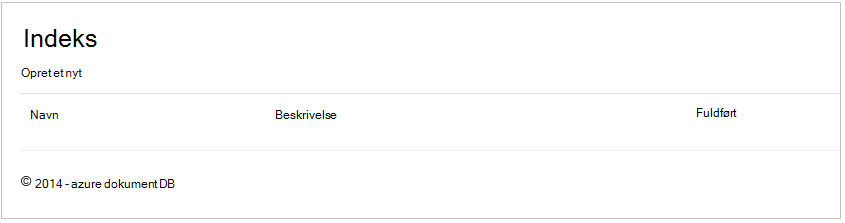

### Føje elementer

Lad os sætte nogle elementer i vores database, så vi har noget mere end et tomt gitter for at se på.

Lad os tilføje kode til DocumentDBRepository og ItemController skal fastholdes post i DocumentDB.

1.  Tilføj følgende metode til klasse **DocumentDBRepository** .

        public static async Task<Document> CreateItemAsync(T item)
        {
            return await client.CreateDocumentAsync(UriFactory.CreateDocumentCollectionUri(DatabaseId, CollectionId), item);
        }

    Denne metode tager et objekt, der overføres til den, skal du blot og fortsætter i DocumentDB.

2. Åbn filen ItemController.cs og tilføje følgende kodestykke i klassen. Dette er hvordan ASP.NET MVC ved, hvad du skal gøre for handlingen **Opret** . I dette tilfælde kun gengive den tilknyttede Create.cshtml visning, der oprettede tidligere.

        [ActionName("Create")]
        public async Task<ActionResult> CreateAsync()
        {
            return View();
        }

    Vi skal nu nogle flere kode i denne controller, der accepterer bidrag fra visningen **Opret** .

2. Føje den næste blok af kode til klassen ItemController.cs, der fortæller ASP.NET MVC Hvad skal jeg gøre med en formular INDLÆG til denne controller.
    
        [HttpPost]
        [ActionName("Create")]
        [ValidateAntiForgeryToken]
        public async Task<ActionResult> CreateAsync([Bind(Include = "Id,Name,Description,Completed")] Item item)
        {
            if (ModelState.IsValid)
            {
                await DocumentDBRepository<Item>.CreateItemAsync(item);
                return RedirectToAction("Index");
            }

            return View(item);
        }

    Denne kode kalder i DocumentDBRepository og bruger CreateItemAsync metode til at bevare det nye element opgaveliste til databasen. 
 
    **Sikkerhedsnote**: attributten **ValidateAntiForgeryToken** bruges her for at beskytte dette program mod angreb på tværs af websteder anmodning forfalskning. Der er mere end bare tilføje denne attribut, har du brug for dine visninger til at arbejde med dette mod forfalskning symbol. Få mere at vide under emnet og eksempler på, hvordan du kan implementere dette korrekt, skal du se [Forhindrer på tværs af websteder anmode om forfalskning][]. Koden findes på [GitHub][] har den fulde implementering på plads.

    **Sikkerhedsnote**: Vi bruger også attributten **binde** på Metodeparameteren til at beskytte mod uberettiget bogføring angreb. Du kan finde flere oplysninger om [Grundlæggende CRUD-handlinger i ASP.NET MVC][].

Dette fuldfører den kode, der kræves for at tilføje nye elementer til vores database.

### Redigere elementer

Der er en sidste ting for os til at gøre, og det er at tilføje muligheden for at redigere **elementer** i databasen og for at markere dem som fuldført. Visningen til redigering er allerede føjet til projektet, så vi skal blot tilføje kode til vores controller og til klassen **DocumentDBRepository** igen.

1. Tilføj følgende klassen **DocumentDBRepository** .

        public static async Task<Document> UpdateItemAsync(string id, T item)
        {
            return await client.ReplaceDocumentAsync(UriFactory.CreateDocumentUri(DatabaseId, CollectionId, id), item);
        }

        public static async Task<T> GetItemAsync(string id)
        {
            try
            {
                Document document = await client.ReadDocumentAsync(UriFactory.CreateDocumentUri(DatabaseId, CollectionId, id));
                return (T)(dynamic)document;
            }
            catch (DocumentClientException e)
            {
                if (e.StatusCode == HttpStatusCode.NotFound)
                {
                    return null;
                }
                else
                {
                    throw;
                }
            }
        }
    
    Først af disse metoder, **GetItem** henter et element fra DocumentDB, der overføres tilbage til **ItemController** , og klik derefter på **Rediger** visning.
    
    Andet af metoder vi lige har tilføjet erstatter **dokument** i DocumentDB med versionen af **dokumentet** blev sendt fra **ItemController**.

2. Tilføj følgende klassen **ItemController** .

        [HttpPost]
        [ActionName("Edit")]
        [ValidateAntiForgeryToken]
        public async Task<ActionResult> EditAsync([Bind(Include = "Id,Name,Description,Completed")] Item item)
        {
            if (ModelState.IsValid)
            {
                await DocumentDBRepository<Item>.UpdateItemAsync(item.Id, item);
                return RedirectToAction("Index");
            }

            return View(item);
        }

        [ActionName("Edit")]
        public async Task<ActionResult> EditAsync(string id)
        {
            if (id == null)
            {
                return new HttpStatusCodeResult(HttpStatusCode.BadRequest);
            }

            Item item = await DocumentDBRepository<Item>.GetItemAsync(id);
            if (item == null)
            {
                return HttpNotFound();
            }

            return View(item);
        }
    
    Den første metode håndterer den Http GET, sker der, når brugeren klikker på linket **Rediger** fra visningen **indeks** . Denne metode henter et [**dokument**](http://msdn.microsoft.com/library/azure/microsoft.azure.documents.document.aspx) fra DocumentDB og sender den til **redigeringsvisning** .

    **Redigeringsvisning** Benyt derefter en Http-POST til **IndexController**. 
    
    Den anden metode vi tilføjet heltal, der passerer det opdaterede objekt til DocumentDB til at blive bevaret i databasen.

Det er det, der er alt, hvad vi brug for at køre vores program, vise ufuldstændige **elementer**, tilføje nye **elementer**og redigere **elementer**.

## Trin 6: Køre programmet lokalt

Hvis du vil teste programmet på din lokale computer, skal du gøre følgende:

1. Tryk på F5 i Visual Studio til at oprette programmet i fejlsikret tilstand. Det skal basere programmet og Start en browser med siden tomt gitter, så vi før:

    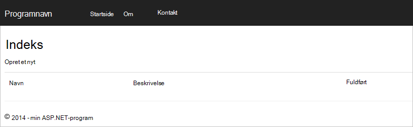

    Hvis du bruger Visual Studio 2013 og får vist fejlmeddelelsen "Kan ikke venter på at blive i brødteksten i en produkter-delsætning." Du skal installere [Microsoft.Net.Compilers nuget pakke](https://www.nuget.org/packages/Microsoft.Net.Compilers/). Du kan også sammenligne din kode mod eksempelprojektet på [GitHub][]. 

2. Klik på **Opret ny** linket og føje værdier til felterne **navn** og **Beskrivelse** . Forlad **fuldført** afkrydsningsfeltet ikke valgt ellers det nye **element** tilføjes i tilstanden færdige og vises ikke på den første liste.

    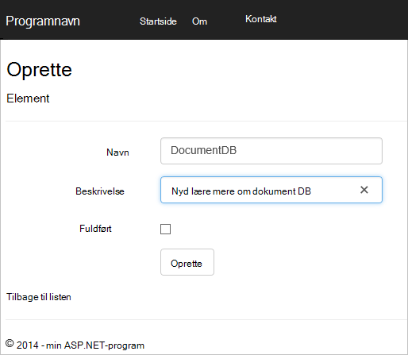

3. Klik på **Opret** , og du har åbnet tilbage til visningen **indeks** og dit **element** vises på listen.

    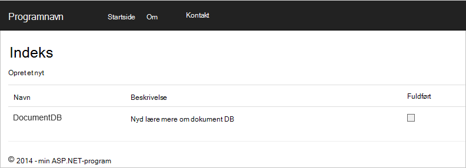

    Velkommen til at tilføje nogle flere **elementer** på listen opgaveliste.

3. Klik på **Rediger** ud for et **element** på listen, og du føres til **redigeringsvisning** hvor du kan opdatere en egenskab for objektet, herunder flaget **fuldført** . Hvis du markerer flaget **færdigt** , og klik på **Gem**, fjernes **elementet** på listen over ikke-afsluttede opgaver.

    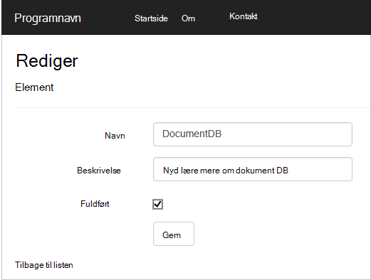

4. Én gang du har afprøvet appen, skal du trykke på Ctrl + F5 til stop fejlfindingen appen. Er du klar til at udrulle!

## Trin 7: Installere programmet til Azure websteder

Nu hvor du har fuldført programmet fungerer korrekt med DocumentDB vi skal installeres denne WebApp til Azure websteder. Hvis du har valgt **Host i skyen** , da du oprettede tomme ASP.NET MVC projektet derefter Visual Studio gør det nemt og gør de fleste af arbejdet for dig. 

1. Hvis du vil publicere dette program skal du gøre blot højreklikke på projektet i **Solution Explorer** , og klik på **Publicer**.

    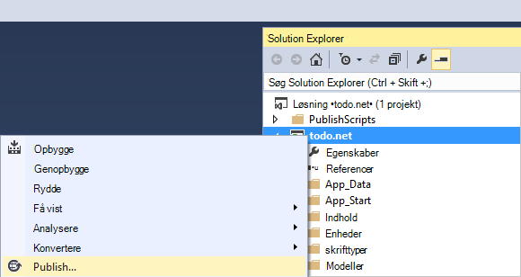

2. Alt skal allerede være konfigureret efter dine legitimationsoplysninger faktisk er webstedet allerede oprettet i Azure for dig på **Destination URL-adresse** , der vises, skal du gøre blot Klik på **Publicer**.

    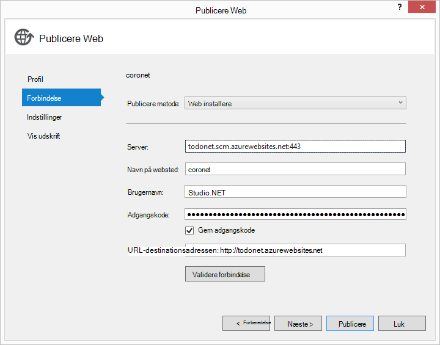

I et par sekunder, vil Visual Studio afslutte publicere dit webprogram og Start en browser, hvor du kan se dit praktiske arbejde, der kører i Azure!

## Næste trin

Tillykke! Du lige har oprettet din første ASP.NET MVC webprogrammet ved hjælp af Azure DocumentDB og publiceret til Azure websteder. Kildekode til programmet fuldført, herunder de detaljer og Slet funktioner, der ikke indgår i dette selvstudium kan blive hentet eller klones fra [GitHub][]. Hvis du er interesseret i at tilføje, til din app, tage koden så og tildele den til denne app.

For at tilføje ekstra funktioner til dit program skal du gennemse de tilgængelige i [DocumentDB .NET bibliotek](https://msdn.microsoft.com/library/azure/dn948556.aspx) API'er og Velkommen til at bidrage til biblioteket DocumentDB .NET på [GitHub][]. 

[\*]: https://microsoft.sharepoint.com/teams/DocDB/Shared%20Documents/Documentation/Docs.LatestVersions/PicExportError
[Visual Studio Express]: http://www.visualstudio.com/products/visual-studio-express-vs.aspx
[Microsoft Web Platform Installer]: http://www.microsoft.com/web/downloads/platform.aspx
[Forhindre forfalskning af anmodning på tværs af websteder]: http://go.microsoft.com/fwlink/?LinkID=517254
[Grundlæggende CRUD handlinger i ASP.NET MVC]: http://go.microsoft.com/fwlink/?LinkId=317598
[GitHub]: https://github.com/Azure-Samples/documentdb-net-todo-app
