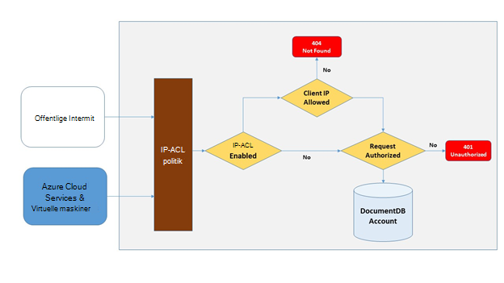
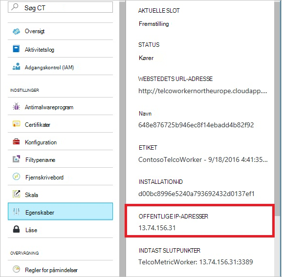
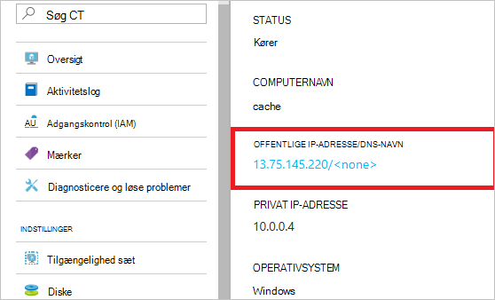
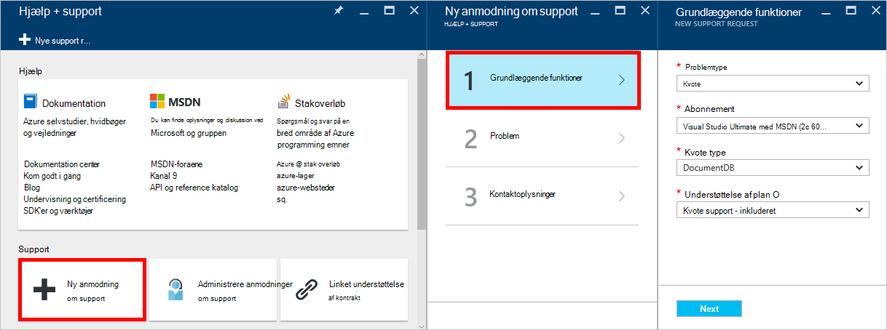
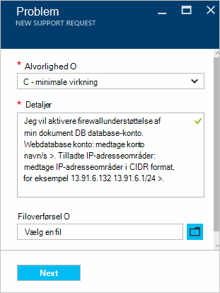

<properties
    pageTitle="Understøttelse af DocumentDB firewall | Microsoft Azure"
    description="Lær at bruge IP-politik for adgangskontrol til firewall support på Azure DocumentDB database konti."
    keywords="IP-adgangskontrol, firewall support"
    services="documentdb"
    authors="shahankur11"
    manager="jhubbard"
    editor=""
    tags="azure-resource-manager"
    documentationCenter=""/>

<tags 
    ms.service="documentdb" 
    ms.workload="data-services" 
    ms.tgt_pltfrm="na" 
    ms.devlang="na" 
    ms.topic="article" 
    ms.date="10/17/2016" 
    ms.author="ankshah; kraman"/>

# DocumentDB firewall support

For at sikre data, der er gemt i en Azure DocumentDB database-konto, har DocumentDB leveret support for en hemmeligt baseret [godkendelse model](https://msdn.microsoft.com/library/azure/dn783368.aspx) , der bruger en stærk Hash-baseret meddelelse godkendelse kode (HMAC). Ud over hemmeligt baseret godkendelse modellen understøtter DocumentDB nu politik indsatsbaserede IP-baserede adgang til kontrolelementer for indgående firewall support. Denne model minder meget om firewallregler af system traditionel OLAP-database og giver en ekstra sikkerhed til kontoen DocumentDB database. Med denne model, kan du nu konfigurere en DocumentDB database for at kunne åbnes kun fra et godkendt sæt af computere og/eller tjenester i skyen. Adgang til DocumentDB ressourcer fra disse godkendte sæt af computere og tjenester kræver stadig opkalds til at præsentere et gyldigt godkendelse token.

## IP-oversigt over adgangskontrol

En DocumentDB database konto er som standard tilgængelig fra offentlige internet, så længe anmodningen leveres med et gyldigt godkendelse token. Hvis du vil konfigurere IP-baseret på politik adgangskontrol, skal brugeren angive sæt IP-adresser eller IP-adresseområder i CIDR formular der skal medtages som listen tilladte af klienten IP'er til en given database-konto. Når denne konfiguration er anvendt, bliver alle anmodninger, der kommer fra maskiner uden for denne liste over tilladte blokeret af serveren.  Behandling af flow til den IP-baserede adgangskontrol forbindelsen er beskrevet i følgende diagram.

## Forbindelser fra skyen services

I Azure er skytjenester en meget almindelig måde til at være vært midterste niveau service logik ved hjælp af DocumentDB. For at få adgang til en DocumentDB database konto fra en skybaseret tjeneste, skal den offentlige IP-adresse skytjenesten føjes til listen over tilladte IP-adresser, der er knyttet til kontoen DocumentDB database ved at [kontakte Azure support](#configure-ip-policy).  Dette sikrer, at alle rolle forekomster af skytjenester har adgang til kontoen DocumentDB database. Du kan hente IP-adresser til din skytjenester i Azure-portalen, som vist på følgende skærmbillede. 

Når du skalere ud af dine skytjeneste ved at tilføje yderligere rolle forekomster, har de nye forekomster automatisk adgang til kontoen DocumentDB database, fordi de er en del af den samme skybaseret tjeneste.

## Forbindelser fra virtuelle maskiner

[Virtuelle maskiner](https://azure.microsoft.com/services/virtual-machines/) eller [virtuelt skala angiver](../virtual-machine-scale-sets/virtual-machine-scale-sets-overview.md) kan også bruges til at hoste midterste niveau-tjenester med DocumentDB.  For at konfigurere DocumentDB skal database-konto for at tillade adgang fra virtuelle maskiner, offentlige IP-adresser for virtuelt og/eller virtuelt skala sæt konfigureres som et af de tilladte IP-adresser for kontoen DocumentDB database ved at [kontakte Azure support](#configure-ip-policy). Du kan hente IP-adresser for virtuelle maskiner i Azure-portalen, som vist på følgende skærmbillede.

Når du tilføjer yderligere virtuelt forekomster til gruppen, får de automatisk adgang til kontoen DocumentDB database.

## Forbindelser fra internettet

Når du åbner en DocumentDB database konto fra en computer på internettet, klienten IP-adresse eller IP-adresseområder på computeren, skal føjes til listen over tilladte IP-adresse for kontoen DocumentDB database. 

## Konfiguration af IP-politikken for adgangskontrol

Brug portalen Azure til at indsende en anmodning til [Azure Support](https://portal.azure.com/?#blade/Microsoft_Azure_Support/HelpAndSupportBlade) til at aktivere IP-politikken for adgangskontrol i din database-konto.

1. Vælg **Ny understøtter anmodning**i bladet [Hjælp + support](https://portal.azure.com/?#blade/Microsoft_Azure_Support/HelpAndSupportBlade) .
2. Vælg **grundlæggende funktioner**i bladet **Ny understøtter anmodning** .
3. Vælg følgende i bladet **grundlæggende** :
    - **Problemtype**: kvote
    - **Abonnement**: der er knyttet til den konto, hvor du kan tilføje politikken for adgangskontrol IP-abonnementet.
    - **Kvote type**: DocumentDB
    - **Plan for support**: kvote Support - inkluderet.
4. Gør følgende i bladet **problemet** :
    - **Alvorlighed**: Vælg C - minimale virkning
    - **Detaljer**: Kopier følgende tekst i feltet, og omfatter din konto navn/s og IP-adresse/es: "Jeg vil aktivere firewallunderstøttelse af min DocumentDB database-konto. Webdatabase konto: *Medtag konto navn/s*. Tilladte IP-adresseområder: *medtage IP-adresse/område i CIDR format, for eksempel 13.91.6.132, 13.91.6.1/24*. "
    - Klik på **Næste**. 
5. Udfyld dine kontaktoplysninger bladet **kontaktoplysninger** , og klik på **Opret**. 

Når der modtages din anmodning, skal være aktiveret IP-adgangskontrol inden for 24 timer. Du får besked, når anmodningen er fuldført.

## Foretage fejlfinding af IP-politikken for adgangskontrol

### Portalen handlinger

Når du aktiverer en IP-politik for adgangskontrol for kontoen DocumentDB database, tilladt alle adgang til kontoen DocumentDB database fra maskiner uden for det konfigurerede liste over IP-adresseområder blokeres. I henhold til denne model blokeres browsing handlingen data plan fra portalen også for at sikre integriteten af adgangskontrol. 

### SDK og resten API

Af sikkerhedsmæssige årsager, adgang via SDK eller REST-API fra maskiner ikke på listen over tilladte vil returnere en generisk 404 ikke fundet svar uden yderligere oplysninger. Kontroller den IP-adresse, der tillader liste, der er konfigureret til kontoen DocumentDB database for at sikre, at konfigurere korrekte politikken anvendes på kontoen DocumentDB database.

## Næste trin

Finde oplysninger om netværk relaterede ydeevne tip [tip om ydeevne](documentdb-performance-tips.md).