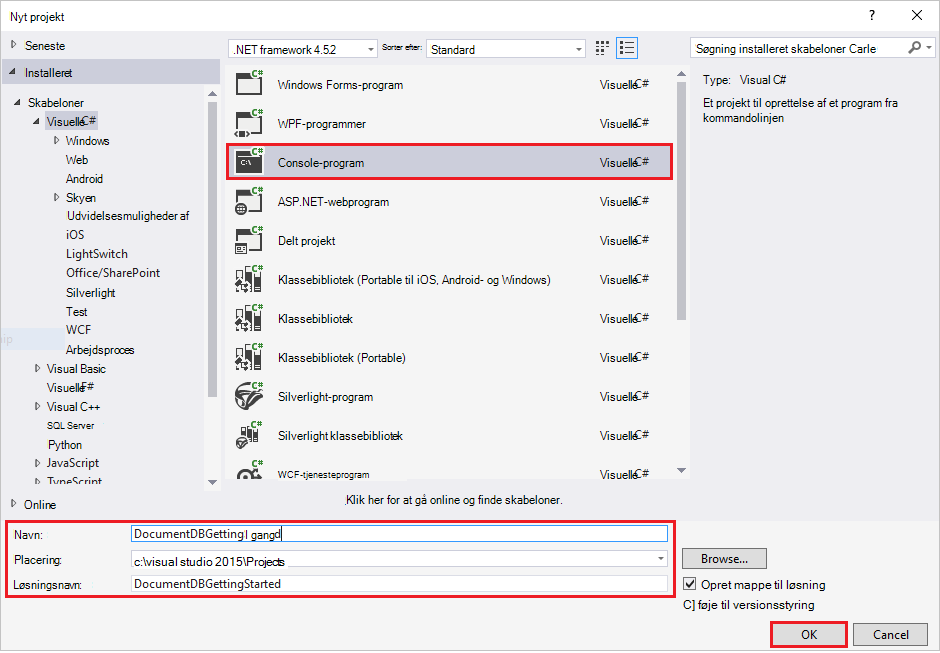
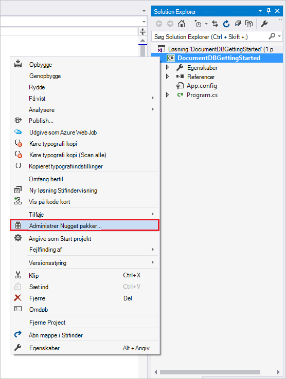
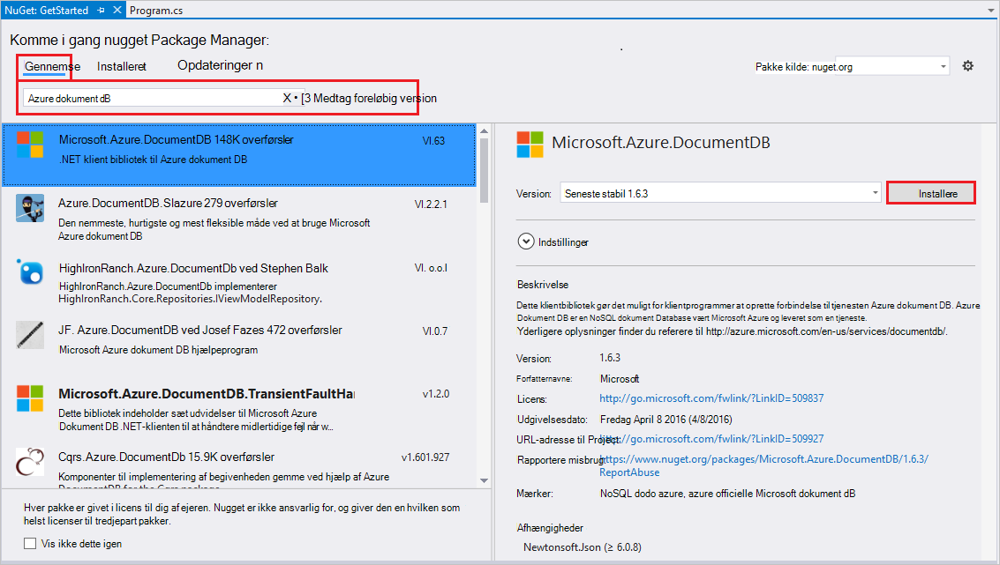
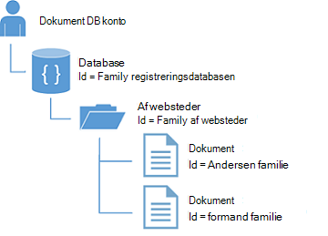
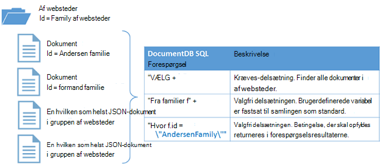

<properties
    pageTitle="NoSQL Selvstudium: DocumentDB .NET SDK | Microsoft Azure"
    description="Et NoSQL selvstudium, der opretter en onlinedatabasen og C# console-program ved hjælp af DocumentDB .NET SDK. DocumentDB er en NoSQL database til JSON."
    keywords="nosql selvstudium onlinedatabasen, c# console-program"
    services="documentdb"
    documentationCenter=".net"
    authors="AndrewHoh"
    manager="jhubbard"
    editor="monicar"/>

<tags
    ms.service="documentdb"
    ms.workload="data-services"
    ms.tgt_pltfrm="na"
    ms.devlang="dotnet"
    ms.topic="hero-article"
    ms.date="08/29/2016"
    ms.author="anhoh"/>

# NoSQL Selvstudium: oprette en DocumentDB C# console-program

> [AZURE.SELECTOR]
- [.NET](documentdb-get-started.md)
- [Node.js](documentdb-nodejs-get-started.md)

Velkommen til NoSQL selvstudiet til Azure DocumentDB .NET SDK! Når du har fulgt selvstudiet, har du en console-program, der opretter og forespørgsler DocumentDB ressourcer.

Vi gennemgår:

- Oprette og oprette forbindelse til en DocumentDB-konto
- Konfiguration af din løsning i Visual Studio
- Oprette en onlinedatabasen
- Oprette en samling
- Oprette JSON dokumenter
- Forespørgsler samlingen
- Erstatte et dokument
- Hvis du sletter et dokument
- Slette databasen

Ikke har tid? Vær ikke bekymret! Komplet løsning er tilgængelig på [GitHub](https://github.com/Azure-Samples/documentdb-dotnet-getting-started). Gå til den [få sektionen komplet løsning](#GetSolution) til hurtig vejledning.

Senere, skal du bruge responsknapperne øverst eller nederst på denne side til at give os feedback. Hvis du vil have os til at kontakte dig direkte, Velkommen til at medtage din e-mail-adresse i dine kommentarer.

Nu Lad os komme i gang!

## Forudsætninger

Kontrollér, at du har følgende:

- En active Azure-konto. Hvis du ikke har en, kan du tilmelde dig en [gratis konto](https://azure.microsoft.com/free/).
- [Visual Studio 2013 / Visual Studio 2015](http://www.visualstudio.com/).
- .NET framework 4.6

## Trin 1: Oprette en DocumentDB-konto

Lad os oprette en DocumentDB-konto. Hvis du allerede har en konto, du vil bruge, kan du gå videre til at [konfigurere din Visual Studio-løsning](#SetupVS).

[AZURE.INCLUDE [documentdb-create-dbaccount](../../includes/documentdb-create-dbaccount.md)]

## Trin 2: Konfigurer Visual Studio-løsning

1. Åbne **Visual Studio 2015** på din computer.
2. Vælg **Ny**i menuen **filer** , og vælg derefter **Project**.
3. Vælg **skabeloner**i dialogboksen **Nyt projekt**  / **Visual C#** / **Console-program**, Navngiv dit projekt, og klik derefter på **OK**.

4. I **Solution Explorer**, højreklik på dit nye console-program, som er under Visual Studio-løsning.
5. Klik derefter på **Administrer... NuGet pakker** uden at forlade menuen 
 
6. Klik på **Gennemse**under fanen **Nuget** , og skriv **azure documentdb** i søgefeltet.
7. Find **Microsoft.Azure.DocumentDB** inden for resultaterne, og klik på **Installer**.
Pakke-ID for biblioteket DocumentDB klient er [Microsoft.Azure.DocumentDB](https://www.nuget.org/packages/Microsoft.Azure.DocumentDB)

Enestående! Nu hvor vi har afsluttet konfigurationen, Lad os begynde at skrive kode. Du kan finde en færdige Kodeprojektet af dette selvstudium på [GitHub](https://github.com/Azure-Samples/documentdb-dotnet-getting-started/blob/master/src/Program.cs).

## Trin 3: Oprette forbindelse til en DocumentDB-konto

Først skal du tilføje disse referencer til starten af dit C#-program, i filen Program.cs:

    using System;
    using System.Linq;
    using System.Threading.Tasks;

    // ADD THIS PART TO YOUR CODE
    using System.Net;
    using Microsoft.Azure.Documents;
    using Microsoft.Azure.Documents.Client;
    using Newtonsoft.Json;

> [AZURE.IMPORTANT] Kontrollér, at du har tilføjet de afhængigheder ovenfor for at fuldføre selvstudiet NoSQL.

Nu skal du tilføje disse to konstanter, og din *klient* variabel under klasse offentlige *Program*.

    public class Program
    {
        // ADD THIS PART TO YOUR CODE
        private const string EndpointUri = "<your endpoint URI>";
        private const string PrimaryKey = "<your key>";
        private DocumentClient client;

Næste, gå til [Azure Portal](https://portal.azure.com) for at hente dine URI og primær nøgle. DocumentDB URI og primær nøgle er nødvendige for dit program at forstå, hvor du vil oprette forbindelse til, og DocumentDB at have tillid til dit program forbindelse.

Gå til kontoen DocumentDB i Azure-portalen, og klik derefter på **nøgler**.

Kopiér URI fra portalen og sæt dem ind i `<your endpoint URI>` i filen program.cs. Derefter Kopiér den PRIMÆRNØGLE fra portalen, og sæt dem ind i `<your key>`.

![Skærmbillede af portalen Azure bruges af NoSQL selvstudiet til at oprette et C# console-program. Viser en DocumentDB-konto med den aktive hub fremhævet, knappen TASTER er fremhævet på bladet DocumentDB konto og de URI, PRIMÆRNØGLE og sekundær nøgle værdier, der er fremhævet på bladet taster][keys]

Vi begynder få Introduktion programmet ved at oprette en ny forekomst af **DocumentClient**.

Tilføj denne nye asynkron opgave kaldet **GetStartedDemo**, hvor der oprettes en forekomst af vores nye **DocumentClient**under metoden **Main** .

    static void Main(string[] args)
    {
    }

    // ADD THIS PART TO YOUR CODE
    private async Task GetStartedDemo()
    {
        this.client = new DocumentClient(new Uri(EndpointUri), PrimaryKey);
    }

Tilføj følgende kode for at køre din asynkron opgave fra din **Main** metode. Metoden **Main** Fang undtagelser, og skrive dem til konsollen.

    static void Main(string[] args)
    {
            // ADD THIS PART TO YOUR CODE
            try
            {
                    Program p = new Program();
                    p.GetStartedDemo().Wait();
            }
            catch (DocumentClientException de)
            {
                    Exception baseException = de.GetBaseException();
                    Console.WriteLine("{0} error occurred: {1}, Message: {2}", de.StatusCode, de.Message, baseException.Message);
            }
            catch (Exception e)
            {
                    Exception baseException = e.GetBaseException();
                    Console.WriteLine("Error: {0}, Message: {1}", e.Message, baseException.Message);
            }
            finally
            {
                    Console.WriteLine("End of demo, press any key to exit.");
                    Console.ReadKey();
            }

Tryk på **F5 for** at køre programmet.

Tillykke! Du har oprettet forbindelse til en DocumentDB-konto, Lad os nu se nærmere på arbejde med DocumentDB ressourcer.  

## Trin 4: Oprette en database
Før du tilføjer koden for oprettelse af en database, kan du tilføje en hjælper metode til at skrive til konsollen.

Kopiere og indsætte Metoden **WriteToConsoleAndPromptToContinue** under metoden **GetStartedDemo** .

    // ADD THIS PART TO YOUR CODE
    private void WriteToConsoleAndPromptToContinue(string format, params object[] args)
    {
            Console.WriteLine(format, args);
            Console.WriteLine("Press any key to continue ...");
            Console.ReadKey();
    }

DocumentDB [database](documentdb-resources.md#databases) kan oprettes ved hjælp af metoden [CreateDatabaseAsync](https://msdn.microsoft.com/library/microsoft.azure.documents.client.documentclient.createdatabaseasync.aspx) i klassen **DocumentClient** . En database er objektbeholderen logiske JSON dokument lagerplads opdelt på tværs af websteder.

Kopiere og indsætte Metoden **CreateDatabaseIfNotExists** under metoden **WriteToConsoleAndPromptToContinue** .

    // ADD THIS PART TO YOUR CODE
    private async Task CreateDatabaseIfNotExists(string databaseName)
    {
            // Check to verify a database with the id=FamilyDB does not exist
            try
            {
                    await this.client.ReadDatabaseAsync(UriFactory.CreateDatabaseUri(databaseName));
                    this.WriteToConsoleAndPromptToContinue("Found {0}", databaseName);
            }
            catch (DocumentClientException de)
            {
                    // If the database does not exist, create a new database
                    if (de.StatusCode == HttpStatusCode.NotFound)
                    {
                            await this.client.CreateDatabaseAsync(new Database { Id = databaseName });
                            this.WriteToConsoleAndPromptToContinue("Created {0}", databaseName);
                    }
                    else
                    {
                            throw;
                    }
            }
    }

Kopiér og Indsæt følgende kode i din **GetStartedDemo** metode under oprettelsen af klienten. Dette vil oprette en database med navnet *FamilyDB*.

    private async Task GetStartedDemo()
    {
        this.client = new DocumentClient(new Uri(EndpointUri), PrimaryKey);

        // ADD THIS PART TO YOUR CODE
        await this.CreateDatabaseIfNotExists("FamilyDB_oa");

Tryk på **F5 for** at køre programmet.

Tillykke! Du har oprettet en DocumentDB database.  

## Trin 5: Oprette en samling  

> [AZURE.WARNING] **CreateDocumentCollectionAsync** opretter en ny af websteder med reserveret overførselshastighed, som har priser konsekvenserne. Få mere at vide, skal du gå til vores [priser side](https://azure.microsoft.com/pricing/details/documentdb/).

En [samling](documentdb-resources.md#collections) kan oprettes ved hjælp af metoden [CreateDocumentCollectionAsync](https://msdn.microsoft.com/library/microsoft.azure.documents.client.documentclient.createdocumentcollectionasync.aspx) i klassen **DocumentClient** . En samling er en beholder af JSON dokumenter og tilknyttede JavaScript programlogik.

Kopiere og indsætte Metoden **CreateDocumentCollectionIfNotExists** under din **CreateDatabaseIfNotExists** metode.

    // ADD THIS PART TO YOUR CODE
    private async Task CreateDocumentCollectionIfNotExists(string databaseName, string collectionName)
    {
        try
        {
            await this.client.ReadDocumentCollectionAsync(UriFactory.CreateDocumentCollectionUri(databaseName, collectionName));
            this.WriteToConsoleAndPromptToContinue("Found {0}", collectionName);
        }
        catch (DocumentClientException de)
        {
            // If the document collection does not exist, create a new collection
            if (de.StatusCode == HttpStatusCode.NotFound)
            {
                DocumentCollection collectionInfo = new DocumentCollection();
                collectionInfo.Id = collectionName;

                // Configure collections for maximum query flexibility including string range queries.
                collectionInfo.IndexingPolicy = new IndexingPolicy(new RangeIndex(DataType.String) { Precision = -1 });

                // Here we create a collection with 400 RU/s.
                await this.client.CreateDocumentCollectionAsync(
                    UriFactory.CreateDatabaseUri(databaseName),
                    collectionInfo,
                    new RequestOptions { OfferThroughput = 400 });

                this.WriteToConsoleAndPromptToContinue("Created {0}", collectionName);
            }
            else
            {
                throw;
            }
        }
    }

Kopiér og Indsæt følgende kode i din **GetStartedDemo** metode under oprette databasen. Dette vil oprette en navngivet *FamilyCollection_oa*dokument af websteder.

        this.client = new DocumentClient(new Uri(EndpointUri), PrimaryKey);

        await this.CreateDatabaseIfNotExists("FamilyDB_oa");

        // ADD THIS PART TO YOUR CODE
        await this.CreateDocumentCollectionIfNotExists("FamilyDB_oa", "FamilyCollection_oa");

Tryk på **F5 for** at køre programmet.

Tillykke! Du har oprettet en DocumentDB dokument af websteder.  

## Trin 6: Oprette JSON dokumenter
Et [dokument](documentdb-resources.md#documents) kan oprettes ved hjælp af metoden [CreateDocumentAsync](https://msdn.microsoft.com/library/microsoft.azure.documents.client.documentclient.createdocumentasync.aspx) i klassen **DocumentClient** . Dokumenter er brugerdefinerede (vilkårlig) JSON-indhold. Vi kan nu indsætte et eller flere dokumenter. Hvis du allerede har data, du vil gemme i databasen, kan du bruge Documentdbs [Data overførselsværktøjet](documentdb-import-data.md).

Først skal vi oprette en **familie** klasse, der repræsenterer objekter, der er gemt i DocumentDB i dette eksempel. Vi kan også oprette **overordnede**, **underordnede**, **Pet**, **adresse** underklasser, der bruges i **serien**. Bemærk, at dokumenter skal have et **id-** egenskaben serialiseret som **id** i JSON. Oprette disse klasser ved at tilføje følgende interne underordnede klasser efter metoden **GetStartedDemo** .

Kopiere og indsætte **familie**, **overordnede**, **underordnede**, **Pet**og **adresse** klasser under metoden **WriteToConsoleAndPromptToContinue** .

    private void WriteToConsoleAndPromptToContinue(string format, params object[] args)
    {
        Console.WriteLine(format, args);
        Console.WriteLine("Press any key to continue ...");
        Console.ReadKey();
    }

    // ADD THIS PART TO YOUR CODE
    public class Family
    {
        [JsonProperty(PropertyName = "id")]
        public string Id { get; set; }
        public string LastName { get; set; }
        public Parent[] Parents { get; set; }
        public Child[] Children { get; set; }
        public Address Address { get; set; }
        public bool IsRegistered { get; set; }
        public override string ToString()
        {
                return JsonConvert.SerializeObject(this);
        }
    }

    public class Parent
    {
        public string FamilyName { get; set; }
        public string FirstName { get; set; }
    }

    public class Child
    {
        public string FamilyName { get; set; }
        public string FirstName { get; set; }
        public string Gender { get; set; }
        public int Grade { get; set; }
        public Pet[] Pets { get; set; }
    }

    public class Pet
    {
        public string GivenName { get; set; }
    }

    public class Address
    {
        public string State { get; set; }
        public string County { get; set; }
        public string City { get; set; }
    }

Kopiere og indsætte Metoden **CreateFamilyDocumentIfNotExists** under din **CreateDocumentCollectionIfNotExists** metode.

    // ADD THIS PART TO YOUR CODE
    private async Task CreateFamilyDocumentIfNotExists(string databaseName, string collectionName, Family family)
    {
        try
        {
            await this.client.ReadDocumentAsync(UriFactory.CreateDocumentUri(databaseName, collectionName, family.Id));
            this.WriteToConsoleAndPromptToContinue("Found {0}", family.Id);
        }
        catch (DocumentClientException de)
        {
            if (de.StatusCode == HttpStatusCode.NotFound)
            {
                await this.client.CreateDocumentAsync(UriFactory.CreateDocumentCollectionUri(databaseName, collectionName), family);
                this.WriteToConsoleAndPromptToContinue("Created Family {0}", family.Id);
            }
            else
            {
                throw;
            }
        }
    }

Og indsætte to dokumenter, én for familien Andersen og formand familie.

Kopiér og Indsæt følgende kode i din **GetStartedDemo** metode under oprettelsen af websteder i dokumentet.

    await this.CreateDatabaseIfNotExists("FamilyDB_oa");

    await this.CreateDocumentCollectionIfNotExists("FamilyDB_oa", "FamilyCollection_oa");

    // ADD THIS PART TO YOUR CODE
    Family andersenFamily = new Family
    {
            Id = "Andersen.1",
            LastName = "Andersen",
            Parents = new Parent[]
            {
                    new Parent { FirstName = "Thomas" },
                    new Parent { FirstName = "Mary Kay" }
            },
            Children = new Child[]
            {
                    new Child
                    {
                            FirstName = "Henriette Thaulow",
                            Gender = "female",
                            Grade = 5,
                            Pets = new Pet[]
                            {
                                    new Pet { GivenName = "Fluffy" }
                            }
                    }
            },
            Address = new Address { State = "WA", County = "King", City = "Seattle" },
            IsRegistered = true
    };

    await this.CreateFamilyDocumentIfNotExists("FamilyDB_oa", "FamilyCollection_oa", andersenFamily);

    Family wakefieldFamily = new Family
    {
            Id = "Wakefield.7",
            LastName = "Wakefield",
            Parents = new Parent[]
            {
                    new Parent { FamilyName = "Wakefield", FirstName = "Robin" },
                    new Parent { FamilyName = "Miller", FirstName = "Ben" }
            },
            Children = new Child[]
            {
                    new Child
                    {
                            FamilyName = "Merriam",
                            FirstName = "Jesse",
                            Gender = "female",
                            Grade = 8,
                            Pets = new Pet[]
                            {
                                    new Pet { GivenName = "Goofy" },
                                    new Pet { GivenName = "Shadow" }
                            }
                    },
                    new Child
                    {
                            FamilyName = "Miller",
                            FirstName = "Lisa",
                            Gender = "female",
                            Grade = 1
                    }
            },
            Address = new Address { State = "NY", County = "Manhattan", City = "NY" },
            IsRegistered = false
    };

    await this.CreateFamilyDocumentIfNotExists("FamilyDB_oa", "FamilyCollection_oa", wakefieldFamily);

Tryk på **F5 for** at køre programmet.

Tillykke! Du har oprettet to DocumentDB dokumenter.  

##Trin 7: Forespørgsel DocumentDB ressourcer

DocumentDB understøtter RTF [forespørgsler](documentdb-sql-query.md) JSON-dokumenter, der er gemt i hver af websteder.  Følgende eksempelkode viser forskellige forespørgsler - med begge DocumentDB SQL-syntaks samt LINQ -, at vi kan køre mod dokumenterne vi indsat i det forrige trin.

Kopiere og indsætte Metoden **ExecuteSimpleQuery** under din **CreateFamilyDocumentIfNotExists** metode.

    // ADD THIS PART TO YOUR CODE
    private void ExecuteSimpleQuery(string databaseName, string collectionName)
    {
        // Set some common query options
        FeedOptions queryOptions = new FeedOptions { MaxItemCount = -1 };

            // Here we find the Andersen family via its LastName
            IQueryable<Family> familyQuery = this.client.CreateDocumentQuery<Family>(
                    UriFactory.CreateDocumentCollectionUri(databaseName, collectionName), queryOptions)
                    .Where(f => f.LastName == "Andersen");

            // The query is executed synchronously here, but can also be executed asynchronously via the IDocumentQuery<T> interface
            Console.WriteLine("Running LINQ query...");
            foreach (Family family in familyQuery)
            {
                    Console.WriteLine("\tRead {0}", family);
            }

            // Now execute the same query via direct SQL
            IQueryable<Family> familyQueryInSql = this.client.CreateDocumentQuery<Family>(
                    UriFactory.CreateDocumentCollectionUri(databaseName, collectionName),
                    "SELECT * FROM Family WHERE Family.LastName = 'Andersen'",
                    queryOptions);

            Console.WriteLine("Running direct SQL query...");
            foreach (Family family in familyQueryInSql)
            {
                    Console.WriteLine("\tRead {0}", family);
            }

            Console.WriteLine("Press any key to continue ...");
            Console.ReadKey();
    }

Kopiér og Indsæt følgende kode i din **GetStartedDemo** metode under dokumentoprettelse af det andet.

    await this.CreateFamilyDocumentIfNotExists("FamilyDB_oa", "FamilyCollection_oa", wakefieldFamily);

    // ADD THIS PART TO YOUR CODE
    this.ExecuteSimpleQuery("FamilyDB_oa", "FamilyCollection_oa");

Tryk på **F5 for** at køre programmet.

Tillykke! Du har korrekt forespørges mod en DocumentDB af websteder.

I følgende diagram vises, hvordan DocumentDB SQL forespørgselssyntaksen hedder mod samlingen, du har oprettet, og den samme logik anvendes på forespørgslen LINQ.

Nøgleordet [fra](documentdb-sql-query.md#from-clause) er valgfrit i forespørgslen, fordi DocumentDB forespørgsler allerede er fastsat til en enkelt samling. Derfor "Fra familier f" kan byttes med "Fra rodwebstedet r" eller andre variabel navngive du vælger. DocumentDB kan udlede pågældende familier, rod eller variabelnavn du vælger, der henviser til den aktuelle websteder som standard.

##Trin 8: Erstat JSON dokument

DocumentDB understøtter erstatte JSON-dokumenter.  

Kopiere og indsætte Metoden **ReplaceFamilyDocument** under din **ExecuteSimpleQuery** metode.

    // ADD THIS PART TO YOUR CODE
    private async Task ReplaceFamilyDocument(string databaseName, string collectionName, string familyName, Family updatedFamily)
    {
        try
        {
            await this.client.ReplaceDocumentAsync(UriFactory.CreateDocumentUri(databaseName, collectionName, familyName), updatedFamily);
            this.WriteToConsoleAndPromptToContinue("Replaced Family {0}", familyName);
        }
        catch (DocumentClientException de)
        {
            throw;
        }
    }

Kopiér og Indsæt følgende kode i din **GetStartedDemo** metode under udførelse af forespørgsler. Dette vil køre den samme forespørgsel igen for at få vist ændrede dokumentet efter erstatning dokumentet.

    await this.CreateFamilyDocumentIfNotExists("FamilyDB_oa", "FamilyCollection_oa", wakefieldFamily);

    this.ExecuteSimpleQuery("FamilyDB_oa", "FamilyCollection_oa");

    // ADD THIS PART TO YOUR CODE
    // Update the Grade of the Andersen Family child
    andersenFamily.Children[0].Grade = 6;

    await this.ReplaceFamilyDocument("FamilyDB_oa", "FamilyCollection_oa", "Andersen.1", andersenFamily);

    this.ExecuteSimpleQuery("FamilyDB_oa", "FamilyCollection_oa");

Tryk på **F5 for** at køre programmet.

Tillykke! Du er blevet erstattet et DocumentDB dokument.

##Trin 9: Slette JSON dokument

DocumentDB understøtter sletning JSON-dokumenter.  

Kopiere og indsætte Metoden **DeleteFamilyDocument** under din **ReplaceFamilyDocument** metode.

    // ADD THIS PART TO YOUR CODE
    private async Task DeleteFamilyDocument(string databaseName, string collectionName, string documentName)
    {
        try
        {
            await this.client.DeleteDocumentAsync(UriFactory.CreateDocumentUri(databaseName, collectionName, documentName));
            Console.WriteLine("Deleted Family {0}", documentName);
        }
        catch (DocumentClientException de)
        {
            throw;
        }
    }

Kopiér og Indsæt følgende kode i din **GetStartedDemo** metode under den anden udførelse af forespørgsel.

    await this.ReplaceFamilyDocument("FamilyDB_oa", "FamilyCollection_oa", "Andersen.1", andersenFamily);

    this.ExecuteSimpleQuery("FamilyDB_oa", "FamilyCollection_oa");

    // ADD THIS PART TO CODE
    await this.DeleteFamilyDocument("FamilyDB_oa", "FamilyCollection_oa", "Andersen.1");

Tryk på **F5 for** at køre programmet.

Tillykke! Du har slettet en DocumentDB dokument.

##Trin 10: Slet databasen

Slette den oprettede database fjerner databasen og alle underordnede ressourcer (af websteder, dokumenter osv.).

Kopiér og Indsæt følgende kode i din **GetStartedDemo** metode under dokumentet Slet til Slet hele databasen og alle underordnede ressourcer.

    this.ExecuteSimpleQuery("FamilyDB_oa", "FamilyCollection_oa");

    await this.DeleteFamilyDocument("FamilyDB_oa", "FamilyCollection_oa", "Andersen.1");

    // ADD THIS PART TO CODE
    // Clean up/delete the database
    await this.client.DeleteDatabaseAsync(UriFactory.CreateDatabaseUri("FamilyDB_oa"));

Tryk på **F5 for** at køre programmet.

Tillykke! Du har slettet en DocumentDB database.

##Trin 11: Kør C# console programmet alle sammen!

Tryk på F5 i Visual Studio til at oprette programmet i fejlsikret tilstand.

Du bør se output fra din Introduktion get-app. Output viser resultaterne af forespørgslerne vi har tilføjet og skal svare til eksempelteksten nedenfor.

    Created FamilyDB_oa
    Press any key to continue ...
    Created FamilyCollection_oa
    Press any key to continue ...
    Created Family Andersen.1
    Press any key to continue ...
    Created Family Wakefield.7
    Press any key to continue ...
    Running LINQ query...
        Read {"id":"Andersen.1","LastName":"Andersen","District":"WA5","Parents":[{"FamilyName":null,"FirstName":"Thomas"},{"FamilyName":null,"FirstName":"Mary Kay"}],"Children":[{"FamilyName":null,"FirstName":"Henriette Thaulow","Gender":"female","Grade":5,"Pets":[{"GivenName":"Fluffy"}]}],"Address":{"State":"WA","County":"King","City":"Seattle"},"IsRegistered":true}
    Running direct SQL query...
        Read {"id":"Andersen.1","LastName":"Andersen","District":"WA5","Parents":[{"FamilyName":null,"FirstName":"Thomas"},{"FamilyName":null,"FirstName":"Mary Kay"}],"Children":[{"FamilyName":null,"FirstName":"Henriette Thaulow","Gender":"female","Grade":5,"Pets":[{"GivenName":"Fluffy"}]}],"Address":{"State":"WA","County":"King","City":"Seattle"},"IsRegistered":true}
    Replaced Family Andersen.1
    Press any key to continue ...
    Running LINQ query...
        Read {"id":"Andersen.1","LastName":"Andersen","District":"WA5","Parents":[{"FamilyName":null,"FirstName":"Thomas"},{"FamilyName":null,"FirstName":"Mary Kay"}],"Children":[{"FamilyName":null,"FirstName":"Henriette Thaulow","Gender":"female","Grade":6,"Pets":[{"GivenName":"Fluffy"}]}],"Address":{"State":"WA","County":"King","City":"Seattle"},"IsRegistered":true}
    Running direct SQL query...
        Read {"id":"Andersen.1","LastName":"Andersen","District":"WA5","Parents":[{"FamilyName":null,"FirstName":"Thomas"},{"FamilyName":null,"FirstName":"Mary Kay"}],"Children":[{"FamilyName":null,"FirstName":"Henriette Thaulow","Gender":"female","Grade":6,"Pets":[{"GivenName":"Fluffy"}]}],"Address":{"State":"WA","County":"King","City":"Seattle"},"IsRegistered":true}
    Deleted Family Andersen.1
    End of demo, press any key to exit.

Tillykke! Du har færdiggjort selvstudiet NoSQL og har et arbejde C# console-program!

##Få den komplette NoSQL selvstudie løsning
For at opbygge GetStarted løsningen, der indeholder alle eksemplerne i denne artikel, skal du følgende:

- En active Azure-konto. Hvis du ikke har en, kan du tilmelde dig en [gratis konto](https://azure.microsoft.com/free/).
-   En [DocumentDB konto][documentdb-create-account].
-   Tilgængelig på GitHub [GetStarted](https://github.com/Azure-Samples/documentdb-dotnet-getting-started) løsning.

Højreklik på **GetStarted** løsningen i Solution Explorer for at gendanne referencer til DocumentDB .NET SDK i Visual Studio skal, og klik derefter på **Aktivér NuGet pakke Gendan**. Derefter i filen App.config opdatere EndpointUrl og AuthorizationKey værdierne som beskrevet i [oprette forbindelse til en DocumentDB-konto](#Connect).

## Næste trin

- Vil du have en mere kompleks ASP.NET MVC NoSQL selvstudium? Se [oprette et webprogram med ASP.NET MVC ved hjælp af DocumentDB](documentdb-dotnet-application.md).
- Vil udføre skala og performance-test med DocumentDB? Se [ydeevne og skalering test med Azure DocumentDB](documentdb-performance-testing.md)
-   Lær, hvordan du kan [overvåge en DocumentDB-konto](documentdb-monitor-accounts.md).
-   Køre forespørgsler i vores eksempel datasæt i [Forespørgsel tennisklub](https://www.documentdb.com/sql/demo).
-   Lær mere om programmering modellen i sektionen udvikling af [DocumentDB dokumentation side](https://azure.microsoft.com/documentation/services/documentdb/).

[documentdb-create-account]: documentdb-create-account.md
[documentdb-manage]: documentdb-manage.md
[keys]: media/documentdb-get-started/nosql-tutorial-keys.png
