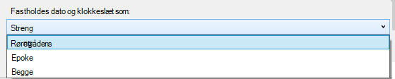
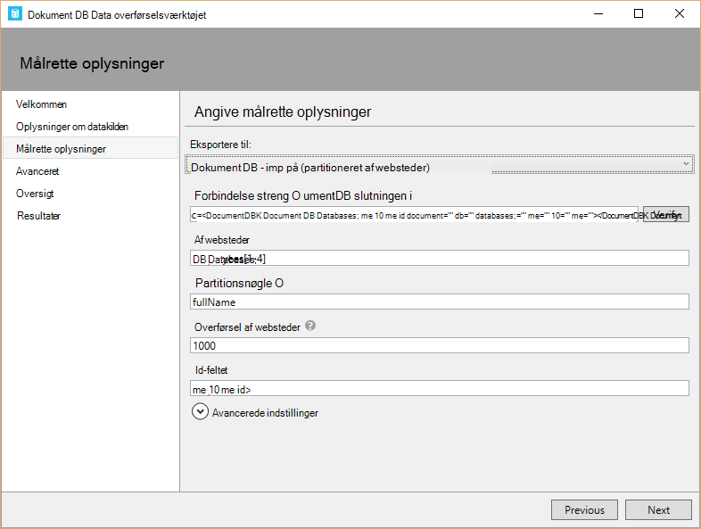
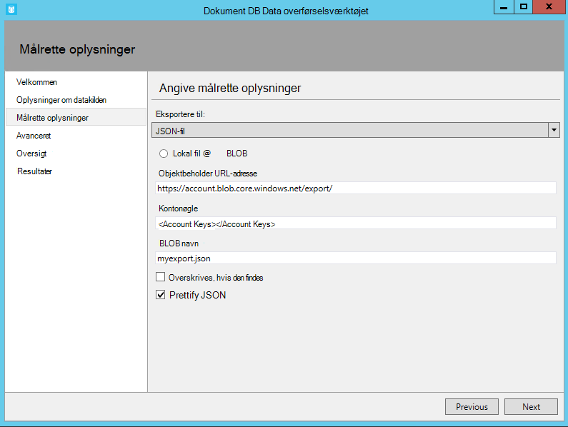

<properties
    pageTitle="Overflytningsværktøj til database til DocumentDB | Microsoft Azure"
    description="Lær at bruge Åbn kilde DocumentDB data-overførselsværktøjer til at importere data til DocumentDB fra forskellige kilder, herunder MongoDB SQL Server, tabel lagerplads, Amazon DynamoDB, CSV-filer, og JSON. CSV til konvertering af JSON."
    keywords="csv til json, overførsel Databaseværktøjer konvertere csv til json"
    services="documentdb"
    authors="andrewhoh"
    manager="jhubbard"
    editor="monicar"
    documentationCenter=""/>

<tags
    ms.service="documentdb"
    ms.workload="data-services"
    ms.tgt_pltfrm="na"
    ms.devlang="na"
    ms.topic="article"
    ms.date="10/06/2016"
    ms.author="anhoh"/>

# Importere data til DocumentDB med overførselsværktøjet Database

I denne artikel viser, hvordan du bruger overførselsværktøjet officielle Åbn kilde DocumentDB data til at importere data til [Microsoft Azure DocumentDB](https://azure.microsoft.com/services/documentdb/) fra forskellige kilder, herunder JSON-filer, CSV-filer, SQL, MongoDB, Azure Table storage, Amazon DynamoDB og DocumentDB af websteder.

Når du har læst i denne artikel, vil du kunne besvare spørgsmål, der er følgende:  

-   Hvordan kan jeg importere JSON-fil, CSV-fil, SQL Server-data eller MongoDB data til DocumentDB?
-   Hvordan kan jeg importere data fra Azure Table storage, Amazon DynamoDB og HBase til DocumentDB?
-   Hvordan kan jeg overføre data mellem DocumentDB af websteder?

##Forudsætninger

Før du følge vejledningen i denne artikel kan du sikre dig, at du har installeret følgende:

- [Microsoft .NET Framework 4.51](https://www.microsoft.com/download/developer-tools.aspx) eller nyere.

##Oversigt over overførselsværktøjet DocumentDB Data

Værktøjet DocumentDB dataoverførsel er en Åbn kilde-løsning, der importerer data til DocumentDB fra en lang række kilder, herunder:

- JSON-filer
- MongoDB
- SQL Server
- Csv-filer
- Azure-tabellager
- Amazon DynamoDB
- HBase
- DocumentDB af websteder

Mens importværktøjet indeholder en grafisk brugergrænseflade (dtui.exe), kan det også styres fra kommandolinjen (dt.exe). Faktisk er der en indstilling til at få vist kommandoen tilknyttede efter konfigurering af en import via Brugergrænsefladen. Tabelformat kildedata (fx SQL Server- eller CSV-filer) kan ændres, så hierarkiske relationer (underdokumenter) kan oprettes under importen. Læs mere at vide om indstillinger for datakilde, eksempel på kommandoen streger for at importere fra hver kilde, indstillinger for destinationswebstedet og visning Importer resultater.

##Installere overførselsværktøjet DocumentDB Data

Overførsel værktøjet kildekode er tilgængelig på GitHub i [denne lager](https://github.com/azure/azure-documentdb-datamigrationtool) og en kompileret version er tilgængelige fra [Microsoft Download Center](http://www.microsoft.com/downloads/details.aspx?FamilyID=cda7703a-2774-4c07-adcc-ad02ddc1a44d). Du kan enten samle løsningen eller blot downloade og udtrække den kompilerede version til en mappe efter eget valg. Kør derefter enten:

- **Dtui.exe**: grafiske brugergrænseflade version af værktøjet
- **DT.exe**: kommandolinjen version af værktøjet

##Importere JSON filer

Indstillingen JSON importer kilde kan du importere en eller flere enkelt dokument JSON filer eller JSON-filer, hver indeholder en matrix med JSON dokumenter. Når du tilføjer mapper, der indeholder JSON skal importeres, har du mulighed for at søge efter filer i undermapper gælder.

Her er nogle eksempler på kommandolinjen til at importere JSON filer:

    #Import a single JSON file
    dt.exe /s:JsonFile /s.Files:.\Sessions.json /t:DocumentDBBulk /t.ConnectionString:"AccountEndpoint=<DocumentDB Endpoint>;AccountKey=<DocumentDB Key>;Database=<DocumentDB Database>;" /t.Collection:Sessions /t.CollectionThroughput:2500

    #Import a directory of JSON files
    dt.exe /s:JsonFile /s.Files:C:\TESessions\*.json /t:DocumentDBBulk /t.ConnectionString:" AccountEndpoint=<DocumentDB Endpoint>;AccountKey=<DocumentDB Key>;Database=<DocumentDB Database>;" /t.Collection:Sessions /t.CollectionThroughput:2500

    #Import a directory (including sub-directories) of JSON files
    dt.exe /s:JsonFile /s.Files:C:\LastFMMusic\**\*.json /t:DocumentDBBulk /t.ConnectionString:" AccountEndpoint=<DocumentDB Endpoint>;AccountKey=<DocumentDB Key>;Database=<DocumentDB Database>;" /t.Collection:Music /t.CollectionThroughput:2500

    #Import a directory (single), directory (recursive), and individual JSON files
    dt.exe /s:JsonFile /s.Files:C:\Tweets\*.*;C:\LargeDocs\**\*.*;C:\TESessions\Session48172.json;C:\TESessions\Session48173.json;C:\TESessions\Session48174.json;C:\TESessions\Session48175.json;C:\TESessions\Session48177.json /t:DocumentDBBulk /t.ConnectionString:"AccountEndpoint=<DocumentDB Endpoint>;AccountKey=<DocumentDB Key>;Database=<DocumentDB Database>;" /t.Collection:subs /t.CollectionThroughput:2500

    #Import a single JSON file and partition the data across 4 collections
    dt.exe /s:JsonFile /s.Files:D:\\CompanyData\\Companies.json /t:DocumentDBBulk /t.ConnectionString:"AccountEndpoint=<DocumentDB Endpoint>;AccountKey=<DocumentDB Key>;Database=<DocumentDB Database>;" /t.Collection:comp[1-4] /t.PartitionKey:name /t.CollectionThroughput:2500

##Importere fra MongoDB

Indstillingen MongoDB kilde importer kan du importere fra en enkelt MongoDB af websteder, og som du kan også filtrere dokumenter ved hjælp af en forespørgsel og/eller redigere dokumentstrukturen ved hjælp af en projicering.  

Forbindelsesstrengen er i formatet standard MongoDB:

    mongodb://<dbuser>:<dbpassword>@<host>:<port>/<database>

> [AZURE.NOTE] Kommandoen Verify bruges til at sikre, at den MongoDB-forekomst, der er angivet i feltet forbindelsesstreng kan åbnes.

Skriv navnet på gruppen af websteder, der skal importeres data. Du kan eventuelt angive eller angive en fil til en forespørgsel (fx {pop: {$gt: 5000}}) og/eller projicering (fx {loc:0}) for både filtrere og forme data der skal importeres.

Her er nogle eksempler på kommandolinjen til at importere fra MongoDB:

    #Import all documents from a MongoDB collection
    dt.exe /s:MongoDB /s.ConnectionString:mongodb://<dbuser>:<dbpassword>@<host>:<port>/<database> /s.Collection:zips /t:DocumentDBBulk /t.ConnectionString:"AccountEndpoint=<DocumentDB Endpoint>;AccountKey=<DocumentDB Key>;Database=<DocumentDB Database>;" /t.Collection:BulkZips /t.IdField:_id /t.CollectionThroughput:2500

    #Import documents from a MongoDB collection which match the query and exclude the loc field
    dt.exe /s:MongoDB /s.ConnectionString:mongodb://<dbuser>:<dbpassword>@<host>:<port>/<database> /s.Collection:zips /s.Query:{pop:{$gt:50000}} /s.Projection:{loc:0} /t:DocumentDBBulk /t.ConnectionString:"AccountEndpoint=<DocumentDB Endpoint>;AccountKey=<DocumentDB Key>;Database=<DocumentDB Database>;" /t.Collection:BulkZipsTransform /t.IdField:_id/t.CollectionThroughput:2500

##Importere MongoDB eksportere filer

MongoDB Eksportér JSON kilde importer filindstillingen kan du importere en eller flere JSON-filer, der er oprettet fra funktionen mongoexport.  

Når du tilføjer mapper, der indeholder MongoDB Eksportér JSON filer til import, har du mulighed for at søge efter filer i undermapper gælder.

Her er et eksempel på kommandolinjen til at importere fra MongoDB eksportere JSON filer:

    dt.exe /s:MongoDBExport /s.Files:D:\mongoemployees.json /t:DocumentDBBulk /t.ConnectionString:"AccountEndpoint=<DocumentDB Endpoint>;AccountKey=<DocumentDB Key>;Database=<DocumentDB Database>;" /t.Collection:employees /t.IdField:_id /t.Dates:Epoch /t.CollectionThroughput:2500

##Importere fra SQL Server

Indstillingen SQL Kilde importer kan du importere fra en enkelt SQL Server-database, og du kan også filtrere poster der skal importeres ved hjælp af en forespørgsel. Desuden kan du ændre dokumentstrukturen ved at angive en indlejre separator (mere om, i et øjeblik).  

Formatet af forbindelsesstrengen er det standard formatet af SQL forbindelsesstrengen.

> [AZURE.NOTE] Kommandoen Verify bruges til at sikre, at den SQL Server-forekomst, der er angivet i feltet forbindelsesstreng kan åbnes.

Egenskaben indlejre separator, der bruges til at oprette hierarkiske relationer (underordnede dokumenter) under importen. Overvej følgende SQL-forespørgslen:

*Vælg CAST (BusinessEntityID AS varchar) som-Id, navn, AddressType som [Address.AddressType], AddressLine1 som [Address.AddressLine1], by som [Address.Location.City], StateProvinceName som [Address.Location.StateProvinceName], postnummer som [Address.PostalCode], CountryRegionName som [Address.CountryRegionName] fra Sales.vStoreWithAddresses hvor AddressType = 'Main Office'*

Som returnerer (delvis) følgende resultater:

Bemærk aliasser som Address.AddressType og Address.Location.StateProvinceName. Ved at angive en indlejre separator af '.', importværktøjet opretter adresse og Address.Location underdokumenter under importen. Her er et eksempel på et resulterende dokument i DocumentDB:

*{"-id": "956", "navn": "Bedre salg og Service", "Adresse": {"AddressType": "Main stede", "AddressLine1": "#500-75 O'Connor Gade", "Placering": {"By": "Ottawa", "StateProvinceName": "Ontario"}, "Postnummer": "K4B 1S2", "CountryRegionName": "Canada"}}*

Her er nogle eksempler på kommandolinjen til at importere fra SQL Server:

    #Import records from SQL which match a query
    dt.exe /s:SQL /s.ConnectionString:"Data Source=<server>;Initial Catalog=AdventureWorks;User Id=advworks;Password=<password>;" /s.Query:"select CAST(BusinessEntityID AS varchar) as Id, * from Sales.vStoreWithAddresses WHERE AddressType='Main Office'" /t:DocumentDBBulk /t.ConnectionString:" AccountEndpoint=<DocumentDB Endpoint>;AccountKey=<DocumentDB Key>;Database=<DocumentDB Database>;" /t.Collection:Stores /t.IdField:Id /t.CollectionThroughput:2500

    #Import records from sql which match a query and create hierarchical relationships
    dt.exe /s:SQL /s.ConnectionString:"Data Source=<server>;Initial Catalog=AdventureWorks;User Id=advworks;Password=<password>;" /s.Query:"select CAST(BusinessEntityID AS varchar) as Id, Name, AddressType as [Address.AddressType], AddressLine1 as [Address.AddressLine1], City as [Address.Location.City], StateProvinceName as [Address.Location.StateProvinceName], PostalCode as [Address.PostalCode], CountryRegionName as [Address.CountryRegionName] from Sales.vStoreWithAddresses WHERE AddressType='Main Office'" /s.NestingSeparator:. /t:DocumentDBBulk /t.ConnectionString:" AccountEndpoint=<DocumentDB Endpoint>;AccountKey=<DocumentDB Key>;Database=<DocumentDB Database>;" /t.Collection:StoresSub /t.IdField:Id /t.CollectionThroughput:2500

##Importere csv-filer - konvertere CSV til JSON

Indstillingen csv-fil kilde importer gør det muligt at importere en eller flere csv-filer. Når du tilføjer mapper, der indeholder CSV-filer til import, har du mulighed for at søge efter filer i undermapper gælder.

Svarer til SQL-kilden, kan egenskaben indlejre separator, der bruges til at oprette hierarkiske relationer (underordnede dokumenter) under importen. Overvej følgende csv-header række- og datarækkerne:

Bemærk aliasser som DomainInfo.Domain_Name og RedirectInfo.Redirecting. Ved at angive en indlejre separator af '.', importværktøjet opretter DomainInfo og RedirectInfo underdokumenter under importen. Her er et eksempel på et resulterende dokument i DocumentDB:

*{"DomainInfo": {"Domænenavn": "ACUS.GOV", "Domain_Name_Address": "http://www.ACUS.GOV"}, "Myndigheder": "Administrative konference af feltet USA", "RedirectInfo": {"Omdirigere": "0", "Redirect_Destination": ""}, "-id": "9cc565c5-ebcd-1c03-ebd3-cc3e2ecd814d"}*

Importværktøjet forsøger at udlede typeoplysninger for et værdier i CSV-filer (tilbudte værdier behandles altid som strenge).  Typer identificeres i følgende rækkefølge: tal, dato og klokkeslæt, boolesk.  

Der er to andre ting, du skal bemærkning om csv-import:

1.  Som standard et værdier er altid trimmet for faner og mellemrum, mens tilbudte værdier bevares som-er. Dette problem kan tilsidesættes med afkrydsningsfeltet Trim tilbudte værdier eller kommandolinjeparameteren /s.TrimQuoted.

2.  Som standard behandles en et null som en null-værdi. Dette problem kan tilsidesættes (det vil sige behandle en et null som en "null" streng) med Opfat et NULL som streng afkrydsningsfeltet eller kommandolinjeparameteren /s.NoUnquotedNulls.

Her er et kommandolinjen eksempel til CSV-import:

    dt.exe /s:CsvFile /s.Files:.\Employees.csv /t:DocumentDBBulk /t.ConnectionString:"AccountEndpoint=<DocumentDB Endpoint>;AccountKey=<DocumentDB Key>;Database=<DocumentDB Database>;" /t.Collection:Employees /t.IdField:EntityID /t.CollectionThroughput:2500

##Importere fra Azure Table storage

Indstillingen Azure-tabel lagerplads kilde importer giver mulighed at importere fra en enkelt Azure-tabel lagerplads tabel, og du kan også filtrere på tabel enheder, der skal importeres.  

Formatet af forbindelsesstrengen Azure-tabel lagerplads er:

    DefaultEndpointsProtocol=<protocol>;AccountName=<Account Name>;AccountKey=<Account Key>;

> [AZURE.NOTE] Kommandoen Verify bruges til at sikre, at Azure-tabel lagerplads forekomst, der er angivet i feltet forbindelsesstreng kan åbnes.

Skriv navnet på tabellen Azure, der skal importeres data. Du kan eventuelt angive et [filter](https://msdn.microsoft.com/library/azure/ff683669.aspx).

Indstillingen Azure-tabel lagerplads kilde importer har følgende yderligere indstillinger:

1. Medtage interne felter
    2. Alle - medtage alle interne felter (PartitionKey, RowKey og tidsstempel)
    3. Ingen - udelade alle interne felter
    4. RowKey - kun at medtage feltet RowKey
3. Vælg kolonner
    1. Azure-lager tabelfiltre understøtter ikke prognoser. Hvis du vil kun importere objektegenskaber bestemte Azure-tabel, skal du føje dem til listen Vælg kolonner. Alle andre objektegenskaber ignoreres.

Her er et eksempel på kommandolinjen til at importere fra Azure Table storage:

    dt.exe /s:AzureTable /s.ConnectionString:"DefaultEndpointsProtocol=https;AccountName=<Account Name>;AccountKey=<Account Key>" /s.Table:metrics /s.InternalFields:All /s.Filter:"PartitionKey eq 'Partition1' and RowKey gt '00001'" /s.Projection:ObjectCount;ObjectSize  /t:DocumentDBBulk /t.ConnectionString:" AccountEndpoint=<DocumentDB Endpoint>;AccountKey=<DocumentDB Key>;Database=<DocumentDB Database>;" /t.Collection:metrics /t.CollectionThroughput:2500

##Importere fra Amazon DynamoDB

Indstillingen Amazon DynamoDB kilde importer kan du importere fra en enkelt Amazon DynamoDB tabel, og du kan også filtrere de enheder, der skal importeres. Der findes flere skabeloner, så konfiguration af en import er lige så nemt som muligt.

Formatet af forbindelsesstrengen Amazon DynamoDB er:

    ServiceURL=<Service Address>;AccessKey=<Access Key>;SecretKey=<Secret Key>;

> [AZURE.NOTE] Kommandoen Verify bruges til at sikre, at den Amazon DynamoDB-forekomst, der er angivet i feltet forbindelsesstreng kan åbnes.

Her er et eksempel på kommandolinjen til at importere fra Amazon DynamoDB:

    dt.exe /s:DynamoDB /s.ConnectionString:ServiceURL=https://dynamodb.us-east-1.amazonaws.com;AccessKey=<accessKey>;SecretKey=<secretKey> /s.Request:"{   """TableName""": """ProductCatalog""" }" /t:DocumentDBBulk /t.ConnectionString:"AccountEndpoint=<DocumentDB Endpoint>;AccountKey=<DocumentDB Key>;Database=<DocumentDB Database>;" /t.Collection:catalogCollection /t.CollectionThroughput:2500

##Importere filer fra Azure Blob-lager

JSON-filen, MongoDB eksportfilen og CSV-fil kilde importer indstillinger giver dig mulighed at importere en eller flere filer fra Azure Blob-lager. Når du har angivet en Blob objektbeholder URL-adresse og Kontonøgle, skal du blot give et søgemønster for at markere filerne, der skal importeres.

Her er kommandolinjen eksempel importere JSON filer fra Azure Blob-lager:

    dt.exe /s:JsonFile /s.Files:"blobs://<account key>@account.blob.core.windows.net:443/importcontainer/.*" /t:DocumentDBBulk /t.ConnectionString:"AccountEndpoint=<DocumentDB Endpoint>;AccountKey=<DocumentDB Key>;Database=<DocumentDB Database>;" /t.Collection:doctest

##Importere fra DocumentDB

Indstillingen DocumentDB kilde importer giver mulighed at importere data fra en eller flere DocumentDB samlinger, og du kan også filtrere dokumenter ved hjælp af en forespørgsel.  

Formatet af forbindelsesstrengen DocumentDB er:

    AccountEndpoint=<DocumentDB Endpoint>;AccountKey=<DocumentDB Key>;Database=<DocumentDB Database>;

Den DocumentDB konto forbindelsesstreng kan hentes fra bladet taster af portalen Azure, som beskrevet i [Sådan administreres en DocumentDB-konto](documentdb-manage-account.md), men navnet på databasen, skal vedhæftes forbindelsesstrengen i følgende format:

    Database=<DocumentDB Database>;

> [AZURE.NOTE] Kommandoen Verify bruges til at sikre, at den DocumentDB-forekomst, der er angivet i feltet forbindelsesstreng kan åbnes.

Skriv navnet på gruppen af websteder, der skal importeres data for at importere fra en enkelt DocumentDB af websteder. For at importere fra flere DocumentDB af websteder, giver et søgemønster så det svarer til et eller flere af websteder navne (fx collection01 | collection02 | collection03). Du kan eventuelt angive eller angive en fil til en forespørgsel for både filter og figur dataene, der skal importeres.

> [AZURE.NOTE] Da feltet samling accepterer almindelige udtryk, hvis du importerer fra en enkelt samling, hvis navn indeholder regulære udtrykstegn, derefter disse tegn skal escape-tegn i overensstemmelse hermed.

Indstillingen DocumentDB kilde importer har følgende avancerede indstillinger:

1. Indeholder interne felter: Angiver, om du vil medtage DocumentDB dokumentegenskaber system i Eksportér (fx _rid, _ts) eller ej.
2. Antallet af forsøg ved fejl: Angiver antallet gange for at forsøge at oprette forbindelse til DocumentDB i tilfælde af midlertidige fejl (fx netværksforbindelsen blev afbrudt).
3. Interval for gentagelse: Angiver hvor længe skal ventes mellem prøver igen forbindelsen til DocumentDB i tilfælde af midlertidige fejl (fx netværksforbindelsen blev afbrudt).
4. Forbindelsestilstand: Angiver forbindelsestilstanden til brug med DocumentDB. De tilgængelige valgmuligheder er DirectTcp, DirectHttps og gatewayen. Tilstandene for den direkte forbindelse er hurtigere, mens gateway-tilstanden er mere brugervenligt firewall, som det kun bruger port 443.

> [AZURE.TIP] Importværktøjet standard forbindelsestilstand DirectTcp. Hvis du oplever problemer med firewalls, skal du skifte til forbindelsestilstand gatewayen, som kun kræver port 443.

Her er nogle eksempler på kommandolinjen til at importere fra DocumentDB:

    #Migrate data from one DocumentDB collection to another DocumentDB collections
    dt.exe /s:DocumentDB /s.ConnectionString:"AccountEndpoint=<DocumentDB Endpoint>;AccountKey=<DocumentDB Key>;Database=<DocumentDB Database>;" /s.Collection:TEColl /t:DocumentDBBulk /t.ConnectionString:" AccountEndpoint=<DocumentDB Endpoint>;AccountKey=<DocumentDB Key>;Database=<DocumentDB Database>;" /t.Collection:TESessions /t.CollectionThroughput:2500

    #Migrate data from multiple DocumentDB collections to a single DocumentDB collection
    dt.exe /s:DocumentDB /s.ConnectionString:"AccountEndpoint=<DocumentDB Endpoint>;AccountKey=<DocumentDB Key>;Database=<DocumentDB Database>;" /s.Collection:comp1|comp2|comp3|comp4 /t:DocumentDBBulk /t.ConnectionString:"AccountEndpoint=<DocumentDB Endpoint>;AccountKey=<DocumentDB Key>;Database=<DocumentDB Database>;" /t.Collection:singleCollection /t.CollectionThroughput:2500

    #Export a DocumentDB collection to a JSON file
    dt.exe /s:DocumentDB /s.ConnectionString:"AccountEndpoint=<DocumentDB Endpoint>;AccountKey=<DocumentDB Key>;Database=<DocumentDB Database>;" /s.Collection:StoresSub /t:JsonFile /t.File:StoresExport.json /t.Overwrite /t.CollectionThroughput:2500

##Importere fra HBase

Indstillingen HBase kilde importer kan du importere data fra en HBase tabel, og du kan også filtrere dataene. Der findes flere skabeloner, så konfiguration af en import er lige så nemt som muligt.

Formatet af forbindelsesstrengen HBase Stargate er:

    ServiceURL=<server-address>;Username=<username>;Password=<password>

> [AZURE.NOTE] Kommandoen Verify bruges til at sikre, at den HBase-forekomst, der er angivet i feltet forbindelsesstreng kan åbnes.

Her er et eksempel på kommandolinjen til at importere fra HBase:

    dt.exe /s:HBase /s.ConnectionString:ServiceURL=<server-address>;Username=<username>;Password=<password> /s.Table:Contacts /t:DocumentDBBulk /t.ConnectionString:"AccountEndpoint=<DocumentDB Endpoint>;AccountKey=<DocumentDB Key>;Database=<DocumentDB Database>;" /t.Collection:hbaseimport

##Importer til DocumentDB (masseimport)

Programmet DocumentDB flere importer kan du importere fra et af de tilgængelige indstillinger for datakilde ved hjælp af en DocumentDB gemt procedure for effektivitet. Værktøjet understøtter import til én enkelt opdelt DocumentDB samling og delt Importér hvorved data opdelt på tværs af flere enkelt opdelt DocumentDB af websteder. Se [partitionering og skalering i Azure DocumentDB](documentdb-partition-data.md)kan finde flere oplysninger om partitionering data. Værktøjet vil oprette, udføre og derefter slette den lagrede procedure fra den destinationsadresse af websteder.  

Formatet af forbindelsesstrengen DocumentDB er:

    AccountEndpoint=<DocumentDB Endpoint>;AccountKey=<DocumentDB Key>;Database=<DocumentDB Database>;

Den DocumentDB konto forbindelsesstreng kan hentes fra bladet taster af portalen Azure, som beskrevet i [Sådan administreres en DocumentDB-konto](documentdb-manage-account.md), men navnet på databasen, skal vedhæftes forbindelsesstrengen i følgende format:

    Database=<DocumentDB Database>;

> [AZURE.NOTE] Kommandoen Verify bruges til at sikre, at den DocumentDB-forekomst, der er angivet i feltet forbindelsesstreng kan åbnes.

Skriv navnet på den samling, hvor data der skal importeres, og klik på knappen Tilføj for at importere til en enkelt samling. Angiv navnene samling enkeltvis, eller brug følgende syntaks til at angive flere af websteder for at importere til flere websteder,: *collection_prefix*[start indeks - slutningen indeks]. Når du angiver flere websteder via ovennævnte syntaksen, du huske følgende:

1. Kun heltal område navn mønstre understøttes. For eksempel angive samling [0-3] giver følgende samlinger: collection0, collection1, collection2, collection3.
2. Du kan bruge en forkortede syntaks: samling [3] udsender samme sæt af websteder, der er nævnt i trin 1.
3. Mere end én erstatning kan leveres. For eksempel samling [0-1] [0-9] genererer 20 samling navne med foranstillede nuller (collection01, … 02.. 03).

Når der er angivet af websteder navnene, Vælg den ønskede overførsel af af websteder (400 RUs til 10.000 RUs). Vælg en højere overførselshastighed bedste Importér ydeevne. Du kan finde flere oplysninger om ydeevne, [ydeevneniveauer i DocumentDB](documentdb-performance-levels.md).

> [AZURE.NOTE] Indstillingen ydeevne overførselshastighed gælder kun for oprettelsen af websteder. Hvis den angivne samling allerede findes, ændres dens overførselshastighed ikke.

Når du importerer til flere websteder, baseret giver Importér værktøjet understøtter resultat sharding. I dette scenarie skal du angive egenskaben dokument, du vil bruge som tasten Partition (hvis Partitionsnøgle er tomt, dokumenter, der bliver delt tilfældigt på tværs af samlingerne mål).

Du kan eventuelt angive, hvilket felt i importkilden skal bruges som egenskaben DocumentDB dokument-id under importen (Bemærk, at hvis dokumenter ikke indeholder denne egenskab, derefter importværktøjet genererer en GUID som egenskabsværdi id).

Der findes et antal avancerede indstillinger under importen. Først, mens værktøjet indeholder en masse standard importere lagret procedure (BulkInsert.js), du kan vælge at angive dine egne gemt importprocedure:

 

Desuden, når du importerer datotyper (fx fra SQL Server eller MongoDB), kan du vælge mellem tre importindstillinger:

 

-   Streng: Fastholdes som en strengværdi
-   Epoke: Fastholdes som en epoke talværdi
-   Begge dele: Fastholdes både streng- og epoke talværdier. Denne indstilling opretter et underdokument, for eksempel: "date_joined": {"Værdi": "2013-10-21T21:17:25.2410000Z", "epoke": 1382390245}

Programmet DocumentDB flere importer har følgende yderligere avancerede indstillinger:

1. Batchstørrelse: Værktøjet som standard en batchstørrelse på 50.  Hvis dokumenterne, der skal importeres er stor, kan du overveje at sænke batchstørrelsen. Omvendt, hvis dokumenterne, der skal importeres er små, overveje at hæve batchstørrelse.
2. Maks Script størrelse (byte): værktøjet anvender en maks script størrelse på 512KB
3. Deaktiver automatisk id-oprettelse: Hvis alle dokumenter, der skal importeres indeholder et id-felt, du vælger denne indstilling kan øge ydeevnen. Dokumenter, som mangler et entydigt id-felt, der ikke skal importeres.
4. Opdater eksisterende dokumenter: Værktøjet som standard ikke erstatter eksisterende dokumenter med id-konflikter. Hvis du vælger denne indstilling, så overskrive eksisterende dokumenter med identiske id'er. Denne funktion bruges til planlagt overførsler, opdaterer eksisterende dokumenter.
5. Antallet af forsøg ved fejl: Angiver antallet gange for at forsøge at oprette forbindelse til DocumentDB i tilfælde af midlertidige fejl (fx netværksforbindelsen blev afbrudt).
6. Interval for gentagelse: Angiver hvor længe skal ventes mellem prøver igen forbindelsen til DocumentDB i tilfælde af midlertidige fejl (fx netværksforbindelsen blev afbrudt).
7. Forbindelsestilstand: Angiver forbindelsestilstanden til brug med DocumentDB. De tilgængelige valgmuligheder er DirectTcp, DirectHttps og gatewayen. Tilstandene for den direkte forbindelse er hurtigere, mens gateway-tilstanden er mere brugervenligt firewall, som det kun bruger port 443.

> [AZURE.TIP] Importværktøjet standard forbindelsestilstand DirectTcp. Hvis du oplever problemer med firewalls, skal du skifte til forbindelsestilstand gatewayen, som kun kræver port 443.

##Importer til DocumentDB (sekventielle post importere)

DocumentDB sekventielle post importer kan du importere fra en af de tilgængelige datakilder indstillinger på grundlag af post ved post. Du kan vælge denne indstilling, hvis du vil importere til en eksisterende af websteder, der har nået sin kvote for lagrede procedurer. Værktøjet understøtter import til en enkelt (både enkelt partition og flere partition) DocumentDB af websteder, som også delt importere hvorved data opdelt på tværs af flere enkelt partition og/eller flere partition DocumentDB af websteder. Se [partitionering og skalering i Azure DocumentDB](documentdb-partition-data.md)kan finde flere oplysninger om partitionering data.

Formatet af forbindelsesstrengen DocumentDB er:

    AccountEndpoint=<DocumentDB Endpoint>;AccountKey=<DocumentDB Key>;Database=<DocumentDB Database>;

Den DocumentDB konto forbindelsesstreng kan hentes fra bladet taster af portalen Azure, som beskrevet i [Sådan administreres en DocumentDB-konto](documentdb-manage-account.md), men navnet på databasen, skal vedhæftes forbindelsesstrengen i følgende format:

    Database=<DocumentDB Database>;

> [AZURE.NOTE] Kommandoen Verify bruges til at sikre, at den DocumentDB-forekomst, der er angivet i feltet forbindelsesstreng kan åbnes.

Skriv navnet på den samling, hvor data der skal importeres, og klik på knappen Tilføj for at importere til en enkelt samling. Angiv navnene samling enkeltvis, eller brug følgende syntaks til at angive flere af websteder for at importere til flere websteder,: *collection_prefix*[start indeks - slutningen indeks]. Når du angiver flere websteder via ovennævnte syntaksen, huske følgende:

1. Kun heltal område navn mønstre understøttes. For eksempel angive samling [0-3] giver følgende samlinger: collection0, collection1, collection2, collection3.
2. Du kan bruge en forkortede syntaks: samling [3] udsender samme sæt af websteder, der er nævnt i trin 1.
3. Mere end én erstatning kan leveres. For eksempel samling [0-1] [0-9] genererer 20 samling navne med foranstillede nuller (collection01, … 02.. 03).

Når der er angivet af websteder navnene, Vælg den ønskede overførsel af af websteder (400 RUs til 250.000 RUs). Vælg en højere overførselshastighed bedste Importér ydeevne. Du kan finde flere oplysninger om ydeevne, [ydeevneniveauer i DocumentDB](documentdb-performance-levels.md). En hvilken som helst import af websteder med overførselshastighed > 10.000 RUs kræver en Partitionsnøgle. Hvis du vælger at har mere end 250.000 RUs, se [anmode om øget DocumentDB konto begrænsninger](documentdb-increase-limits.md).

> [AZURE.NOTE] Indstillingen overførselshastighed gælder kun for oprettelsen af websteder. Hvis den angivne samling allerede findes, ændres dens overførselshastighed ikke.

Når du importerer til flere websteder, baseret giver Importér værktøjet understøtter resultat sharding. I dette scenarie skal du angive egenskaben dokument, du vil bruge som tasten Partition (hvis Partitionsnøgle er tomt, dokumenter, der bliver delt tilfældigt på tværs af samlingerne mål).

Du kan eventuelt angive, hvilket felt i importkilden skal bruges som egenskaben DocumentDB dokument-id under importen (Bemærk, at hvis dokumenter ikke indeholder denne egenskab, derefter importværktøjet genererer en GUID som egenskabsværdi id).

Der findes et antal avancerede indstillinger under importen. Først, når du importerer datotyper (fx fra SQL Server eller MongoDB), kan du vælge mellem tre importindstillinger:

 

-   Streng: Fastholdes som en strengværdi
-   Epoke: Fastholdes som en epoke talværdi
-   Begge dele: Fastholdes både streng- og epoke talværdier. Denne indstilling opretter et underdokument, for eksempel: "date_joined": {"Værdi": "2013-10-21T21:17:25.2410000Z", "epoke": 1382390245}

DocumentDB - sekventielle post importer har følgende yderligere avancerede indstillinger:

1. Antallet af parallelle anmodninger: værktøjet som standard 2 parallelle anmodninger. Hvis dokumenterne, der skal importeres er små, kan du overveje at øge antallet af parallelle anmodninger. Bemærk, at hvis tallet er opløftet for meget, importen kan opleve (throttling).
2. Deaktiver automatisk id-oprettelse: Hvis alle dokumenter, der skal importeres indeholder et id-felt, du vælger denne indstilling kan øge ydeevnen. Dokumenter, som mangler et entydigt id-felt, der ikke skal importeres.
3. Opdater eksisterende dokumenter: Værktøjet som standard ikke erstatter eksisterende dokumenter med id-konflikter. Hvis du vælger denne indstilling, så overskrive eksisterende dokumenter med identiske id'er. Denne funktion bruges til planlagt overførsler, opdaterer eksisterende dokumenter.
4. Antallet af forsøg ved fejl: Angiver antallet gange for at forsøge at oprette forbindelse til DocumentDB i tilfælde af midlertidige fejl (fx netværksforbindelsen blev afbrudt).
5. Interval for gentagelse: Angiver hvor længe skal ventes mellem prøver igen forbindelsen til DocumentDB i tilfælde af midlertidige fejl (fx netværksforbindelsen blev afbrudt).
6. Forbindelsestilstand: Angiver forbindelsestilstanden til brug med DocumentDB. De tilgængelige valgmuligheder er DirectTcp, DirectHttps og gatewayen. Tilstandene for den direkte forbindelse er hurtigere, mens gateway-tilstanden er mere brugervenligt firewall, som det kun bruger port 443.

> [AZURE.TIP] Importværktøjet standard forbindelsestilstand DirectTcp. Hvis du oplever problemer med firewalls, skal du skifte til forbindelsestilstand gatewayen, som kun kræver port 443.

##Angive en politik for indeksering, når du opretter DocumentDB af websteder

Når du tillader overførselsværktøjet til at oprette samlinger under importen, kan du angive politikken indeksering af samlingerne. I de avancerede indstillinger sektion af DocumentDB flere Importér og indstillinger for DocumentDB sekventielle, gå til afsnittet indeksering politik.

Bruger politikken indeksering avancerede indstilling, kan du vælge en indeksering politikfil manuelt Angiv en politik for indeksering, eller Vælg fra et sæt af standardskabeloner (ved at højreklikke i tekstfeltet indeksering politik).

Værktøjet indeholder politik skabelonerne er:

- Som standard. Denne politik er bedst, når du opretter udførelse af lighedstype: forespørgsler mod strenge og bruger ORDER BY, område og lige forespørgsler for tal. Denne politik har en mindre indeks lagerplads Ressourceforbrug end område.
- Område. Denne politik er bedst du bruger ORDER BY, område og lige forespørgsler på både tal og strenge. Denne politik har en højere indeks lagerplads omkostninger end standard eller Hash.

> [AZURE.NOTE] Hvis du ikke angiver en politik for indeksering, anvendes standardpolitikken for. Du kan finde flere oplysninger om indeksering politikker [DocumentDB indeksering politikker](documentdb-indexing-policies.md).

## Eksportere til JSON-fil

DocumentDB JSON eksportoeren kan du eksportere en af de tilgængelige datakilder indstillinger til en JSON-fil, der indeholder en matrix med JSON dokumenter. Værktøjet håndterer Eksportér for dig, eller du kan vælge at få vist kommandoen resulterende overførsel og køre kommandoen dig selv. Den resulterende JSON-fil kan blive gemt lokalt eller i Azure Blob-lager.

Du kan eventuelt vælge at prettify den resulterende JSON, hvilket vil øge størrelsen af det færdige dokument samtidig med at indholdet mere læsbare.

    Standard JSON export
    [{"id":"Sample","Title":"About Paris","Language":{"Name":"English"},"Author":{"Name":"Don","Location":{"City":"Paris","Country":"France"}},"Content":"Don's document in DocumentDB is a valid JSON document as defined by the JSON spec.","PageViews":10000,"Topics":[{"Title":"History of Paris"},{"Title":"Places to see in Paris"}]}]

    Prettified JSON export
    [
    {
    "id": "Sample",
    "Title": "About Paris",
    "Language": {
      "Name": "English"
    },
    "Author": {
      "Name": "Don",
      "Location": {
        "City": "Paris",
        "Country": "France"
      }
    },
    "Content": "Don's document in DocumentDB is a valid JSON document as defined by the JSON spec.",
    "PageViews": 10000,
    "Topics": [
      {
        "Title": "History of Paris"
      },
      {
        "Title": "Places to see in Paris"
      }
    ]
    }]

## Avanceret konfiguration

Angive placeringen af logfilen, du vil have eventuelle fejl, der er skrevet på skærmbilledet Avanceret konfiguration. Følgende regler gælder for denne side:

1.  Hvis der ikke er angivet et filnavn, returneres alle fejl på siden resultater.
2.  Hvis et filnavn leveres uden en mappe, der derefter filen oprettes (eller overskrevet) i den aktuelle mappe miljø.
3.  Hvis du markerer en eksisterende fil, og klik derefter filen overskrives, der er ikke muligt Tilføj.

Vælg derefter, om du vil logge alle, kritiske, eller ingen fejlmeddelelser. Til sidst skal beslutte, hvor ofte på skærmbilledet viderestilling meddelelsen opdateres med dens status.

    

## Bekræfte importindstillingerne og få vist kommandolinje

1. Når du har angivet kildeoplysninger, målrette oplysninger og Avanceret konfiguration, gennemse overførslen oversigt og, du kan også få vist/Kopiér kommandoen resulterende overførsel (kopierer kommandoen er praktisk til at automatisere importhandlinger):

    

    

2. Klik på **Importér**, når du er tilfreds med indstillingerne for kilde- og destinationswebsteder. Forløbet tid, overførte Tæl og manglende oplysninger (Hvis du ikke angiver et filnavn i sektionen Avanceret konfiguration) opdateres, når importen er i gang. Når det er fuldført, kan du eksportere resultaterne (fx håndtere alle importfejl).

    

3. Du kan også starte en ny import enten holde styr på de eksisterende indstillinger (fx forbindelse streng oplysninger, kilde- og destinationswebsteder valg, osv.), eller hvis du nulstiller alle værdier.

    

## Næste trin

- Hvis du vil vide mere om DocumentDB skal du se [Læringssti](https://azure.microsoft.com/documentation/learning-paths/documentdb/).
