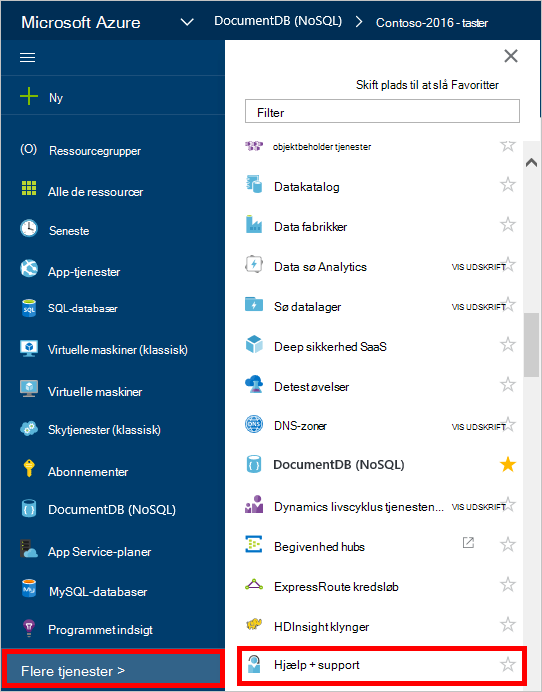
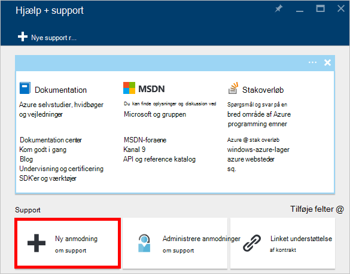
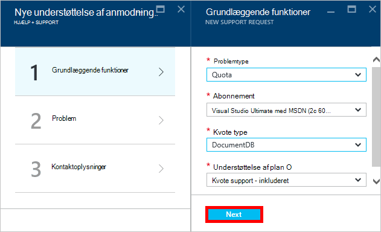
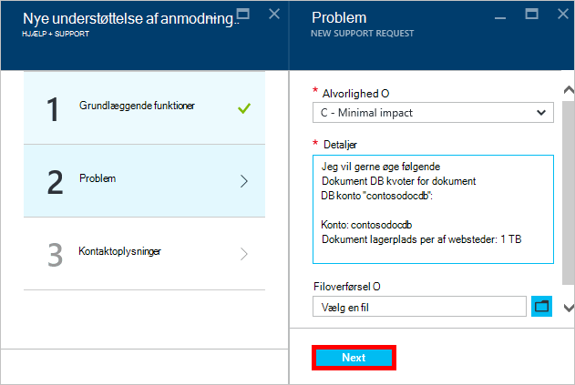
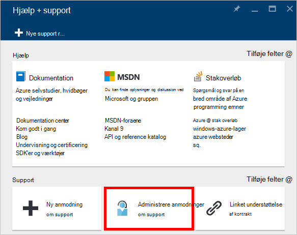

<properties
    pageTitle="Anmodning om øget DocumentDB konto kvoter | Microsoft Azure"
    description="Lær, hvordan du anmoder om en justering af DocumentDB databasen kvoter som lagring af dokumenter og overførselshastighed per af websteder."
    services="documentdb"
    authors="AndrewHoh"
    manager="jhubbard"
    editor="monicar"
    documentationCenter=""/>

<tags
    ms.service="documentdb"
    ms.workload="data-services"
    ms.tgt_pltfrm="na"
    ms.devlang="na"
    ms.topic="article"
    ms.date="08/25/2016"
    ms.author="anhoh"/>

# Anmode om begrænsninger for øget DocumentDB-konto

[Microsoft Azure DocumentDB](https://azure.microsoft.com/services/documentdb/) har et sæt af standard kvoter, der kan tilpasses ved at kontakte Azure support.  I denne artikel viser, hvordan du anmoder om en kvote stigning.

Når du har læst i denne artikel, vil du kunne besvare spørgsmål, der er følgende:  

-   Hvor DocumentDB database kvotaer kan tilpasses ved at kontakte Azure support?
-   Hvordan kan jeg anmode om en DocumentDB konto kvote justering?

##DocumentDB konto kvoter

I følgende tabel beskrives DocumentDB kvoter. Kvoter, der har en stjerne (*) kan tilpasses ved at kontakte Azure support:

[AZURE.INCLUDE [azure-documentdb-limits](../../includes/azure-documentdb-limits.md)]

##Anmode om en kvote justering
Følgende trin viser, hvordan du anmoder om en kvote justering.

1. Klik på **Flere tjenester**i [Azure-portalen](https://portal.azure.com), og klik derefter på **Hjælp + support**.

    

2. Klik på **Ny understøtter anmodning**i bladet **Hjælp + support** .

    

3. Klik på **grundlæggende funktioner**i bladet **Ny understøtter anmodning** . Næste, skal du angive **problemtype** **kvote**, **abonnement** til dit abonnement, der er vært din DocumentDB kontoindstillinger, **kvote type** til **DocumentDB**og **plan for Support** til **Kvote SUPPORT - inkluderet**. Klik derefter på **Næste**.

    

4. Vælg en alvorlighed i bladet **problemet** og indeholder oplysninger om din kvote stigning i **Detaljer**. Klik på **Næste**.

    

5. Til sidst skal udfylde dine kontaktoplysninger i bladet **kontaktoplysninger** , og klik på **Opret**.

Når supportbilletter er blevet oprettet, skal du modtage support anmodning tal via mail.  Du kan også få vist anmodning om support ved at klikke på **Administrer support, som** bladet **Hjælp + support** .

##Næste trin
- Hvis du vil vide mere om DocumentDB, skal du klikke på [her](http://azure.com/docdb).
