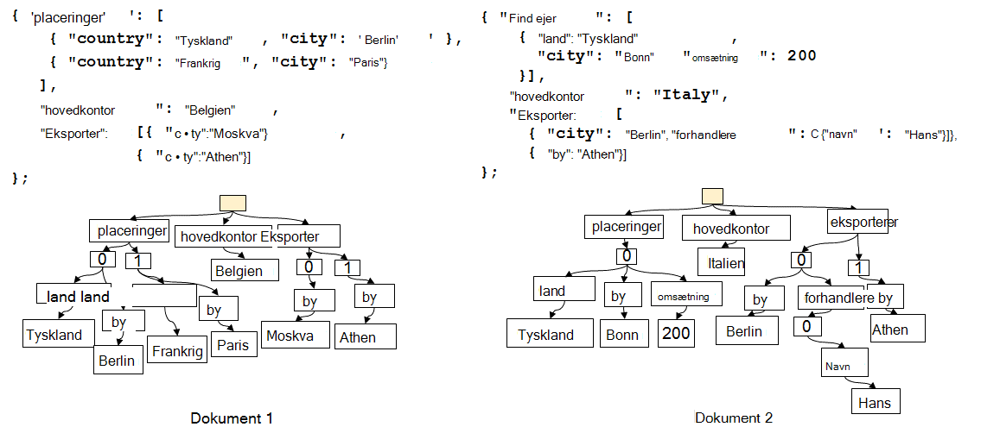
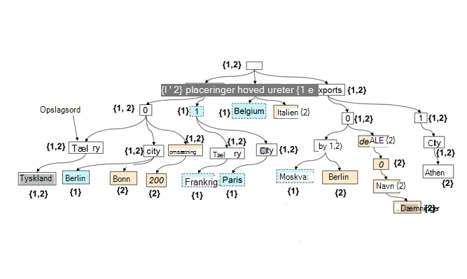

<properties 
    pageTitle="Automatisk indeksering i DocumentDB | Microsoft Azure" 
    description="Få mere at vide om, hvordan automatisk indeksering fungerer i Azure DocumentDB." 
    services="documentdb" 
    authors="arramac" 
    manager="jhubbard" 
    editor="mimig" 
    documentationCenter=""/>

<tags 
    ms.service="documentdb" 
    ms.workload="data-services" 
    ms.tgt_pltfrm="na" 
    ms.devlang="na" 
    ms.topic="article" 
    ms.date="10/27/2016" 
    ms.author="arramac"/>
    
# Automatisk indeksering i Azure DocumentDB

I denne artikel er et uddrag fra ["skema Agnostic indeksering med Azure DocumentDB"](http://www.vldb.org/pvldb/vol8/p1668-shukla.pdf) papir, som der præsenteres på [41st interne konference om meget store databaser](http://www.vldb.org/2015/) mellem den 31-4 September 2015 og er en introduktion til hvordan indeksering fungerer i Azure DocumentDB. 

Når du har læst, kan du besvare følgende spørgsmål:

- Hvordan DocumentDB udlede skemaet fra et JSON-dokument?
- Hvordan DocumentDB opbygge et indeks på tværs af forskellige dokumenter?
- Hvordan udfører DocumentDB automatisk indeksering skaleres?

##Sådan fungerer DocumentDB indeksering

[Microsoft Azure DocumentDB](https://azure.microsoft.com/services/documentdb/) er sand skema ledig database formålet bygget til JSON. Den ikke forventer eller kræver et skema eller sekundære indeks definitioner indeksere data skaleres til brug. Dette kan du hurtigt definere og forbedrer programmet datamodeller ved hjælp af DocumentDB. Når du tilføjer dokumenter i en samling, indekserer DocumentDB automatisk alle dokumentegenskaber, så de er tilgængelige for dig til forespørgsel. Automatisk indeksering gør det muligt at gemme dokumenter, der hører til helt vilkårlig skemaer uden at bekymre dig om skemaer eller sekundære indeks.

Med et mål for at eliminere impedans uoverensstemmelsen mellem databasen og de application programming modeller, udnytter DocumentDB brugervenlighed JSON og en skema specifikation manglende. Det gør ingen antagelser om dokumenterne, og gør det dokumenter i en DocumentDB samling til varierer i skemaet, ud over de forekomst specifikke værdier. I modsætning til andre dokument databaser fungerer Documentdbs databaseprogram direkte på niveauet i JSON grammatik resterende uafhængig som repræsenterer et dokumentskema og sløring i rammen mellem værdierne struktur og forekomst af dokumenter. Denne, i-slå, kan det til automatisk indeks dokumenter uden skema eller sekundære indeks.

Indeksering i DocumentDB udnytter fakultet, JSON grammatik tillader, at dokumenter skal **repræsenteres som træer**. En dummy rodnode skal oprettes som parents resten af de faktiske noder i dokumentet under et JSON-dokument skal repræsenteres som en træstruktur. Hver etiket, herunder matrix indeks i et JSON dokument bliver en node i træet. Figuren nedenfor illustrerer et eksempel JSON-dokument og dens tilsvarende træet repræsentation.

>[AZURE.NOTE] Da JSON er selv der beskriver det vil sige hvert dokument omfatter både skema (metadata) og data, f.eks. `{"locationId": 5, "city": "Moscow"}` viser, at der er to egenskaber `locationId` og `city`, og at de har en numeriske værdier og strengværdier egenskab. DocumentDB er i stand til at skemaet for dokumenter og indeksere dem, når de er indsat eller erstattet, uden at du være nødt til at definere skemaer eller sekundære indeks.

**JSON dokumenter som træer:**

For eksempel i eksemplet ovenfor:

- Egenskaben JSON `{"headquarters": "Belgium"}` egenskab i eksemplet ovenfor svarer til stien, headquarters/Belgien.
- Matrixen JSON `{"exports": [{"city": “Moscow"}`, `{"city": Athens"}]}` svarer til stier `/exports/[]/city/Moscow` og `/exports/[]/city/Athens`.

Med automatisk indeksering (1) hver stien i et dokument træ er indekseret (medmindre udvikleren har eksplicit konfigureret politikken indeksering for at udelade bestemte sti mønstre). (2) hver opdatering af et dokument til en DocumentDB samling fører til opdatering af strukturen i indekset (det vil sige årsager tilføjelse eller fjernelse af knuder). En af de primære krav af automatisk indeksering af dokumenter sikrer, at de omkostninger for at indeksere og forespørgsel et dokument med dybt indlejrede struktur, sig 10 niveauer, er den samme som i en flad JSON dokument bestående af nøgle-værdi-par kun ét niveau deep. Derfor er en standardiseret sti, der repræsenterer grundlaget, som begge automatisk indeksering og forespørgsel delsystemer er indbygget.

En vigtig kombination af behandling af begge skema og en forekomst værdierne ensartet med hensyn til stier er, logisk, ligesom de enkelte dokumenter, et indeks over de to dokumenter, der vises, der holder en tilknytning mellem stier, og de dokument-id'er, der indeholder sti kan også repræsenteres som en træstruktur. DocumentDB bruger denne oplysning til at opbygge et indeks træ som er opbygget af forening af alle de træer, der repræsenterer enkelte dokumenter i gruppen af websteder. Træet indeks i DocumentDB samlinger vokser over tid, som nye dokumenter få tilføjet eller opdateret til samlingen.

**DocumentDB indeks som en træstruktur:**

Selvom det er fri for skema, Documentdb's SQL og JavaScript forespørge sprog giver relationelle prognoser og filtre, hierarkisk navigation på tværs af dokumenter, geografiske handlinger og aktivering af brugerdefinerede funktioner, der er skrevet helt på JavaScript. Den DocumentDB forespørgsel runtime er i stand til at understøtte disse forespørgsler, da den kan bruges direkte mod denne indeks træet repræsentation af dataene.

Den standardpolitik for indeksering automatisk indekserer alle egenskaber for alle dokumenter og giver ensartet forespørgsler (hvilket betyder indekset opdateres synkront med dokument skriveadgang). Hvordan understøtter DocumentDB ensartet opdateringer til træet indeks skaleres? DocumentDB bruger Skriv optimeret, Lås gratis, og log strukturerede indeks vedligeholdelse teknikker. Det betyder, at DocumentDB kan understøtte en vedvarende mængde hurtigt skriver mens du stadig fungerer ensartet forespørgsler. 

Documentdbs indeksering er udviklet til opbevaring effektivitet og til at håndtere flere arkitekturer. For omkostningseffektivitet er på disken lagerplads spild af indekset nedre og mere forudsigelige. Indeks opdateringer udføres også inden for budgettet systemressourcer fordelt DocumentDB af websteder.

##Næste trin
- Hent ["skema Agnostic indeksering med Azure DocumentDB"](http://www.vldb.org/pvldb/vol8/p1668-shukla.pdf)til præsenteres på 41st interne konferencen på meget store databaser, den 31 - September 4 2015.
- [Forespørgsel med DocumentDB SQL](documentdb-sql-query.md)
- Få mere at vide om, hvordan du tilpasser DocumentDB indekset [her](documentdb-indexing-policies.md)
 
