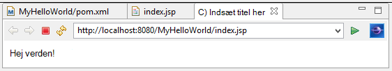

<properties
    pageTitle="Java programmet udvikling selvstudium ved hjælp af DocumentDB | Microsoft Azure"
    description="Selvstudiet Java web application viser, hvordan du bruger tjenesten Azure DocumentDB til at gemme og få adgang til data fra en Java-program, der er hostet på Azure websteder."
    keywords="Udvikling af programmer, database selvstudium, java-program, java web application selvstudium, documentdb, azure, Microsoft azure"
    services="documentdb"
    documentationCenter="java"
    authors="dennyglee"
    manager="jhubbard"
    editor="mimig"/>

<tags
    ms.service="documentdb"
    ms.devlang="java"
    ms.topic="hero-article"
    ms.tgt_pltfrm="NA"
    ms.workload="data-services"
    ms.date="08/24/2016"
    ms.author="denlee"/>

# Oprette en Java-webprogrammet, ved hjælp af DocumentDB

> [AZURE.SELECTOR]
- [.NET](documentdb-dotnet-application.md)
- [Node.js](documentdb-nodejs-application.md)
- [Java](documentdb-java-application.md)
- [Python](documentdb-python-application.md)

Selvstudiet Java web application viser, hvordan du bruger tjenesten [Microsoft Azure DocumentDB](https://portal.azure.com/#gallery/Microsoft.DocumentDB) til at gemme og få adgang til data fra en Java-program, der er hostet på Azure websteder. I dette emne, skal du se:

- Sådan oprettes et grundlæggende JSP program i Eklipse.
- Sådan arbejder du med Azure DocumentDB-tjenesten ved hjælp af [DocumentDB Java SDK](https://github.com/Azure/azure-documentdb-java).

Selvstudiet Java programmet viser, hvordan du opretter en webbaseret opgave-management-program, der gør det muligt at oprette, hente og markere opgaver som fuldført, som vist på følgende billede. Alle opgaver på listen opgaveliste er gemt som JSON dokumenter i Azure DocumentDB.

> [AZURE.TIP] Dette program udvikling selvstudium antages det, at du har tidligere oplevelse ved hjælp af Java. Hvis du er ny bruger af Java eller de [nødvendige værktøjer](#Prerequisites), anbefaler vi hente komplette [Opgaveliste](https://github.com/Azure-Samples/documentdb-java-todo-app) projektet fra GitHub og opbygning af den ved hjælp [af vejledningen i slutningen af denne artikel](#GetProject). Når du har oprettet, kan du gennemgå artiklen for at få indsigt for koden i forbindelse med projektet.  

##Forudsætninger for selvstudiet Java web-program
Inden du starter selvstudiet programmet udvikling, skal du have følgende:

- En active Azure-konto. Hvis du ikke har en konto, kan du oprette en gratis prøveversion konto på blot et par minutter. Yderligere oplysninger finder du [Azure gratis prøveversion](https://azure.microsoft.com/pricing/free-trial/).
- [Java Development Kit (JDK 7 +)](http://www.oracle.com/technetwork/java/javase/downloads/index.html).
- [Eklipse IDE for Java EE udviklere.](http://www.eclipse.org/downloads/packages/eclipse-ide-java-ee-developers/lunasr1)
- [Et Azure-websted med en Java runtime-miljø (fx Tomcat eller Jetty) aktiveret.](../app-service-web/web-sites-java-get-started.md)

Hvis du installerer disse værktøjer for første gang, coreservlets.com indeholder en gennemgang af installationsprocessen i afsnittet Hurtig Start i deres [Selvstudium: installere TomCat7 og bruge det med Eklipse](http://www.coreservlets.com/Apache-Tomcat-Tutorial/tomcat-7-with-eclipse.html) artikel.

##Trin 1: Oprette en DocumentDB database-konto

Lad os starte med at oprette en DocumentDB-konto. Hvis du allerede har en konto, kan du gå til [trin 2: oprette programmet Java JSP](#CreateJSP).

[AZURE.INCLUDE [documentdb-create-dbaccount](../../includes/documentdb-create-dbaccount.md)]

[AZURE.INCLUDE [documentdb-keys](../../includes/documentdb-keys.md)]

##Trin 2: Oprette Java JSP programmet

Sådan oprettes JSP programmet:

1. Først skal begynder vi ved at oprette et Java-projekt. Start Eklipse, og derefter klikke på **filer**, klik på **Ny**, og klik derefter på **Dynamiske webprojekt**. Hvis du ikke kan se **Dynamisk webprojekt** er angivet som en tilgængelig project skal du gøre følgende: Klik på **filer**, klik på **Ny**, klik på **projekt**..., udvide **Web**, klik på **Dynamisk webprojekt**og klikke på **Næste**.

    

2. Angiv et projektnavn, i feltet **Projektnavn** og i rullemenuen **Target Runtime** , du kan også vælge en værdi (fx Apache Tomcat v7.0), og klik derefter på **Udfør**. Valg af en destination runtime gør det muligt at køre projektet lokalt via Eklipse.
3. Udvid projektet i visningen Projektstifinder Eklipse. Højreklik på **WebContent**, klik på **Ny**, og klik derefter på **JSP fil**.
4. Navngiv filen **index.jsp**i dialogboksen **Ny JSP-fil** . Behold den overordnede mappe som **WebContent**, som vist i nedenstående illustration, og klik derefter på **Næste**.

    

5. Vælg **Ny JSP fil (html)**med henblik på dette selvstudium i dialogboksen **Vælg JSP skabelon** , og klik derefter på **Udfør**.

6. Tilføj tekst skal vises, når filen index.jsp åbner i Eklipse **Hej verden!** inden for den nuværende <body> element. Din opdaterede <body> indhold skal ligne følgende kode:

        <body>
            <% out.println("Hello World!"); %>
        </body>

8. Gem filen index.jsp.
9. Hvis du angiver en destination runtime i trin 2, kan du klikke på **projekt** og derefter **køre** for at køre programmet JSP lokalt:

    

##Trin 3: Installere DocumentDB Java SDK ##

Den nemmeste måde at trække i DocumentDB Java SDK og dets afhængigheder er gennem [Apache Maven](http://maven.apache.org/).

For at gøre dette, skal du konvertere dit projekt til et maven projekt ved at udføre følgende trin:

1. Højreklik på dit projekt i Projektstifinder, klik på **Konfigurer**, klik på **Konverter til Maven projekt**.
2. Accepter standardindstillingerne, og klik på **Udfør**i vinduet **Opret ny POM** .
3. Åbn filen pom.xml i **Projektstifinder**.
4. Klik på **Tilføj**under fanen **afhængigheder** i ruden **afhængigheder** .
4. I vinduet **Vælg afhængighed** skal du gøre følgende:
 - Angiv com.microsoft.azure i feltet **gruppe-id** .
 - Angiv azure-documentdb i feltet **Genstand** .
 - Angiv 1.5.1 i boksen **Version** .

    

    Eller føje afhængigheden XML for gruppe-id og ArtifactId direkte til pom.xml via et tekstredigeringsprogram:

        <dependency>
            <groupId>com.microsoft.azure</groupId>
            <artifactId>azure-documentdb</artifactId>
            <version>1.5.1</version>
        </dependency>

5. Klik på **Ok** og Maven installeres DocumentDB Java SDK.
6. Gem filen pom.xml.

##Trin 4: Ved hjælp af tjenesten DocumentDB i et Java-program

1. Først skal Lad os definere objektet TodoItem:

        @Data
        @Builder
        public class TodoItem {
            private String category;
            private boolean complete;
            private String id;
            private String name;
        }

    I dette projekt bruger vi [Project Lombok](http://projectlombok.org/) til at generere parametre, getters, setters og en generator. Du kan også skrive denne kode manuelt eller har IDE generere den.

2. Hvis du vil starte tjenesten DocumentDB, skal du oprette en ny **DocumentClient**. Generelt, er det bedst at genbruge **DocumentClient** - i stedet for at oprette en ny klient til hver efterfølgende anmodning. Vi kan genbruge klienten ved ombrydning af klienten på computeren i en **DocumentClientFactory**. Dette er også sted, hvor du vil indsætte værdien URI og PRIMÆRNØGLE, du har gemt i din Udklipsholder i [trin 1](#CreateDB). Erstatte [din\_SLUTPUNKT\_her] med dit URI og Erstat [din\_nøgle\_her] med den PRIMÆRNØGLE.

        private static final String HOST = "[YOUR_ENDPOINT_HERE]";
        private static final String MASTER_KEY = "[YOUR_KEY_HERE]";

        private static DocumentClient documentClient;

        public static DocumentClient getDocumentClient() {
            if (documentClient == null) {
                documentClient = new DocumentClient(HOST, MASTER_KEY,
                        ConnectionPolicy.GetDefault(), ConsistencyLevel.Session);
            }

            return documentClient;
        }

3. Nu Lad os oprette en Data Access Object (DAO) for at abstrakt vedvarer vores opgaveliste elementer, der skal DocumentDB.

    For at gemme opgaveliste elementer på en samling, klienten skal vide, hvilke database og samling bevares til (som der refereres til af links selv). Generelt er det bedst at cache database og af websteder, når det er muligt at undgå ekstra forbindelse til databasen.

    Følgende kode viser, hvordan at hente vores database og af websteder, hvis den findes, eller Opret en ny, hvis den ikke findes:

        public class DocDbDao implements TodoDao {
            // The name of our database.
            private static final String DATABASE_ID = "TodoDB";

            // The name of our collection.
            private static final String COLLECTION_ID = "TodoCollection";

            // The DocumentDB Client
            private static DocumentClient documentClient = DocumentClientFactory
                    .getDocumentClient();

            // Cache for the database object, so we don't have to query for it to
            // retrieve self links.
            private static Database databaseCache;

            // Cache for the collection object, so we don't have to query for it to
            // retrieve self links.
            private static DocumentCollection collectionCache;

            private Database getTodoDatabase() {
                if (databaseCache == null) {
                    // Get the database if it exists
                    List<Database> databaseList = documentClient
                            .queryDatabases(
                                    "SELECT * FROM root r WHERE r.id='" + DATABASE_ID
                                            + "'", null).getQueryIterable().toList();

                    if (databaseList.size() > 0) {
                        // Cache the database object so we won't have to query for it
                        // later to retrieve the selfLink.
                        databaseCache = databaseList.get(0);
                    } else {
                        // Create the database if it doesn't exist.
                        try {
                            Database databaseDefinition = new Database();
                            databaseDefinition.setId(DATABASE_ID);

                            databaseCache = documentClient.createDatabase(
                                    databaseDefinition, null).getResource();
                        } catch (DocumentClientException e) {
                            // TODO: Something has gone terribly wrong - the app wasn't
                            // able to query or create the collection.
                            // Verify your connection, endpoint, and key.
                            e.printStackTrace();
                        }
                    }
                }

                return databaseCache;
            }

            private DocumentCollection getTodoCollection() {
                if (collectionCache == null) {
                    // Get the collection if it exists.
                    List<DocumentCollection> collectionList = documentClient
                            .queryCollections(
                                    getTodoDatabase().getSelfLink(),
                                    "SELECT * FROM root r WHERE r.id='" + COLLECTION_ID
                                            + "'", null).getQueryIterable().toList();

                    if (collectionList.size() > 0) {
                        // Cache the collection object so we won't have to query for it
                        // later to retrieve the selfLink.
                        collectionCache = collectionList.get(0);
                    } else {
                        // Create the collection if it doesn't exist.
                        try {
                            DocumentCollection collectionDefinition = new DocumentCollection();
                            collectionDefinition.setId(COLLECTION_ID);

                            collectionCache = documentClient.createCollection(
                                    getTodoDatabase().getSelfLink(),
                                    collectionDefinition, null).getResource();
                        } catch (DocumentClientException e) {
                            // TODO: Something has gone terribly wrong - the app wasn't
                            // able to query or create the collection.
                            // Verify your connection, endpoint, and key.
                            e.printStackTrace();
                        }
                    }
                }

                return collectionCache;
            }
        }

4. Næste trin er at skrive kode kan du bevare TodoItems i til samlingen. I dette eksempel bruger vi [Gson](https://code.google.com/p/google-gson/) sekventielt og deaktivere sekventielt på Java-objekter i TodoItem almindelig gamle (POJOs) til JSON dokumenter. [Jackson](http://jackson.codehaus.org/) eller din egen brugerdefinerede serialiseringsfunktion er også godt alternativer til serialisering POJOs.

        // We'll use Gson for POJO <=> JSON serialization for this example.
        private static Gson gson = new Gson();

        @Override
        public TodoItem createTodoItem(TodoItem todoItem) {
            // Serialize the TodoItem as a JSON Document.
            Document todoItemDocument = new Document(gson.toJson(todoItem));

            // Annotate the document as a TodoItem for retrieval (so that we can
            // store multiple entity types in the collection).
            todoItemDocument.set("entityType", "todoItem");

            try {
                // Persist the document using the DocumentClient.
                todoItemDocument = documentClient.createDocument(
                        getTodoCollection().getSelfLink(), todoItemDocument, null,
                        false).getResource();
            } catch (DocumentClientException e) {
                e.printStackTrace();
                return null;
            }

            return gson.fromJson(todoItemDocument.toString(), TodoItem.class);
        }

5. Som DocumentDB databaser og samlinger, dokumenterne også refererer til ved selv links. Funktionen følgende hjælper kan os med at hente dokumenter med en anden attributten (fx "id") i stedet for at sammenkæde præsentation:

        private Document getDocumentById(String id) {
            // Retrieve the document using the DocumentClient.
            List<Document> documentList = documentClient
                    .queryDocuments(getTodoCollection().getSelfLink(),
                            "SELECT * FROM root r WHERE r.id='" + id + "'", null)
                    .getQueryIterable().toList();

            if (documentList.size() > 0) {
                return documentList.get(0);
            } else {
                return null;
            }
        }

6. Vi kan bruge metoden hjælper i trin 5 til at hente et TodoItem JSON dokument efter id og deserialisere den til en POJO:

        @Override
        public TodoItem readTodoItem(String id) {
            // Retrieve the document by id using our helper method.
            Document todoItemDocument = getDocumentById(id);

            if (todoItemDocument != null) {
                // De-serialize the document in to a TodoItem.
                return gson.fromJson(todoItemDocument.toString(), TodoItem.class);
            } else {
                return null;
            }
        }

7. Vi kan også bruge DocumentClient til at få en samling eller liste over TodoItems ved hjælp af DocumentDB SQL:

        @Override
        public List<TodoItem> readTodoItems() {
            List<TodoItem> todoItems = new ArrayList<TodoItem>();

            // Retrieve the TodoItem documents
            List<Document> documentList = documentClient
                    .queryDocuments(getTodoCollection().getSelfLink(),
                            "SELECT * FROM root r WHERE r.entityType = 'todoItem'",
                            null).getQueryIterable().toList();

            // De-serialize the documents in to TodoItems.
            for (Document todoItemDocument : documentList) {
                todoItems.add(gson.fromJson(todoItemDocument.toString(),
                        TodoItem.class));
            }

            return todoItems;
        }

8. Der findes mange måder at opdatere et dokument med DocumentClient. I vores opgaveliste listen program vil vi ikke kunne skifte om en TodoItem er fuldført. Dette kan opnås ved at opdatere attributten "udført" i dokumentet:

        @Override
        public TodoItem updateTodoItem(String id, boolean isComplete) {
            // Retrieve the document from the database
            Document todoItemDocument = getDocumentById(id);

            // You can update the document as a JSON document directly.
            // For more complex operations - you could de-serialize the document in
            // to a POJO, update the POJO, and then re-serialize the POJO back in to
            // a document.
            todoItemDocument.set("complete", isComplete);

            try {
                // Persist/replace the updated document.
                todoItemDocument = documentClient.replaceDocument(todoItemDocument,
                        null).getResource();
            } catch (DocumentClientException e) {
                e.printStackTrace();
                return null;
            }

            return gson.fromJson(todoItemDocument.toString(), TodoItem.class);
        }

9. Til sidst skal vil vi muligheden for at slette en TodoItem fra vores liste. For at gøre dette, kan vi bruge metoden hjælper vi skrevet tidligere til at hente selv link og derefter angive klienten til at slette den:

        @Override
        public boolean deleteTodoItem(String id) {
            // DocumentDB refers to documents by self link rather than id.

            // Query for the document to retrieve the self link.
            Document todoItemDocument = getDocumentById(id);

            try {
                // Delete the document by self link.
                documentClient.deleteDocument(todoItemDocument.getSelfLink(), null);
            } catch (DocumentClientException e) {
                e.printStackTrace();
                return false;
            }

            return true;
        }

##Trin 5: Kabelføring resten af den af Java programmet udviklingsprojekt sammen

Nu hvor vi har afsluttet sjov bit - alle, der venstre er at opbygge en hurtig bruger brugergrænsefladen og ledningsomrids op til vores DAO.

1. Først skal Lad os starte med at opbygge en controller for at ringe vores DAO:

        public class TodoItemController {
            public static TodoItemController getInstance() {
                if (todoItemController == null) {
                    todoItemController = new TodoItemController(TodoDaoFactory.getDao());
                }
                return todoItemController;
            }

            private static TodoItemController todoItemController;

            private final TodoDao todoDao;

            TodoItemController(TodoDao todoDao) {
                this.todoDao = todoDao;
            }

            public TodoItem createTodoItem(@NonNull String name,
                    @NonNull String category, boolean isComplete) {
                TodoItem todoItem = TodoItem.builder().name(name).category(category)
                        .complete(isComplete).build();
                return todoDao.createTodoItem(todoItem);
            }

            public boolean deleteTodoItem(@NonNull String id) {
                return todoDao.deleteTodoItem(id);
            }

            public TodoItem getTodoItemById(@NonNull String id) {
                return todoDao.readTodoItem(id);
            }

            public List<TodoItem> getTodoItems() {
                return todoDao.readTodoItems();
            }

            public TodoItem updateTodoItem(@NonNull String id, boolean isComplete) {
                return todoDao.updateTodoItem(id, isComplete);
            }
        }

    I et mere komplekse til computeren, kan controlleren huse komplicerede forretningslogik oven på DAO.

2. Dernæst skal oprette vi en servlet til distribuere HTTP-anmodninger til domænecontrolleren:

        public class TodoServlet extends HttpServlet {
            // API Keys
            public static final String API_METHOD = "method";

            // API Methods
            public static final String CREATE_TODO_ITEM = "createTodoItem";
            public static final String GET_TODO_ITEMS = "getTodoItems";
            public static final String UPDATE_TODO_ITEM = "updateTodoItem";

            // API Parameters
            public static final String TODO_ITEM_ID = "todoItemId";
            public static final String TODO_ITEM_NAME = "todoItemName";
            public static final String TODO_ITEM_CATEGORY = "todoItemCategory";
            public static final String TODO_ITEM_COMPLETE = "todoItemComplete";

            public static final String MESSAGE_ERROR_INVALID_METHOD = "{'error': 'Invalid method'}";

            private static final long serialVersionUID = 1L;
            private static final Gson gson = new Gson();

            @Override
            protected void doGet(HttpServletRequest request,
                    HttpServletResponse response) throws ServletException, IOException {

                String apiResponse = MESSAGE_ERROR_INVALID_METHOD;

                TodoItemController todoItemController = TodoItemController
                        .getInstance();

                String id = request.getParameter(TODO_ITEM_ID);
                String name = request.getParameter(TODO_ITEM_NAME);
                String category = request.getParameter(TODO_ITEM_CATEGORY);
                boolean isComplete = StringUtils.equalsIgnoreCase("true",
                        request.getParameter(TODO_ITEM_COMPLETE)) ? true : false;

                switch (request.getParameter(API_METHOD)) {
                case CREATE_TODO_ITEM:
                    apiResponse = gson.toJson(todoItemController.createTodoItem(name,
                            category, isComplete));
                    break;
                case GET_TODO_ITEMS:
                    apiResponse = gson.toJson(todoItemController.getTodoItems());
                    break;
                case UPDATE_TODO_ITEM:
                    apiResponse = gson.toJson(todoItemController.updateTodoItem(id,
                            isComplete));
                    break;
                default:
                    break;
                }

                response.getWriter().println(apiResponse);
            }

            @Override
            protected void doPost(HttpServletRequest request,
                    HttpServletResponse response) throws ServletException, IOException {
                doGet(request, response);
            }
        }

3. Vi skal bruge en Web brugergrænseflade vises for brugeren. Lad os igen skrive index.jsp vi oprettede tidligere:

        <html>
        <head>
          <meta http-equiv="Content-Type" content="text/html; charset=ISO-8859-1">
          <meta http-equiv="X-UA-Compatible" content="IE=edge;" />
          <title>Azure DocumentDB Java Sample</title>

          <!-- Bootstrap -->
          <link href="//ajax.aspnetcdn.com/ajax/bootstrap/3.2.0/css/bootstrap.min.css" rel="stylesheet">

          
        </head>
        <body>
          <!-- Nav Bar -->
          

            

              

                <a class="navbar-brand" href="#">My Tasks</a>
              

            

          

          <!-- Body -->
          

            <h1>My ToDo List</h1>

            

            <!-- The ToDo List -->
            

              <table class="table table-bordered table-striped" id="todoItems">
                <thead>
                  <tr>
                    <th>Name</th>
                    <th>Category</th>
                    <th>Complete</th>
                  </tr>
                </thead>
                <tbody>
                </tbody>
              </table>

              <!-- Update Button -->
              

                <form class="form-horizontal" role="form">
                  <button type="button" class="btn btn-primary">Update Tasks</button>
                </form>
              

            

            

            <!-- Item Input Form -->
            

              <form class="form-horizontal" role="form">
                

                  <label for="inputItemName" class="col-sm-2">Task Name</label>
                  

                    <input type="text" class="form-control" id="inputItemName" placeholder="Enter name">
                  

                

                

                  <label for="inputItemCategory" class="col-sm-2">Task Category</label>
                  

                    <input type="text" class="form-control" id="inputItemCategory" placeholder="Enter category">
                  

                

                <button type="button" class="btn btn-primary">Add Task</button>
              </form>
            

          

          <!-- Placed at the end of the document so the pages load faster -->
          
          
          
        </body>
        </html>

4. Og til sidst skal skrive nogle klientsiden Javascript for at knytter i web-brugergrænsefladen og servlet sammen:

        var todoApp = {
          /*
           * API methods to call Java backend.
           */
          apiEndpoint: "api",

          createTodoItem: function(name, category, isComplete) {
            $.post(todoApp.apiEndpoint, {
                "method": "createTodoItem",
                "todoItemName": name,
                "todoItemCategory": category,
                "todoItemComplete": isComplete
              },
              function(data) {
                var todoItem = data;
                todoApp.addTodoItemToTable(todoItem.id, todoItem.name, todoItem.category, todoItem.complete);
              },
              "json");
          },

          getTodoItems: function() {
            $.post(todoApp.apiEndpoint, {
                "method": "getTodoItems"
              },
              function(data) {
                var todoItemArr = data;
                $.each(todoItemArr, function(index, value) {
                  todoApp.addTodoItemToTable(value.id, value.name, value.category, value.complete);
                });
              },
              "json");
          },

          updateTodoItem: function(id, isComplete) {
            $.post(todoApp.apiEndpoint, {
                "method": "updateTodoItem",
                "todoItemId": id,
                "todoItemComplete": isComplete
              },
              function(data) {},
              "json");
          },

          /*
           * UI Methods
           */
          addTodoItemToTable: function(id, name, category, isComplete) {
            var rowColor = isComplete ? "active" : "warning";

            todoApp.ui_table().append($("<tr>")
              .append($("<td>").text(name))
              .append($("<td>").text(category))
              .append($("<td>")
                .append($("<input>")
                  .attr("type", "checkbox")
                  .attr("id", id)
                  .attr("checked", isComplete)
                  .attr("class", "isComplete")
                ))
              .addClass(rowColor)
            );
          },

          /*
           * UI Bindings
           */
          bindCreateButton: function() {
            todoApp.ui_createButton().click(function() {
              todoApp.createTodoItem(todoApp.ui_createNameInput().val(), todoApp.ui_createCategoryInput().val(), false);
              todoApp.ui_createNameInput().val("");
              todoApp.ui_createCategoryInput().val("");
            });
          },

          bindUpdateButton: function() {
            todoApp.ui_updateButton().click(function() {
              // Disable button temporarily.
              var myButton = $(this);
              var originalText = myButton.text();
              $(this).text("Updating...");
              $(this).prop("disabled", true);

              // Call api to update todo items.
              $.each(todoApp.ui_updateId(), function(index, value) {
                todoApp.updateTodoItem(value.name, value.value);
                $(value).remove();
              });

              // Re-enable button.
              setTimeout(function() {
                myButton.prop("disabled", false);
                myButton.text(originalText);
              }, 500);
            });
          },

          bindUpdateCheckboxes: function() {
            todoApp.ui_table().on("click", ".isComplete", function(event) {
              var checkboxElement = $(event.currentTarget);
              var rowElement = $(event.currentTarget).parents('tr');
              var id = checkboxElement.attr('id');
              var isComplete = checkboxElement.is(':checked');

              // Toggle table row color
              if (isComplete) {
                rowElement.addClass("active");
                rowElement.removeClass("warning");
              } else {
                rowElement.removeClass("active");
                rowElement.addClass("warning");
              }

              // Update hidden inputs for update panel.
              todoApp.ui_updateForm().children("input[name='" + id + "']").remove();

              todoApp.ui_updateForm().append($("<input>")
                .attr("type", "hidden")
                .attr("class", "updateComplete")
                .attr("name", id)
                .attr("value", isComplete));

            });
          },

          /*
           * UI Elements
           */
          ui_createNameInput: function() {
            return $(".todoForm #inputItemName");
          },

          ui_createCategoryInput: function() {
            return $(".todoForm #inputItemCategory");
          },

          ui_createButton: function() {
            return $(".todoForm button");
          },

          ui_table: function() {
            return $(".todoList table tbody");
          },

          ui_updateButton: function() {
            return $(".todoUpdatePanel button");
          },

          ui_updateForm: function() {
            return $(".todoUpdatePanel form");
          },

          ui_updateId: function() {
            return $(".todoUpdatePanel .updateComplete");
          },

          /*
           * Install the TodoApp
           */
          install: function() {
            todoApp.bindCreateButton();
            todoApp.bindUpdateButton();
            todoApp.bindUpdateCheckboxes();

            todoApp.getTodoItems();
          }
        };

        $(document).ready(function() {
          todoApp.install();
        });

5. Formidabelt! Nu er alle, der er tilbage til at afprøve programmet. Kør programmet lokalt, og tilføje nogle opgaveliste elementer ved at udfylde emnenavn og kategori og klikke på **Tilføj opgave**.

6. Når Elementet vises, kan du opdatere om den er fuldført ved aktivering/deaktivering af afkrydsningsfeltet og klikke på **Opdater opgaver**.

##Trin 6: Installere Java programmet til Azure websteder

Azure websteder gør implementering af Java-programmer, der er så enkelt som eksport dit program som en KRIG fil og enten uploade det via versionsstyring (fx CIFFER) eller FTP.

1. Eksportere dit program som en KRIG, skal du højreklikke på dit projekt i **Projektstifinder**, klik på **eksport**, og klik derefter på **KRIG fil**.
2. I vinduet **KRIG eksportere** skal du gøre følgende:
 - Skriv azure-documentdb-java-eksempel i project Web.
 - Vælg en destination til at gemme filen KRIG i feltet Destination.
 - Klik på **Udfør**.

3. Nu hvor du har en KRIG fil i hånden, kan du blot overføre den til webstedet Azure **WebApp** mappe. Flere oplysninger om overførsel af filen, under [tilføje et program på webstedet Java på Azure](../app-service-web/web-sites-java-add-app.md).

    Når filen KRIG er overført til mappen WebApp, registrerer runtime-miljø, du har tilføjet den, og automatisk indlæser den.
4. For at få vist din færdige produkt, gå til http://YOUR\_websted\_NAME.azurewebsites.net/azure-documentdb-java-sample/ og begynde at tilføje dine opgaver!

##Få projektet fra GitHub

Alle eksemplerne i dette selvstudium medtages i [Opgaveliste](https://github.com/Azure-Samples/documentdb-java-todo-app) projektet på GitHub. Sikre, at du har softwaren og de ressourcer, der er angivet i afsnittet [forudsætninger](#Prerequisites) for at importere opgaveliste projektet til Eklipse, og derefter gøre følgende:

1. Installere [Project Lombok](http://projectlombok.org/). Lombok bruges til at generere konstruktører, getters, setters i projektet. Når du har hentet filen lombok.jar, skal du dobbeltklikke på den for at installere den eller installere det fra kommandolinjen.
2. Hvis Eklipse er åben, skal du lukke den og genstarte den for at indlæse Lombok.
3. Klik på **Importér**i Eklipse, i menuen **filer** .
4. I vinduet **Importer** , skal du klikke på **ciffer**, klik på **projekter fra ciffer**og klik derefter på **Næste**.
5. Klik på **Klon URI**på skærmbilledet **Vælg lager kilde** .
6. Angiv https://github.com/Azure-Samples/documentdb-java-todo-app.git på skærmbilledet **Kilde ciffer lager** i feltet **URI** , og klik derefter på **Næste**.
7. På skærmbilledet **Gren markering** sikre, at **overordnet** er markeret, og klik derefter på **Næste**.
8. Klik på **Gennemse** for at vælge en mappe, hvor lageret kan kopieres, og klik derefter på **Næste**på skærmbilledet **Lokale Destination** .
9. Sikre, at **importere eksisterende projekter** er markeret, og klik derefter på **Næste**på skærmbilledet **Vælg en guide til at bruge til at importere projekter** .
10. Fjern markeringen af **DocumentDB** projektet på skærmbilledet **Importer projekter** , og klik derefter på **Udfør**. DocumentDB projektet indeholder DocumentDB Java SDK, som vi vil tilføje som en afhængighed i stedet.
11. Gå til azure-documentdb-java-sample\src\com.microsoft.azure.documentdb.sample.dao\DocumentClientFactory.java i **Projektstifinder**, og Erstat HOST og MASTER_KEY værdier med URI og PRIMÆRNØGLE til kontoen DocumentDB, og Gem derefter filen. Du kan finde flere oplysninger [trin 1. Oprette en DocumentDB database konto](#CreateDB).
12. Højreklik på **azure-documentdb-java-eksempel**i **Projektstifinder**, skal du klikke på **Opret sti**, og klik **Konfigurere opbygge sti**.
13. Vælg fanen **biblioteker** på skærmbilledet **Java opbygge stien** i højre rude, og klik derefter på **Tilføj eksterne JARs**. Gå til placeringen af filen lombok.jar, og klik på **Åbn**, og klik derefter på **OK**.
14. Brug trin 12 til at åbne vinduet **Egenskaber** igen, og klik derefter på **Rettet eksekverbar kode**i venstre rude.
15. Klik på **Ny**på skærmbilledet **Rettet eksekverbar kode** , Vælg **Apache Tomcat v7.0**, og klik derefter på **OK**.
16. Brug trin 12 til at åbne vinduet **Egenskaber** igen, og klik derefter på **Project facetter**i venstre rude.
17. Vælg **Dynamisk webmodul** og **Java**på skærmbilledet **Project facetter** , og klik derefter på **OK**.
18. Højreklik på **Tomcat v7.0 Server på localhost** under fanen **servere** i bunden af skærmen, og klik derefter på **Tilføj og fjern**.
19. Flyt **azure-documentdb-java-eksempel** til feltet **konfigureret** i vinduet **Tilføj og fjern** , og klik derefter på **Udfør**.
20. Højreklik på **Tomcat v7.0 Server på localhost**i fanen **Server** , og klik derefter på **Genstart**.
21. I en browser, gå til http://localhost:8080/azure-documentdb-java-stikprøve / og begynde at føje til din opgaveliste. Bemærk, at hvis du har ændret din standardværdier port ændre 8080 til den værdi, du har valgt.
22. Hvis du vil installere dit projekt til et Azure-websted, skal du se [trin 6. Installere programmet til Azure websteder](#Deploy).

[1]: media/documentdb-java-application/keys.png
