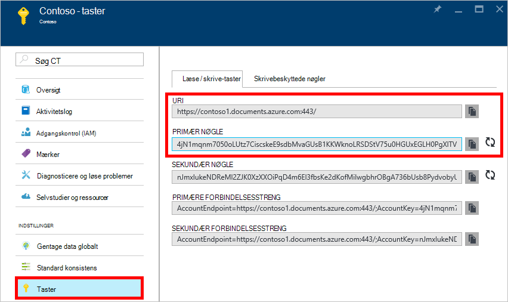
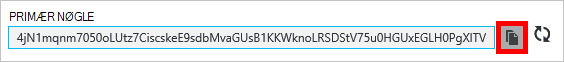
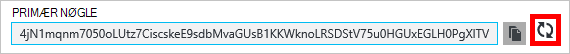
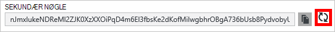
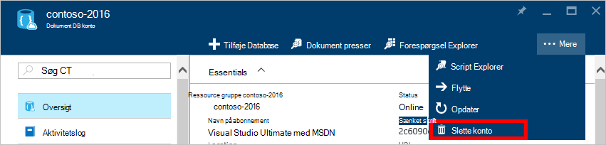
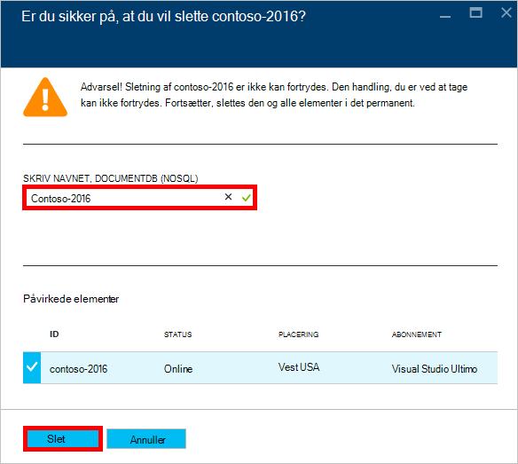

<properties
    pageTitle="Administrere en DocumentDB konto ved hjælp af portalen Azure | Microsoft Azure"
    description="Lær at administrere kontoen DocumentDB via Azure-portalen. Du kan finde en vejledning på portalen Azure til at få vist, kopiere, slette og få adgang til konti."
    keywords="Azure-portalen, documentdb, azure, Microsoft azure"
    services="documentdb"
    documentationCenter=""
    authors="kirillg"
    manager="jhubbard"
    editor="cgronlun"/>

<tags
    ms.service="documentdb"
    ms.workload="data-services"
    ms.tgt_pltfrm="na"
    ms.devlang="na"
    ms.topic="article"
    ms.date="10/14/2016"
    ms.author="kirillg"/>

# Sådan administreres en DocumentDB-konto

Lær at angive globale konsistens, arbejde med nøgler og slette en DocumentDB konto i portalen Azure.

## Administrere indstillinger for DocumentDB konsistens

Vælge det rigtige konsistens niveau, afhænger af semantik af dit program. Du skal lære at kende de tilgængelige konsistens niveauer i DocumentDB ved at læse [Brug af konsistens niveauer til at maksimere tilgængelighed og ydeevne i DocumentDB] [consistency]. DocumentDB indeholder konsistens, tilgængelighed og ydeevne garantier, på alle konsistens niveauer, der er tilgængelig for din database-konto. Konfigurere din database konto med en konsistens niveau af stærke kræver, at dine data er inden for et enkelt Azure område og globalt ikke tilgængelig. På anden side, lavere konsistens niveauer - afgrænset staleness, session eller eventuel Aktivér du knytte en hvilken som helst antal Azure områder til databasekontoen. Følgende enkle trin viser, hvordan du vælge konsistens Standardniveau for din database-konto. 

### Angive standard konsistens en DocumentDB-konto

1. Adgang til kontoen DocumentDB i [Azure-portalen](https://portal.azure.com/).
2. Klik på **standard konsistens**i bladet konto.
3. Vælg ny konsistens niveauet bladet **Standard konsistens** og klik på **Gem**.
    ![Standard konsistens session][5]

## Få vist, kopiere og genoprette access-taster
Når du opretter en DocumentDB-konto, genererer tjenesten to overordnede access-taster, der kan bruges til godkendelse, når kontoen DocumentDB åbnes. Ved at oprette to access-taster, DocumentDB giver dig mulighed at genoprette tasterne uden afbrydelser til kontoen DocumentDB. 

Adgang til bladet **taster** fra menuen ressource på bladet **DocumentDB konto** til at få vist, kopiere og genoprette hurtigtasterne, der bruges til at få adgang til kontoen DocumentDB i [Azure-portalen](https://portal.azure.com/).

> [AZURE.NOTE] Bladet **taster** indeholder også primære og sekundære forbindelsesstrenge, som kan bruges til at oprette forbindelse til din konto fra [Data overførselsværktøjet](documentdb-import-data.md).

Skrivebeskyttede nøgler er også tilgængelige på denne blade. Læser og forespørgsler er skrivebeskyttede handlinger, mens opretter, sletter, ikke og erstatter.

### Kopiere en hurtigtast i portalen Azure

Klik på knappen **Kopiér** til højre for den nøgle, du vil kopiere bladet **taster** .

### Genoprette access-taster

Du skal ændre hurtigtasterne til kontoen DocumentDB med jævne mellemrum for at beskytte dine forbindelser. To access-taster er tildelt til gør det muligt at vedligeholde forbindelser til kontoen DocumentDB ved hjælp af en access-tasten, mens du genoprette andre hurtigtast.

> [AZURE.WARNING] Genoprette dine access-taster påvirker alle programmer, der er afhængige af den aktuelle nøgle. Alle klienter, der bruger tasten access til at få adgang til kontoen DocumentDB skal opdateres, hvis du vil bruge den nye nøgle.

Hvis du har programmer eller ved hjælp af kontoen DocumentDB-skytjenester, mister du forbindelserne Hvis du genoprette taster, medmindre du vender dine nøgler. Følgende trin oprettes en disposition for den proces, der er involveret i rullende dine nøgler.

1. Opdater hurtigtast i din programkode til at referere til den sekundære hurtigtast DocumentDB-konto.
2. Genoprette nøglen primære adgang til kontoen DocumentDB. Adgang til kontoen DocumentDB i [Azure-portalen](https://portal.azure.com/).
3. Klik på **tasterne**i bladet **DocumentDB konto** .
4. Bladet **taster** , klik på knappen Regenerer, og klik derefter på **Ok** for at bekræfte, at du vil oprette en ny nøgle.
    

5. Når du har bekræftet, at den nye nøgle er tilgængelig til brug (cirka 5 minutter efter nøgler), skal du opdatere hurtigtast i din programkode til at referere til den nye primære access-nøgle.
6. Genoprette nøglen sekundær adgang.

    

> [AZURE.NOTE] Det kan tage flere minutter, før en nyligt oprettet nøgle kan bruges til at få adgang til kontoen DocumentDB.

## Få vist forbindelsesstrengen

Hvis du vil hente din forbindelsesstreng, skal du gøre følgende: 

1. Adgang til kontoen DocumentDB i [Azure-portalen](https://portal.azure.com).
2. Klik på **tasterne**i menuen ressource.
3. Klik på knappen **Kopiér** ud for feltet **Primær forbindelsesstreng** eller **Sekundær forbindelsesstreng** . 

Hvis du bruger forbindelsesstrengen i [Overflytningsværktøj til DocumentDB Database](documentdb-import-data.md), du Føj databasenavnet til slutningen af forbindelsesstrengen. `AccountEndpoint=< >;AccountKey=< >;Database=< >`.

## Slette en DocumentDB-konto
Hvis du vil fjerne en DocumentDB konto fra Azure-portalen, som du ikke længere bruger, skal du bruge kommandoen **Slet firma** på bladet **DocumentDB konto** .

1. Få adgang til DocumentDB-kontoen, du vil slette i [Azure-portalen](https://portal.azure.com/).
2. Klik på **mere**på bladet **DocumentDB konto** , og klik derefter på **Slet firma**. Eller Højreklik på navnet på databasen, og klik på **Slet firma**.
3. Skriv firmanavnet DocumentDB for at bekræfte, at du vil slette kontoen på bladet resulterende bekræftelse.
4. Klik på knappen **Slet** .

## Næste trin

Lær, hvordan du [kommer i gang med din DocumentDB-konto](http://go.microsoft.com/fwlink/p/?LinkId=402364).

Hvis du vil vide mere om DocumentDB, i dokumentationen til Azure DocumentDB på [azure.com](http://go.microsoft.com/fwlink/?LinkID=402319&clcid=0x409).

<!--Image references-->
[1]: ./media/documentdb-manage-account/documentdb_add_region-1.png
[2]: ./media/documentdb-manage-account/documentdb_add_region-2.png
[3]: ./media/documentdb-manage-account/documentdb_change_write_region-1.png
[4]: ./media/documentdb-manage-account/documentdb_change_write_region-2.png
[5]: ./media/documentdb-manage-account/documentdb_change_consistency-1.png
[6]: ./media/documentdb-manage-account/chooseandsaveconsistency.png

<!--Reference style links - using these makes the source content way more readable than using inline links-->
[bcdr]: https://azure.microsoft.com/documentation/articles/best-practices-availability-paired-regions/
[consistency]: https://azure.microsoft.com/documentation/articles/documentdb-consistency-levels/
[azureregions]: https://azure.microsoft.com/en-us/regions/#services
[offers]: https://azure.microsoft.com/en-us/pricing/details/documentdb/
