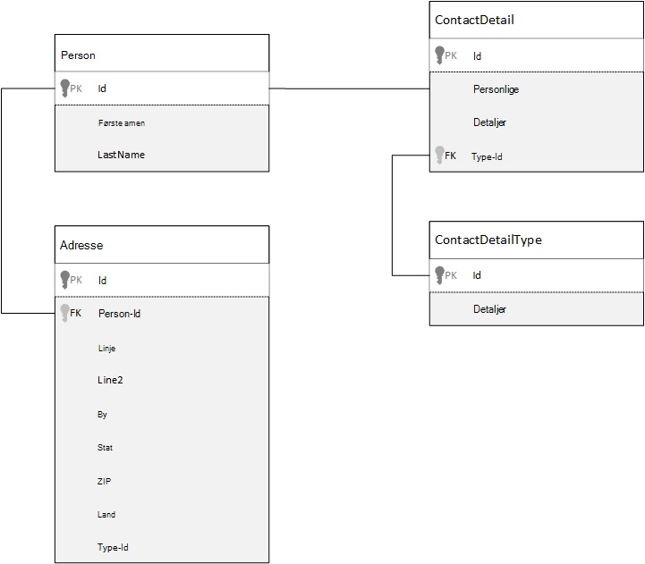
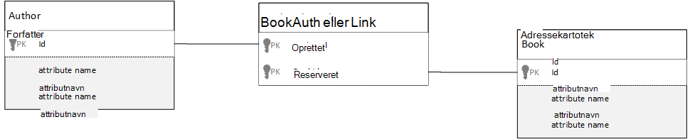

<properties 
    pageTitle="Modeling data i Azure DocumentDB | Microsoft Azure" 
    description="Få mere at vide om modeling data for DocumentDB, en NoSQL dokument database." 
    keywords="modellering data"
    services="documentdb" 
    authors="kiratp" 
    manager="jhubbard" 
    editor="mimig1" 
    documentationCenter=""/>

<tags 
    ms.service="documentdb" 
    ms.workload="data-services" 
    ms.tgt_pltfrm="na" 
    ms.devlang="na" 
    ms.topic="article" 
    ms.date="08/05/2016" 
    ms.author="kipandya"/>

#Modellering data i DocumentDB#
Mens skema ledig databaser, som Azure DocumentDB gør det meget nemmere at få dobbelt ændringer til din datamodel du skal stadig bruger nogle tid tanker om dine data. 

Hvordan dataene skal gemmes? Hvordan er dit program skal til at hente og forespørge data? Er programmet læse fed, eller skriv tunge? 

Når du har læst i denne artikel, vil du kunne besvare spørgsmål, der er følgende:

- Hvordan skal jeg tænke over et dokument i et dokument database?
- Hvad er datamodellering og hvorfor skal jeg sig? 
- Hvordan adskiller modellering data i et dokument-database til en relationel database?
- Hvordan jeg express data relationer i en ikke-relationel database?
- Når Integrer data, og hvornår jeg oprette et link til data?

##Integrering af data##
Når du starter modeling data i et dokumentlager som DocumentDB, kan du prøve at behandle dine-enheder som **selvstændig dokumenter** , der er repræsenteret i JSON.

Før vi kaste dig ud for meget yderligere Lad os tage et par trin tilbage og har nærmere på, hvordan vi kan modellere noget i en relationel database, et emne, der er mange af OS er bekendt med. I følgende eksempel viser, hvordan en person kan være gemt i en relationel database. 

Når du arbejder med relationsdatabaser, har vi blevet gennemgangen baseret for år, der skal standardiseres, normalisere, normalisere.

Normalisere dine dataene typisk omfatter at tage et objekt, som en person og opdele den på dedikeret dele af data. I eksemplet ovenfor, kan en person har flere kontaktpersoner detaljerede poster samt flere adresseposter. Vi selv gå et skridt videre og opdele kontaktoplysninger ved at yderligere udtrække almindelige felter som en type. Samme adresse til hver enkelt post her er en type som *Home* eller *Business* 

Den vejledende premise, når normalisere dataene er at **undgå at gemme overflødige data** for hver post og hellere referere til data. I dette eksempel, hvis du vil læse en person med alle deres kontaktoplysninger og adresser, skal du bruge JOINFORBINDELSER til at samle effektivt dine data på kørselstidspunktet.

    SELECT p.FirstName, p.LastName, a.City, cd.Detail
    FROM Person p
    JOIN ContactDetail cd ON cd.PersonId = p.Id
    JOIN ContactDetailType on cdt ON cdt.Id = cd.TypeId
    JOIN Address a ON a.PersonId = p.Id

Opdatere en enkelt person med deres kontaktoplysninger og adresser kræver skrivning på tværs af mange individuelle tabeller. 

Nu Lad os se nærmere på, hvordan vi vil model de samme data som en selvstændig enhed i en database i dokumentet.
        
    {
        "id": "1",
        "firstName": "Thomas",
        "lastName": "Andersen",
        "addresses": [
            {            
                "line1": "100 Some Street",
                "line2": "Unit 1",
                "city": "Seattle",
                "state": "WA",
                "zip": 98012
            }
        ],
        "contactDetails": [
            {"email: "thomas@andersen.com"},
            {"phone": "+1 555 555-5555", "extension": 5555}
        ] 
    }

Ved hjælp af den ovenstående fremgangsmåde har vi nu **ikke-normaliserede** personen optage hvor vi **integreret** alle de oplysninger, der vedrører til denne person, som deres kontaktoplysninger og adresser i et enkelt JSON-dokument.
Desuden, fordi vi ikke er begrænset til et fast skema har vi mulighed for at gøre ting som har kontaktoplysninger i forskellige figurer helt. 

Hentning af en, der er færdigt personpost fra databasen er nu en enkelt handlingen mod en enkelt samling og til et enkelt dokument Læs. Opdatering af en personpost med deres kontaktoplysninger og adresser er også en enkelt skrivehandling på et enkelt dokument.

Ved denormalizing data, skulle dit program udstede færre forespørgsler og opdateringer til at udføre almindelige handlinger. 

###Hvornår skal man integrere

Brug generelt integrerede data modeller hvornår:

- Der findes **indeholder** relationer mellem objekter.
- Der findes **en-til-få** relationer mellem objekter.
- Der er integreret data, der **sjældent ændres**.
- Der er integreret data ikke vokse **uden grænse**.
- Der er integreret data, der er **integreret** til data i et dokument.

> [AZURE.NOTE] Ikke-normaliserede datamodeller giver typisk bedre **læse** ydeevne.

###Hvornår ikke at integrere

Mens tommelfingerregel i et dokument database er denormalize alt og integrere alle data i et enkelt dokument, kan det medføre nogle situationer, der skal undgås.

Tage denne JSON kodestykke.

    {
        "id": "1",
        "name": "What's new in the coolest Cloud",
        "summary": "A blog post by someone real famous",
        "comments": [
            {"id": 1, "author": "anon", "comment": "something useful, I'm sure"},
            {"id": 2, "author": "bob", "comment": "wisdom from the interwebs"},
            …
            {"id": 100001, "author": "jane", "comment": "and on we go ..."},
            …
            {"id": 1000000001, "author": "angry", "comment": "blah angry blah angry"},
            …
            {"id": ∞ + 1, "author": "bored", "comment": "oh man, will this ever end?"},
        ]
    }

Det kan være, hvordan et indlæg objekt med integrerede kommentarer vil se ud, hvis vi modeling en typisk blog eller CMS, system. Problem med dette eksempel er, at matrixen kommentarer er **ubundet**, hvilket betyder, at der er ingen (praktiske) grænse for antallet af kommentarer, der kan have en enkelt post. Det bliver et problem, som størrelsen af dokumentet kan vokse betydeligt.

> [AZURE.TIP] Dokumenter i DocumentDB har en maksimal størrelse. Få mere at vide om dette referere til [DocumentDB begrænsninger](documentdb-limits.md).

Efterhånden som størrelsen på dokumentet vokser muligheden for at sende data over tråd samt læse og opdatere dokumentet, skaleres, der påvirkes.

I dette tilfælde vil det være bedre at overveje følgende model.
        
    Post document:
    {
        "id": "1",
        "name": "What's new in the coolest Cloud",
        "summary": "A blog post by someone real famous",
        "recentComments": [
            {"id": 1, "author": "anon", "comment": "something useful, I'm sure"},
            {"id": 2, "author": "bob", "comment": "wisdom from the interwebs"},
            {"id": 3, "author": "jane", "comment": "....."}
        ]
    }

    Comment documents:
    {
        "postId": "1"
        "comments": [
            {"id": 4, "author": "anon", "comment": "more goodness"},
            {"id": 5, "author": "bob", "comment": "tails from the field"},
            ...
            {"id": 99, "author": "angry", "comment": "blah angry blah angry"}
        ]
    },
    {
        "postId": "1"
        "comments": [
            {"id": 100, "author": "anon", "comment": "yet more"},
            ...
            {"id": 199, "author": "bored", "comment": "will this ever end?"}
        ]
    }

Denne model har de seneste tre kommentarer, der er integreret på indlægget selve, som er en matrix med en fast bundet nuværende tidspunkt. Andre kommentarerne er grupperet i batches med 100 kommentarer og gemmes i separate dokumenter. Størrelsen af batchen blev valgt som 100, fordi vores opdigtet programmet giver brugeren mulighed at indlæse 100 kommentarer ad gangen.  

Andre tilfælde, hvor integrering data ikke er en god ide er, når de integrerede data bruges ofte på tværs af dokumenter og vil ændre ofte. 

Tage denne JSON kodestykke.

    {
        "id": "1",
        "firstName": "Thomas",
        "lastName": "Andersen",
        "holdings": [
            {
                "numberHeld": 100,
                "stock": { "symbol": "zaza", "open": 1, "high": 2, "low": 0.5 }
            },
            {
                "numberHeld": 50,
                "stock": { "symbol": "xcxc", "open": 89, "high": 93.24, "low": 88.87 }
            }
        ]
    }

Dette kan repræsentere en persons aktier. Vi har valgt at integrere aktiekurser oplysningerne i hver portefølje dokumentet. I et miljø, hvor relaterede data ændres ofte, som en bestand handel programmet, integrering af data, der ofte ændres, skal betyder, at du konstant opdaterer hvert portefølje dokument, hver gang en bestand handle.

Aktiekurser *zaza* kan handle hundredvis af gange i en enkelt dag og tusindvis af brugere kan have *zaza* på deres portefølje. Med en datamodel som ovenstående det nødvendigt at opdatere mange tusindvis af portefølje dokumenter mange gange hver dag, hvilket medfører et system, der ikke kan skalere meget vel. 

##Refererer til data##

Så integrering af data fungerer fint til mange tilfælde, men det er klart, at der er scenarier, hvor denormalizing dine data skaber flere problemer, end det er værd. Så hvad vi gør nu? 

Relationsdatabaser er ikke det eneste sted, hvor du kan oprette relationer mellem objekter. Du kan indeholde oplysninger i ét dokument, der faktisk relaterer til data i andre dokumenter i en database i dokumentet. Nu, jeg ikke forbindelse for endnu et minut, vi bygger systemer, der ville være passer bedre til en relationel database i DocumentDB eller en anden database i dokumentet, men enkle relationer er fint og kan være meget nyttigt. 

Vi henviser til det aktie element på portefølje i stedet for at integrere det i JSON nedenfor vi vælger at bruge et eksempel med en aktiekurser portefølje fra tidligere, men denne gang. Denne måde, når det aktie element ændres ofte i løbet af arbejdsdagen kun dokumentet, der skal opdateres, er det enkelte aktiekurser dokument. 

    Person document:
    {
        "id": "1",
        "firstName": "Thomas",
        "lastName": "Andersen",
        "holdings": [
            { "numberHeld":  100, "stockId": 1},
            { "numberHeld":  50, "stockId": 2}
        ]
    }
    
    Stock documents:
    {
        "id": "1",
        "symbol": "zaza",
        "open": 1,
        "high": 2,
        "low": 0.5,
        "vol": 11970000,
        "mkt-cap": 42000000,
        "pe": 5.89
    },
    {
        "id": "2",
        "symbol": "xcxc",
        "open": 89,
        "high": 93.24,
        "low": 88.87,
        "vol": 2970200,
        "mkt-cap": 1005000,
        "pe": 75.82
    }
    

En øjeblikkelig Ulempen denne fremgangsmåde er dog, hvis dit program er påkrævet for at få vist oplysninger om hver enkelt aktie, der bruges, når der vises en persons portefølje. i dette tilfælde skal du vil foretage flere rejser til databasen til at indlæse oplysninger for hvert lager dokument. Her har vi gjort en beslutning om at forbedre effektiviteten i forbindelse med skrivehandlinger, der sker ofte i løbet af arbejdsdagen, men også er blevet kompromitteret på de Læs handlinger, der potentielt har mindre indvirkning på ydeevnen for denne bestemt system.

> [AZURE.NOTE] Normaliserede datamodeller **kan kræve, at flere trafik** til serveren.

### Hvad med fremmede nøgler?
Fordi der ikke er i øjeblikket ingen begrebet en begrænsning, fremmed nøgle eller på anden måde, eventuelle relationer i mellem dokument, du har i dokumenter er effektivt "svage links" og vil ikke være godkendt af selve databasen. Hvis du vil sikre, at de data, et dokument refererer til faktisk findes, skal du gøre dette i programmet, eller ved hjælp af serversiden udløsere eller lagrede procedurer på DocumentDB.

###Hvornår der refereres til
Brug generelt standardiseret data modeller hvornår:

- **En-til-mange** -relationer, der repræsenterer.
- **Mange til mange -** relationer, der repræsenterer.
- Relaterede data **ofte ændres**.
- Der henvises til data kan være **ubundet**.

> [AZURE.NOTE] Typisk normalisering giver bedre **skrive** ydeevne.

###Hvor jeg placerede relationen?
Væksten af relationen hjælper med at afgøre i hvilke dokument for at gemme referencen.

Hvis vi ser på nedenfor JSON, modeller udgivere og bøger.

    Publisher document:
    {
        "id": "mspress",
        "name": "Microsoft Press",
        "books": [ 1, 2, 3, ..., 100, ..., 1000]
    }

    Book documents:
    {"id": "1", "name": "DocumentDB 101" }
    {"id": "2", "name": "DocumentDB for RDBMS Users" }
    {"id": "3", "name": "Taking over the world one JSON doc at a time" }
    ...
    {"id": "100", "name": "Learn about Azure DocumentDB" }
    ...
    {"id": "1000", "name": "Deep Dive in to DocumentDB" }

Hvis antallet af bøger per publisher er lille med begrænset vækst, være og derefter lagre adressekartotek reference i publisher dokumentet nyttige. Men hvis antallet af bøger per publisher er ubundet, derefter denne datamodel medfører af, voksende matrixer, som i ovenstående eksempel publisher-dokumentet. 

Skifte ting rundt om lidt resulterer i en model, der repræsenterer de samme data stadig, men nu undgår disse store af samlinger.

    Publisher document: 
    {
        "id": "mspress",
        "name": "Microsoft Press"
    }
    
    Book documents: 
    {"id": "1","name": "DocumentDB 101", "pub-id": "mspress"}
    {"id": "2","name": "DocumentDB for RDBMS Users", "pub-id": "mspress"}
    {"id": "3","name": "Taking over the world one JSON doc at a time"}
    ...
    {"id": "100","name": "Learn about Azure DocumentDB", "pub-id": "mspress"}
    ...
    {"id": "1000","name": "Deep Dive in to DocumentDB", "pub-id": "mspress"}

I eksemplet ovenfor, har vi sluppet samlingen ubundet i publisher-dokument. I stedet vi blot har et en reference til publisher på hvert adressekartotek dokument.

###Hvordan jeg model mange: mange-relationer?
*Mange: mange* -relationer er ofte tilpasset med Deltag i tabeller, som kun sammenføje poster fra andre tabeller i en relationel database. 

Du kan være fristende at gentage det samme ved hjælp af dokumenter og frembringe en datamodel, der ser ud som følger.

    Author documents: 
    {"id": "a1", "name": "Thomas Andersen" }
    {"id": "a2", "name": "William Wakefield" }
    
    Book documents:
    {"id": "b1", "name": "DocumentDB 101" }
    {"id": "b2", "name": "DocumentDB for RDBMS Users" }
    {"id": "b3", "name": "Taking over the world one JSON doc at a time" }
    {"id": "b4", "name": "Learn about Azure DocumentDB" }
    {"id": "b5", "name": "Deep Dive in to DocumentDB" }
    
    Joining documents: 
    {"authorId": "a1", "bookId": "b1" }
    {"authorId": "a2", "bookId": "b1" }
    {"authorId": "a1", "bookId": "b2" }
    {"authorId": "a1", "bookId": "b3" }

Det kan fungere. Indlæsning af enten en forfatter med deres bøger eller indlæse en bog med forfatter, kræver dog altid mindst to yderligere forespørgsler i databasen. En forespørgsel tilslutter dokumentet og derefter en anden forespørgsel til at hente det aktuelle dokument lægges sammen. 

Hvis alle er at benytte denne join-tabel sammen fastklæbe to filer, hvorfor ikke slip dem helt?
Overvej følgende.

    Author documents:
    {"id": "a1", "name": "Thomas Andersen", "books": ["b1, "b2", "b3"]}
    {"id": "a2", "name": "William Wakefield", "books": ["b1", "b4"]}
    
    Book documents: 
    {"id": "b1", "name": "DocumentDB 101", "authors": ["a1", "a2"]}
    {"id": "b2", "name": "DocumentDB for RDBMS Users", "authors": ["a1"]}
    {"id": "b3", "name": "Learn about Azure DocumentDB", "authors": ["a1"]}
    {"id": "b4", "name": "Deep Dive in to DocumentDB", "authors": ["a2"]}

Nu, hvis jeg har en forfatter, jeg, lige hvilke bøger, de har skrevet, og hvis jeg har et adressekartotek dokument, der er indlæst vil jeg omvendt ved id'er forfatternavne. Dette gemmer mellemliggende forespørgslen mod joinforbindelse tabel reducere antallet af server afrunde rejser dit program har at gøre. 

##Hybrid-datamodeller##
Vi har nu ledt integrering af (eller denormalizing) og refererer til sig (eller normalisering) data, har hver deres upsides og hver har kompromiser, som vi har set. 

Det ikke altid behøver at være enten eller ikke være Skræmt at blande ting lidt. 

Baseret på dit program specifikke mønstre og arbejdsbelastninger, der kan være tilfælde, hvor blanding integreret, og der henvises til data giver mening og kunne kundeemne til nemmere programlogik med færre server runde rejser og stadig bevare en god præstationsniveau.

Overvej følgende JSON. 

    Author documents: 
    {
        "id": "a1",
        "firstName": "Thomas",
        "lastName": "Andersen",     
        "countOfBooks": 3,
        "books": ["b1", "b2", "b3"],
        "images": [
            {"thumbnail": "http://....png"}
            {"profile": "http://....png"}
            {"large": "http://....png"}
        ]
    },
    {
        "id": "a2",
        "firstName": "William",
        "lastName": "Wakefield",
        "countOfBooks": 1,
        "books": ["b1"],
        "images": [
            {"thumbnail": "http://....png"}
        ]
    }
    
    Book documents:
    {
        "id": "b1",
        "name": "DocumentDB 101",
        "authors": [
            {"id": "a1", "name": "Thomas Andersen", "thumbnailUrl": "http://....png"},
            {"id": "a2", "name": "William Wakefield", "thumbnailUrl": "http://....png"}
        ]
    },
    {
        "id": "b2",
        "name": "DocumentDB for RDBMS Users",
        "authors": [
            {"id": "a1", "name": "Thomas Andersen", "thumbnailUrl": "http://....png"},
        ]
    }

Vi har her (hovedsageligt) fulgt integrerede modellen, hvor data fra andre enheder er integreret i dokumentets på øverste niveau, men andre data, der refereres til. 

Hvis du ser på dokumentets adressekartotek, kan vi se nogle interessant felter, når vi se på af en række forfattere. Der er et *id-* felt, er feltet vi bruger til at få adgang til et dokument til forfatter, standard øvelse i et standardiseret modellen, men derefter vi har også *navn* og *thumbnailUrl*. Vi kunne har lige fastlåst med *id* og venstre program tilladelse til at få andre det nødvendige oplysninger fra respektive forfatter dokumentet ved hjælp af "linket", men fordi vores program viser forfatterens navn og et miniaturebillede med hver adressekartotek, vises vi kan gemme en returkørsel på serveren i adressekartoteket på en liste ved denormalizing **nogle** data fra forfatteren.

Hvis forfatterens navn ændres, eller de ønskede at opdatere deres foto, har vi vil gå en opdatering hver bogen de publiceret nogensinde sikker, men for vores program, der er baseret på den antagelse, at forfattere ikke ændre deres navne meget ofte, det er en acceptabel design beslutning.  

I eksemplet er der **beregnet på forhånd samlinger** værdier for at gemme dyr behandling på handlingen Læs. I eksemplet er nogle af de data, der er integreret i dokumentets forfatter data, der beregnes på kørselstidspunktet. Hver gang der udgives en ny mappe, oprettes et adressekartotek dokument, **og** feltet countOfBooks er indstillet til en beregnet værdi, der er baseret på antallet adressekartotek dokumenter, der findes for en bestemt forfatter. Denne optimering ville være god i Læs tunge systemer hvor vi har råd til at udføre beregninger på skriver for at optimere læser.

Muligheden for at have en model med allerede beregnede felter er gjort muligt, fordi DocumentDB understøtter **flere dokumenter transaktioner**. Mange NoSQL gemmer kan ikke gøre transaktioner på tværs af dokumenter og derfor støtter designbeslutninger, som "Integrer altid alt", på grund af denne begrænsning. Med DocumentDB, kan du bruge serversiden udløsere eller lagrede procedurer, som indsætte bøger og opdatere forfattere alt sammen i en SURT transaktion. Nu du ikke **har** integrere alt i på et enkelt dokument til skal du sørge for, at dine data forbliver ensartet.

##Næste trin

De største takeaways fra denne artikel er at forstå, datamodeller i et skema ledig verden er lige så vigtigt som nogensinde. 

Ligesom der findes ingen enkelt måde til at repræsentere en del af data på en skærm, findes der ingen enkelt måde at tilpasse dine data. Du har brug for at forstå dit program, og hvordan det vil returnere, bruge og behandle data. Ved at anvende nogle af de retningslinjer, der præsenteres her kan du derefter angive om oprettelse af en model, der løser øjeblikkelig behovet i dit program. Når dine programmer har brug at ændre, kan du udnytte fleksibilitet af et skema ledig databasen for at få dobbelt, ændre og udvikle din datamodel nemt. 

Hvis du vil vide mere om Azure DocumentDB, referere til tjenestens [dokumentation](https://azure.microsoft.com/documentation/services/documentdb/) side. 

Se artiklen om [indeksering politikker](documentdb-indexing-policies.md)for at få mere for at vide om justering indeks i Azure DocumentDB.

At forstå, hvordan til shard dine data på tværs af flere partitioner referere til [Partitionering Data i DocumentDB](documentdb-partition-data.md). 

Og endelig kan du kontakte [Skalering et med flere lejer program med Azure DocumentDB](http://blogs.msdn.com/b/documentdb/archive/2014/12/03/scaling-a-multi-tenant-application-with-azure-documentdb.aspx)vejledning i modellering data og sharding for flere lejer programmer.
 
