<properties 
    pageTitle="Bruge MongoChef med en DocumentDB konto med protocol-understøttelse af MongoDB | Microsoft Azure" 
    description="Lær at bruge MongoChef med en DocumentDB konto med protocol-understøttelse af MongoDB, nu tilgængeligt til preview." 
    keywords="mongochef"
    services="documentdb" 
    authors="AndrewHoh" 
    manager="jhubbard" 
    editor="" 
    documentationCenter=""/>

<tags 
    ms.service="documentdb" 
    ms.workload="data-services" 
    ms.tgt_pltfrm="na" 
    ms.devlang="na" 
    ms.topic="article" 
    ms.date="08/25/2016" 
    ms.author="anhoh"/>

# Brug MongoChef med en DocumentDB konto med protocol-understøttelse af MongoDB

Hvis du vil oprette forbindelse til en Azure DocumentDB konto hos protocol-understøttelse af MongoDB ved hjælp af MongoChef, skal du:

- Hent og Installer [MongoChef](http://3t.io/mongochef)
- Har din DocumentDB konto med protocol-understøttelse af MongoDB [forbindelsesstreng](documentdb-connect-mongodb-account.md) oplysninger

## Oprette forbindelsen i MongoChef  

For at tilføje kontoen DocumentDB med protocol-understøttelse af MongoDB Forbindelsesstyring MongoChef for skal du udføre følgende trin.

1. Hente din DocumentDB med protocol-understøttelse af MongoDB forbindelsesoplysningerne ved hjælp af vejledningen [her](documentdb-connect-mongodb-account.md).

    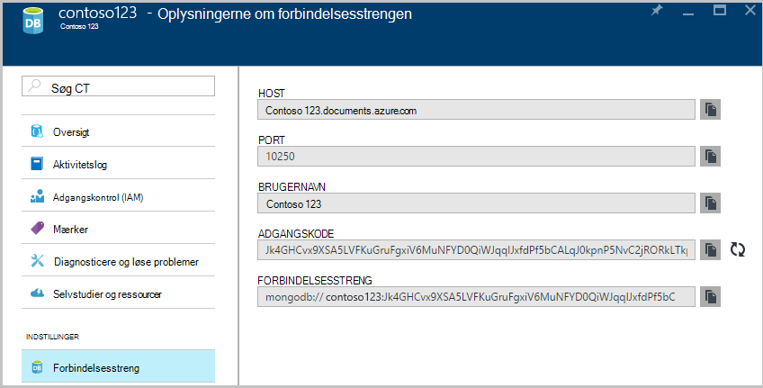

2. Klik på **Opret forbindelse** for at åbne den Forbindelsesstyring, og klik derefter på **Ny forbindelse**

    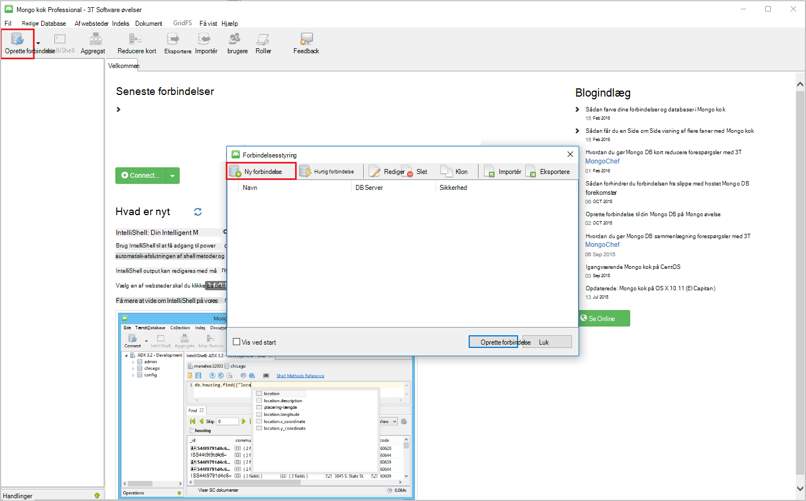
    
2. Angiv HOST (fulde) for kontoen DocumentDB med protocol-understøttelse af MongoDB og PORT i vinduet **Ny forbindelse** på fanen **Server** .
    
    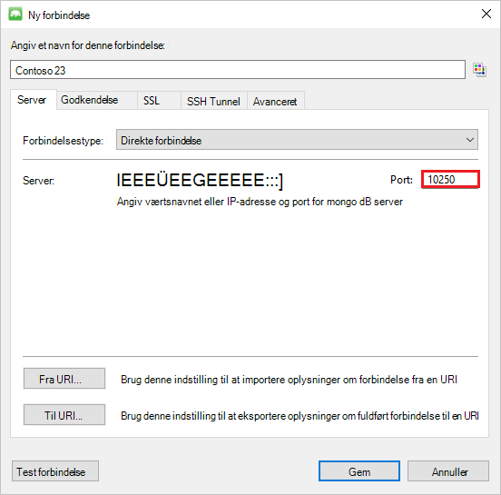

3. Vælg godkendelsestilstand **Standard (MONGODB CR eller SCARM-SHA-1)** i vinduet **Ny forbindelse** på fanen **godkendelse** , og Angiv brugernavn og din adgangskode.  Acceptere standard godkendelse db (admin) eller angive din egen værdi.

    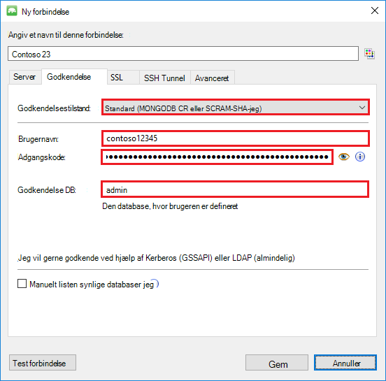

4. Markér afkrydsningsfeltet **Brug SSL-protokollen til at oprette forbindelse** og alternativknappen **Acceptér selvsigneret SSL-certifikater** i vinduet **Ny forbindelse** på fanen **SSL** .

    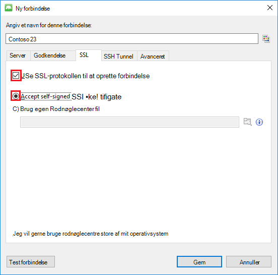

5. Klik på **Test forbindelse** for at validere forbindelsesoplysningerne, skal du klikke på **OK** for at vende tilbage til vinduet Ny forbindelse, og klik derefter på **Gem**.

    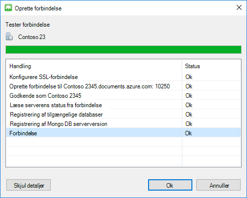

## Brug MongoChef til at oprette en database, websteder og dokumenter  

Hvis du vil oprette en database, websteder og dokumenter ved hjælp af MongoChef, skal du udføre følgende trin.

1. Fremhæv forbindelsen i **Forbindelsesstyring**, og klik på **Opret forbindelse**.

    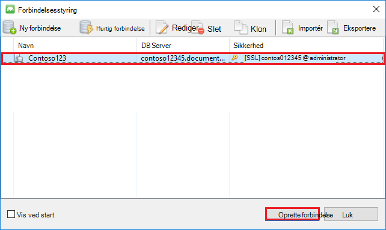

2. Højreklik på værten og vælge **Tilføj Database**.  Giver et databasenavn, og klik på **OK**.
    
    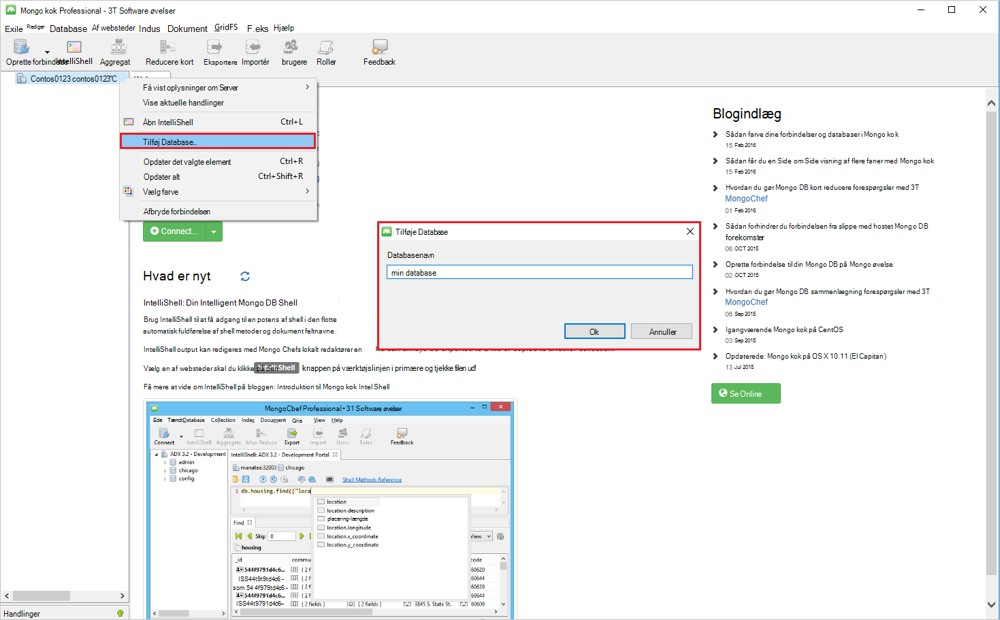

3. Højreklik på databasen, og vælg **Tilføj af websteder**.  Angiv et navn til af websteder, og klik på **Opret**.

    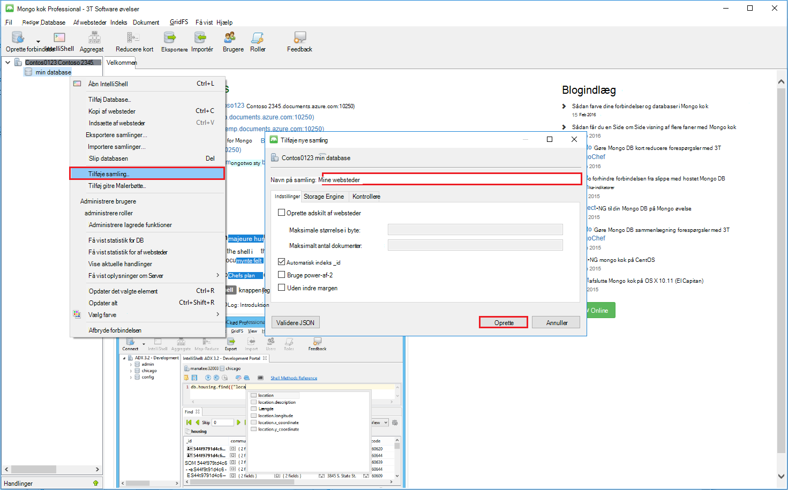

4. Klik på menupunktet **af websteder** , og klik derefter på **Tilføj dokument**.

    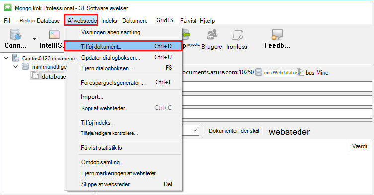

5. Indsæt følgende i dialogboksen Tilføj dokument, og klik derefter på **Tilføj dokument**.

        {
        "_id": "AndersenFamily",
        "lastName": "Andersen",
        "parents": [
            { "firstName": "Thomas" },
            { "firstName": "Mary Kay"}
        ],
        "children": [
        {
            "firstName": "Henriette Thaulow", "gender": "female", "grade": 5,
            "pets": [{ "givenName": "Fluffy" }]
        }
        ],
        "address": { "state": "WA", "county": "King", "city": "seattle" },
        "isRegistered": true
        }

    
6. Tilføje et andet dokument, denne gang med følgende indhold.

        {
        "_id": "WakefieldFamily",
        "parents": [
            { "familyName": "Wakefield", "givenName": "Robin" },
            { "familyName": "Miller", "givenName": "Ben" }
        ],
        "children": [
            {
                "familyName": "Merriam", 
                "givenName": "Jesse", 
                "gender": "female", "grade": 1,
                "pets": [
                    { "givenName": "Goofy" },
                    { "givenName": "Shadow" }
                ]
            },
            { 
                "familyName": "Miller", 
                "givenName": "Lisa", 
                "gender": "female", 
                "grade": 8 }
        ],
        "address": { "state": "NY", "county": "Manhattan", "city": "NY" },
        "isRegistered": false
        }

7. Et eksempel forespørgslen køres. Søge efter familier med efternavnet 'Andersen' f.eks, og vend tilbage felterne forældre og tilstand.

    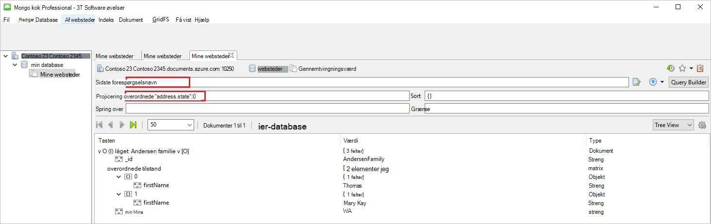
    

## Næste trin

- Udforsk DocumentDB med protocol-understøttelse af MongoDB [eksempler](documentdb-mongodb-samples.md).

 
