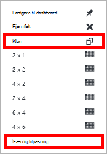

<properties
    pageTitle="Overvåge DocumentDB anmodninger og lager | Microsoft Azure"
    description="Lær at overvåge kontoen DocumentDB for ydeevnen for statistik, som anmodninger og serverfejl, og brugen statistik, som lager forbrug."
    services="documentdb"
    documentationCenter=""
    authors="mimig1"
    manager="jhubbard"
    editor="cgronlun"/>

<tags
    ms.service="documentdb"
    ms.workload="data-services"
    ms.tgt_pltfrm="na"
    ms.devlang="na"
    ms.topic="article"
    ms.date="10/17/2016"
    ms.author="mimig"/>

# Overvåge DocumentDB anmodninger, brugen og lagerplads

Du kan overvåge kontiene Azure DocumentDB [Azure-portalen](https://portal.azure.com/). Begge ydeevne for statistik, som anmodninger og serverfejl samt brugen statistik, som lager forbrug, er tilgængelige for hver DocumentDB-konto.

Du kan gennemse målepunkter på bladet konto eller på bladet nye målepunkter.

## Vis ydeevne målepunkter på bladet målepunkter

1. I et nyt vindue åbner [Azure-portalen](https://portal.azure.com/), skal du klikke på **Flere tjenester**, skal du klikke på **DocumentDB (NoSQL)**og derefter klikke på navnet på den DocumentDB-konto, du vil have til at få vist ydeevnen målepunkter.
2. Klik på **målepunkter**i menuen ressource.

Bladet målepunkter åbnes, og du kan vælge samlingen for at gennemse. Du kan gennemgå tilgængelighed, anmodninger, overførselshastighed og lagerplads målepunkter og sammenlign dem med DocumentDB SLA.

## Vis ydeevne målepunkter på bladet konto
1.  I et nyt vindue åbner [Azure-portalen](https://portal.azure.com/), skal du klikke på **Flere tjenester**, skal du klikke på **DocumentDB (NoSQL)**og derefter klikke på navnet på den DocumentDB-konto, du vil have til at få vist ydeevnen målepunkter.

2.  Objektiv til **overvågnings** vises følgende felter som standard:
    *   Samlet antal anmodninger for den aktuelle dag.
    *   Anvendt lagerplads.

    Hvis din tabel viser **ingen data, der er tilgængelige** , og du mener, at der er data i databasen, skal du se afsnittet [fejlfinding](#troubleshooting) .

    

3.  Når du klikker på **anmodninger** eller **lagerplads** åbnes felt en detaljeret **metrisk** blade.
4.  Bladet **metrisk** viser detaljer om den statistik, du har valgt.  I øverst del af bladet er der en graf over anmodninger om hver time i diagrammet, og under, der er tabellen, der viser sammenlægning værdier begrænset og samlede anmodninger om.  Bladet metriske også viser listen over beskeder, der er defineret, filtreret til målene, der vises på den aktuelle metriske blade (denne metode, hvis du har et antal beskeder, du får kun vist relevante dem præsenteres her).   

    

## Tilpasse ydeevne metriske visninger i portalen

1.  Hvis du vil tilpasse den målepunkter, der vises i et bestemt diagram, klik på diagrammet for at åbne den i bladet **metrisk** , og klik derefter på **Rediger diagram**.  
    

2.  På bladet **Redigere diagram** er der muligheder for at redigere den målepunkter, der vises i diagrammet, samt deres tidsinterval.  
    

3.  For at ændre omfanget vises i del, du blot markere eller fjern tilgængelige ydeevne målepunkter, og klik derefter på **OK** i nederst del af bladet.  
4.  Hvis du vil ændre tidsrum, vælge et andet område (for eksempel **brugerdefineret**), og klik derefter på **OK** i nederst del af bladet.  

    

## Oprette side om side diagrammer i portalen
Portalen Azure kan du oprette side om side metriske diagrammer.  

1.  Først skal du højreklikke på det diagram, du vil kopiere, og vælg **Tilpas**.

    

2.  Klik på **Klon** i menuen for at kopiere del, og klik derefter på **udført tilpasning**.

      

Du kan nu behandle denne del som enhver anden metriske del, tilpasse den målepunkter og klokkeslætsintervallet vises i webdelen.  Ved at gøre dette, kan du se to forskellige måleenheder diagram side om side på samme tid.  
      

## Konfigurere beskeder i portalen
1.  [Azure-portalen](https://portal.azure.com/), skal du klikke på **Flere tjenester**, skal du klikke på **DocumentDB (NoSQL)**og derefter klikke på navnet på den DocumentDB-konto, du vil konfigurere ydeevne metriske beskeder.

2.  Klik på **Regler for påmindelser** for at åbne bladet regler for påmindelser i menuen ressource.  
    

3.  Klik på **Tilføj påmindelse**i bladet **regler for påmindelser** .  
    

4.  Angiv i bladet **tilføje en besked om** :
    *   Navnet på reglen, du vil oprette.
    *   En beskrivelse af den nye beskeder om regel.
    *   Metrisk for reglen.
    *   Den betingelse, grænseværdi og periode, der bestemmer, hvornår påmindelsen aktiveres. En serverfejl tælle eksempelvis større end 5 over de sidste 15 minutter.
    *   Om tjenesteadministratoren og coadministrators er sendt mail når påmindelsen udløses.
    *   Yderligere mailadresser til påmindelser.  
    

## Overvåge DocumentDB programmeringsmæssigt
Konto niveau målepunkter tilgængelig i portalen, såsom konto lagerplads brugen og total anmodninger, er ikke tilgængelige via DocumentDB APIs. Du kan dog hente Brugsdata for websteder ved hjælp af de DocumentDB APIs. Hvis du vil hente samling niveau data, skal du gøre følgende:

- Bruge REST-API, [udføre få på samlingen](https://msdn.microsoft.com/library/mt489073.aspx). Kvote for og brugen oplysningerne til samlingen returneres i x-ms--kvote for serverressourcer og x-ms--Ressourceforbrug overskrifterne i svaret.
- For at bruge .NET SDK skal du bruge metoden [DocumentClient.ReadDocumentCollectionAsync](https://msdn.microsoft.com/library/microsoft.azure.documents.client.documentclient.readdocumentcollectionasync.aspx) , som returnerer en [ResourceResponse](https://msdn.microsoft.com/library/dn799209.aspx) , der indeholder et antal egenskaber for forbrug som **CollectionSizeUsage**, **DatabaseUsage**, **DocumentUsage**og meget mere.

Bruge [Azure skærm SDK](https://www.nuget.org/packages/Microsoft.Azure.Insights)for at få adgang til flere målepunkter. Tilgængelige metriske definitioner kan hentes ved at ringe til:

    https://management.azure.com/subscriptions/{SubscriptionId}/resourceGroups/{ResourceGroup}/providers/Microsoft.DocumentDb/databaseAccounts/{DocumentDBAccountName}/metricDefinitions?api-version=2015-04-08

Forespørgsler, der kan hente individuelle målepunkter Brug følgende format:

    https://management.azure.com/subscriptions/{SubecriptionId}/resourceGroups/{ResourceGroup}/providers/Microsoft.DocumentDb/databaseAccounts/{DocumentDBAccountName}/metrics?api-version=2015-04-08&$filter=%28name.value%20eq%20%27Total%20Requests%27%29%20and%20timeGrain%20eq%20duration%27PT5M%27%20and%20startTime%20eq%202016-06-03T03%3A26%3A00.0000000Z%20and%20endTime%20eq%202016-06-10T03%3A26%3A00.0000000Z

Du kan finde yderligere oplysninger finder [Hentning af ressource målepunkter via Azure skærm REST-API](https://blogs.msdn.microsoft.com/cloud_solution_architect/2016/02/23/retrieving-resource-metrics-via-the-azure-insights-api/). Bemærk, at "Azure Inights" blevet omdøbt "Azure skærm".  Dette blogindlæg refererer til det ældre navn.

## Fejlfinding i forbindelse med
Hvis dine overvågning felter vises **ingen data tilgængelige** meddelelsen, og du for nylig har foretaget anmodninger eller føjet data til databasen, kan du redigere feltet afspejler den seneste brugen.

### Redigere et felt for at opdatere aktuelle data
1.  Hvis du vil tilpasse den målepunkter, vises i en bestemt del, klik på diagrammet for at åbne bladet **metrisk** , og klik derefter på **Rediger diagram**.  
    

2.  Klik på **tidligere time**på bladet **Rediger diagram** i sektionen **Tidsinterval** , og klik derefter på **OK**.  
    

3.  Dit felt skal nu opdatere viser din aktuelle data for og brugen.  
    

## Næste trin
Hvis du vil vide mere om DocumentDB kapacitet skal du se [administrere DocumentDB kapacitet](documentdb-manage.md).
