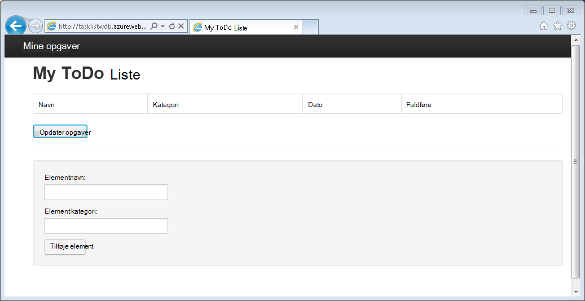
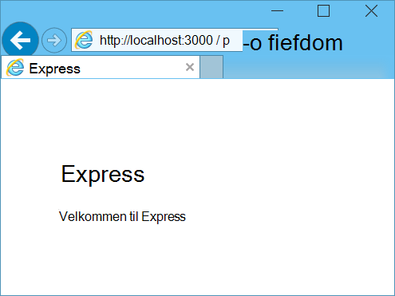
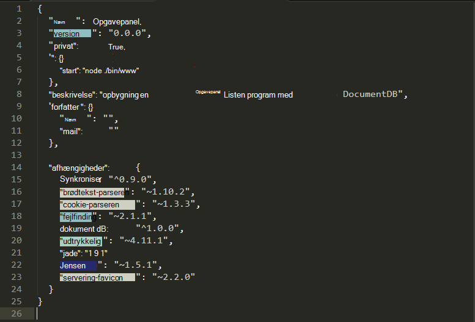
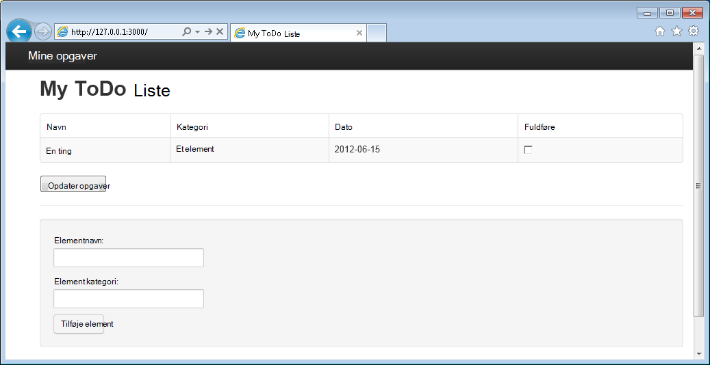

<properties 
    pageTitle="Få mere at vide Node.js - DocumentDB Node.js selvstudium | Microsoft Azure" 
    description="Få mere at vide Node.js! Selvstudium undersøges hvordan du bruger Microsoft Azure DocumentDB til at gemme og få adgang til data fra et Node.js Express webprogram hostes på Azure websteder." 
    keywords="Udvikling af programmer, database selvstudium få mere at vide node.js, node.js selvstudium, documentdb, azure, Microsoft azure"
    services="documentdb" 
    documentationCenter="nodejs" 
    authors="syamkmsft" 
    manager="jhubbard" 
    editor="cgronlun"/>

<tags 
    ms.service="documentdb" 
    ms.workload="data-services" 
    ms.tgt_pltfrm="na" 
    ms.devlang="nodejs" 
    ms.topic="hero-article" 
    ms.date="08/25/2016" 
    ms.author="syamk"/>

# Opbygge et Node.js webprogram ved hjælp af DocumentDB

> [AZURE.SELECTOR]
- [.NET](documentdb-dotnet-application.md)
- [Node.js](documentdb-nodejs-application.md)
- [Java](documentdb-java-application.md)
- [Python](documentdb-python-application.md)

Selvstudiet Node.js viser dig, hvordan du bruger tjenesten Azure DocumentDB til at gemme og få adgang til data fra et Node.js Express-program, der er hostet på Azure websteder.

Vi anbefaler, at komme i gang ved at se den følgende video, hvor du lære, hvordan du klargør en Azure DocumentDB database konto og gemme JSON dokumenter i dit Node.js program. 

> [AZURE.VIDEO azure-demo-getting-started-with-azure-documentdb-on-nodejs-in-linux]

Derefter vende tilbage til selvstudiet Node.js, hvor du skal lære svar på spørgsmål, der er følgende:

- Hvordan arbejder jeg med DocumentDB bruger modulet documentdb npm?
- Hvordan kan jeg installere webprogrammet til Azure websteder?

Ved at følge dette selvstudium database, kan du oprette en enkel webbaseret-Opgavestyring-program, der kan oprette, hente og afslutning af opgaver. Opgaverne, der gemmes som JSON dokumenter i Azure DocumentDB.

Ikke har tid til at fuldføre selvstudiet og blot ønsker at få den komplette løsning? Ikke noget problem, kan du få hele eksemplet løsningen fra [GitHub][].

## Forudsætninger

> [AZURE.TIP] Selvstudiet Node.js antages det, at du har nogle tidligere oplevelse ved hjælp af Node.js og Azure websteder.

Før du følge vejledningen i denne artikel, skal du sikre dig, at du har følgende:

- En active Azure-konto. Hvis du ikke har en konto, kan du oprette en gratis prøveversion konto på blot et par minutter. Yderligere oplysninger finder du [Azure gratis prøveversion](https://azure.microsoft.com/pricing/free-trial/).
- [Node.js][] version v0.10.29 eller nyere.
- [Express generator](http://www.expressjs.com/starter/generator.html) (du kan installere dette via `npm install express-generator -g`)
- [Ciffer][].

## Trin 1: Oprette en DocumentDB database-konto

Lad os starte med at oprette en DocumentDB-konto. Hvis du allerede har en konto, kan du gå til [trin 2: oprette et nyt Node.js program](#_Toc395783178).

[AZURE.INCLUDE [documentdb-create-dbaccount](../../includes/documentdb-create-dbaccount.md)]

[AZURE.INCLUDE [documentdb-keys](../../includes/documentdb-keys.md)]

## Trin 2: Lær, hvordan du opretter et nyt Node.js program

Nu Lad os lære at oprette et grundlæggende Hej verden Node.js projekt ved hjælp af [Express](http://expressjs.com/) framework.

1. Åbn din foretrukne terminal.

2. Bruge Hurtig generator til at oprette et nyt program kaldet **Opgaveliste**.

        express todo

3. Åbn mappen ny **Opgaveliste** og installere afhængigheder.

        cd todo
        npm install

4. Køre dit nye program.

        npm start

5. Du kan få vist dit nye program ved at navigere din browser til [http://localhost:3000](http://localhost:3000).

    

## Trin 3: Installere yderligere moduler

**Package.json** filen er en af de filer, der er oprettet i roden af projektet. Denne fil indeholder en liste over yderligere moduler, der kræves til dit Node.js program. Senere, når du installerer programmet til en Azure-websteder, er denne fil bruges til at bestemme, hvilke moduler skal installeres på Azure til at understøtte dit program. Vi stadig har brug at installere to flere pakker til dette selvstudium.

1. Tilbage i terminal skal du installere modulet **asynkrone** via npm.

        npm install async --save

1. Installere modulet **documentdb** via npm. Dette er det modul, hvor alle DocumentDB Magien sker.

        npm install documentdb --save

3. En hurtig kontrol af filen **package.json** af programmet skal vise yderligere moduler. Denne fil fortæller Azure, hvilke pakker til at hente og installere, når du kører dit program. Det skal ligne eksemplet nedenfor.

    

    Det fortæller Node (og Azure senere), at dit program afhænger af disse yderligere moduler.

## Trin 4: Ved hjælp af tjenesten DocumentDB i et node til computeren

Der tager sig af alle de indledende installation og konfiguration, nu Lad os få ned til hvorfor vi er her, og det er for at skrive kode ved hjælp af Azure DocumentDB.

### Oprette modellen

1. Oprette en ny mappe med navnet **modeller**i projektmappen.
2. Oprette en ny fil med navnet **taskDao.js**i mappen **modeller** . Denne fil indeholder modellen for de opgaver, der er oprettet af vores program.
3. Oprette en anden ny fil med navnet **docdbUtils.js**i den samme mappe i **modeller** . Denne fil indeholder nogle nyttige, der kan genbruges, kode, vi vil bruge i vores program. 
4. Kopier den følgende kode i til **docdbUtils.js**

        var DocumentDBClient = require('documentdb').DocumentClient;
            
        var DocDBUtils = {
            getOrCreateDatabase: function (client, databaseId, callback) {
                var querySpec = {
                    query: 'SELECT * FROM root r WHERE r.id= @id',
                    parameters: [{
                        name: '@id',
                        value: databaseId
                    }]
                };
        
                client.queryDatabases(querySpec).toArray(function (err, results) {
                    if (err) {
                        callback(err);
        
                    } else {
                        if (results.length === 0) {
                            var databaseSpec = {
                                id: databaseId
                            };
        
                            client.createDatabase(databaseSpec, function (err, created) {
                                callback(null, created);
                            });
        
                        } else {
                            callback(null, results[0]);
                        }
                    }
                });
            },
        
            getOrCreateCollection: function (client, databaseLink, collectionId, callback) {
                var querySpec = {
                    query: 'SELECT * FROM root r WHERE r.id=@id',
                    parameters: [{
                        name: '@id',
                        value: collectionId
                    }]
                };             
                
                client.queryCollections(databaseLink, querySpec).toArray(function (err, results) {
                    if (err) {
                        callback(err);
        
                    } else {        
                        if (results.length === 0) {
                            var collectionSpec = {
                                id: collectionId
                            };
                            
                            client.createCollection(databaseLink, collectionSpec, function (err, created) {
                                callback(null, created);
                            });
        
                        } else {
                            callback(null, results[0]);
                        }
                    }
                });
            }
        };
                
        module.exports = DocDBUtils;

    > [AZURE.TIP] createCollection tager en valgfri requestOptions parameter, som kan bruges til at angive, hvilke tilbyder til samlingen. Hvis ingen requestOptions.offerType værdi leveres derefter oprettes samlingen ved hjælp af standard tilbyder Type.
    >
    > Yderligere oplysninger om DocumentDB tilbyder typer se [ydeevneniveauer i DocumentDB](documentdb-performance-levels.md) 
        
3. Gem og Luk filen **docdbUtils.js** .

4. Føj følgende kode for at henvise til **DocumentDBClient** og **docdbUtils.js** , vi oprettede ovenfor i starten af filen **taskDao.js** :

        var DocumentDBClient = require('documentdb').DocumentClient;
        var docdbUtils = require('./docdbUtils');

4. Dernæst skal tilføje du kode for at definere og eksportere objektet opgave. Dette er ansvarlig for initialisering af vores opgaveobjekt og konfiguration af databasen og dokumentsamling vi vil bruge.

        function TaskDao(documentDBClient, databaseId, collectionId) {
          this.client = documentDBClient;
          this.databaseId = databaseId;
          this.collectionId = collectionId;
        
          this.database = null;
          this.collection = null;
        }
        
        module.exports = TaskDao;

5. Føj følgende kode for at definere flere metoder til objektet opgave, som gør det muligt interaktion med data, der er gemt i DocumentDB.

        TaskDao.prototype = {
            init: function (callback) {
                var self = this;
        
                docdbUtils.getOrCreateDatabase(self.client, self.databaseId, function (err, db) {
                    if (err) {
                        callback(err);
                    } else {
                        self.database = db;
                        docdbUtils.getOrCreateCollection(self.client, self.database._self, self.collectionId, function (err, coll) {
                            if (err) {
                                callback(err);
        
                            } else {
                                self.collection = coll;
                            }
                        });
                    }
                });
            },
        
            find: function (querySpec, callback) {
                var self = this;
        
                self.client.queryDocuments(self.collection._self, querySpec).toArray(function (err, results) {
                    if (err) {
                        callback(err);
        
                    } else {
                        callback(null, results);
                    }
                });
            },
        
            addItem: function (item, callback) {
                var self = this;
        
                item.date = Date.now();
                item.completed = false;
        
                self.client.createDocument(self.collection._self, item, function (err, doc) {
                    if (err) {
                        callback(err);
        
                    } else {
                        callback(null, doc);
                    }
                });
            },
        
            updateItem: function (itemId, callback) {
                var self = this;
        
                self.getItem(itemId, function (err, doc) {
                    if (err) {
                        callback(err);
        
                    } else {
                        doc.completed = true;
        
                        self.client.replaceDocument(doc._self, doc, function (err, replaced) {
                            if (err) {
                                callback(err);
        
                            } else {
                                callback(null, replaced);
                            }
                        });
                    }
                });
            },
        
            getItem: function (itemId, callback) {
                var self = this;
        
                var querySpec = {
                    query: 'SELECT * FROM root r WHERE r.id = @id',
                    parameters: [{
                        name: '@id',
                        value: itemId
                    }]
                };
        
                self.client.queryDocuments(self.collection._self, querySpec).toArray(function (err, results) {
                    if (err) {
                        callback(err);
        
                    } else {
                        callback(null, results[0]);
                    }
                });
            }
        };

6. Gem og Luk filen **taskDao.js** . 

### Oprette controlleren

1. Oprette en ny fil med navnet **tasklist.js**i mappen **omdirigerer** på projektet. 
2. Tilføj følgende kode til **tasklist.js**. Dette indlæser DocumentDBClient og asynkron moduler, der bruges af **tasklist.js**. Dette også defineret funktionen **vha** , som der overføres en forekomst af objektet **opgave** , som vi definerede tidligere:

        var DocumentDBClient = require('documentdb').DocumentClient;
        var async = require('async');
        
        function TaskList(taskDao) {
          this.taskDao = taskDao;
        }
        
        module.exports = TaskList;

3. Fortsæt med at tilføje til fil, **tasklist.js** ved at tilføje **showTasks, addTask**og **completeTasks**metoder:
        
        TaskList.prototype = {
            showTasks: function (req, res) {
                var self = this;
        
                var querySpec = {
                    query: 'SELECT * FROM root r WHERE r.completed=@completed',
                    parameters: [{
                        name: '@completed',
                        value: false
                    }]
                };
        
                self.taskDao.find(querySpec, function (err, items) {
                    if (err) {
                        throw (err);
                    }
        
                    res.render('index', {
                        title: 'My ToDo List ',
                        tasks: items
                    });
                });
            },
        
            addTask: function (req, res) {
                var self = this;
                var item = req.body;
        
                self.taskDao.addItem(item, function (err) {
                    if (err) {
                        throw (err);
                    }
        
                    res.redirect('/');
                });
            },
        
            completeTask: function (req, res) {
                var self = this;
                var completedTasks = Object.keys(req.body);
        
                async.forEach(completedTasks, function taskIterator(completedTask, callback) {
                    self.taskDao.updateItem(completedTask, function (err) {
                        if (err) {
                            callback(err);
                        } else {
                            callback(null);
                        }
                    });
                }, function goHome(err) {
                    if (err) {
                        throw err;
                    } else {
                        res.redirect('/');
                    }
                });
            }
        };

4. Gem og Luk filen **tasklist.js** .
 
### Tilføje config.js

1. Oprette en ny fil med navnet **config.js**i project-biblioteket.
2. Tilføj følgende **config.js**. Dette definerer konfigurationsindstillinger og værdier, der er behov for vores program.

        var config = {}
        
        config.host = process.env.HOST || "[the URI value from the DocumentDB Keys blade on http://portal.azure.com]";
        config.authKey = process.env.AUTH_KEY || "[the PRIMARY KEY value from the DocumentDB Keys blade on http://portal.azure.com]";
        config.databaseId = "ToDoList";
        config.collectionId = "Items";
        
        module.exports = config;

3. Opdatere værdierne af HOST og AUTH_KEY ved hjælp af de værdier, der findes i bladet taster af kontoen DocumentDB på [Microsoft Azure Portal](https://portal.azure.com)i filen **config.js** :

4. Gem og Luk filen **config.js** .
 
### Ændre app.js

1. Åbn filen **app.js** i projektmappen. Denne fil blev oprettet tidligere, da webprogrammet Express blev oprettet.
2. Føj følgende kode til toppen af **app.js**
    
        var DocumentDBClient = require('documentdb').DocumentClient;
        var config = require('./config');
        var TaskList = require('./routes/tasklist');
        var TaskDao = require('./models/taskDao');

3. Denne kode definerer konfigurationsfil skal anvendes, og fortsætter med at læse værdier af denne fil i til nogle variabler, vi bruger snart.
4. Erstatte de følgende to linjer i **app.js** fil:

        app.use('/', routes);
        app.use('/users', users); 

      med følgende kodestykke:

        var docDbClient = new DocumentDBClient(config.host, {
            masterKey: config.authKey
        });
        var taskDao = new TaskDao(docDbClient, config.databaseId, config.collectionId);
        var taskList = new TaskList(taskDao);
        taskDao.init();
        
        app.get('/', taskList.showTasks.bind(taskList));
        app.post('/addtask', taskList.addTask.bind(taskList));
        app.post('/completetask', taskList.completeTask.bind(taskList));
        app.set('view engine', 'jade');

6. Disse linjer definere en ny forekomst af vores **TaskDao** objekt, initialiseret opgaveobjektet med en ny forbindelse til DocumentDB (ved hjælp af de værdier, der læses fra **config.js**), og derefter binde formularhandlinger til metoder på vores **vha** controller. 

7. Til sidst, Gem og Luk filen **app.js** , vi næsten er færdig.
 
## Trin 5: Oprette en brugergrænseflade

Nu slå Lad os vores handling til at lave brugergrænsefladen, så en bruger kan faktisk arbejde med vores program. Programmet Express, vi oprettede bruger **Jade** som Vis-program. Se [http://jade-lang.com/](http://jade-lang.com/)yderligere oplysninger om Jade.

1. Filen **layout.jade** i mappen **visninger** bruges som en global skabelon til andre **.jade** filer. I dette trin kan du ændre den for at bruge [Twitter-Bootstrap](https://github.com/twbs/bootstrap), som er en værktøjskassen, der gør det nemt at designe et flot udseende websted. 
2. Åbn filen **layout.jade** findes i mappen **visninger** og erstatte indholdet med følgende:
    
        doctype html
        html
          head
            title= title
            link(rel='stylesheet', href='//ajax.aspnetcdn.com/ajax/bootstrap/3.3.2/css/bootstrap.min.css')
            link(rel='stylesheet', href='/stylesheets/style.css')
          body
            nav.navbar.navbar-inverse.navbar-fixed-top
              div.navbar-header
                a.navbar-brand(href='#') My Tasks
            block content
            script(src='//ajax.aspnetcdn.com/ajax/jQuery/jquery-1.11.2.min.js')
            script(src='//ajax.aspnetcdn.com/ajax/bootstrap/3.3.2/bootstrap.min.js')

    Dette effektivt fortæller **Jade** program til at gengive nogle HTML for vores program og opretter en **blok** kaldet **indhold** , hvor vi kan levere layout til vores indholdssider.
    Gem og Luk denne **layout.jade** -fil.

4. Nu Åbn filen **index.jade** , den visning, der bruges af vores program, og Erstat indholdet af filen med følgende:

        extends layout
        
        block content
          h1 #{title}
          br
        
          form(action="/completetask", method="post")
            table.table.table-striped.table-bordered
              tr
                td Name
                td Category
                td Date
                td Complete
              if (typeof tasks === "undefined")
                tr
                  td
              else
                each task in tasks
                  tr
                    td #{task.name}
                    td #{task.category}
                    - var date  = new Date(task.date);
                    - var day   = date.getDate();
                    - var month = date.getMonth() + 1;
                    - var year  = date.getFullYear();
                    td #{month + "/" + day + "/" + year}
                    td
                      input(type="checkbox", name="#{task.id}", value="#{!task.completed}", checked=task.completed)
            button.btn(type="submit") Update tasks
          hr
          form.well(action="/addtask", method="post")
            label Item Name:
            input(name="name", type="textbox")
            label Item Category:
            input(name="category", type="textbox")
            br
            button.btn(type="submit") Add item

    Dette udvider layout og leverer indhold til pladsholderen **indhold** vi så tidligere i filen **layout.jade** .
    
    I dette layout oprettede vi to HTML-formularer. 
    Den første formular indeholder en tabel til vores data og en knap, der gør det muligt for os til at opdatere elementer ved at skrive til **/completetask** metode til vores controller.
    Den anden formular indeholder to input felter og en knap, der gør det muligt for os til at oprette et nyt element ved at skrive til **/addtask** metode til vores controller.
    
    Dette bør være alle, der skal bruges i vores program tilladelse til at arbejde.

5. Åbn filen **style.css** i **public\stylesheets** directory og erstatte koden med følgende:

        body {
          padding: 50px;
          font: 14px "Lucida Grande", Helvetica, Arial, sans-serif;
        }
        a {
          color: #00B7FF;
        }
        .well label {
          display: block;
        }
        .well input {
          margin-bottom: 5px;
        }
        .btn {
          margin-top: 5px;
          border: outset 1px #C8C8C8;
        }

    Gem og Luk denne **style.css** -fil.

## Trin 6: Køre programmet lokalt

1. Hvis du vil teste programmet på din lokale computer, skal du køre `npm start` i en terminal til at starte dit program, og Start en browser med en side, der ligner billedet nedenfor:

    

2. Brug de medfølgende felter for elementet, elementnavn og kategori til at angive oplysninger, og klik derefter på **Tilføj element**.

3. Siden bør opdatere for at få vist det nyoprettede element på listen opgaveliste.

    

4. For at fuldføre en opgave, blot Markér afkrydsningsfeltet i kolonnen færdigt, og klik derefter på **Opdater opgaver**.

## Trin 7: Installere projektet programmet udvikling til Azure websteder

1. Hvis du ikke allerede har gjort det, kan du aktivere et ciffer lager Azure til dit websted. Du kan finde instruktioner til, hvordan du gør dette i emnet med den [Lokale ciffer installation til Azure App-tjenesten](../app-service-web/app-service-deploy-local-git.md) .

2. Tilføje dit Azure-websted som en remote ciffer.

        git remote add azure https://username@your-azure-website.scm.azurewebsites.net:443/your-azure-website.git

3. Installer ved at trykke på fjerncomputeren.

        git push azure master

4. I et par sekunder, der ciffer afslutte publicere dit webprogram og Start en browser, hvor du kan se dit praktiske arbejde, der kører i Azure!

## Næste trin

Tillykke! Du har lige oprettet din første Node.js Express webprogrammet ved hjælp af Azure DocumentDB og publiceret til Azure websteder.

Kildekode til programmet komplet reference kan hentes fra [GitHub][].

Du kan finde yderligere oplysninger finder [Node.js Developer Center](https://azure.microsoft.com/develop/nodejs/).

[Node.js]: http://nodejs.org/
[Ciffer]: http://git-scm.com/
[Github]: https://github.com/Azure-Samples/documentdb-node-todo-app
 
