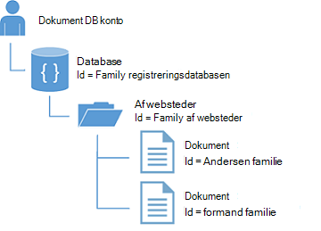
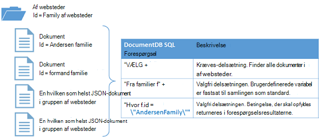

<properties
  pageTitle="NoSQL Node.js selvstudium til DocumentDB | Microsoft Azure"
  description="Et NoSQL Node.js selvstudium, der opretter en node database og console program ved hjælp af DocumentDB Node.js SDK. DocumentDB er en NoSQL database til JSON."
    keywords="node.js selvstudium node database"
  services="documentdb"
  documentationCenter="node.js"
  authors="AndrewHoh"
  manager="jhubbard"
  editor="monicar"/>

<tags
  ms.service="documentdb"
  ms.workload="data-services"
  ms.tgt_pltfrm="na"
  ms.devlang="node"
  ms.topic="hero-article"
  ms.date="08/11/2016"
  ms.author="anhoh"/>

# <a name="nosql-nodejs-tutorial-documentdb-nodejs-console-application"></a>NoSQL Node.js Selvstudium: DocumentDB Node.js console-program  

> [AZURE.SELECTOR]
- [.NET](documentdb-get-started.md)
- [Node.js](documentdb-nodejs-get-started.md)

Velkommen til Node.js selvstudiet til Azure DocumentDB Node.js SDK! Når du har fulgt selvstudiet, har du en console-program, der opretter og forespørgsler DocumentDB ressourcer, herunder en Node database.

Vi gennemgår:

- Oprette og oprette forbindelse til en DocumentDB-konto
- Konfiguration af dit program
- Oprettelse af en node database
- Oprette en samling
- Oprette JSON-dokumenter
- Forespørgsler samlingen
- Erstatte et dokument
- Hvis du sletter et dokument
- Slette node databasen

Ikke har tid? Vær ikke bekymret! Komplet løsning er tilgængelig på [GitHub](https://github.com/Azure-Samples/documentdb-node-getting-started). Se [få komplet løsning](#GetSolution) for hurtig vejledning.

Når du har fuldført Node.js selvstudiet, Brug responsknapperne øverst og nederst på denne side til at give os feedback. Hvis du vil have os til at kontakte dig direkte, Velkommen til at medtage din e-mail-adresse i dine kommentarer.

Nu Lad os komme i gang!

## <a name="prerequisites-for-the-nodejs-tutorial"></a>Forudsætninger for Node.js selvstudiet

Kontrollér, at du har følgende:

- En active Azure-konto. Hvis du ikke har en, kan du tilmelde dig en [Gratis prøveversion af Azure](https://azure.microsoft.com/pricing/free-trial/).
- [Node.js](https://nodejs.org/) version v0.10.29 eller nyere.

## <a name="step-1-create-a-documentdb-account"></a>Trin 1: Oprette en DocumentDB-konto

Lad os oprette en DocumentDB-konto. Hvis du allerede har en konto, du vil bruge, kan du gå videre til [konfiguration af dit Node.js program](#SetupNode).

[AZURE.INCLUDE [documentdb-create-dbaccount](../../includes/documentdb-create-dbaccount.md)]

## <a id="SetupNode"></a>Trin 2: Konfigurer dit Node.js program

1. Åbn din foretrukne terminal.
2. Find den mappe eller et bibliotek, hvor du vil gemme dit Node.js program.
3. Opret to tomme JavaScript-filer med følgende kommandoer:
  - Windows:
      * ```fsutil file createnew app.js 0```
        * ```fsutil file createnew config.js 0```
  - Linux/OS X:
      * ```touch app.js```
        * ```touch config.js```
4. Installere modulet documentdb via npm. Brug følgende kommando:
    * ```npm install documentdb --save```

Enestående! Nu hvor du er færdig med at konfigurere, Lad os begynde at skrive kode.

## <a id="Config"></a>Trin 3: Angive din app konfigurationer

Åbn ```config.js``` i din foretrukne tekstredigeringsprogram.

Derefter, Kopiér og Indsæt nedenfor kodestykket og angive egenskaber ```config.endpoint``` og ```config.primaryKey``` til DocumentDB slutpunkt uri og primær nøgle. Begge disse konfigurationer kan findes i [Azure-portalen](https://portal.azure.com).

![Node.js selvstudium - skærmbillede af portalen Azure, der viser en DocumentDB-konto med den aktive hub fremhævet, knappen TASTER er fremhævet på bladet DocumentDB konto og de URI, PRIMÆRNØGLE og sekundær nøgle værdier, der er fremhævet på bladet taster - Node database][keys]

    // ADD THIS PART TO YOUR CODE
    var config = {}

    config.endpoint = "~your DocumentDB endpoint uri here~";
    config.primaryKey = "~your primary key here~";

Kopiere og indsætte den ```database id```, ```collection id```, og ```JSON documents``` til din ```config``` objekt under det sted, hvor du angive din ```config.endpoint``` og ```config.authKey``` egenskaber. Hvis du allerede har data, du vil gemme i databasen, kan du bruge Documentdb's [Data overførselsværktøjet](documentdb-import-data.md) i stedet for at tilføje dokument definitioner.

    config.endpoint = "~your DocumentDB endpoint uri here~";
    config.primaryKey = "~your primary key here~";

    // ADD THIS PART TO YOUR CODE
    config.database = {
        "id": "FamilyDB"
    };

    config.collection = {
        "id": "FamilyColl"
    };

    config.documents = {
        "Andersen": {
            "id": "Anderson.1",
            "lastName": "Andersen",
            "parents": [{
                "firstName": "Thomas"
            }, {
                    "firstName": "Mary Kay"
                }],
            "children": [{
                "firstName": "Henriette Thaulow",
                "gender": "female",
                "grade": 5,
                "pets": [{
                    "givenName": "Fluffy"
                }]
            }],
            "address": {
                "state": "WA",
                "county": "King",
                "city": "Seattle"
            }
        },
        "Wakefield": {
            "id": "Wakefield.7",
            "parents": [{
                "familyName": "Wakefield",
                "firstName": "Robin"
            }, {
                    "familyName": "Miller",
                    "firstName": "Ben"
                }],
            "children": [{
                "familyName": "Merriam",
                "firstName": "Jesse",
                "gender": "female",
                "grade": 8,
                "pets": [{
                    "givenName": "Goofy"
                }, {
                        "givenName": "Shadow"
                    }]
            }, {
                    "familyName": "Miller",
                    "firstName": "Lisa",
                    "gender": "female",
                    "grade": 1
                }],
            "address": {
                "state": "NY",
                "county": "Manhattan",
                "city": "NY"
            },
            "isRegistered": false
        }
    };


Database, indsamling og dokument definitioner skal fungere som din DocumentDB ```database id```, ```collection id```, og dokumenterne data.

Til sidst skal eksportere dine ```config``` objekt, så du kan referere til den inden for den ```app.js``` fil.

            },
            "isRegistered": false
        }
    };

    // ADD THIS PART TO YOUR CODE
    module.exports = config;

##<a id="Connect"></a>Trin 4: Oprette forbindelse til en DocumentDB-konto

Åbn din Tøm ```app.js``` fil i tekstredigeringsprogrammet. Kopiere og indsætte koden nedenfor for at importere den ```documentdb``` modul og din nyoprettede ```config``` modul.

    // ADD THIS PART TO YOUR CODE
    "use strict";

    var documentClient = require("documentdb").DocumentClient;
    var config = require("./config");
    var url = require('url');

Kopiér og Indsæt koden, hvis du vil bruge den tidligere gemt ```config.endpoint``` og ```config.primaryKey``` til at oprette en ny DocumentClient.

    var config = require("./config");
    var url = require('url');

    // ADD THIS PART TO YOUR CODE
    var client = new documentClient(config.endpoint, { "masterKey": config.primaryKey });

Nu hvor du har koden initialiseret documentdb klienten, Lad os se nærmere på arbejde med DocumentDB ressourcer.

## <a name="step-5-create-a-node-database"></a>Trin 5: Oprette en Node database
Kopiér og Indsæt koden nedenfor for at angive HTTP-status for blev ikke fundet, database URL-adressen og samling URL-adressen. Disse URL-adresser er, hvordan DocumentDB klienten kan finde den rigtige database og af websteder.

    var client = new documentClient(config.endpoint, { "masterKey": config.primaryKey });

    // ADD THIS PART TO YOUR CODE
    var HttpStatusCodes = { NOTFOUND: 404 };
    var databaseUrl = `dbs/${config.database.id}`;
    var collectionUrl = `${databaseUrl}/colls/${config.collection.id}`;

En [database](documentdb-resources.md#databases) kan oprettes ved hjælp af funktionen [createDatabase](https://azure.github.io/azure-documentdb-node/DocumentClient.html) på klassenavn, **DocumentClient** . En database er objektbeholderen logiske dokument lagerplads opdelt på tværs af websteder.

Kopiere og indsætte funktionen **getDatabase** til at oprette den nye database i filen app.js med den ```id``` angivet i den ```config``` objekt. Funktionen kontrollerer Hvis databasen med det samme ```FamilyRegistry``` id ikke allerede findes. Hvis den findes, skal vi returnere denne database i stedet for at oprette en ny.

    var collectionUrl = `${databaseUrl}/colls/${config.collection.id}`;

    // ADD THIS PART TO YOUR CODE
    function getDatabase() {
        console.log(`Getting database:\n${config.database.id}\n`);

        return new Promise((resolve, reject) => {
            client.readDatabase(databaseUrl, (err, result) => {
                if (err) {
                    if (err.code == HttpStatusCodes.NOTFOUND) {
                        client.createDatabase(config.database, (err, created) => {
                            if (err) reject(err)
                            else resolve(created);
                        });
                    } else {
                        reject(err);
                    }
                } else {
                    resolve(result);
                }
            });
        });
    }

Kopiér og Indsæt koden, herunder hvor du angive funktionen **getDatabase** til at tilføje den hjælper funktionen **Afslut** , du vil udskrive Afslut meddelelsen og opkaldet til **getDatabase** funktionen.

                } else {
                    resolve(result);
                }
            });
        });
    }

    // ADD THIS PART TO YOUR CODE
    function exit(message) {
        console.log(message);
        console.log('Press any key to exit');
        process.stdin.setRawMode(true);
        process.stdin.resume();
        process.stdin.on('data', process.exit.bind(process, 0));
    }

    getDatabase()
    .then(() => { exit(`Completed successfully`); })
    .catch((error) => { exit(`Completed with error ${JSON.stringify(error)}`) });

I terminal skal du finde din ```app.js``` fil og køre kommandoen:```node app.js```

Tillykke! Du har oprettet en DocumentDB database.

##<a id="CreateColl"></a>Trin 6: Oprette en samling  

> [AZURE.WARNING] **CreateDocumentCollectionAsync** opretter en ny af websteder, som har priser konsekvenserne. Få mere at vide, skal du gå til vores [priser side](https://azure.microsoft.com/pricing/details/documentdb/).

En [samling](documentdb-resources.md#collections) kan oprettes ved hjælp af funktionen [createCollection](https://azure.github.io/azure-documentdb-node/DocumentClient.html) i klassen **DocumentClient** . En samling er en beholder af JSON dokumenter og tilknyttede JavaScript programlogik.

Kopiere og indsætte **getCollection** funktionen under funktionen **getDatabase** til at oprette den nye samling med den ```id``` angivet i den ```config``` objekt. Vi vil Kontroller igen for at sikre, at en samling med det samme ```FamilyCollection``` id ikke allerede findes. Hvis den findes, skal vi returnerer samlingen i stedet for at oprette en ny.

                } else {
                    resolve(result);
                }
            });
        });
    }

    // ADD THIS PART TO YOUR CODE
    function getCollection() {
        console.log(`Getting collection:\n${config.collection.id}\n`);

        return new Promise((resolve, reject) => {
            client.readCollection(collectionUrl, (err, result) => {
                if (err) {
                    if (err.code == HttpStatusCodes.NOTFOUND) {
                        client.createCollection(databaseUrl, config.collection, { offerThroughput: 400 }, (err, created) => {
                            if (err) reject(err)
                            else resolve(created);
                        });
                    } else {
                        reject(err);
                    }
                } else {
                    resolve(result);
                }
            });
        });
    }

Kopiér og Indsæt koden under opkaldet til **getDatabase** til at udføre **getCollection** funktion.

    getDatabase()

    // ADD THIS PART TO YOUR CODE
    .then(() => getCollection())
    // ENDS HERE

    .then(() => { exit(`Completed successfully`); })
    .catch((error) => { exit(`Completed with error ${JSON.stringify(error)}`) });

I terminal skal du finde din ```app.js``` fil og køre kommandoen:```node app.js```

Tillykke! Du har oprettet en DocumentDB af websteder.

##<a id="CreateDoc"></a>Trin 7: Oprette et dokument
Et [dokument](documentdb-resources.md#documents) kan oprettes ved hjælp af funktionen [createDocument](https://azure.github.io/azure-documentdb-node/DocumentClient.html) i klassen **DocumentClient** . Dokumenter er brugerdefinerede (vilkårlig) JSON-indhold. Du kan nu indsætte et dokument i DocumentDB.

Kopiere og indsætte **getFamilyDocument** funktionen under funktionen **getCollection** til oprettelse af de dokumenter, der indeholder de JSON-data, der er gemt i den ```config``` objekt. Vi vil Kontroller igen for at sikre at et dokument med det samme id ikke allerede findes.

                } else {
                    resolve(result);
                }
            });
        });
    }

    // ADD THIS PART TO YOUR CODE
    function getFamilyDocument(document) {
        let documentUrl = `${collectionUrl}/docs/${document.id}`;
        console.log(`Getting document:\n${document.id}\n`);

        return new Promise((resolve, reject) => {
            client.readDocument(documentUrl, { partitionKey: document.district }, (err, result) => {
                if (err) {
                    if (err.code == HttpStatusCodes.NOTFOUND) {
                        client.createDocument(collectionUrl, document, (err, created) => {
                            if (err) reject(err)
                            else resolve(created);
                        });
                    } else {
                        reject(err);
                    }
                } else {
                    resolve(result);
                }
            });
        });
    };

Kopiér og Indsæt koden under opkaldet til **getCollection** til at udføre **getFamilyDocument** funktion.

    getDatabase()
    .then(() => getCollection())

    // ADD THIS PART TO YOUR CODE
    .then(() => getFamilyDocument(config.documents.Andersen))
    .then(() => getFamilyDocument(config.documents.Wakefield))
    // ENDS HERE

    .then(() => { exit(`Completed successfully`); })
    .catch((error) => { exit(`Completed with error ${JSON.stringify(error)}`) });

I terminal skal du finde din ```app.js``` fil og køre kommandoen:```node app.js```

Tillykke! Du har oprettet en DocumentDB dokumenter.



##<a id="Query"></a>Trin 8: Forespørgsel DocumentDB ressourcer

DocumentDB understøtter JSON dokumenter gemmes i hver websteder [omfattende forespørgsler](documentdb-sql-query.md) . Følgende eksempelkode viser en forespørgsel, du kan køre for dokumenterne i af websteder.

Kopiere og indsætte **queryCollection** funktionen under funktionen **getFamilyDocument** . DocumentDB understøtter synes godt om SQL-forespørgsler, som vist nedenfor. Flere oplysninger om at oprette komplekse forespørgsler, se [Forespørgsel tennisklub](https://www.documentdb.com/sql/demo) og [forespørgselsdokumentation](documentdb-sql-query.md).

                } else {
                    resolve(result);
                }
            });
        });
    }

    // ADD THIS PART TO YOUR CODE
    function queryCollection() {
        console.log(`Querying collection through index:\n${config.collection.id}`);

        return new Promise((resolve, reject) => {
            client.queryDocuments(
                collectionUrl,
                'SELECT VALUE r.children FROM root r WHERE r.lastName = "Andersen"'
            ).toArray((err, results) => {
                if (err) reject(err)
                else {
                    for (var queryResult of results) {
                        let resultString = JSON.stringify(queryResult);
                        console.log(`\tQuery returned ${resultString}`);
                    }
                    console.log();
                    resolve(results);
                }
            });
        });
    };


I følgende diagram vises, hvordan forespørgselssyntaksen DocumentDB SQL hedder mod samlingen du har oprettet.



Nøgleordet [fra](documentdb-sql-query.md#from-clause) er valgfrit i forespørgslen, fordi DocumentDB forespørgsler allerede er fastsat til en enkelt samling. Derfor "Fra familier f" kan byttes med "Fra rodwebstedet r" eller andre variabel navngive du vælger. DocumentDB kan udlede pågældende familier, rod eller variabelnavn du vælger, der henviser til den aktuelle websteder som standard.

Kopiér og Indsæt koden under opkaldet til **getFamilyDocument** til at udføre **queryCollection** funktion.

    .then(() => getFamilyDocument(config.documents.Andersen))
    .then(() => getFamilyDocument(config.documents.Wakefield))

    // ADD THIS PART TO YOUR CODE
    .then(() => queryCollection())
    // ENDS HERE

    .then(() => { exit(`Completed successfully`); })
    .catch((error) => { exit(`Completed with error ${JSON.stringify(error)}`) });

I terminal skal du finde din ```app.js``` fil og køre kommandoen:```node app.js```

Tillykke! Du har korrekt forespørges DocumentDB dokumenter.

##<a id="ReplaceDocument"></a>Trin 9: Erstatte et dokument
DocumentDB understøtter erstatte JSON-dokumenter.

Kopiere og indsætte **replaceDocument** funktionen under funktionen **queryCollection** .

                    }
                    console.log();
                    resolve(result);
                }
            });
        });
    }

    // ADD THIS PART TO YOUR CODE
    function replaceFamilyDocument(document) {
        let documentUrl = `${collectionUrl}/docs/${document.id}`;
        console.log(`Replacing document:\n${document.id}\n`);
        document.children[0].grade = 6;

        return new Promise((resolve, reject) => {
            client.replaceDocument(documentUrl, document, (err, result) => {
                if (err) reject(err);
                else {
                    resolve(result);
                }
            });
        });
    };

Kopiér og Indsæt koden under opkaldet til **queryCollection** til at udføre **replaceDocument** funktion. Desuden tilføje kode for at ringe **queryCollection** igen for at bekræfte, at dokumentet har ændret.

    .then(() => getFamilyDocument(config.documents.Andersen))
    .then(() => getFamilyDocument(config.documents.Wakefield))
    .then(() => queryCollection())

    // ADD THIS PART TO YOUR CODE
    .then(() => replaceFamilyDocument(config.documents.Andersen))
    .then(() => queryCollection())
    // ENDS HERE

    .then(() => { exit(`Completed successfully`); })
    .catch((error) => { exit(`Completed with error ${JSON.stringify(error)}`) });

I terminal skal du finde din ```app.js``` fil og køre kommandoen:```node app.js```

Tillykke! Du er blevet erstattet et DocumentDB dokument.

##<a id="DeleteDocument"></a>Trin 10: Slette et dokument
DocumentDB understøtter sletning JSON-dokumenter.

Kopiere og indsætte **deleteDocument** funktionen under funktionen **replaceDocument** .

                else {
                    resolve(result);
                }
            });
        });
    };

    // ADD THIS PART TO YOUR CODE
    function deleteFamilyDocument(document) {
        let documentUrl = `${collectionUrl}/docs/${document.id}`;
        console.log(`Deleting document:\n${document.id}\n`);

        return new Promise((resolve, reject) => {
            client.deleteDocument(documentUrl, (err, result) => {
                if (err) reject(err);
                else {
                    resolve(result);
                }
            });
        });
    };

Kopiér og Indsæt koden under opkaldet til den anden **queryCollection** til at udføre **deleteDocument** funktion.

    .then(() => queryCollection())
    .then(() => replaceFamilyDocument(config.documents.Andersen))
    .then(() => queryCollection())

    // ADD THIS PART TO YOUR CODE
    .then(() => deleteFamilyDocument(config.documents.Andersen))
    // ENDS HERE

    .then(() => { exit(`Completed successfully`); })
    .catch((error) => { exit(`Completed with error ${JSON.stringify(error)}`) });

I terminal skal du finde din ```app.js``` fil og køre kommandoen:```node app.js```

Tillykke! Du har slettet en DocumentDB dokument.

##<a id="DeleteDatabase"></a>Trin 11: Slet Node databasen

Slette den oprettede database fjerner databasen og alle underordnede ressourcer (af websteder, dokumenter osv.).

Kopiere og indsætte kodestykket (funktionen **Oprydning**) til at fjerne databasen og alle ressourcerne, underordnede websteder.

                else {
                    resolve(result);
                }
            });
        });
    };

    // ADD THIS PART TO YOUR CODE
    function cleanup() {
        console.log(`Cleaning up by deleting database ${config.database.id}`);

        return new Promise((resolve, reject) => {
            client.deleteDatabase(databaseUrl, (err) => {
                if (err) reject(err)
                else resolve(null);
            });
        });
    }

Kopiér og Indsæt koden under opkaldet til **deleteDocument** til at udføre funktionen **Oprydning** .

    .then(() => deleteFamilyDocument(config.documents.Andersen))

    // ADD THIS PART TO YOUR CODE
    .then(() => cleanup())
    // ENDS HERE

    .then(() => { exit(`Completed successfully`); })
    .catch((error) => { exit(`Completed with error ${JSON.stringify(error)}`) });

##<a id="Run"></a>Trin 12: Kør Node.js programmet alle sammen!

Helt, hvilken rækkefølge for opkald til din funktioner ser sådan ud:

    getDatabase()
    .then(() => getCollection())
    .then(() => getFamilyDocument(config.documents.Andersen))
    .then(() => getFamilyDocument(config.documents.Wakefield))
    .then(() => queryCollection())
    .then(() => replaceFamilyDocument(config.documents.Andersen))
    .then(() => queryCollection())
    .then(() => deleteFamilyDocument(config.documents.Andersen))
    .then(() => cleanup())
    .then(() => { exit(`Completed successfully`); })
    .catch((error) => { exit(`Completed with error ${JSON.stringify(error)}`) });

I terminal skal du finde din ```app.js``` fil og køre kommandoen:```node app.js```

Du bør se output fra din Introduktion get-app. Output skal svare til eksempelteksten nedenfor.

    Getting database:
    FamilyDB

    Getting collection:
    FamilyColl

    Getting document:
    Anderson.1

    Getting document:
    Wakefield.7

    Querying collection through index:
    FamilyColl
        Query returned [{"firstName":"Henriette Thaulow","gender":"female","grade":5,"pets":[{"givenName":"Fluffy"}]}]

    Replacing document:
    Anderson.1

    Querying collection through index:
    FamilyColl
        Query returned [{"firstName":"Henriette Thaulow","gender":"female","grade":6,"pets":[{"givenName":"Fluffy"}]}]

    Deleting document:
    Anderson.1

    Cleaning up by deleting database FamilyDB
    Completed successfully
    Press any key to exit

Tillykke! Du har oprettet, du har fuldført Node.js selvstudiet, og har første DocumentDB console programmet!

## <a id="GetSolution"></a>Få den komplette Node.js selvstudie løsning
For at opbygge GetStarted løsningen, der indeholder alle eksemplerne i denne artikel, skal du følgende:

-   [DocumentDB konto][documentdb-create-account].
-   Tilgængelig på GitHub [GetStarted](https://github.com/Azure-Samples/documentdb-node-getting-started) løsning.

Installere modulet **documentdb** via npm. Brug følgende kommando:
* ```npm install documentdb --save```

Derefter skal du i den ```config.js``` fil ved at opdatere config.endpoint og config.authKey værdierne, som beskrevet i [trin 3: angive din app konfigurationer](#Config).

## <a name="next-steps"></a>Næste trin

-   Vil du have en mere kompleks Node.js eksempel? Se [opbygge et Node.js webprogram ved hjælp af DocumentDB](documentdb-nodejs-application.md).
-  Lær, hvordan du kan [overvåge en DocumentDB-konto](documentdb-monitor-accounts.md).
-  Køre forespørgsler i vores eksempel datasæt i [Forespørgsel tennisklub](https://www.documentdb.com/sql/demo).
-  Lær mere om programmering modellen i sektionen udvikling af [DocumentDB dokumentation side](https://azure.microsoft.com/documentation/services/documentdb/).

[documentdb-create-account]: documentdb-create-account.md
[documentdb-manage]: documentdb-manage.md

[keys]: media/documentdb-nodejs-get-started/node-js-tutorial-keys.png
