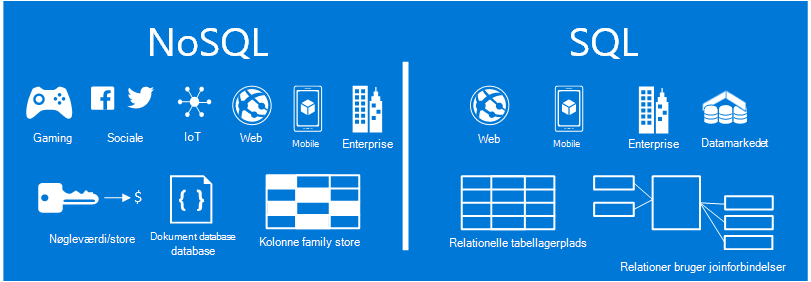
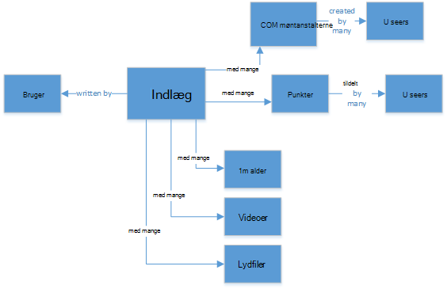
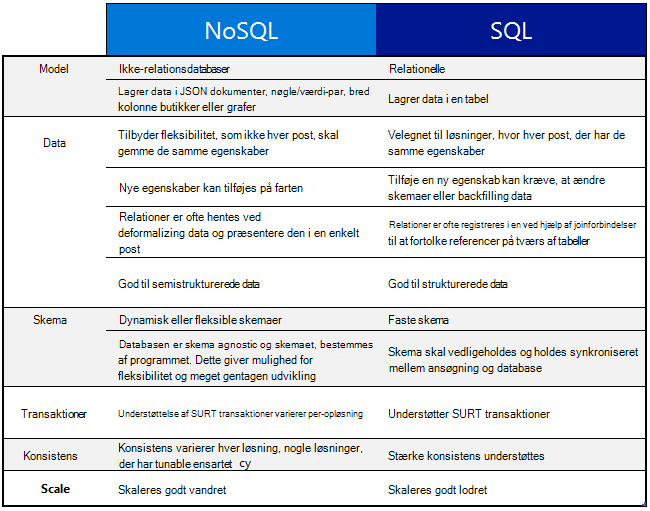
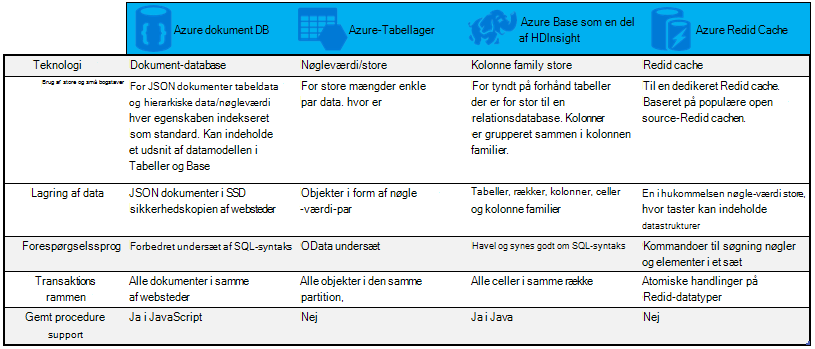

<properties
    pageTitle="Hvornår skal jeg bruge NoSQL vs SQL | Microsoft Azure"
    description="Sammenlign fordelene ved at bruge NoSQL ikke-relationelle løsninger kontra SQL-løsninger. Få mere at vide om et af Microsoft Azure NoSQL tjenester eller SQL Server bedst passer til det pågældende scenarie."
    keywords="nosql eller-sql, hvornår du skal bruge NoSQL, sql vs nosql"
    services="documentdb"
    documentationCenter=""
    authors="mimig1"
    manager="jhubbard"
    editor=""/>

<tags
    ms.service="documentdb"
    ms.workload="data-services"
    ms.tgt_pltfrm="na"
    ms.devlang="dotnet"
    ms.topic="article" 
    ms.date="06/24/2016"
    ms.author="mimig"/>

# NoSQL vs SQL

SQL Server og relationsdatabaser (RDBMS) har været gå til databaser i mere end 20 år. Øget brug til at behandle højere enheder og sorter af data med en hurtig hastighed er dog ændret datalagring for programmet udviklere art. For at aktivere dette scenario, har fået NoSQL databaser, der kan gemmes ustrukturerede og forskellige data skaleres til brug i popularitets. 

NoSQL er en kategori af databaser klart forskellige fra SQL-databaser. NoSQL bruges ofte til at referere til systemer til administration af data, der er "Ikke SQL" eller en metode til administration af data, der indeholder "ikke kun SQL". Der findes et antal teknologier i NoSQL kategori, herunder dokument databaser, nøgleværdi butikker, kolonne family butikker og graph databaser, som er populære med gaming, sociale, og IoT apps.

Mål i denne artikel er at hjælpe dig med at få mere at vide om forskellene mellem NoSQL og SQL, og give dig en introduktion til NoSQL og SQL-tilbud fra Microsoft.  

## Hvornår skal jeg bruge NoSQL?

Lad os Forestil dig, at du opretter et nyt websted med sociale aftale. Brugere kan oprette indlæg og tilføje billeder, videoer og musik til det. Andre brugere kan skrive en kommentar til indlæggene og give point (synes godt om) til at vurdere indlæggene. Landingssiden har en feed af indlæg, som brugerne kan dele og interagere med. 

Så hvordan gemmer du disse data? Hvis du kender til SQL, kan du starte tegning nogenlunde sådan ud:

Så langt, så godt, men nu synes om strukturen i en enkelt meddelelse og hvordan du kan få den vist. Hvis du vil vise indlægget og den tilknyttede billeder, lyd, video, kommentarer, punkter og brugeroplysninger på et websted eller et program, har du vil udføre en forespørgsel med otte tabel joinforbindelser lige til at hente indholdet. Forestil dig nu en strøm af indlæg, der dynamisk indlæse og vises på skærmen, og du kan nemt forudsige, at det vil kræver tusindvis af forespørgsler og mange joinforbindelser til at fuldføre opgaven.

Nu kan du bruge en relationel løsning som SQL Server til at gemme data -, men der er en anden mulighed, en NoSQL-indstilling, der forenkler tilgangen. Ved at transformere indlæg i en JSON-dokument som følgende og gemme den i DocumentDB, en Azure NoSQL dokument database-tjeneste, kan du øge ydeevnen og hente det hele indlæg med en forespørgsel og ingen joinforbindelser. Det er en nemmere mere helt almindelige, og flere performant resultat.

    {
        "id":"ew12-res2-234e-544f",
        "title":"post title",
        "date":"2016-01-01",
        "body":"this is an awesome post stored on NoSQL",
        "createdBy":User,
        "images":["http://myfirstimage.png","http://mysecondimage.png"],
        "videos":[
            {"url":"http://myfirstvideo.mp4", "title":"The first video"},
            {"url":"http://mysecondvideo.mp4", "title":"The second video"}
        ],
        "audios":[
            {"url":"http://myfirstaudio.mp3", "title":"The first audio"},
            {"url":"http://mysecondaudio.mp3", "title":"The second audio"}
        ]
    }

Disse data kan desuden være opdelt efter indlæg id, så dataene kan skalere naturligt og udnytte NoSQL skala egenskaber. Også tillade NoSQL systemer udviklere løsn konsistens og tilbyde meget tilgængelige apps.  Til sidst skal kræver denne løsning ikke udviklere til at definere, administrere og vedligeholde skema i det data niveau tillade til hurtig gentagelse.

Du kan derefter oprettes på denne løsning ved hjælp af andre Azure tjenester:

- [Azure søgning](https://azure.microsoft.com/services/search/) kan bruges til at aktivere brugere til at søge efter indlæg via webappen.
- [Azure App Services](https://azure.microsoft.com/services/app-service/) kan bruges til at være vært for programmer og baggrundsprocesser.
- [Azure Blob-lager](https://azure.microsoft.com/services/storage/) kan bruges til at gemme fuld brugerprofiler, herunder billeder.
- [Azure SQL-Database](https://azure.microsoft.com/services/sql-database/) kan bruges til at gemme store mængder data, som logonoplysninger og data for brugsstatistik.
- [Azure Machine Learning](https://azure.microsoft.com/services/machine-learning/) kan bruges til at opbygge viden og intelligence, som kan give feedback til processen og til at udvikle det rigtige indhold til de rigtige brugere.

Sociale aftale webstedet er kun et scenarie, hvor en NoSQL database er den rigtige datamodel til jobbet. Hvis du er interesseret i at læse mere om dette scenario, og hvordan du model dine data til DocumentDB i programmerne på sociale medier, skal du se [foregår sociale med DocumentDB](documentdb-social-media-apps.md). 

## Sammenligning af NoSQL eller-SQL

Følgende tabel sammenligner de vigtigste forskelle mellem NoSQL og SQL. 

Hvis en NoSQL database, der bedst passer til dine behov, kan du fortsætte til næste afsnit for at få flere oplysninger om de tilgængelige fra Azure NoSQL tjenester. Ellers hvis en SQL-database, der bedst passer til dine behov, gå til [Hvad er Microsoft SQL-tilbud?](#what-are-the-microsoft-sql-offerings)

## Hvad er Microsoft Azure NoSQL tilbud?

Azure har fire fuldt administreret NoSQL tjenester: 

- [Azure DocumentDB](https://azure.microsoft.com/services/documentdb/)
- [Azure-Tabellager](https://azure.microsoft.com/services/storage/)
- [Azure HBase som en del af HDInsight](https://azure.microsoft.com/services/hdinsight/)
- [Azure Redis Cache](https://azure.microsoft.com/services/cache/)

Det følgende diagram til sammenligning overblik over de vigtigste differentiators for hver tjeneste. Hvilken beskriver bedst passer til dit program? 

Hvis en eller flere af disse tjenester kan imødekommer behovet hos dit program, kan du lære mere med følgende ressourcer: 

- [DocumentDB læringssti](https://azure.microsoft.com/documentation/learning-paths/documentdb/) og [DocumentDB use cases](documentdb-use-cases.md)
- [Introduktion til Azure-tabellager](../storage/storage-dotnet-how-to-use-tables.md)
- [Hvad er HBase i HDInsight](../hdinsight/hdinsight-hbase-overview.md)
- [Redis Cache læringssti](https://azure.microsoft.com/documentation/learning-paths/redis-cache/)

Gå derefter til [Næste trin](#next-steps) for at få gratis prøveversion oplysninger.

## Hvad er Microsoft SQL-tilbud?

Microsoft har fem SQL tilbud: 

- [Azure SQL-Database](https://azure.microsoft.com/services/sql-database/)
- [SQL Server på Azure virtuelle maskiner](https://azure.microsoft.com/services/virtual-machines/sql-server/)
- [SQL Server](https://www.microsoft.com/server-cloud/products/sql-server-2016/)
- [Azure SQL datawarehouse (Preview)](https://azure.microsoft.com/services/sql-data-warehouse/)
- [Analysesystem Platform (lokale maskinen)](https://www.microsoft.com/en-us/server-cloud/products/analytics-platform-system/)

Hvis du er interesseret i SQL Server på et virtuelt eller SQL-Database, og Læs derefter [Vælg en skybaseret SQL Server option: Azure SQL (PaaS)-Database eller SQL Server på Azure FOS (IaaS)](../sql-database/sql-database-paas-vs-sql-server-iaas.md) mere at vide om forskellene mellem to.

Hvis SQL lyder som den bedste løsning, skal du gå til [SQL Server](https://www.microsoft.com/server-cloud/products/) for at få mere at vide om, hvad vores Microsoft SQL-produkter og tjenester har til at tilbyde.

Gå derefter til [Næste trin](#next-steps) gratis prøveversion og evaluering links.

## Næste trin

Vi inviterer dig til at få mere at vide om vores SQL og NoSQL produkter prøver dem gratis. 

- For alle Azure tjenester, kan du tilmelde dig en [gratis prøveversion af en måned](https://azure.microsoft.com/pricing/free-trial/) og modtage 200 til bruger på Azure tjenesterne.
    - [Azure DocumentDB](https://azure.microsoft.com/services/documentdb/)
    - [Azure HBase som en del af HDInsight](https://azure.microsoft.com/services/hdinsight/)
    - [Azure Redis Cache](https://azure.microsoft.com/services/cache/)
    - [Azure SQL datawarehouse (Preview)](https://azure.microsoft.com/services/sql-data-warehouse/)
    - [Azure SQL-Database](https://azure.microsoft.com/services/sql-database/)
    - [Azure-Tabellager](https://azure.microsoft.com/services/storage/)

- Du kan rotation af en [beregning version af SQL Server 2016 på en virtuel maskine](https://azure.microsoft.com/marketplace/partners/microsoft/sqlserver2016ctp33evaluationwindowsserver2012r2/) eller henter en [evalueringsversion af SQL Server](https://www.microsoft.com/en-us/evalcenter/evaluate-sql-server-2016).
    - [SQL Server](https://www.microsoft.com/server-cloud/products/sql-server-2016/)
    - [SQL Server på Azure virtuelle maskiner](https://azure.microsoft.com/services/virtual-machines/sql-server/)

