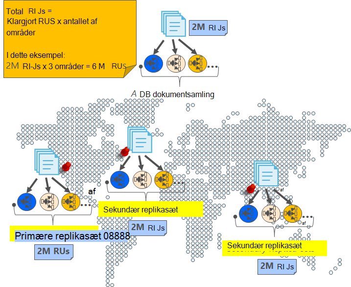

<properties
    pageTitle="Online sikkerhedskopiering og gendannelse med DocumentDB | Microsoft Azure"
    description="Få mere at vide, hvordan du udfører automatisk sikkerhedskopiering og gendannelse af NoSQL databaser med Azure DocumentDB."
    keywords="Sikkerhedskopiering og gendannelse, sikkerhedskopiering online"
    services="documentdb"
    documentationCenter=""
    authors="RahulPrasad16"
    manager="jhubbard"
    editor="monicar"/>

<tags
    ms.service="documentdb"
    ms.workload="data-services"
    ms.tgt_pltfrm="na"
    ms.devlang="multiple"
    ms.topic="article"
    ms.date="09/23/2016"
    ms.author="raprasa"/>

# Automatisk online sikkerhedskopiering og gendannelse med DocumentDB 

Azure DocumentDB tager automatisk sikkerhedskopier af alle dine data med jævne mellemrum. De automatiske sikkerhedskopier er taget uden at påvirke ydeevnen eller tilgængelighed af dine NoSQL databasehandlinger. Alle dine sikkerhedskopier gemmes separat i en anden lagringstjeneste, og disse sikkerhedskopier replikeres globalt af mod internationale nedbrud tolerance. Automatisk sikkerhedskopiering er beregnet til scenarier, når du kommer til at slette din DocumentDB af websteder og senere kræver genoprettelse af data eller en løsning til genoprettelse efter genoprettelse.  

I denne artikel starter med en hurtig opsummering af overflødige data og tilgængelighed i DocumentDB, og klik derefter beskriver sikkerhedskopier. 

## Høj tilgængelighed med DocumentDB - en opsummering

DocumentDB er udviklet til at være [globalt distribueret](documentdb-distribute-data-globally.md) – gør det muligt at skalere overførselshastighed på tværs af flere Azure områder sammen med politik indsatsbaserede failover og gennemsigtig understøttelse af flere websteder API'er. Som en databasesystem, tilbyder [99,99% tilgængelighed SLA](https://azure.microsoft.com/support/legal/sla/documentdb/v1_0/), er alle skriver i DocumentDB solidt anvendt til lokale drev ved beslutningsdygtigt replikaer i et lokale datacenter før som bekræfter til klienten. Bemærk, at høj tilgængeligheden af DocumentDB er afhængig af lokale lager og afhænger ikke af enhver ekstern storage-teknologier. Hvis databasekontoen er knyttet til mere end én Azure område, replikeres din skriver desuden på tværs af samt andre områder. Hvis du vil skalere dit overførselshastighed og adgang til data på lav latenstider, kan du få som mange læse områder, der er knyttet til databasekontoen, som du ønsker. I hvert område for Læs bevares solidt (replikerede) data på tværs af et replikasæt.  

Som vist i følgende diagram, er en enkelt DocumentDB samling [vandret opdelt](documentdb-partition-data.md). En "partition" er markeret med en cirkel i i det følgende diagram, og hver partition er gjort meget tilgængelige via et replikasæt. Dette er den lokale fordeling inden for et enkelt Azure område (angivet med X-aksen). Yderligere, skal distribueres hver partition (med dens tilsvarende replikasættet) derefter globalt på tværs af flere områder, der er knyttet til databasekontoen (for eksempel i denne illustration tre områder – af USA, vest USA og Central Indien). "Partitionssæt" er en globalt fordelt enhed bestående af flere kopier af dine data i hvert område (angivet med Y-aksen). Du kan tildele prioritet til de områder, der er knyttet til databasekontoen og DocumentDB vil transparent failover til det næste område i tilfælde af nedbrud. Du kan også manuelt simulere failover for at teste til slut tilgængeligheden af dit program.  

Følgende billede viser den høj grad af redundans med DocumentDB.

## Fuld, automatisk, online sikkerhedskopier

UPS, jeg har slettet Mine websteder eller database! Med DocumentDB, ikke kun dataene, men sikkerhedskopier af dine data er også foretages meget overflødige og tolerant til internationale nedbrud. Disse automatiseret sikkerhedskopier tages aktuelt omkring hver 4 timer. 

Sikkerhedskopier af tages uden at påvirke ydeevnen eller tilgængeligheden af din databasehandlinger. DocumentDB tager sikkerhedskopien i baggrunden, uden at forbrug din klargjort RUs eller påvirke ydeevnen og uden at påvirke tilgængeligheden af databasen NoSQL. 

I modsætning til dine data, der er gemt i DocumentDB, gemmes automatisk sikkerhedskopiering i Azure Blob-lager-tjeneste. For at garantere lav ventetid/effektiv overførslen, er øjebliksbillede af sikkerhedskopien overført til en forekomst af Azure Blob-lager i samme område som det aktuelle område, Skriv for kontoen DocumentDB database. Hver snapshot af dataene sikkerhedskopiering i Azure Blob-lager replikeres til fleksibilitet mod regionale igen via geografisk overflødige lagerplads (GRS) til et andet område. I det følgende diagram viser, at hele DocumentDB samlingen (med alle tre primære partitioner i Vest USA i dette eksempel) er sikkerhedskopieret i en ekstern Azure Blob-lager-konto i Vest USA og derefter GRS replikeres til indtastning af østasiatiske USA. 

Følgende billede viser periodiske fuld sikkerhedskopier af alle DocumentDB enheder i GRS Azure-lager.

## Opbevaringsperiode for et givet øjebliksbillede

Som beskrevet ovenfor, vi med jævne mellemrum tage øjebliksbilleder af dine data og per vores regler, vi bevarer den seneste øjebliksbillede op til 90 dage før den sidste bliver slettet. Hvis en af websteder eller kontoen slettes, gemmer DocumentDB den sidste sikkerhedskopiering i 90 dage.

## Gendanne databasen fra online sikkerhedskopien

I tilfælde af, at du ved et uheld sletter dine data, kan du [fil en supportbilletter](https://portal.azure.com/?#blade/Microsoft_Azure_Support/HelpAndSupportBlade) eller [Ring til support til Azure](https://azure.microsoft.com/support/options/) gendanne dataene fra den seneste automatiske sikkerhedskopi. For et bestemt øjebliksbillede af sikkerhedskopien skal gendannes, kræver DocumentDB, at dataene var mindst tilgængelig med os for varigheden af sikkerhedskopiering cyklussen for pågældende øjebliksbillede.

## Næste trin

Hvis du vil gentage NoSQL databasen i flere datacentre, se [distribuere dine data globalt med DocumentDB](documentdb-distribute-data-globally.md). 

Til fil Kontakt Azure understøttelse af [fil en brugertilladelse fra Azure-portalen](https://portal.azure.com/?#blade/Microsoft_Azure_Support/HelpAndSupportBlade).