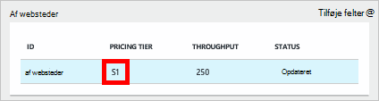
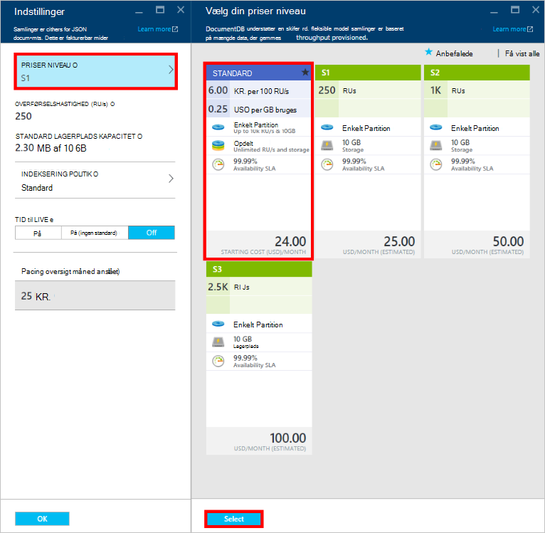
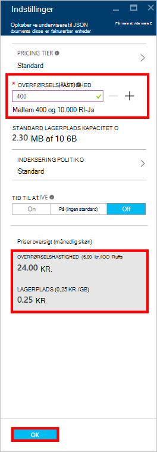
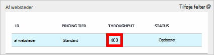

<properties
    pageTitle="Ydeevneniveauer i DocumentDB | Microsoft Azure"
    description="Få mere at vide om, hvordan ydeevneniveauer i DocumentDB gør det muligt at reservere overførselshastighed på grundlag af hver af websteder."
    services="documentdb"
    authors="mimig1"
    manager="jhubbard"
    editor="monicar"
    documentationCenter=""/>

<tags
    ms.service="documentdb"
    ms.workload="data-services"
    ms.tgt_pltfrm="na"
    ms.devlang="na"
    ms.topic="article"
    ms.date="08/26/2016"
    ms.author="mimig"/>

# Ydeevneniveauer i DocumentDB

I denne artikel indeholder en oversigt over ydeevneniveauer i [Microsoft Azure DocumentDB](https://azure.microsoft.com/services/documentdb/).

Når du har læst i denne artikel, vil du kunne besvare spørgsmål, der er følgende:  

-   Hvad er et ydeevneniveau for?
-   Hvordan er overførselshastighed reserveret til en database-konto?
-   Hvordan arbejder jeg med ydeevne?
-   Hvordan får jeg faktureret for ydeevneniveauer?

## Introduktion til ydeevne

Hver DocumentDB af websteder, der er oprettet under en standardkonto er klargjort med en tilknyttet ydeevneniveau. Hver af websteder i en database kan have et forskellige ydeevneniveau, så du kan angive flere overførselshastighed for hyppigt af websteder og mindre overførsel for sjældent er adgang til af websteder. DocumentDB understøtter begge brugerdefinerede ydeevneniveauer og foruddefineret ydeevne.  

Hvert ydeevnen har en tilknyttet [anmodning enhed (RU)](documentdb-request-units.md) grænsen. Dette er den overførselshastighed, er der reserveret til en samling, der er baseret på graden ydeevne og er tilgængelig til brug af samlingen udelukkende.

<table border="0" cellspacing="0" cellpadding="0">
    <tbody>
        <tr>
            <td valign="top">

</td>
            <td valign="top">
Detaljer
</td>
            <td valign="top">
Begrænsninger for overførselshastighed
</td>
            <td valign="top">
Lagergrænser
</td>
            <td valign="top">
Version
</td>
            <td valign="top">
API'er
</td>            
        </tr>
        <tr>
            <td valign="top">
Brugerdefinerede ydeevne
</td>
            <td valign="top">
Lagerplads forbrugsafregnede baseret på brugen i GB.

Overførselshastighed i enheder af 100 RU/s
</td>
            <td valign="top">
Ubegrænset. 400 - 250.000 anmode om enheder/s som standard (højere af anmodning)
</td>
            <td valign="top">
Ubegrænset. 250 GB som standard (højere af anmodning) 
</td>
            <td valign="top">
V2
</td>
            <td valign="top">
API 2015-12-16 og nyere
</td>  
        </tr>
        <tr>
            <td valign="top">
Foruddefinerede ydeevne
</td>
            <td valign="top">
10 GB reserveret lagerplads.

S1 = 250 RU/s, S2 = 1000 RU/s, S3 = 2500 RU/s
</td>
            <td valign="top">
2500 RU/s
</td>
            <td valign="top">
10 GB
</td>
            <td valign="top">
V1
</td>
            <td valign="top">
En hvilken som helst
</td>  
        </tr>        
    </tbody>
</table>                

DocumentDB giver mulighed for et bredt udvalg af Databasefunktioner, herunder forespørgsler, udløsere og forespørgsler med brugerdefinerede funktioner, gemt procedurer. De behandling omkostninger, der er knyttet til hver af disse funktioner varierer afhængigt af CPU'EN, EY og hukommelse kræves for at fuldføre handlingen. I stedet tænker over og administration af hardwareressourcer, kan du betragte en anmodning om enhed som et enkelt mål for ressourcerne, der kræves for at udføre forskellige databasehandlinger og servicere en anmodning om anvendelse.

Af websteder kan oprettes via [Microsoft Azure-portalen](https://portal.azure.com), [REST-API](https://msdn.microsoft.com/library/azure/mt489078.aspx) eller en anden [DocumentDB SDK'er](https://msdn.microsoft.com/library/azure/dn781482.aspx). DocumentDB APIs gør det muligt at angive en samling præstationsniveau.

> [AZURE.NOTE] En samling præstationsniveau kan justeres gennem API'erne eller [Microsoft Azure-portalen](https://portal.azure.com/). Ydeevnen niveau ændringer forventes at fuldført inden for 3 minutter.

## Angivelse af ydeevneniveauer for af websteder
Når en af websteder er oprettet, er fuld tildeling af RUs baseret på niveauet for udpegede ydeevne reserveret til samlingen.

Bemærk, at med både brugerdefinerede og foruddefinerede ydeevneniveauer DocumentDB fungerer baseret på reservation af overførsel. Ved at oprette en samling, et program har reserveret og faktureres for reserveret overførselshastighed uanset hvor meget af overførselshastighed bruges aktivt. Lagerplads er forbrugsafregnede baseret på forbrug med brugerdefinerede ydeevneniveauer, men med foruddefinerede ydeevneniveauer, der er reserveret 10 GB lagerplads på tidspunktet for oprettelsen af websteder.  

Når af websteder er oprettet, kan du ændre niveauet ydeevne via DocumentDB SDK'er eller via portalen Azure klassisk.

> [AZURE.IMPORTANT] DocumentDB Standard samlinger faktureres med en time hastighed og hver af de websteder, du opretter vil blive faktureret for et minimum én time af brug af.

Hvis du justerer en samling inden for en time præstationsniveau, vil du blive faktureret for det højeste ydeevneniveau angive under timen. Eksempelvis hvis du øger dit ydeevneniveau for for en samling på 8:53 am skal du betale til det nye fra og med kl. På samme måde, hvis du reducere din ydeevneniveau på 8:53 am, anvendes den nye sats på 9:00 am.

Anmodning om enheder er reserveret til hver af websteder, der er baseret på det niveau sæt ydeevne. Anmodning om enhed forbrug evalueres som en hver anden rente. Programmer, der overskrider klargjort anmodning enhed rente (eller ydeevneniveau) på en samling sænkes, før rente, der falder under det reserverede niveau for den pågældende samling. Hvis programmet kræver et højere niveau af overførselshastighed, kan du øge ydeevneniveau for hver af websteder.

> [AZURE.NOTE] Hvis dit program overstiger ydeevneniveauer for en eller flere af websteder, sænkes anmodninger på grundlag af hver af websteder. Det betyder, at nogle anmodninger om programmet kan lykkes, mens andre kan være begrænset. Det anbefales at tilføje et lille antal nye forsøg ved begrænset for at kunne håndtere spidser i anmodning trafik.

## Arbejde med ydeevne
DocumentDB af websteder kan du gruppere data baseret på både forespørgsel mønstre og ydeevne passer til dit program. Med Documentdbs automatisk indeksering og understøttelse af forespørgsler er det helt almindeligt at placere forskellige dokumenter i den samme websteder. De vigtigste overvejelser, beslutte, om der skal bruges separate samlinger, omfatter:

- Forespørgsler – en samling er området for udførelse af forespørgsel. Hvis du har brug at forespørge på tværs af et sæt dokumenter, stammer de mest effektive Læs mønstre fra sig dokumenter i en enkelt samling.
- Transaktioner – alle transaktioner er fastsat til inden for en enkelt samling. Hvis du har dokumenter, der skal opdateres inden for en enkelt lagret procedure eller udløser, skal de være gemt i den samme websteder. Mere specifikt er en Partitionsnøgle i en samling i transaction rammen. Se [partitionering i DocumentDB](documentdb-partition-data.md) kan finde flere oplysninger.
- Ydeevnen isolationsniveauet – en samling har en tilknyttet ydeevneniveau. Dette sikrer, at hver af websteder har en mere forudsigelige ydeevne gennem reserveret RUs. Data kan tildeles forskellige af websteder med forskellige ydeevneniveauer, ud fra access hyppighed.

> [AZURE.IMPORTANT] Det er vigtigt at forstå, du vil blive faktureret til fuld standard rente, der er baseret på antallet af websteder, der er oprettet af programmet.

Det anbefales, at dit program gør brug af et lille antal af websteder, medmindre du har stor lagerplads eller overførselshastighed krav. Sørg for, at du har forstået programmet mønstre for oprettelse af nye websteder. Du kan vælge at reservere oprettelsen af websteder som handlingen management håndteres uden for dit program. På samme måde ændres at justere niveauet af ydeevnen for en samling den hver time rente, hvormed samlingen er faktureret. Du bør overvåge ydeevnen af websteder, hvis dit program justeres disse dynamisk.

## Ændre fra S1, S2, S3 til brugerdefinerede ydeevne

Følg disse trin for at ændre i at bruge foruddefinerede overførselshastighed niveauer til brugerdefinerede overførselshastighed niveauer i portalen Azure. Ved hjælp af brugerdefinerede overførselshastighed niveauer, kan du tilpasser din overførselshastighed til dine behov. Og hvis du stadig bruger en S1-konto, du kan øge din standard overførselshastighed fra 250 RU/s til 400 RU/s med blot nogle få klik.

Du kan finde flere oplysninger om priser ændringer der er relateret til brugerdefinerede og foruddefinerede overførselshastigheden, kan du se blogindlægget [DocumentDB: alt, hvad du bør vide om at bruge de nye indstillinger i priser](https://azure.microsoft.com/blog/documentdb-use-the-new-pricing-options-on-your-existing-collections/).

> [AZURE.VIDEO changedocumentdbcollectionperformance]

1. I din browser skal du gå til [**Azure-portalen**](https://portal.azure.com).
2. Klik på **Gennemse** -> **DocumentDB konti**og derefter vælge DocumentDB kontoen til at ændre.   
3. Vælg databasen, til at ændre i objektiv til **databaser** , og vælg derefter samlingen til at ændre i bladet **Database** . Brug af foruddefinerede overførselshastighed-konti har et priser lag i S1, S2 eller S3.

      

4. Klik på **flere**, derefter **Indstillinger** på linjen øverst i bladet **af websteder** .   
5. Klik på **Priser niveau** i bladet **Indstillinger** , og Bemærk, at månedlige estimatet for hver enkelt plan vises i bladet **vælge din priser niveau** . Klik på **Standard**for at ændre til brugerdefinerede overførselshastighed, og klik derefter på **Vælg** for at gemme ændringerne.

      

6. **Priser niveau** ændres til **Standard** , og feltet **overførselshastighed (RU/s)** vises med en standardværdi på 400 tilbage i bladet **Indstillinger** . Angive overførselshastighed mellem 400 og 10.000 [anmode om enheder](documentdb-request-units.md)/second (RU/s). **Oversigt over priser** nederst på siden opdateres automatisk til at levere en estimering af den månedlige pris. Klik på **OK** for at gemme ændringerne.

    

7. Du kan kontrollere den nye overførsel af gruppen af websteder på bladet **Database** igen.

    

Hvis du beslutter, at du har brug for flere gennemløb (større end 10.000 RU/s) eller mere lagerplads (større end 10GB) kan du oprette en partitioneret af websteder. Hvis du vil oprette en partitioneret af websteder, skal du se [oprette en samling](documentdb-create-collection.md).

>[AZURE.NOTE] Ændre niveauet for en samling ydeevne kan tage op til 2 minutter.

## Ændre ydeevneniveauer ved hjælp af .NET SDK

En anden indstilling til at ændre dine samlinger ydeevneniveauer er gennem vores SDK'er. I dette afsnit beskrives kun ændre en samling ydeevneniveau ved hjælp af vores [.NET SDK](https://msdn.microsoft.com/library/azure/dn948556.aspx), men fremgangsmåden er den samme for vores andre [SDK'er](https://msdn.microsoft.com/library/azure/dn781482.aspx). Hvis du er ny bruger af vores .NET SDK, skal du gå til vores [Introduktion – selvstudium](documentdb-get-started.md).

Her er et kodestykke til ændring af tilbud overførselshastigheden til 50.000 anmodning enheder sekundet:

    //Fetch the resource to be updated
    Offer offer = client.CreateOfferQuery()
                      .Where(r => r.ResourceLink == collection.SelfLink)    
                      .AsEnumerable()
                      .SingleOrDefault();

    // Set the throughput to 5000 request units per second
    offer = new OfferV2(offer, 5000);

    //Now persist these changes to the database by replacing the original resource
    await client.ReplaceOfferAsync(offer);

    // Set the throughput to S2
    offer = new Offer(offer);
    offer.OfferType = "S2";

    //Now persist these changes to the database by replacing the original resource
    await client.ReplaceOfferAsync(offer);

> [AZURE.NOTE] Samlinger, der er klargjort med under 10.000 anmodning enheder per kan andet overføres mellem tilbud med brugerdefinerede overførselshastighed og foruddefinerede overførselshastighed (S1, S2, S3) når som helst. Samlinger, der er klargjort med over 10.000 anmodning enheder per kan andet ikke konverteres til foruddefinerede overførselshastighed niveauer.

Besøg [MSDN](https://msdn.microsoft.com/library/azure/microsoft.azure.documents.client.documentclient.aspx) for at se flere eksempler og lære mere om vores tilbud metoder:

- [**ReadOfferAsync**](https://msdn.microsoft.com/library/azure/microsoft.azure.documents.client.documentclient.readofferasync.aspx)
- [**ReadOffersFeedAsync**](https://msdn.microsoft.com/library/azure/microsoft.azure.documents.client.documentclient.readoffersfeedasync.aspx)
- [**ReplaceOfferAsync**](https://msdn.microsoft.com/library/azure/microsoft.azure.documents.client.documentclient.replaceofferasync.aspx)
- [**CreateOfferQuery**](https://msdn.microsoft.com/library/azure/microsoft.azure.documents.linq.documentqueryable.createofferquery.aspx)

## Ændre gennemløb af en samling

Hvis du allerede bruger brugerdefinerede ydeevne, kan du ændre overførselshastighed for af websteder ved at gøre følgende. Hvis du vil ændre en S1, S2 eller S3 ydeevne niveau (foruddefinerede ydeevne) til brugerdefinerede ydeevne, skal du se [ændre fra S1, S2, S3 til brugerdefinerede ydeevne](#changing-performance-levels-using-the-azure-portal).

1. I din browser skal du gå til [**Azure-portalen**](https://portal.azure.com).
2. Klik på **Gennemse** -> **DocumentDB konti**og derefter vælge DocumentDB kontoen til at ændre.   
3. Vælg databasen, til at ændre på bladet **DocumentDB konto** i objektiv til **databaser** , og vælg derefter samlingen til at ændre i bladet **Database** .
4. Klik på **Indstillinger** på linjen øverst i bladet **af websteder** .   
5. Forøge værdien i feltet **overførselshastighed (RU/s)** i bladet **Indstillinger** , og klik derefter på **OK** for at gemme ændringerne. **Oversigt over priser** i bunden af bladet er blevet opdateret til at vise den nye beregnede månedlige pris af samlingen i et enkelt område.

    

Hvis du ikke er sikker hvor meget at øge din overførselshastighed, se [Estimating overførselshastighed skal](documentdb-request-units.md#estimating-throughput-needs) og [anmode om enhed Lommeregner](https://www.documentdb.com/capacityplanner).

## Næste trin

Hvis du vil vide mere om priser og administrere data med Azure DocumentDB, kan du gennemse disse ressourcer:

- [DocumentDB priser](https://azure.microsoft.com/pricing/details/documentdb/)
- [Administrere DocumentDB kapacitet](documentdb-manage.md)
- [Modellering data i DocumentDB](documentdb-modeling-data.md)
- [Partitionering data i DocumentDB](documentdb-partition-data.md)
- [Anmode om enheder](http://go.microsoft.com/fwlink/?LinkId=735027)

Hvis du vil vide mere om DocumentDB skal du se Azure DocumentDB [dokumentation](https://azure.microsoft.com/documentation/services/documentdb/).

For at komme i gang med skala og performance-test med DocumentDB skal du se [skala test med Azure DocumentDB af ydeevne og](documentdb-performance-testing.md).

[1]: ./media/documentdb-performance-levels/documentdb-change-collection-performance7-9.png
[2]: ./media/documentdb-performance-levels/documentdb-change-collection-performance10-11.png
