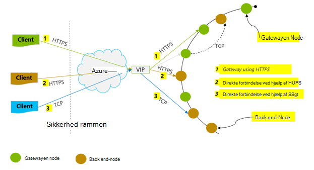
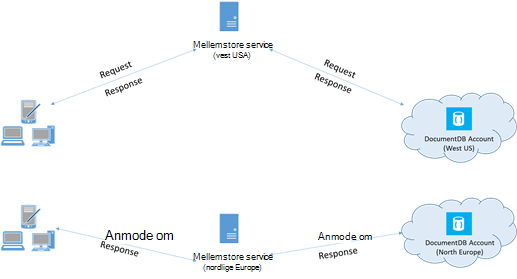

<properties 
    pageTitle="Tip om DocumentDB ydeevne | Microsoft Azure" 
    description="Få mere at vide klient konfigurationsindstillinger til at forbedre Azure DocumentDB databasens ydeevne"
    keywords="hvordan du kan forbedre databasens ydeevne"
    services="documentdb" 
    authors="mimig1" 
    manager="jhubbard" 
    editor="" 
    documentationCenter=""/>

<tags 
    ms.service="documentdb" 
    ms.workload="data-services" 
    ms.tgt_pltfrm="na" 
    ms.devlang="na" 
    ms.topic="article" 
    ms.date="10/17/2016" 
    ms.author="mimig"/>

# Ydeevnen tip til DocumentDB

Azure DocumentDB er en hurtig og fleksibel distribueret database, der kan skaleres problemfrit med garanterede ventetid og overførselshastighed. Du behøver ikke at foretage ændringer af overordnede arkitekturen eller skrive komplekse kode for at tilpasse din database med DocumentDB. Det er lige så nemt som at foretage et enkelt API-opkald eller [SDK metode ringe](documentdb-performance-levels.md#changing-performance-levels-using-the-net-sdk)skalering op og ned. Da DocumentDB der opnås adgang via netværk opkald er der klientsiden optimeringer, kan du opnå optimal ydeevne.

Så hvis du beder "Hvordan kan jeg forbedre databaseydeevnen min?" Overvej følgende indstillinger:

## Netværk

1. **Forbindelse politik: Brug direkte forbindelsestilstand**
    
    Hvordan en klient opretter forbindelse til Azure DocumentDB har vigtige konsekvenserne ydeevne, især med hensyn til observerede klientsiden ventetid. Der er to vigtige konfigurationsindstillinger til konfiguration af klienten forbindelse politik – forbindelse *tilstand* og [forbindelse *protocol*](#connection-protocol).  De to tilgængelige tilstande er:

    1. Gateway-tilstand (standard)
    2. Direkte tilstand

    Da DocumentDB er et fordelt storage-system, DocumentDB ressourcer som samlinger er opdelt på tværs af flere computere og hver partition replikeres til høj tilgængelighed. De logiske til fysisk adresseoversættelse gemmes i en routing-tabel, der findes også internt som en ressource.

    I Gateway-tilstand udføre DocumentDB gateway maskiner denne rute, hvilket gør det muligt klient kode, der skal være enkel og kompakt. En klientprogrammet udsteder anmodninger til DocumentDB gateway-computere, som oversætte den logiske URI i anmodningen, så den fysiske adresse på noden back end- og videresende anmodningen korrekt.  Derimod i direkte tilstand skal klienter vedligeholde – og med jævne mellemrum opdatere – en kopi af denne routing-tabel, og derefter direkte oprette forbindelse til back end-DocumentDB knuderne.

    Gateway-tilstand er understøttet på alle SDK platforme og er konfigureret standard.  Hvis dit program kører inden for virksomhedens netværk med faste firewall begrænsninger, er Gateway tilstand det bedste valg, da det bruger HTTPS standardport og et enkelt slutpunkt. Den ydeevne fordeling er dog, Gateway tilstand vedrører en ekstra netværk hop, hver gang data læses eller skrives til DocumentDB.   På grund af dette tilbyder direkte tilstand bedre ydeevne på grund af færre netværk hop.

2. **Forbindelse politik: Brug af TCP-protokollen**

    Når udnytte direkte tilstand, er der to protocol indstillinger tilgængelige:

    - TCP
    - HTTPS

    DocumentDB tilbyder en enkel og åbne RESTful programming model over HTTPS. Desuden, indeholder den en effektiv TCP-protokollen, som er også RESTful i modellen, kommunikation og er tilgængelige via .NET klienten SDK. Både direkte TCP og HTTP'ER Brug SSL til indledende godkendelse og kryptering trafik. Bedste ydeevne ved brug af TCP-protokollen, når det er muligt. 

    Når du bruger TCP i Gateway-tilstand, TCP-Port 443 er DocumentDB port, og 10250 er MongoDB API-port. Når du bruger TCP i direkte tilstand, ud over Gateway-portene, skal du sikre, at port mellem 10000 og 20000 er åben, fordi DocumentDB bruger dynamiske TCP-porte. Hvis disse porte, der ikke er åbne, og du forsøger at bruge TCP, modtager du fejlen 503 Tjenesten er ikke tilgængelig. 

    Tilstanden Connectivity er konfigureret i oprettelsen af forekomsten DocumentClient med parameteren ConnectionPolicy. Hvis direkte tilstand bruges, kan protokollen også angives i parameteren ConnectionPolicy.

        var serviceEndpoint = new Uri("https://contoso.documents.net");
        var authKey = new "your authKey from Azure Mngt Portal";
        DocumentClient client = new DocumentClient(serviceEndpoint, authKey, 
        new ConnectionPolicy
        {
            ConnectionMode = ConnectionMode.Direct,
            ConnectionProtocol = Protocol.Tcp
        });

    Da TCP understøttes kun i direkte tilstand, hvis Gateway tilstand bruges, HTTPS-protokollen er altid bruges til at kommunikere med Gateway, og værdien fra Protocol i ConnectionPolicy ignoreres.

    

3. **Ringe til OpenAsync for at undgå Start ventetid på første anmodning**

    Den første anmodning får som standard en højere ventetid, fordi den ikke har til at hente adressetabellen routing. For at undgå denne Start ventetid på den første anmodning, skal du ringe OpenAsync() én gang under initialisering på følgende måde.

        await client.OpenAsync();

4. **Placere-klienter med samme Azure område for ydeevne**

    Når det er muligt, kan du placere alle programmer, der ringer DocumentDB i samme område som DocumentDB databasen. Ved en tilnærmet sammenligning opkald til DocumentDB inden for samme region fuldført inden for 1-2 ms, men ventetid mellem Vest og østkyst USA er > 50 ms. Denne ventetid kan sandsynligt variere fra at anmode om afhængigt af ruten truffet anmodningen, som den går fra klienten til Azure datacenter grænsen. Den lavest mulige forsinkelse opnås ved at sikre opkald programmet er placeret i det samme Azure område som den klargjorte DocumentDB slutpunkt. Du kan finde en liste over tilgængelige områder [Azure områder](https://azure.microsoft.com/regions/#services).

    

5. **Øge antallet af tråde/opgaver**

    Da der foretages opkald til DocumentDB via netværket, skal du muligvis variere graden af parallelitet af dine anmodninger, så klientprogrammet tilbringer meget lidt tid, der venter mellem anmodninger. For eksempel, hvis du bruger. Nettooversigts [Opgave parallelle bibliotek](https://msdn.microsoft.com//library/dd460717.aspx), oprette i den rækkefølge, 100s opgaver læsning eller skrivning til DocumentDB.

## SDK brugen

1. **Installere den seneste SDK**

    DocumentDB SDK'er er konstant forbedres for at give den bedste ydeevne. Se siderne [DocumentDB SDK](documentdb-sdk-dotnet.md) til at bestemme den seneste SDK og gennemse forbedringer. 

2. **Bruge en separat DocumentDB klient til levetiden for dit program**
  
    Bemærk, at hver DocumentClient forekomst er tråd sikker og udfører effektiv Forbindelsesstyring og adresse cachelagring, når du kører i direkte tilstand. For at give effektiv Forbindelsesstyring og bedre ydeevne ved DocumentClient, anbefales det at bruge en enkelt forekomst af DocumentClient per AppDomain til levetiden for programmet.

3. **Øge System.Net MaxConnections per host**

    DocumentDB anmodninger der foretages over HTTPS/RESTEN som standard, og at der foretages grænsen for forbindelser per værtsnavn eller IP-adresse. Du skal muligvis angive maksimumforbindelser til en højere værdi (100-1000), så biblioteket klient kan udnytte flere samtidige forbindelser til DocumentDB. .NET SDK 1.8.0 og derover, standardværdien for [ServicePointManager.DefaultConnectionLimit](https://msdn.microsoft.com/library/system.net.servicepointmanager.defaultconnectionlimit.aspx) er 50, og hvis du vil ændre værdien, du kan angive [Documents.Client.ConnectionPolicy.MaxConnectionLimit](https://msdn.microsoft.com/en-us/library/azure/microsoft.azure.documents.client.connectionpolicy.maxconnectionlimit.aspx) til en højere værdi.  

4. **Justering af parallelle forespørgsler for partitioneret af websteder**

     DocumentDB .NET SDK version 1.9.0 og over understøttelse af parallelle forespørgsler, der gør det muligt at forespørge på en partitioneret samling parallelt (se [arbejde med SDK'er](documentdb-partition-data.md#working-with-the-sdks) og relaterede [kodeeksempler](https://github.com/Azure/azure-documentdb-dotnet/blob/master/samples/code-samples/Queries/Program.cs) for at få flere oplysninger). Parallelle forespørgsler er designet til at forbedre forespørgselsventetid og overførselshastighed over deres seriel modstykke. Parallelle forespørgsler giver to parametre, som brugere kan finjustere for at brugerdefineret Tilpas deres krav, (a) MaxDegreeOfParallelism: til at styre det maksimale antal partitioner end kan forespørges i parallelt og (b) MaxBufferedItemCount: til at styre antallet allerede hentede resultater. 
    
    (a) ***optimering af MaxDegreeOfParallelism\: *** 
    Parallel forespørgsel fungerer ved at forespørge flere partitioner parallelt. Dog hentes data fra en enkelt partitioneret Indsaml serielt i forhold til forespørgslen. Så, angive MaxDegreeOfParallelism til antallet partitioner har maksimale risikoen for at opnå de fleste performant forespørgslen, forudsat alle andre betingelser for systemet forbliver de samme. Hvis du ikke kender antallet af partitioner, kan du angive MaxDegreeOfParallelism til et høj tal og systemet vælger minimum (antallet af partitioner, leveres brugerinput) som MaxDegreeOfParallelism. 
    
    Det er vigtigt at være opmærksom på, parallelle forespørgsler giver de bedste fordele, hvis dataene er jævnt fordelt på tværs af alle partitioner i forhold til forespørgslen. Hvis samlingen partitioneret opdeler en sådan måde, at hele eller en størstedelen af data, der returneres af en forespørgsel er koncentreret i et par partitioner (én partition i værste tilfælde) og derefter ydeevnen for forespørgslen ville være bottlenecked ved partitionerne. 
    
    (b) ***optimering af MaxBufferedItemCount\: *** 
    parallelle forespørgsel er udviklet til at hente allerede resultater, mens den aktuelle mængde resultater er behandlet af klienten. Automatisk indsætning hjælper med at overordnede ventetid forbedring af en forespørgsel. MaxBufferedItemCount er parameteren til at begrænse mængden allerede hentede resultater. Angiver MaxBufferedItemCount til det forventede antal resultater returneret (eller et højere tal), kan forespørgslen til at modtage maksimale benefit fra automatisk indsætning. 
    
    Bemærk, at automatisk indsætning fungerer på samme måde, uanset MaxDegreeOfParallelism, og der er en enkelt bufferen for data fra alle partitioner.  

5. **Slå serversiden globalt katalog**
    
    Reducere hyppigheden for Spildopsamling kan hjælpe i nogle tilfælde. Angiv [gcServer](https://msdn.microsoft.com/library/ms229357.aspx) i .NET, til sand.

6. **Implementere backoff med RetryAfter intervaller**
 
    Under test af ydeevne, skal du øge indlæsning, indtil et lille antal anmodninger få begrænset. Hvis begrænset, bør klientprogrammet backoff på begrænsning for intervallet for server-angivet gentagelse. Overholde lovgivningen om backoff sikrer, at du bruger minimale mængde ventetiden mellem nye forsøg. Understøttelse af flere forsøg politik er inkluderet i Version 1.8.0 og over DocumentDB [.NET](documentdb-sdk-dotnet.md) og [Java](documentdb-sdk-java.md)og version 1.9.0 og over [Node.js](documentdb-sdk-node.md) og [Python](documentdb-sdk-python.md). Se [Exceeding reserveret overførselshastighed begrænser](documentdb-request-units.md#exceeding-reserved-throughput-limits) og [RetryAfter](https://msdn.microsoft.com/library/microsoft.azure.documents.documentclientexception.retryafter.aspx)kan finde flere oplysninger.

7. **Skalere ud af din klient-arbejdsbyrde**

    Hvis du tester på høj overførselshastighed niveauer (> 50.000 RU/s), klientprogrammet kan blive flaskehals på grund af maskine markeret ud på CPU- eller netværksproblemer anvendelsen. Hvis du kommer til dette punkt, kan du fortsætte til push kontoen DocumentDB yderligere ved at skalere ud af dine klientprogrammer på tværs af flere servere.

8. **Cache dokument URI'er for nederste Læs ventetid**

    Cache dokument URI'er, når det er muligt for den bedste Læs ydeevne.

9. **Tilpasse størrelsen på siden til forespørgsler/læst feeds for at forbedre ydeevnen**

    Når udføre en masse læse af dokumenter ved hjælp af læst feed funktionalitet (det vil sige ReadDocumentFeedAsync), eller når der gives en DocumentDB SQL-forespørgsel, returneres resultaterne i en segmenteret måde hvis resultatsættet er for stor. Resultaterne returneres i dele af 100 elementer eller 1 MB som standard, uanset hvilken grænsen påløber første. 

    For at reducere antallet af netværk afrunde rejser, der kræves for at hente alle relevante resultater, du kan øge sidestørrelsen ved hjælp af x-ms-Maks--antallet af elementer anmodning sidehoved til op til 1000. I tilfælde, hvor du vil have vist kun nogle få resultater, f.eks., hvis din bruger interface eller program API returnerer kun 10 resultatet et tidspunkt, du kan også sænke sidestørrelse til 10 at reducere overførselshastigheden consumed til læsning og forespørgsler.

    Du kan også angive sidestørrelsen ved hjælp af de tilgængelige DocumentDB SDK'er.  Eksempel:
    
        IQueryable<dynamic> authorResults = client.CreateDocumentQuery(documentCollection.SelfLink, "SELECT p.Author FROM Pages p WHERE p.Title = 'About Seattle'", new FeedOptions { MaxItemCount = 1000 });

10. **Øge antallet af tråde/opgaver**

    Se [øge antallet af tråde/opgaver](#increase-threads) i afsnittet netværk.

## Indeksering politik

1. **Brug fløde indeksering af hurtigere spidsbelastning tid indtagelse satser**

    DocumentDB kan du angive – på niveauet af websteder – en indeksering politikken, som gør det muligt at vælge, om du vil dokumenterne i en samling skal indekseres automatisk eller ej.  Desuden kan du også vælge mellem synkron (ensartede) og asynkron (Lazy) indeks opdateringer. Som standard opdateres indekset synkront på hver Indsæt, Erstat eller sletning af et dokument til samlingen. Synkront muliggør tilstand forespørgsler imødekomme det samme [konsistens niveau](documentdb-consistency-levels.md) som for dokument læser alle straks til indeks "holde trit".
    
    Fløde indeksering anses for scenarier, hvor data er skrevet på lyseksplosioner, og du vil amortisere det arbejde, der kræves til indeks indhold over en længere periode. Fløde indeksering kan du også bruge din klargjort overførselshastighed effektivt og betjene skriveanmodninger på spidsbelastning med minimale ventetid. Det er vigtigt at Bemærk dog, at når fløde indeksering er aktiveret, forespørgselsresultater bliver til sidst ensartet uanset niveauet konsistens konfigureret til kontoen DocumentDB.

    Det vil sige, ensartet indeksering tilstand (IndexingPolicy.IndexingMode er indstillet til ensartede) har den højeste anmodning enhedspris per skrive, mens du Lazy indeksering tilstand (IndexingPolicy.IndexingMode er indstillet til Lazy) og ingen indeksering (IndexingPolicy.Automatic er indstillet til FALSK) har nul indeksering omkostninger på tidspunktet for skrivning.

2. **Udelade ubrugte stier i indeksering af hurtigere skriver**

    Documentdbs indeksering politik giver også muligt at angive, hvilke dokument-adresser for at medtage eller udelade fra indeksering ved at udnytte indeksering stier (IndexingPolicy.IncludedPaths og IndexingPolicy.ExcludedPaths). Brug af indeksering af stier kan tilbyde forbedrede Skriv ydeevne og nederste indeks lagerplads for scenarier, hvor forespørgsel mønstre er kendt i forvejen, som indeksering omkostninger mellem direkte til antallet entydige stier indekseret.  Følgende kode vises eksempelvis Sådan udelades en hel sektion af dokumenter (kaldes også et undertræ) fra indeksering ved hjælp af den "*" jokertegn.

        var collection = new DocumentCollection { Id = "excludedPathCollection" };
        collection.IndexingPolicy.IncludedPaths.Add(new IncludedPath { Path = "/*" });
        collection.IndexingPolicy.ExcludedPaths.Add(new ExcludedPath { Path = "/nonIndexedContent/*");
        collection = await client.CreateDocumentCollectionAsync(UriFactory.CreateDatabaseUri("db"), excluded);

    Du kan finde yderligere oplysninger finder [DocumentDB indeksering politikker](documentdb-indexing-policies.md).

## Overførselshastighed

1. **Måle og finjustere på nederste anmodning enheder/andet brugen**

    DocumentDB indeholder et bredt udvalg af Databasefunktioner, herunder Relations- og hierarkiske forespørgsler med brugerdefinerede funktioner, lagrede procedurer og udløsere – alle kører på dokumenter i en database af websteder. De omkostninger, der er knyttet til hver af disse funktioner varierer afhængigt af CPU'EN, EY og hukommelse kræves for at fuldføre handlingen. I stedet for tanker om og administration af hardwareressourcer, kan du betragte en anmodning om enhed (RU) som et enkelt mål for de ressourcer, der kræves for at udføre forskellige databasehandlinger og servicere en anmodning om anvendelse.

    [Anmode om enheder](documentdb-request-units.md) er klargjort for hver database-konto, der er baseret på antallet kapacitetsenheder, du køber. Anmodning om enhed forbrug evalueres som en sats sekundet. Programmer, der overskrider den klargjorte anmodning enhed rente for deres konto er begrænset, før rente, der falder ned under niveauet reserveret til kontoen. Hvis programmet kræver et højere niveau af overførselshastighed, kan du købe ekstra kapacitetsenheder.

    Kompleksiteten af en forespørgsel påvirker, hvor mange anmode om enheder er consumed for en handling. Antallet af prædikaterne, art prædikaterne, antallet af brugerdefinerede funktioner og størrelsen af datasættet kilde alle påvirke omkostninger for forespørgslerne.

    Måle spild af enhver handlingen (oprette, opdatere eller slette), undersøge overskriften x-ms-anmodning-gebyr (eller egenskaben tilsvarende RequestCharge i ResourceResponse<T> eller FeedResponse<T> i .NET SDK) til at måle antallet af anmodning om enheder, der benyttes af disse handlinger.

        // Measure the performance (request units) of writes
        ResourceResponse<Document> response = await client.CreateDocumentAsync(collectionSelfLink, myDocument);
        Console.WriteLine("Insert of document consumed {0} request units", response.RequestCharge);
        // Measure the performance (request units) of queries
        IDocumentQuery<dynamic> queryable = client.CreateDocumentQuery(collectionSelfLink, queryString).AsDocumentQuery();
        while (queryable.HasMoreResults)
             {
                  FeedResponse<dynamic> queryResponse = await queryable.ExecuteNextAsync<dynamic>();
                  Console.WriteLine("Query batch consumed {0} request units", queryResponse.RequestCharge);
             }
        
    Den anmodning om gebyr returneres i dette sidehoved er en brøkdel af din klargjort overførselshastighed (det vil sige 2000 RUs / anden). Eksempelvis hvis ovenfor forespørgslen returnerer 1000 1KB dokumenter, være omkostninger for handlingen 1000. Et sekund respekterer serveren som sådan kun to sådanne anmodninger før (throttling) efterfølgende anmodninger om. Få mere at vide under [anmodning om enheder](documentdb-request-units.md) og [anmodning enhed Lommeregner](https://www.documentdb.com/capacityplanner).

2. **Håndtere rente begrænse/anmodning rente, der er for stor**

    Når en klient forsøger at overskride reserveret overførsel for en konto, er der ingen ydeevne er forringet på serveren og uden brug af overførselshastighed kapacitet ud over niveauet reserveret. Serveren kan overskrides afslutte anmodningen med RequestRateTooLarge (http-statuskode 429) og vende tilbage overskriften x-ms-retry-efter-ms, der angiver mængden af tid i millisekunder, som brugeren skal gå, før mellem anmodningen.
 
        HTTP Status 429,
        Status Line: RequestRateTooLarge
        x-ms-retry-after-ms :100

    SDK'er alle implicit fange dette svar, overholde server angivet forsøg igen efter sidehovedet, og forsøg anmodningen igen. Medmindre din konto åbnes samtidigt af flere klienter, lykkes næste prøv igen.

    Hvis du har mere end én klient kumulativt operativsystem konsekvent over anmodning om rente, antal standard forsøg i øjeblikket er indstillet til 9 internt af klienten muligvis ikke er tilstrækkelige; i dette tilfælde viser klienten en DocumentClientException med statuskode 429 til programmet. Antal standard forsøg kan ændres ved at angive RetryOptions på forekomsten ConnectionPolicy. Som standard returneres DocumentClientException med statuskode 429 efter en akkumuleret ventetid på 30 sekunder, hvis anmodningen fortsætter med at fungere over anmodning om rente. Dette sker, selvom den aktuelle antal forsøg er mindre end antal Maks forsøg, bruges den som standard af 9 eller en brugerdefineret værdi.

    Mens funktionen Automatiseret forsøg hjælper med at forbedre fleksibilitet og brugervenligheden i de fleste programmer, kan den komme som odds, når du udfører ydeevne benchmarks, især hvis måling ventetid.  Den klient-observeret ventetid vil forøgelse, hvis forsøget rammer server begrænsning og får klient-SDK uovervåget prøve igen. Måle gebyr returneres af hver handling, og Sørg for, at de fungerer anmodninger under reserveret anmodning rente for at undgå ventetid spidser under ydeevne forsøg. Du kan finde flere oplysninger, se [anmode om enheder](documentdb-request-units.md).
   
3. **Design for mindre dokumenter til højere overførselshastighed**

    Anmodning om gebyr (det vil sige behandling af mødeindkaldelser omkostninger) på en given handling er direkte mellem størrelsen på dokumentet. Handlinger på store dokumenter koste mere end handlinger for små dokumenter.

## Konsistens niveauer

1. **Brug lavere konsistens niveauer for bedre Læs latenstider**

    En anden vigtig faktor at tage i betragtning under justering af ydeevnen for DocumentDB programmer er konsistens niveau. Valg af konsistens niveau har indflydelse på ydeevnen for både læsning og skrivning. Du kan konfigurere konsistens Standardniveau på databasekontoen, og det valgte konsistens niveau derefter gælder for alle websteder (på tværs af alle databaserne) i DocumentDB-kontoen. Med hensyn til skrivning, er resultatet af en ændring konsistens niveau observeret som anmodning ventetid. Når der bruges stærkere konsistens niveauer, Skriv latenstider, øger. På den anden side overholdes påvirkningen af konsistens niveau på Læs handlinger med hensyn til overførselshastighed. Lavere konsistens niveauer tillade højere Læs hastigheden realiseres af klienten.

    Som standard bruger alle læser og forespørgsler, der udstedes i forhold til de brugerdefinerede ressourcer Standardniveau konsistens angivet på databasekontoen. Du kan dog sænke konsistens niveauet for en bestemt læst/forespørgsel ved at angive x-ms-konsistens-niveau anmodning om sidehovedet. Du kan finde flere oplysninger [konsistens niveauer i DocumentDB](documentdb-consistency-levels.md).

## Næste trin

Et eksempelprogram, der bruges til at evaluere DocumentDB for scenarier med høj ydeevne på et par klientmaskinen, under [ydeevne og skalering test med Azure DocumentDB](documentdb-performance-testing.md).

Hvis du vil vide mere om at designe dit program for skala og høj ydeevne, se også [partitionering og skalering i Azure DocumentDB](documentdb-partition-data.md).
