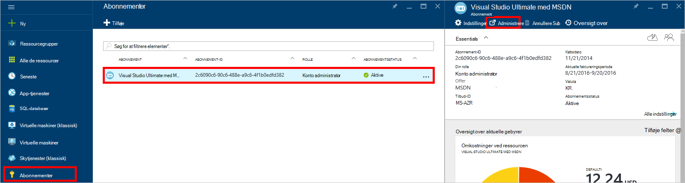
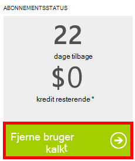

<properties
    pageTitle="Foretage fejlfinding af problemer med portalen DocumentDB | Microsoft Azure"
    description="Finde ud af, for at løse problemer i portalen DocumentDB Azure." 
    services="documentdb"
    documentationCenter=""
    authors="mimig1"
    manager="jhubbard"
    editor="monicar"/>

<tags
    ms.service="documentdb"
    ms.workload="data-services"
    ms.tgt_pltfrm="na"
    ms.devlang="na"
    ms.topic="article"
    ms.date="08/29/2016"
    ms.author="mimig"/>

# Azure DocumentDB portal tip til fejlfinding

I denne artikel beskrives, hvordan du løser DocumentDB problemer med portalen Azure. 

## Ressourcer mangler

**Symptom**: databaser eller samlinger der mangler fra din portalen blade.

**Løsning**: sænke brugen af programmet til at betjene under det maksimale antal gennemløb kvote til samlingen. 

**Forklaring**: portalen er et program som ethvert andet, foretage opkald til din DocumentDB database og af websteder. Hvis dine anmodninger er i øjeblikket er begrænset på grund af kald, der foretages fra et separat program, kan portalen også være begrænset, forårsager ressourcer, der ikke kan vises på portalen. Du kan løse problemet ved adresse årsagen til høj overførselshastighed brugen, og opdater derefter bladet portalen. Oplysninger om, hvordan måle og nederste overførselshastighed brugen kan findes i afsnittet [overførselshastighed](documentdb-performance-tips.md#throughput) i artiklen [tip om ydeevne](documentdb-performance-tips.md) .
 
## Sider eller blade ikke blive indlæst

**Symptom**: sider og blade i portalen vises ikke.

**Løsning**: sænke brugen af programmet til at betjene under det maksimale antal gennemløb kvote til samlingen. 

**Forklaring**: portalen er et program som ethvert andet, foretage opkald til din DocumentDB database og af websteder. Hvis dine anmodninger er i øjeblikket er begrænset på grund af kald, der foretages fra et separat program, kan portalen også være begrænset, forårsager ressourcer, der ikke kan vises på portalen. Du kan løse problemet ved adresse årsagen til høj overførselshastighed brugen, og opdater derefter bladet portalen. Oplysninger om, hvordan måle og nederste overførselshastighed brugen kan findes i afsnittet [overførselshastighed](documentdb-performance-tips.md#throughput) i artiklen [tip om ydeevne](documentdb-performance-tips.md) .

## Tilføje samling knap er deaktiveret

**Symptom**: bladet Database knappen **Tilføj samling** er deaktiveret.

**Forklaring**: Hvis abonnementet Azure er knyttet til benefit kredit, som gratis kredit tilbydes fra et MSDN-abonnement, og du har brugt alle dine kredit for måneden, du kan ikke oprette en hvilken som helst af flere websteder i DocumentDB.

**Løsning**: Fjern grænsen for udgifter fra din konto.

1. I portalen Azure i Jumpbar, skal du klikke på **abonnementer**, skal du klikke på det abonnement, der er knyttet til DocumentDB databasen og derefter klikke på **Administrer**i bladet **abonnement** . 
    

2. I det nye browservindue, får du vist, at du har kredit udløber. Klik på knappen **Fjern udgifter grænse** for at fjerne den bruger, kun den aktuelle faktureringsperiode eller på ubestemt tid. Fuldfør derefter guiden for at tilføje eller bekræfte dine kreditkortoplysninger. 
    

 
## Forespørgsel Explorer er fuldført med fejl

Se [fejlfinding af forespørgsel Explorer](documentdb-query-collections-query-explorer.md#troubleshoot).

## Ingen data, der er tilgængelige i overvågning felter

Se [fejlfinding i forbindelse med overvåge felter](documentdb-monitor-accounts.md#troubleshooting).

## Ingen dokumenter, der returneres i dokumentet Explorer

Se [fejlfinding af dokument Explorer](documentdb-view-json-document-explorer.md#troubleshoot).

## Næste trin

Hvis du fortsat oplever problemer i portalen, bedes du sende [askdocdb@microsoft.com](mailto:askdocdb@microsoft.com) til Hjælp eller fil, en supportanmodning i portalen ved at klikke på **Gennemse**, **Hjælp + support**, og derefter klikke på **Opret supportanmodning**.
