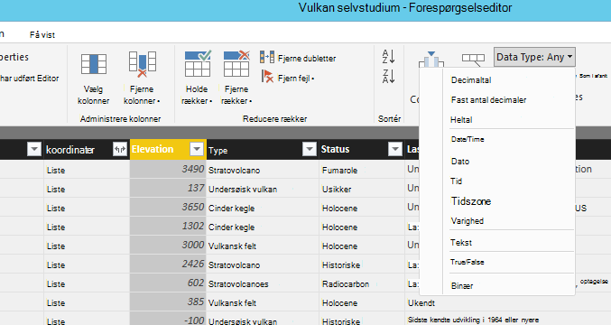

<properties
    pageTitle="Power BI selvstudium for DocumentDB forbindelse | Microsoft Azure"
    description="Brug Selvstudiet Power BI til at importere JSON, oprette nyttige rapporter og visualisere data ved hjælp af DocumentDB og Power BI connector."
    keywords="Power bi selvstudium, visualisere data, power bi forbindelse"
    services="documentdb"
    authors="h0n"
    manager="jhubbard"
    editor="mimig"
    documentationCenter=""/>

<tags
    ms.service="documentdb"
    ms.workload="data-services"
    ms.tgt_pltfrm="na"
    ms.devlang="na"
    ms.topic="article"
    ms.date="09/22/2016"
    ms.author="hawong"/>

# Power BI selvstudium til DocumentDB: visualisere data ved hjælp af Power BI-forbindelse

[PowerBI.com](https://powerbi.microsoft.com/) er en onlinetjeneste, hvor du kan oprette og dele dashboards og rapporter med data, der er vigtige for dig og din organisation.  Power BI Desktop er et dedikeret rapporteringsværktøj, der gør det muligt at hente data fra forskellige datakilder, flette og transformere dataene, oprette effektive rapporter og visualiseringer og udgive rapporterne til Power BI.  Med den seneste version af Power BI Desktop, du kan nu oprette forbindelse til kontoen DocumentDB via DocumentDB forbindelsen til Power BI.   

I dette selvstudium Power BI, skal du gennemgå trinnene til at oprette forbindelse til en DocumentDB konto i Power BI Desktop, gå til en samling, hvor vi vil udtrække data med Navigator, transformere JSON data i tabelformat ved hjælp af Power BI Desktop Query Editor, vi og opbygge og udgive en rapport til PowerBI.com.

Når du har fuldført dette Power BI-selvstudium, vil du kunne besvare spørgsmål, der er følgende:  

-   Hvordan kan jeg oprette rapporter med data fra DocumentDB ved hjælp af Power BI Desktop?
-   Hvordan kan jeg oprette forbindelse til en DocumentDB konto i Power BI Desktop?
-   Hvordan kan jeg hente data fra en af websteder i Power BI Desktop?
-   Hvordan kan jeg konvertere indlejrede JSON-data i Power BI Desktop?
-   Hvordan kan jeg publicere og dele mine rapporter i PowerBI.com?

## Forudsætninger

Før du følge vejledningen i selvstudiet Power BI, kan du sikre dig, at du har følgende:

- [Den seneste version af Power BI Desktop](https://powerbi.microsoft.com/desktop).
- Adgang til vores demo konto eller data i din Azure DocumentDB-konto.
    - Kontoen demo udfyldes med den vulkan data, der vises i dette selvstudium. Denne demo konto er bundet ikke af enhver SLA og er meningen, kun til demonstration.  Vi forbeholder sig ret til at foretage ændringer af denne demo konto, herunder, men begrænset ikke til afslutning af kontoen, ændring af nøglen, begrænsning af adgang, ændre og slette dataene, når som helst uden varsel eller årsag.
        - URL-adresse: https://analytics.documents.azure.com
        - Skrivebeskyttet nøgle: MSr6kt7Gn0YRQbjd6RbTnTt7VHc5ohaAFu7osF0HdyQmfR + YhwCH2D2jcczVIR1LNK3nMPNBD31losN7lQ/fkw ==
    - Eller hvis du vil oprette din egen konto, skal du se [oprette en DocumentDB database-konto ved hjælp af portalen Azure](https://azure.microsoft.com/documentation/articles/documentdb-create-account/). Se [NOAA websted](https://www.ngdc.noaa.gov/nndc/struts/form?t=102557&s=5&d=5) derefter for at få eksempel vulkan data, der svarer til hvad der bruges i dette selvstudium (men ikke indeholder GeoJSON blokke), og derefter importere data med [DocumentDB data overførselsværktøjet til](https://azure.microsoft.com/documentation/articles/documentdb-import-data/).

Hvis du vil dele dine rapporter i PowerBI.com, skal du have en konto i PowerBI.com.  Hvis du vil vide mere om Power BI til gratis og Power BI Pro, skal du besøge [https://powerbi.microsoft.com/pricing](https://powerbi.microsoft.com/pricing).

## Lad os komme i gang
I dette selvstudium Lad os Forestil dig, at du er en geologist studere vulkaner over hele verden.  Vulkan data er gemt i en DocumentDB konto og JSON-dokumenter ser ud som den nedenfor.

    {
        "Volcano Name": "Rainier",
        "Country": "United States",
        "Region": "US-Washington",
        "Location": {
            "type": "Point",
            "coordinates": [
            -121.758,
            46.87
            ]
        },
        "Elevation": 4392,
        "Type": "Stratovolcano",
        "Status": "Dendrochronology",
        "Last Known Eruption": "Last known eruption from 1800-1899, inclusive"
    }

Du vil hente vulkan dataene fra kontoen DocumentDB og visualisere data i en interaktiv Power BI-rapport som den nedenfor.

Klar til at Prøv det? Lad os komme i gang.

1. Køre Power BI Desktop på computeren.
2. Når Power BI Desktop er startet, vises *en velkomstsiden* .

    

3. Du kan **Hente Data**, se **Seneste kilder**eller **Åbne andre rapporter** direkte fra skærmen *Velkommen* .  Klik på X i det øverste højre hjørne for at lukke skærmen. Visningen **rapport** i Power BI Desktop vises.

    

4. Vælg fanen **Startside** og derefter klikke på **Hent Data**.  Vinduet **Hent Data** skal vises.

5. Klik på **Azure**, vælge **Microsoft Azure DocumentDB (Beta)**, og klik derefter på **Opret forbindelse**.  Vinduet **Microsoft Azure DocumentDB Connect** skal vises.

    

6. Angiv DocumentDB konto slutpunkt URL-adressen du gerne vil hente data fra, som vist nedenfor, og klik derefter på **OK**. Du kan hente URL-adressen fra boksen URI i bladet **[taster](documentdb-manage-account.md#keys)** i portalen Azure eller du kan bruge kontoen demo, i hvilket tilfælde URL-adressen er `https://analytics.documents.azure.com`. 

    Undlad at databasenavnet, samlingsnavn og SQL-sætning, som disse felter er valgfrit.  I stedet vil vi bruge Navigator til at vælge den Database og af websteder til at identificere, hvor data kommer fra.

    

7. Hvis du opretter forbindelse til dette slutpunkt for første gang, bliver du bedt om tasten konto.  Du kan hente nøglen fra boksen **Primærnøgle** i bladet **[skrivebeskyttede nøgler](documentdb-manage-account.md#keys)** i portalen Azure, eller du kan bruge kontoen demo, hvori tasten sagen `RcEBrRI2xVnlWheejXncHId6QRcKdCGQSW6uSUEgroYBWVnujW3YWvgiG2ePZ0P0TppsrMgscoxsO7cf6mOpcA==`. Angiv kontonøgle, og klik på **Opret forbindelse**.

    Vi anbefaler, at du bruger tasten skrivebeskyttet tilstand, når du opretter rapporter.  Dette forhindrer unødvendige visning af tasten master til potentiel risiko. Tasten skrivebeskyttet er tilgængelig fra bladet [taster](documentdb-manage-account.md#keys) af portalen Azure, eller du kan bruge kontooplysninger demo angivet ovenfor.

    

8. Når kontoen er tilsluttet, vises **Navigator** .  **Navigator** viser en liste over databaser under kontoen.
9. Klik på, og udvid på den database, hvor dataene til rapporten kommer fra, hvis du bruger demo kontoen og vælge **volcanodb**.   

10. Vælg en af websteder, du vil hente data fra. Hvis du bruger demo-kontoen, skal du vælge **volcano1**.

    Ruden Vis udskrift viser en liste over elementer i **post** .  Et dokument er repræsenteret som en **post** af typen i Power BI. På samme måde, en indlejret JSON-blok i et dokument er også en **post**.

    

11. Klik på **Rediger** for at starte Forespørgselseditor, så vi kan transformere dataene.

## Udjævne og omdanne JSON dokumenter
1. I Power BI Forespørgselseditor, skal du se et **dokument** kolonne i den midterste rude.

2. Klik på ekspander i højre side af kolonneoverskriften **dokument** .  Genvejsmenuen med en liste over felter vises.  Vælg de felter, du skal bruge til rapporten, for eksempel vulkan navn, land, Region, placering, udvidelse, Type, Status og sidste vide udvikling, og klik derefter på **OK**.

    

3. Den midterste rude, der vises et eksempel på resultatet med de felter, der er markeret.

    

4. I vores eksempel er egenskaben placering en GeoJSON blok i et dokument.  Som du kan se, repræsenteres placering som en **post** af typen i Power BI Desktop.  
5. Klik på ekspander i højre side af kolonneoverskriften placering.  Genvejsmenuen med felterne type og koordinater vises.  Lad os markere feltet koordinater, og klik på **OK**.

    

6. Den midterste rude viser nu en koordinater kolonne af **listetypen** .  Som vist i starten af selvstudiet, er GeoJSON dataene i dette selvstudium punkt med bredde- og længdegrader værdier, der er registreret i matrixen koordinater.

    Elementet koordinater [0] repræsenterer længdegrader, mens koordinater [1] repræsenterer længde.
    

7. Hvis du vil udjævne koordinater matrix, skal du oprette en **Brugerdefineret kolonne** med navnet LatLong.  Vælg **Tilføj kolonne** båndet, og klik på **Tilføj brugerdefineret kolonne**.  Vinduet **Tilføj brugerdefineret kolonne** skal vises.

8. Angiv et navn til den nye kolonne, f.eks. LatLong.

9. Derefter skal du angive brugerdefineret formel for den nye kolonne.  I vores eksempel skal vi vil sammenkæde de længde- og længdegrader værdier, der er adskilt af komma som vist nedenfor ved hjælp af følgende formel: `Text.From([Document.Location.coordinates]{1})&","&Text.From([Document.Location.coordinates]{0})`. Klik på **OK**.

    Få mere at vide under Data Analysis Expressions (DAX) herunder DAX-funktioner skal du gå til [Grundlæggende DAX i Power BI Desktop](https://support.powerbi.com/knowledgebase/articles/554619-dax-basics-in-power-bi-desktop).

    

10. Den midterste rude viser nu den nye LatLong kolonne, der er udfyldt med de længde- og længdegrader værdier, der er adskilt af komma.

    

    Hvis du modtager en fejl i den nye kolonne, skal du kontrollere, at de anvendte trin under forespørgselsindstillinger svarer til følgende figur:

    

    Hvis din trinnene er forskellige, slette de ekstra trin, og prøv at tilføje den brugerdefinerede kolonne igen. 

11. Vi har nu fuldført udjævne dataene i tabelformat.  Du kan udnytte alle de funktioner, der er tilgængelig i Forespørgselseditor til figur og transformere dataene i DocumentDB.  Hvis du bruger eksemplet, skal du ændre datatypen for udvidelse til **hele tal** ved at ændre **Datatypen** på fanen **Startside** .

    

12. Klik på **Luk, og Anvend** for at gemme datamodellen.

    

## Oprette rapporter
Power BI Desktop rapportvisning er, hvor du kan begynde at oprette rapporter for at visualisere data.  Du kan oprette rapporter ved at trække og slippe felter til **rapporten** lærredet.

I rapportvisning, skal du finde:

 1. Ruden **felter** dette er, hvor du får vist en liste over datamodeller med felter, du kan bruge til dine rapporter.

 2. Ruden **visualiseringer** . En rapport kan indeholde et enkelt eller flere visualiseringer.  Vælg de visuelle typer tilpasning af dine behov fra ruden **visualiseringer** .

 3. Lærredet **rapport** dette er, hvor du vil oprette de visuelle elementer for rapporten.

 4. **Rapportsiden.** Du kan tilføje flere rapportsider i Power BI Desktop.

Følgende viser de grundlæggende trin til oprettelse af en enkel rapport til visning af interaktive kort.

1. I dette eksempel skal opretter vi en map-visning, der viser placeringen af hver vulkan.  Klik på kort visuel type som fremhævet i skærmbilledet ovenfor i ruden **visualiseringer** .  Du bør se typen kort visuelle malet på **rapport** lærred.  Ruden **visualisering** bør også vise et sæt af egenskaber, der er relateret til den visuelle type kort.

2. Nu, træk og slip LatLong feltet fra ruden **felter** til egenskaben **placering** i **visualiseringer** rude.
3. Næste, træk og slip feltet vulkan navn på egenskaben for **forklaring** .  

4. Derefter skal du trække og slippe feltet udvidelse til egenskaben **størrelse** .  

5. Du bør nu se kortet visuelle viser et sæt af bobler, der angiver placeringen af hver vulkan med størrelsen af boblen korrelere til udvidelse af en vulkan.

6. Du har nu oprettet en grundlæggende rapport.  Du kan yderligere tilpasse rapporten ved at tilføje flere visualiseringer.  I dette tilfælde tilføjet vi en vulkan Type udsnit for at gøre rapporten interaktive.  

    

## Udgive og dele din rapport
Hvis du vil dele din rapport, skal du have en konto i PowerBI.com.

1. Klik på fanen **Hjem** i Power BI Desktop.
2. Klik på **Udgiv**.  Du bliver bedt om at angive brugernavn og adgangskode for kontoen PowerBI.com.
3. Når legitimationsoplysninger, der er blevet godkendt, udgives rapporten til din destination, du har valgt.
4. Klik på **Åbn 'PowerBITutorial.pbix' i Power BI** for at se og dele rapporten på PowerBI.com.

    

## Oprette et dashboard i PowerBI.com

Nu hvor du har en rapport, du kan dele den på PowerBI.com

Når du publicerer din rapport fra Power BI Desktop til PowerBI.com, genererer en **rapport** og et **datasæt** i din PowerBI.com-lejer. F.eks, når du har udgivet en rapport, kaldet **PowerBITutorial** til PowerBI.com, får du vist PowerBITutorial i både **rapporter** og **datasæt** sektioner på PowerBI.com.

   

For at oprette et dashboard, der kan deles, skal du klikke på knappen **Fastgør Live side** i rapporten PowerBI.com.

   

Følg derefter vejledningen i [Fastgør et felt fra en rapport](https://powerbi.microsoft.com/documentation/powerbi-service-pin-a-tile-to-a-dashboard-from-a-report/#pin-a-tile-from-a-report) for at oprette et nyt dashboard. 

Du kan også gøre ad hoc-ændringer til rapport før du opretter et dashboard. Det anbefales dog, at du bruger Power BI Desktop til at udføre ændringerne og genudgive rapporten til PowerBI.com.

## Opdatere data i PowerBI.com

Der er to måder at opdatere data, ad hoc- og planlagte.

Et ad hoc-opdatering, skal du blot klikke på eclipses (...) i **datasæt**, f.eks. PowerBITutorial. Du bør se en liste over handlinger, herunder **Opdater nu**. Klik på **Opdater nu** for at opdatere dataene.

Benyt følgende fremgangsmåde for en planlagt opdatering.

1. Klik på **Opdater tidsplan** på handlingslisten. 
    

2. På siden **Indstillinger** skal du udvide **datakilde legitimationsoplysninger**. 

3. Klik på **Rediger legitimationsoplysninger**. 

    Konfigurer pop-up-vinduet vises. 

4. Angiv nøgle for at oprette forbindelse til kontoen DocumentDB for datasættet, og klik derefter på **Log på**. 

5. Udvid **Tidsplan opdatere** og konfigurere tidsplan du vil opdatere datasættet. 
  
6. Klik på **Anvend** , og du er færdig med at konfigurere planlagt opdatering.

## Næste trin
- Hvis du vil vide mere om Power BI, kan du se [Introduktion til Power BI](https://powerbi.microsoft.com/documentation/powerbi-service-get-started/).
- Hvis du vil vide mere om DocumentDB skal du se [DocumentDB dokumentation landingssiden](https://azure.microsoft.com/documentation/services/documentdb/).
