<properties
    pageTitle="Python anbringes udvikling af webprogrammer med DocumentDB | Microsoft Azure"
    description="Gennemse selvstudium i en database på ved hjælp af DocumentDB til at gemme og få adgang til data fra et Python anbringes webprogram hostes på Azure. Finde programmet udvikling løsninger." 
    keywords="Udvikling af programmer, database selvstudium, hvorefter python, python webprogram, python webudvikling, documentdb, azure, Microsoft azure"
    services="documentdb"
    documentationCenter="python"
    authors="syamkmsft"
    manager="jhubbard"
    editor="cgronlun"/>

<tags
    ms.service="documentdb"
    ms.workload="data-management"
    ms.tgt_pltfrm="na"
    ms.devlang="python"
    ms.topic="hero-article"
    ms.date="08/25/2016"
    ms.author="syamk"/>

# <a name="python-flask-web-application-development-with-documentdb"></a>Python anbringes udvikling af webprogrammer med DocumentDB

> [AZURE.SELECTOR]
- [.NET](documentdb-dotnet-application.md)
- [Node.js](documentdb-nodejs-application.md)
- [Java](documentdb-java-application.md)
- [Python](documentdb-python-application.md)

Dette selvstudium viser, hvordan du bruger Azure DocumentDB til at gemme og få adgang til data fra en Python webprogram, der er hostet på Azure og forudsætter, at du har nogle tidligere oplevelse ved hjælp af Python og Azure websteder.

Selvstudiet database omfatter:

1. Oprette og klargøring af en DocumentDB-konto.
2. Oprette et Python MVC program.
3. Oprette forbindelse til og bruge Azure DocumentDB fra dit webprogram.
4. Installation af webprogrammet til Azure websteder.

Ved at følge dette selvstudium, kan du oprette en enkelt responsknapper program, som gør det muligt at stemme til en afstemning.

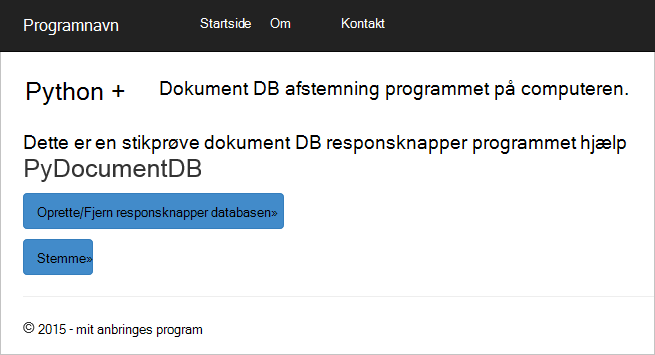


## <a name="database-tutorial-prerequisites"></a>Database selvstudium forudsætninger

Før du følge vejledningen i denne artikel, skal du sikre dig, at du har installeret følgende:

- En active Azure-konto. Hvis du ikke har en konto, kan du oprette en gratis prøveversion konto på blot et par minutter. Yderligere oplysninger finder du [Azure gratis prøveversion](https://azure.microsoft.com/pricing/free-trial/).
- [Visual Studio 2013](http://www.visualstudio.com/) eller nyere, eller [Visual Studio Express](), som er den gratis version. Vejledningen i dette selvstudium er skrevet specielt til Visual Studio-2015. 
- Python værktøjer til Visual Studio fra [GitHub](http://microsoft.github.io/PTVS/). Dette selvstudium bruger Python værktøjer for VS 2015. 
- Azure Python SDK til Visual Studio, version 2,4 eller nyere fra [azure.com](https://azure.microsoft.com/downloads/). Microsoft Azure SDK brugte vi for Python 2.7.
- Python 2.7 fra [python.org][2]. Brugte vi Python 2.7.11. 

> [AZURE.IMPORTANT] Hvis du installerer Python 2.7 for første gang, kan du sikre dig, på skærmbilledet Tilpas Python 2.7.11 skal du vælge **Tilføj python.exe til sti**.
> 
>    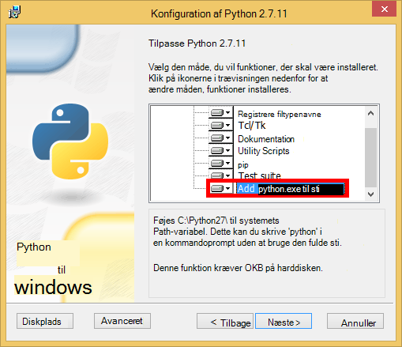

- Microsoft Visual C++ Compiler til Python 2.7 fra [Microsoft Download Center][3].

## <a name="step-1-create-a-documentdb-database-account"></a>Trin 1: Oprette en DocumentDB database-konto

Lad os starte med at oprette en DocumentDB-konto. Hvis du allerede har en konto, kan du gå til [trin 2: oprette et nyt webprogram Python anbringes](#step-2:-create-a-new-python-flask-web-application).

[AZURE.INCLUDE [documentdb-create-dbaccount](../../includes/documentdb-create-dbaccount.md)]

<br/>
Vi fører nu gennem hvordan du opretter et nyt Python anbringes webprogram fra bunden op.

## <a name="step-2-create-a-new-python-flask-web-application"></a>Trin 2: Oprette et nyt webprogram Python anbringes

1. Peg på **Ny**i Visual Studio, i menuen **filer** , og klik derefter på **projekt**.

    Dialogboksen **Nyt projekt** vises.

2. Udvid **skabeloner** og derefter **Python**i venstre rude, og klik derefter på **internettet**. 

3. Vælg **Anbringes webprojekt** i den midterste rude, klik derefter i **navn** feltet type **selvstudium**, og klik derefter på **OK**. Husk, at Python pakkenavne skal være alle små bogstaver, som det er beskrevet i [Typografi vejledning til Python kode](https://www.python.org/dev/peps/pep-0008/#package-and-module-names).

    Til de nye til Python er det en web application development ramme, der hjælper dig med at opbygge Webprogrammer i Python hurtigere.

    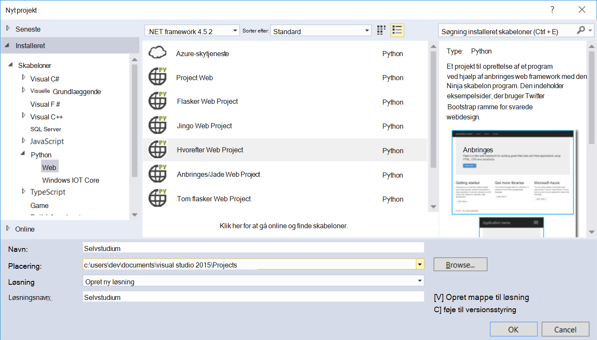

4. Klik på **Installer i et virtuelt miljø**i vinduet **Python værktøjer til Visual Studio** . 

    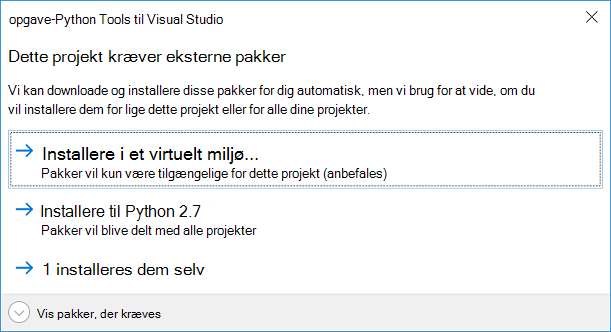

5. I vinduet **Tilføj virtuelt miljø** kan du Accepter standardindstillingerne og bruge Python 2.7 som basis-miljø, fordi PyDocumentDB ikke understøtter i øjeblikket Python 3.x, og klik derefter på **Opret**. Konfigurerer den nødvendige Python virtuelt miljø til projektet.

    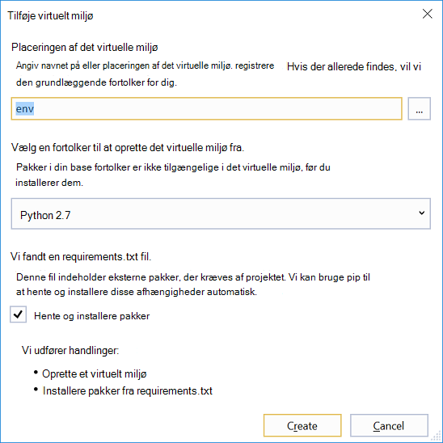

    Outputvinduet viser `Successfully installed Flask-0.10.1 Jinja2-2.8 MarkupSafe-0.23 Werkzeug-0.11.5 itsdangerous-0.24 'requirements.txt' was installed successfully.` når miljøet er installeret.

## <a name="step-3-modify-the-python-flask-web-application"></a>Trin 3: Ændre webprogrammet Python anbringes

### <a name="add-the-python-flask-packages-to-your-project"></a>Føje Python anbringes pakker til dit projekt

Når projektet er konfigureret, skal du føje de nødvendige anbringes-pakker til projektet, herunder pydocumentdb, DocumentDB Python pakke.

1. I Solution Explorer skal du åbne filen med navnet **requirements.txt** og erstatte indholdet med følgende:

        flask==0.9
        flask-mail==0.7.6
        sqlalchemy==0.7.9
        flask-sqlalchemy==0.16
        sqlalchemy-migrate==0.7.2
        flask-whooshalchemy==0.55a
        flask-wtf==0.8.4
        pytz==2013b
        flask-babel==0.8
        flup
        pydocumentdb>=1.0.0

2. Gem filen **requirements.txt** . 
3. Højreklik på **env** i Solution Explorer, og klik på **Installer fra requirements.txt**.

    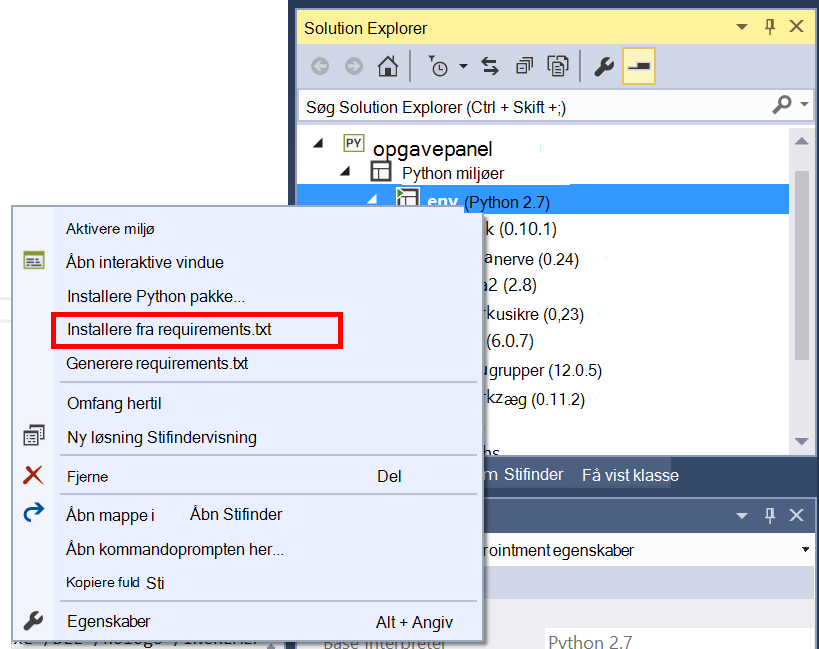

    Efter vellykket installation viser outputvinduet følgende:

        Successfully installed Babel-2.3.2 Tempita-0.5.2 WTForms-2.1 Whoosh-2.7.4 blinker-1.4 decorator-4.0.9 flask-0.9 flask-babel-0.8 flask-mail-0.7.6 flask-sqlalchemy-0.16 flask-whooshalchemy-0.55a0 flask-wtf-0.8.4 flup-1.0.2 pydocumentdb-1.6.1 pytz-2013b0 speaklater-1.3 sqlalchemy-0.7.9 sqlalchemy-migrate-0.7.2

    > [AZURE.NOTE] I sjældne tilfælde kan du muligvis vist en fejl i outputvinduet. Hvis dette sker, kan du se Hvis fejlen er relateret til oprydning. Nogle gange oprydningen mislykkes, men installationen vil stadig være vellykket (Rul op i outputvinduet til at kontrollere). Du kan se din installation ved at [kontrollere det virtuelle miljø](#verify-the-virtual-environment). Hvis installationen mislykkedes, men bekræftelsen er gået igennem, er det OK for at fortsætte.

### <a name="verify-the-virtual-environment"></a>Bekræfte det virtuelle miljø

Lad os sørge for, at alt er installeret korrekt.

1. Opbygge løsningen ved at trykke på **Ctrl**+**Skift**+**B**.
2. Når Opret lykkes, kan du starte det offentlige websted ved at trykke på **F5**. Dette åbner anbringes udviklingsserver og starter din webbrowser. Du bør se den efterfølgende side.

    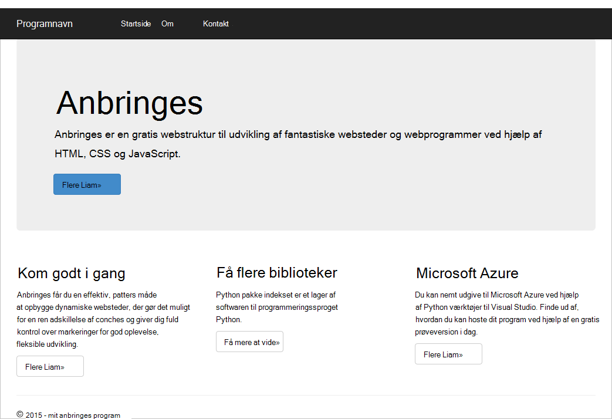

3. Stop fejlfindingen webstedet ved at trykke på **Skift**+**F5** i Visual Studio.

### <a name="create-database-collection-and-document-definitions"></a>Oprette dokument definitioner, websteder og database

Nu Lad os oprette dit responsknapper program ved at tilføje nye filer og opdatering af andre.

1. Højreklik på **selvstudium** projektet i Solution Explorer, skal du klikke på **Tilføj**, og klik derefter på **Nyt element**. Vælg **Tom Python fil** og Navngiv filen **forms.py**.  
2. Tilføj følgende kode til filen forms.py, og Gem derefter filen.

```python
from flask.ext.wtf import Form
from wtforms import RadioField

class VoteForm(Form):
    deploy_preference  = RadioField('Deployment Preference', choices=[
        ('Web Site', 'Web Site'),
        ('Cloud Service', 'Cloud Service'),
        ('Virtual Machine', 'Virtual Machine')], default='Web Site')
```


### <a name="add-the-required-imports-to-viewspy"></a>Tilføj den nødvendige import til views.py

1. Udvid mappen **selvstudium** i Solution Explorer, og Åbn fil, **views.py** . 
2. Tilføj følgende importere sætninger til toppen af filen **views.py** og derefter gemme filen. Disse importere Documentdb's PythonSDK og anbringes pakker.

    ```python
    from forms import VoteForm
    import config
    import pydocumentdb.document_client as document_client
    ```


### <a name="create-database-collection-and-document"></a>Oprette databasen, websteder og dokument

- Tilføj følgende kode til slutningen af filen stadig i **views.py**. Det sig tager af oprettelse af den database, der bruges af formularen. Slet ikke nogen af den eksisterende kode i **views.py**. Blot føje det til slutningen.

```python
@app.route('/create')
def create():
    """Renders the contact page."""
    client = document_client.DocumentClient(config.DOCUMENTDB_HOST, {'masterKey': config.DOCUMENTDB_KEY})

    # Attempt to delete the database.  This allows this to be used to recreate as well as create
    try:
        db = next((data for data in client.ReadDatabases() if data['id'] == config.DOCUMENTDB_DATABASE))
        client.DeleteDatabase(db['_self'])
    except:
        pass

    # Create database
    db = client.CreateDatabase({ 'id': config.DOCUMENTDB_DATABASE })

    # Create collection
    collection = client.CreateCollection(db['_self'],{ 'id': config.DOCUMENTDB_COLLECTION })

    # Create document
    document = client.CreateDocument(collection['_self'],
        { 'id': config.DOCUMENTDB_DOCUMENT,
          'Web Site': 0,
          'Cloud Service': 0,
          'Virtual Machine': 0,
          'name': config.DOCUMENTDB_DOCUMENT 
        })

    return render_template(
       'create.html',
        title='Create Page',
        year=datetime.now().year,
        message='You just created a new database, collection, and document.  Your old votes have been deleted')
```

> [AZURE.TIP] Metoden **CreateCollection** tager en valgfri **RequestOptions** som den tredje parameter. Dette kan bruges til at angive den tilbyder til samlingen. Hvis ingen offerType værdi leveres, derefter oprettes samlingen ved hjælp af standard tilbyder Type. Du kan finde flere oplysninger om DocumentDB tilbyder typer, [ydeevneniveauer i DocumentDB](documentdb-performance-levels.md).


### <a name="read-database-collection-document-and-submit-form"></a>Læs database, samling, dokument, og Send formular

- Tilføj følgende kode til slutningen af filen stadig i **views.py**. Det sig tager af konfiguration af formularen, læse database, indsamling og dokument. Slet ikke nogen af den eksisterende kode i **views.py**. Blot føje det til slutningen.

```python
@app.route('/vote', methods=['GET', 'POST'])
def vote(): 
    form = VoteForm()
    replaced_document ={}
    if form.validate_on_submit(): # is user submitted vote  
        client = document_client.DocumentClient(config.DOCUMENTDB_HOST, {'masterKey': config.DOCUMENTDB_KEY})

        # Read databases and take first since id should not be duplicated.
        db = next((data for data in client.ReadDatabases() if data['id'] == config.DOCUMENTDB_DATABASE))

        # Read collections and take first since id should not be duplicated.
        coll = next((coll for coll in client.ReadCollections(db['_self']) if coll['id'] == config.DOCUMENTDB_COLLECTION))

        # Read documents and take first since id should not be duplicated.
        doc = next((doc for doc in client.ReadDocuments(coll['_self']) if doc['id'] == config.DOCUMENTDB_DOCUMENT))

        # Take the data from the deploy_preference and increment our database
        doc[form.deploy_preference.data] = doc[form.deploy_preference.data] + 1
        replaced_document = client.ReplaceDocument(doc['_self'], doc)

        # Create a model to pass to results.html
        class VoteObject:
            choices = dict()
            total_votes = 0

        vote_object = VoteObject()
        vote_object.choices = {
            "Web Site" : doc['Web Site'],
            "Cloud Service" : doc['Cloud Service'],
            "Virtual Machine" : doc['Virtual Machine']
        }
        vote_object.total_votes = sum(vote_object.choices.values())

        return render_template(
            'results.html', 
            year=datetime.now().year, 
            vote_object = vote_object)

    else :
        return render_template(
            'vote.html', 
            title = 'Vote',
            year=datetime.now().year,
            form = form)
```


### <a name="create-the-html-files"></a>Oprette HTML-filer

1. Højreklik på mappen **skabeloner** i Solution Explorer, i mappen **selvstudium** , klik på **Tilføj**, og klik derefter på **Nyt element**. 
2. Vælg **HTML-side**, og skriv derefter **create.html**i feltet navn. 
3. Gentag trin 1 og 2 for at oprette to yderligere HTML-filer: results.html og vote.html.
4. Føj følgende kode til **create.html** i den `<body>` element. En meddelelse om, at vi oprettede en ny database, indsamling og dokument vises.

    ```html
    
    
    <h2>{{ title }}.</h2>
    <h3>{{ message }}</h3>
    <p><a href="{{ url_for('vote') }}" class="btn btn-primary btn-large">Vote &raquo;</a></p>
    
    ```

5. Føj følgende kode til **results.html** i den `<body`> element. Det viser resultaterne af afstemningen.

    ```html
    
    
    <h2>Results of the vote</h2>
        <br />
        
    
    <div class="row">
        <div class="col-sm-5">{{choice}}</div>
            <div class="col-sm-5">
                <div class="progress">
                    <div class="progress-bar" role="progressbar" aria-valuenow="{{vote_object.choices[choice]}}" aria-valuemin="0" aria-valuemax="{{vote_object.total_votes}}" style="width: {{(vote_object.choices[choice]/vote_object.total_votes)*100}}%;">
                                {{vote_object.choices[choice]}}
                </div>
            </div>
            </div>
    </div>
    
    
    <br />
    <a class="btn btn-primary" href="{{ url_for('vote') }}">Vote again?</a>
    
    ```

6. Føj følgende kode til **vote.html** i den `<body`> element. Det viser afstemningen og accepterer stemmer. Om registrering stemmer, overføres kontrolelementet til views.py, hvor vi skal genkende stemme cast og føje dokumentet i overensstemmelse hermed.

    ```html
    
    
    <h2>What is your favorite way to host an application on Azure?</h2>
    <form action="" method="post" name="vote">
        {{form.hidden_tag()}}
            {{form.deploy_preference}}
            <button class="btn btn-primary" type="submit">Vote</button>
    </form>
    
    ```

7. Erstat indholdet af **index.html** med følgende i mappen **skabeloner** . Dette fungerer som landingssiden for dit program.
    
    ```html
    
    
    <h2>Python + DocumentDB Voting Application.</h2>
    <h3>This is a sample DocumentDB voting application using PyDocumentDB</h3>
    <p><a href="{{ url_for('create') }}" class="btn btn-primary btn-large">Create/Clear the Voting Database &raquo;</a></p>
    <p><a href="{{ url_for('vote') }}" class="btn btn-primary btn-large">Vote &raquo;</a></p>
    
    ```

### <a name="add-a-configuration-file-and-change-the-initpy"></a>Føje en konfigurationsfil og ændre den \_ \_initialisering\_\_.py

1. I Solution Explorer, skal du højreklikke på **selvstudium** projektet, skal du klikke på **Tilføj**, klik på **Nyt element**, Vælg **Tom Python fil**og Navngiv filen **config.py**. Denne konfigurationsfil kræves af formularer i anbringes. Du kan bruge det til at levere en hemmeligt nøgle. Denne nøgle er ikke nødvendig for dette selvstudium via.

2. Tilføj følgende kode til config.py, skal du ændre værdierne i **DOCUMENTDB\_HOST** og **DOCUMENTDB\_nøgle** i næste trin.

    ```python
    CSRF_ENABLED = True
    SECRET_KEY = 'you-will-never-guess'
    
    DOCUMENTDB_HOST = 'https://YOUR_DOCUMENTDB_NAME.documents.azure.com:443/'
    DOCUMENTDB_KEY = 'YOUR_SECRET_KEY_ENDING_IN_=='
    
    DOCUMENTDB_DATABASE = 'voting database'
    DOCUMENTDB_COLLECTION = 'voting collection'
    DOCUMENTDB_DOCUMENT = 'voting document'
    ```

3. Gå til bladet **nøgler** ved at klikke på **Gennemse**, **DocumentDB konti**, skal du dobbeltklikke på navnet på kontoen, der skal bruges i [Azure-portalen](https://portal.azure.com/), og klik derefter på knappen **taster** i området **Essentials** . Kopiér værdien **URI** i bladet **nøgler** og indsætte den i filen **config.py** , som værdien for den **DOCUMENTDB\_HOST** egenskab. 
4. Tilbage i portalen Azure i bladet **taster** kopiere værdien af den **Primærnøgle** eller **Sekundær nøgle**, og sæt dem ind i filen **config.py** , som værdien for den **DOCUMENTDB\_nøgle** egenskab.
5. I den ** \_ \_initialisering\_\_.py** fil, skal du tilføje følgende linje. 

        app.config.from_object('config')

    Så indholdet af filen er:

    ```python
    from flask import Flask
    app = Flask(__name__)
    app.config.from_object('config')
    import tutorial.views
    ```

6. Når du har tilføjet alle filerne, ser Solution Explorer sådan ud:

    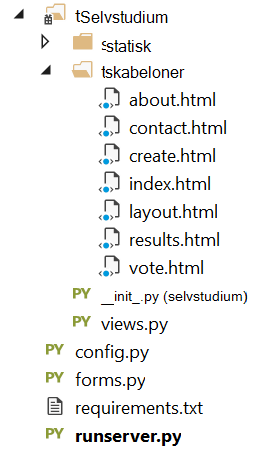


## <a name="step-4-run-your-web-application-locally"></a>Trin 4: Køre dit webprogram lokalt

1. Opbygge løsningen ved at trykke på **Ctrl**+**Skift**+**B**.
2. Når Opret lykkes, kan du starte det offentlige websted ved at trykke på **F5**. Du bør se følgende på skærmen.

    

3. Klik på **Opret/Slet svar databasen** for at generere databasen.

    

4. Derefter skal du klikke på **stemme** og vælge det.

    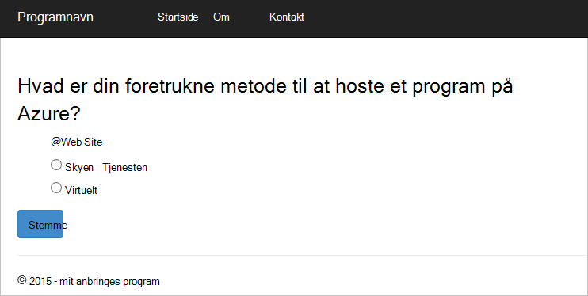

5. For hver stemme, du har konverteret, øger det relevante tælleren.

    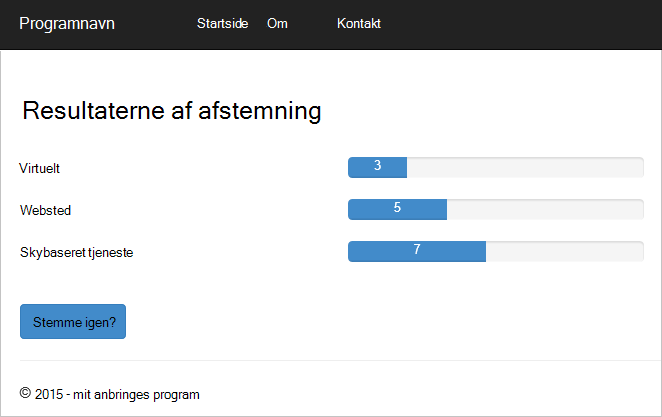

6. Stop fejlfindingen projektet ved at trykke på SKIFT + F5.

## <a name="step-5-deploy-the-web-application-to-azure-websites"></a>Trin 5: Installere webprogrammet til Azure websteder

Nu hvor du har fuldført programmet fungerer korrekt mod DocumentDB, vi installerer det på Azure websteder.

1. Højreklik på projektet i Solution Explorer (Sørg for, at du ikke er stadig kører lokalt), og vælg **Publicer**.  

    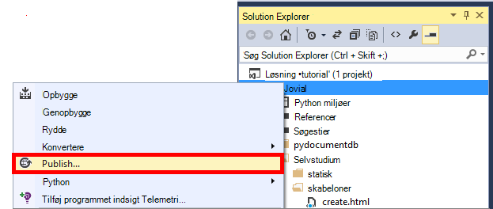

2. Vælg **Microsoft Azure Web Apps**i vinduet **Udgiv websted** , og klik derefter på **Næste**.

    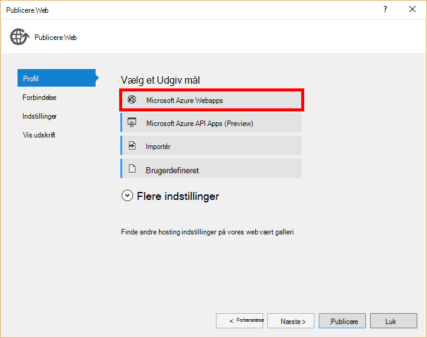

3. Klik på **Ny**i vinduet **Microsoft Azure Web Apps-vinduet** .

    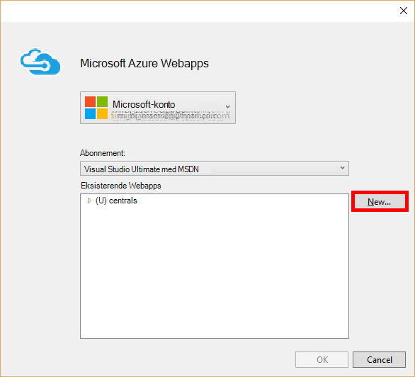

4. Angiv en **Web app-navn**, **App-serviceaftale**, **ressourcegruppe**og **område**i vinduet **Opret websted på Microsoft Azure** og derefter klikke på **Opret**.

    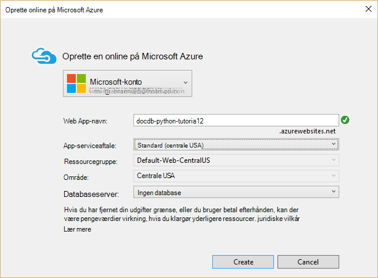

5. Klik på **Publicer**i vinduet **Udgiv websted** .

    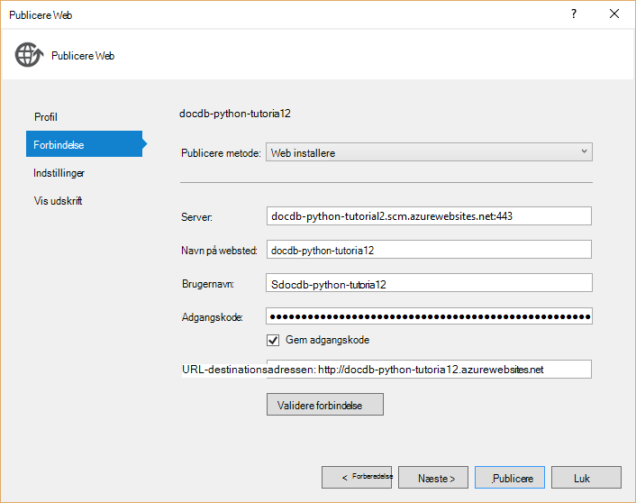

3. I et par sekunder, vil Visual Studio afslutte publicere dit webprogram og Start en browser, hvor du kan se dit praktiske arbejde, der kører i Azure!

## <a name="troubleshooting"></a>Fejlfinding i forbindelse med

Hvis dette er den første Python app, du har kørt på computeren, skal du sikre, at følgende mapper (eller de tilsvarende installationsplaceringer) er medtaget i PATH-variabel:

    C:\Python27\site-packages;C:\Python27\;C:\Python27\Scripts;

Hvis du modtager en fejlmeddelelse på siden stemme, og du udnævnt dit projekt til et andet tal end **selvstudium**, Sørg for, at ** \_ \_initialisering\_\_.py** refererer til det korrekte projektnavn på linjen: `import tutorial.view`.

## <a name="next-steps"></a>Næste trin

Tillykke! Du har lige fuldført din første Python webprogrammet ved hjælp af Azure DocumentDB og publiceret til Azure websteder.

Vi opdatere og forbedre dette emne, der ofte baseret på din feedback.  Når du har fuldført selvstudiet, skal du bruge responsknapperne øverst og nederst på denne side, og Sørg for at medtage din feedback på hvad foretaget forbedringer, du vil have vist. Hvis du vil have os til at kontakte dig direkte, Velkommen til at medtage din e-mail-adresse i dine kommentarer.

Gennemse de tilgængelige i [DocumentDB Python SDK](documentdb-sdk-python.md)API'er for at tilføje ekstra funktioner til dit webprogram.

Du kan finde flere oplysninger om Azure, Visual Studio og Python [Python Developer Center](https://azure.microsoft.com/develop/python/). 

Du kan finde yderligere Python anbringes selvstudier, under [feltet anbringes megapixel-selvstudium, del I: Hej, store verden!](http://blog.miguelgrinberg.com/post/the-flask-mega-tutorial-part-i-hello-world). 

  [Visual Studio Express]: http://www.visualstudio.com/products/visual-studio-express-vs.aspx
  [2]: https://www.python.org/downloads/windows/
  [3]: https://www.microsoft.com/download/details.aspx?id=44266
  [Microsoft Web Platform Installer]: http://www.microsoft.com/web/downloads/platform.aspx
  [Azure portal]: http://portal.azure.com
