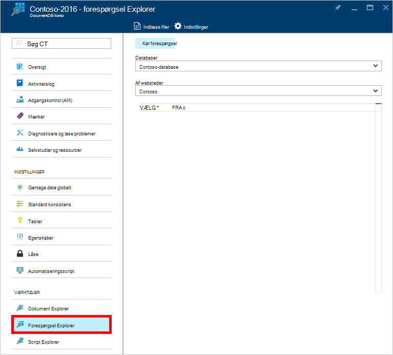
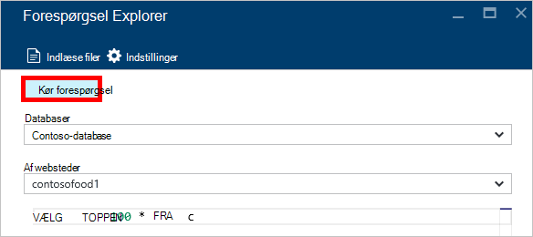
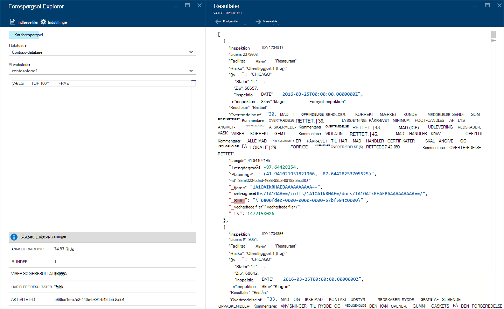
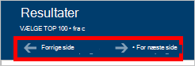
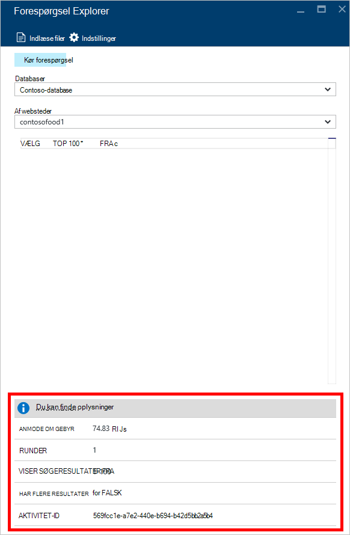
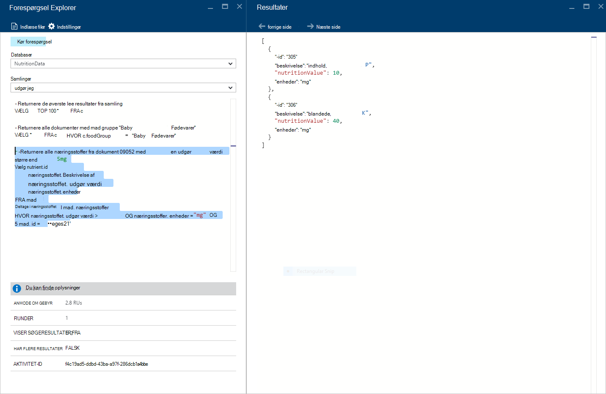
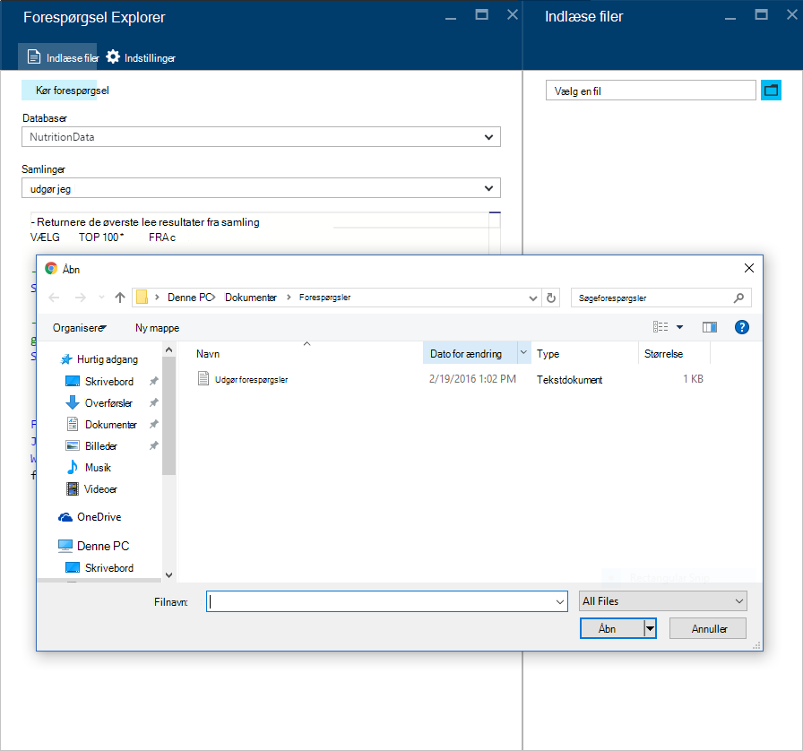
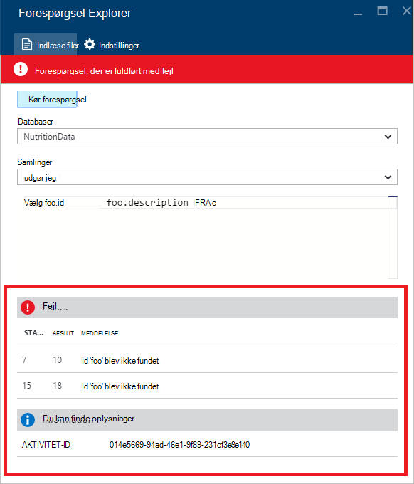

<properties
    pageTitle="DocumentDB forespørgsel Explorer: En SQL forespørgselseditor | Microsoft Azure"
    description="Få mere at vide om DocumentDB forespørgsel Explorer, forespørgselseditor en SQL Azure-portalen for at oprettelsen af SQL-forespørgsler og køre dem mod en NoSQL DocumentDB af websteder."
    keywords="skrive sql-forespørgsler, sql-forespørgselseditor"
    services="documentdb"
    authors="kirillg"
    manager="jhubbard"
    editor="monicar"
    documentationCenter=""/>

<tags
    ms.service="documentdb"
    ms.workload="data-services"
    ms.tgt_pltfrm="na"
    ms.devlang="na"
    ms.topic="article"
    ms.date="08/30/2016"
    ms.author="kirillg"/>

# Skrive, redigere og køre SQL-forespørgsler til DocumentDB med forespørgsel Stifinder 

I denne artikel indeholder en oversigt over [Microsoft Azure DocumentDB](https://azure.microsoft.com/services/documentdb/) forespørgsel Explorer, et Azure portalen værktøj, der gør det muligt at skrive, redigere og køre SQL-forespørgsler i en [DocumentDB af websteder](documentdb-create-collection.md).

1. I portalen Azure i Jumpbar, skal du klikke på **DocumentDB (NoSQL)**. Hvis **DocumentDB (NoSQL)** ikke er synlig, skal du klikke på **Flere tjenester** , og klik derefter på **DocumentDB (NoSQL)**.

2. Klik på **Forespørgsel Explorer**i menuen ressource. 

    

3. Vælg **databaser** og **samlinger** til forespørgsel på rullelisterne i bladet **Forespørgsel Explorer** , og Skriv forespørgslen til at køre. 

    Rullelister **databaser** og **samlinger** er udfyldt på forhånd afhængigt af den kontekst, hvor du starter forespørgsel Explorer. 

    En standardforespørgslen af `SELECT TOP 100 * FROM c` leveres.  Du kan acceptere standardforespørgslen, eller du kan oprette din egen forespørgsel med de SQL-forespørgselssprog, der er beskrevet i [SQL-forespørgsel cheat ark](documentdb-sql-query-cheat-sheet.md) eller i [SQL-forespørgsel og SQL-syntaks](documentdb-sql-query.md) artiklen.

    Klik på **Kør forespørgsel** for at få vist resultaterne.

    

4. Bladet **resultaterne** viser output fra forespørgslen. 

    

## Arbejde med resultater

Som standard returnerer forespørgslen Explorer resultater i sæt af 100.  Hvis din forespørgsel giver mere end 100 resultater, skal du blot bruge kommandoerne **Næste side** og **forrige side** til at navigere gennem resultatsættet.

Ruden **oplysninger** indeholder målepunkter som anmodning gebyr, antallet af Runder forespørgslen har foretaget, sæt af resultater, der aktuelt der vises, og om der er flere resultater, som kan åbnes via kommandoen **Næste side** , som tidligere nævnt vellykkede forespørgsler.

## Bruge flere forespørgsler

Hvis du bruger flere forespørgsler og vil skifte hurtigt mellem dem, kan du angive alle forespørgsler i tekstfeltet forespørgsel af bladet **Forespørgsel Explorer** og derefter markere det, du vil køre og klik derefter på **Kør forespørgsel** for at få vist resultaterne.

## Tilføje forespørgsler fra en fil i SQL-forespørgselseditor

Du kan indlæse indholdet af en eksisterende fil ved hjælp af kommandoen **Indlæse filer** .

## Fejlfinding i forbindelse med

Hvis en forespørgsel er fuldført med fejl, viser forespørgsel Explorer en liste over fejl, der kan hjælpe med fejlfinding.

## Køre DocumentDB SQL-forespørgsler uden for portalen

Stifinder-forespørgsel i portalen Azure er blot en enkelt metode til at køre SQL-forespørgsler i DocumentDB. Du kan også køre SQL-forespørgsler ved hjælp af [REST-API](https://msdn.microsoft.com/library/azure/dn781481.aspx) eller [klient SDK'er](documentdb-sdk-dotnet.md). Du kan finde flere oplysninger om brug af disse andre metoder, se [udførelse af SQL-forespørgsler](documentdb-sql-query.md#executing-sql-queries)

## Næste trin

Hvis du vil vide mere om DocumentDB SQL-grammatikken understøttes i forespørgsel Explorer, i [SQL-forespørgsel og SQL-syntaks](documentdb-sql-query.md) artiklen eller udskrive på [SQL-forespørgsel cheat ark](documentdb-sql-query-cheat-sheet.md).
Du kan også få gavn af at eksperimentere med [Forespørgsel tennisklub](https://www.documentdb.com/sql/demo) , hvor du kan teste forespørgsler online ved hjælp af en stikprøve datasæt.
