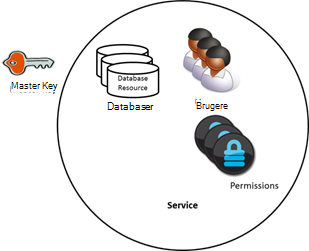
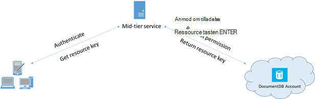

<properties 
    pageTitle="Lær, hvordan du sikker adgang til data i DocumentDB | Microsoft Azure" 
    description="Få mere at vide om access kontrolelement begreber i DocumentDB, herunder master taster, skrivebeskyttede nøgler, brugere og tilladelser." 
    services="documentdb" 
    authors="kiratp" 
    manager="jhubbard" 
    editor="monicar" 
    documentationCenter=""/>

<tags 
    ms.service="documentdb" 
    ms.workload="data-services" 
    ms.tgt_pltfrm="na" 
    ms.devlang="na" 
    ms.topic="article" 
    ms.date="09/19/2016" 
    ms.author="kipandya"/>

# Sikring af adgang til DocumentDB data

I denne artikel indeholder en oversigt over sikring af adgang til data, der er gemt i [Microsoft Azure DocumentDB](https://azure.microsoft.com/services/documentdb/).

Når du har læst denne oversigt, vil du kunne besvare spørgsmål, der er følgende:  

-   Hvad er DocumentDB master taster?
-   Hvad er DocumentDB skrivebeskyttede nøgler?
-   Hvad er DocumentDB ressource tokens?
-   Hvordan kan jeg bruge DocumentDB brugere og tilladelser til at sikre adgang til DocumentDB data?

## DocumentDB access kontrolelement begreber

DocumentDB indeholder førsteklasses begreber for at styre adgangen til DocumentDB ressourcer.  DocumentDB ressourcer er inddelt i to kategorier med henblik på dette emne:

- Administrative ressourcer
    - Konto
    - Database
    - Bruger
    - Tilladelse
- Programmet ressourcer
    - Af websteder
    - Tilbud
    - Dokument
    - Vedhæftet fil
    - Lagret procedure
    - Udløser
    - Brugerdefineret funktion

I forbindelse med disse to kategorier, DocumentDB understøtter tre typer access kontrolelement personas: administrator, skrivebeskyttet administrator og databasebruger-konto.  Rettigheder til hver access kontrolelement de er:
 
- Kontoadministrator: fuld adgang til alle de ressourcer (administrative og program) i en given DocumentDB-konto.
- Skrivebeskyttet administrator: skrivebeskyttet adgang til alle de ressourcer (administrative og program i en given DocumentDB-konto. 
- Databasebruger: feltet DocumentDB bruger ressource, der er knyttet til et bestemt sæt DocumentDB databaseressourcer (fx af websteder, dokumenter, scripts).  Der kan være en eller flere bruger ressourcer, der er knyttet til en given database og hver bruger ressource kan have en eller flere af de tilladelser, der er knyttet til den.

Med de ovennævnte kategorier og ressourcer huske definerer DocumentDB access kontrolelement modellen tre typer access skemakonstruktioner:

- Master taster: efter oprettelse af en DocumentDB-konto, der oprettes to master nøgler (primære og sekundære).  Disse taster Aktiver fuld administrativ adgang til alle de ressourcer i DocumentDB-kontoen.

- Skrivebeskyttede nøgler: efter oprettelse af en DocumentDB-konto, der oprettes to skrivebeskyttede nøgler (primære og sekundære).  Disse taster aktivere skrivebeskyttet adgang til alle ressourcer i DocumentDB-kontoen.

- Ressource tokens: en ressource token er knyttet til en DocumentDB tilladelse ressource og registrerer relationen mellem brugeren af en database og tilladelsen, der bruger har for en bestemt DocumentDB programmet ressource (fx af websteder, dokumentet).

## Arbejde med DocumentDB master- og skrivebeskyttet taster

Som tidligere nævnt giver DocumentDB master taster fulde administratoradgang til alle de ressourcer i en DocumentDB-konto, mens skrivebeskyttede nøgler aktivere læseadgang for alle ressourcer inden for kontoen.  Følgende kodestykke viser, hvordan du bruger en DocumentDB konto slutpunkt og master-tasten til at oprette en forekomst af en DocumentClient og oprette en ny database. 

    //Read the DocumentDB endpointUrl and authorization keys from config.
    //These values are available from the Azure Classic Portal on the DocumentDB Account Blade under "Keys".
    //NB > Keep these values in a safe and secure location. Together they provide Administrative access to your DocDB account.
    
    private static readonly string endpointUrl = ConfigurationManager.AppSettings["EndPointUrl"];
    private static readonly SecureString authorizationKey = ToSecureString(ConfigurationManager.AppSettings["AuthorizationKey"]);
        
    client = new DocumentClient(new Uri(endpointUrl), authorizationKey);
    
    // Create Database
    Database database = await client.CreateDatabaseAsync(
        new Database
        {
            Id = databaseName
        });

## Oversigt over DocumentDB ressource tokens

Du kan bruge en ressource token (ved at oprette DocumentDB brugere og tilladelser) Hvis du vil give adgang til ressourcer i kontoen DocumentDB til en klient, der ikke er tillid til med tasten master. Din DocumentDB master taster omfatter både en primære og sekundære nøgle, hver især giver administratoradgang til din konto og alle ressourcerne i den. Din konto for at skadelig eller uagtsomt Brug mulighed for at åbnes udsætte en af dine master nøgler. 

På samme måde DocumentDB skrivebeskyttede nøgler giver læseadgang til alle de ressourcer - undtagen tilladelse ressourcer naturligvis - inden for en DocumentDB konto og kan ikke bruges til at give mere detaljeret adgang til bestemte DocumentDB ressourcer.

DocumentDB ressource tokens giver sikker alternativ tekst, der gør det muligt for klienter mulighed for at læse, skrive og slette ressourcer i kontoen DocumentDB ifølge de tilladelser, du har tildelt og uden brug af en master eller læst kun vigtige.

Her er et typisk design mønster hvorved ressource tokens kan være anmodet om, genereres og leveret til kunder:

1. En mellemstore tjeneste er konfigureret til at fungere en mobile program tilladelse til at dele bruger billeder.
2. Tjenesten mellemstore har tasten master DocumentDB-konto.
3. Foto-appen er installeret på slutbrugerens mobile enheder. 
4. På logon opretter appen foto på identiteten for brugeren med tjenesten mellemstore. Denne funktion er etableret, identitet er kun op til programmet.
5. Når der er oprettet på identiteten anmodninger tjenesten mellemstore tilladelser, der er baseret på identitet.
6. Tjenesten mellemstore sender en ressource token tilbage til telefonappen.
7. Telefonappen kan fortsætte med at bruge ressource tokenet direkte adgang til DocumentDB ressourcer med de tilladelser, der er defineret af ressource tokenet og for det interval, der tillader tokenet ressource. 
8. Når ressource tokenet udløber, får efterfølgende anmodninger om en 401 Uautoriseret undtagelse.  På dette tidspunkt telefonappen igen opretter identitet og anmoder om et nyt ressource-id.

## Arbejde med DocumentDB brugere og tilladelser
En DocumentDB bruger ressource er knyttet til en DocumentDB database.  Hver database kan indeholde nul eller flere DocumentDB brugere.  Følgende kodestykke viser, hvordan du opretter en DocumentDB bruger ressource.

    //Create a user.
    User docUser = new User
    {
        Id = "mobileuser"
    };

    docUser = await client.CreateUserAsync(UriFactory.CreateDatabaseUri("db"), docUser);

> [AZURE.NOTE] Hver DocumentDB bruger har en PermissionsLink egenskab, der kan bruges til at hente en liste over tilladelser, der er knyttet til brugeren.

En DocumentDB tilladelse ressource er knyttet til en DocumentDB bruger.  Hver bruger kan indeholde nul eller flere DocumentDB tilladelser.  En tilladelse ressource giver adgang til et sikkerhedstoken, som brugeren skal bruge, når du forsøger at få adgang til et bestemt program ressource.
Der er to adgangsniveauer der kan være af en tilladelse ressource:

- Alle: Brugeren har tilladelsen Fuld på ressourcen
- Læs: Brugeren kan kun læse indholdet af ressourcen, men kan ikke udføre skriveadgang, Opdater eller sletningshandlinger på ressourcen.

> [AZURE.NOTE] Lagrede procedurer, der skal brugeren have tilladelsen alle på samlingen, vil blive kørt den lagrede procedure for at køre DocumentDB.

Følgende kodestykke viser, hvordan du opretter en tilladelse ressource, læse ressource tokenet på ressourcen, tilladelser og knytte tilladelser til den bruger, der er oprettet ovenfor.

    // Create a permission.
    Permission docPermission = new Permission
    {
        PermissionMode = PermissionMode.Read,
        ResourceLink = documentCollection.SelfLink,
        Id = "readperm"
    };
            
  docPermission = venter på at blive klient. CreatePermissionAsync (UriFactory.CreateUserUri ("db", "brugere"), docPermission) Console.WriteLine (docPermission.Id + "har token af:" + docPermission.Token);
  
Hvis du har angivet en Partitionsnøgle til din samling, og klik derefter tilladelsen for websteder, skal dokumentet og vedhæftede filer ressourcer også omfatter ResourcePartitionKey ud over ResourceLink.

Før du kan nemt få alle tilladelse ressourcer, der er knyttet til en bestemt bruger, DocumentDB gør tilgængelige et tilladelsesniveau feed for hver brugerobjekt.  Følgende kodestykke viser, hvordan du kan hente den tilladelse, der er knyttet til den bruger, der er oprettet ovenfor, oprette en liste over tilladelser og oprette en ny DocumentClient på vegne af brugeren.

    //Read a permission feed.
    FeedResponse<Permission> permFeed = await client.ReadPermissionFeedAsync(
      UriFactory.CreateUserUri("db", "myUser"));

    List<Permission> permList = new List<Permission>();
      
    foreach (Permission perm in permFeed)
    {
        permList.Add(perm);
    }
            
    DocumentClient userClient = new DocumentClient(new Uri(endpointUrl), permList);

> [AZURE.TIP] Ressource tokens har en gyldig timespan standard til 1 time.  Token levetid, men kan være eksplicit er angivet, op til maksimalt 5 timer.

## Næste trin

- Hvis du vil vide mere om DocumentDB, skal du klikke på [her](http://azure.com/docdb).
- For at få mere for at vide om administration af mastersider og skrivebeskyttet tilstand, skal du klikke på [her](documentdb-manage-account.md).
- Hvis du vil lære at oprette DocumentDB godkendelse tokens, skal du klikke på [her](https://msdn.microsoft.com/library/azure/dn783368.aspx)
 
