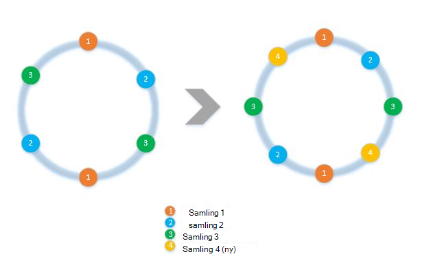
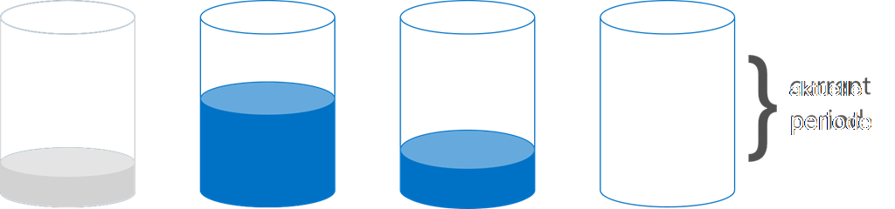

<properties 
    pageTitle="Sådan implementeres klient side partitionering med SDK'er | Microsoft Azure" 
    description="Lær at bruge Azure DocumentDB SDK'er på partition (shard) data og distribuere anmodninger på tværs af flere websteder" 
    services="documentdb" 
    authors="arramac" 
    manager="jhubbard" 
    editor="cgronlun" 
    documentationCenter=""/>

<tags 
    ms.service="documentdb" 
    ms.workload="data-services" 
    ms.tgt_pltfrm="na" 
    ms.devlang="na" 
    ms.topic="article" 
    ms.date="10/27/2016" 
    ms.author="arramac"/>

# <a name="how-to-partition-data-using-client-side-support-in-documentdb"></a>Sådan partition data ved hjælp af klientsiden support i DocumentDB

Azure DocumentDB understøtter [automatisk opdeling af af websteder](documentdb-partition-data.md). Der er dog brug tilfælde, hvor det er en fordel at have fin kornet kontrol over partitionering funktionsmåde. For at reducere den kedel trykplade kode, der kræves til opdeling af opgaver, har vi tilføjet funktionalitet i .NET, Node.js og Java SDK'er, der gør det nemmere at bygge programmer, der er skaleret på tværs af flere websteder.

I denne artikel vil vi se nærmere på de klasser og grænseflader i .NET SDK, og hvordan du kan bruge dem til at udvikle partitioneret programmer. Andre SDK'er som Java, Node.js og Python understøtter lignende metoder og grænseflader til opdeling af klientsiden.

## <a name="client-side-partitioning-with-the-documentdb-sdk"></a>Klientsiden partitionering med DocumentDB SDK

Før vi gå dybere ned partitionering, Lad os opsummere nogle grundlæggende DocumentDB begreber, som er relateret til partitionering. Hver Azure DocumentDB database konto består af et sæt af databaser, hver med flere samlinger, hver især kan indeholde lagrede procedurer, udløsere, brugerdefinerede funktioner, dokumenter og relaterede vedhæftede filer. Af websteder kan være enkelt partition eller partitioneret selv og har følgende egenskaber:

- Samlinger tilbyder ydeevne isolationsniveauet. Derfor er der en ydeevne fordel i sætvis lignende dokumenter i den samme websteder. For eksempel tid serie data skal du muligvis vil placere data for den sidste måned, der ofte forespørges, inden for en samling med højere klargjort overførselshastighed mens ældre data er placeret i af websteder med lav klargjort overførselshastighed.
- SURT transaktioner det vil sige lagrede procedurer og udløsere kan ikke strækker sig over en samling. Transaktioner er fastsat i en enkelt partition nøgleværdi i en samling.
- Samlinger Gennemtving ikke et skema, så de kan bruges til JSON dokumenter af samme type eller forskellige typer.

Starter med version [1.5.x af Azure DocumentDB SDK'er](documentdb-sdk-dotnet.md), kan du udføre dokument handlinger direkte mod en database. [DocumentClient](https://msdn.microsoft.com/library/azure/microsoft.azure.documents.client.documentclient.aspx) bruger internt PartitionResolver, du har angivet for databasen til at dirigere anmodninger til samlingen relevante.

>[AZURE.NOTE] [Serversiden partitionering](documentdb-partition-data.md) introduceret i RESTEN API 2015-12-16 og SDK'er 1.6.0+ deprecates klientsiden partition resolver metode til enkel Brug sager. Klientsiden partitionering dog er mere fleksibel og kan du bestemme isolationsniveauet ydeevne på tværs af partition taster, styre grad af parallelitet under læsning resultater fra flere partitioner og bruge område/geografiske partitionering fremgangsmåder kontra hash.

For eksempel i .NET er hver PartitionResolver klasse en korrekt implementering af en [IPartitionResolver](https://msdn.microsoft.com/library/azure/microsoft.azure.documents.client.ipartitionresolver.aspx) grænseflade, der har tre metoder - [GetPartitionKey](https://msdn.microsoft.com/library/azure/microsoft.azure.documents.client.ipartitionresolver.getpartitionkey.aspx), [ResolveForCreate](https://msdn.microsoft.com/library/azure/microsoft.azure.documents.client.ipartitionresolver.resolveforcreate.aspx) og [ResolveForRead](https://msdn.microsoft.com/library/azure/microsoft.azure.documents.client.ipartitionresolver.resolveforread.aspx). LINQ forespørgsler og ReadFeed Iteratorer kan du bruge metoden ResolveForRead internt til at gentages over alle de samlinger, der svarer til tasten partition for anmodningen. På samme måde, oprette handlinger Brug metoden ResolveForCreate til at dirigere opretter til den rigtige partition. Der er ingen ændringer, der kræves til Erstat, slette og læse, da de bruger dokumenter, som allerede indeholder referencen til den tilsvarende samling.

SDK'er indeholder også to klasser, der understøtter to vedtaget leverandør teknikker, krypteres og område opslag via en [HashPartitionResolver](https://msdn.microsoft.com/library/azure/microsoft.azure.documents.partitioning.hashpartitionresolver.aspx) og [RangePartitionResolver](https://msdn.microsoft.com/library/azure/mt126047.aspx). Du kan bruge disse klasser nemt føje Partitioneringsprogrammet til dit program.  

## <a name="add-partitioning-logic-and-register-the-partitionresolver"></a>Tilføj leverandør logik og Registrer PartitionResolver 

Her er et kodestykke, der viser, hvordan du opretter en [HashPartitionResolver](https://msdn.microsoft.com/library/azure/microsoft.azure.documents.partitioning.hashpartitionresolver.aspx) og registrere med DocumentClient til en database.

```cs
// Create some collections to partition data.
DocumentCollection collection1 = await client.CreateDocumentCollectionAsync(...);
DocumentCollection collection2 = await client.CreateDocumentCollectionAsync(...);

// Initialize a HashPartitionResolver using the "UserId" property and the two collection self-links.
HashPartitionResolver hashResolver = new HashPartitionResolver(
    u => ((UserProfile)u).UserId, 
    new string[] { collection1.SelfLink, collection2.SelfLink });

// Register the PartitionResolver with the database.
this.client.PartitionResolvers[database.SelfLink] = hashResolver;

```

## <a name="create-documents-in-a-partition"></a>Oprette dokumenter i en partition  

Når PartitionResolver er registreret, skal du kan udføre opretter og forespørger direkte på databasen, som vist nedenfor. I dette eksempel bruger SDK på PartitionResolver til at udtrække bruger-id, hash det og derefter bruge denne værdi til at omdirigere handlingen Opret til den korrekte af websteder.

```cs
Document johnDocument = await this.client.CreateDocumentAsync(
    database.SelfLink, new UserProfile("J1", "@John", Region.UnitedStatesEast));
Document ryanDocument = await this.client.CreateDocumentAsync(
    database.SelfLink, new UserProfile("U4", "@Ryan", Region.AsiaPacific, UserStatus.AppearAway));
```

## <a name="create-queries-against-partitions"></a>Oprette forespørgsler mod partitioner  

Du kan forespørge ved hjælp af metoden [CreateDocumentQuery](https://msdn.microsoft.com/library/azure/microsoft.azure.documents.linq.documentqueryable.createdocumentquery.aspx) ved overførsel af databasen og en Partitionsnøgle. Forespørgslen returnerer en enkelt resultatsæt over alle websteder i databasen, der er tilknyttet tasten partition.  

```cs
// Query for John's document by ID - uses PartitionResolver to restrict the query to the partitions 
// containing @John. Again the query uses the database self link, and relies on the hash resolver 
// to route the appropriate collection.
var query = this.client.CreateDocumentQuery<UserProfile>(
    database.SelfLink, null, partitionResolver.GetPartitionKey(johnProfile))
    .Where(u => u.UserName == "@John");
johnProfile = query.AsEnumerable().FirstOrDefault();
```

## <a name="create-queries-against-all-collections-in-the-database"></a>Oprette forespørgsler mod alle websteder i databasen 

Du kan også forespørgsel alle websteder i databasen og Optæl resultaterne, som vises under, ved at springe over argumentet partition nøgle.

```cs
// Query for all "Available" users. Here since there is no partition key, the query is serially executed 
// across each partition/collection and returns a single result-set. 
query = this.client.CreateDocumentQuery<UserProfile>(database.SelfLink)
    .Where(u => u.Status == UserStatus.Available);
foreach (UserProfile activeUser in query)
{
    Console.WriteLine(activeUser);
}
```

## <a name="hash-partition-resolver"></a>Hash Partition Resolver
Med hash partitionering tildeles partitioner ud fra værdien af en hash-funktioner, så du kan distribuere jævnt anmodninger og data på tværs af et antal partitioner. Denne metode bruges normalt til at partition data produceret eller consumed fra et stort antal forskellige klienter og er velegnet til lagring af brugerprofiler, katalogelementer og telemetridata IoT ("Internet af dette"). Hash partitionering bruges også af Documentdbs serversiden leverandør support i en samling.

**Hash partitionering:**


En simpel hash partitionering farveskema på tværs af *N* samlinger der ville være at hente alle dokumenter, beregne *hash(d) rest N* for at finde ud af, hvilken af websteder, det er placeret. Men et problem med denne enkle metode er, at den ikke fungerer godt, når du tilføjer nye af websteder eller fjerner af websteder, som dette kræver næsten alle dataene til at få reshuffled. [Ensartet krypteres] (http://citeseerx.ist.psu.edu/viewdoc/summary?doi=10.1.1.23.3738) er en velkendt algoritme, som løser dette problem ved at implementere en hashingmetode, minimeres mængden data bevægelse, der kræves under tilføje eller fjerne af websteder.

Klassen [HashPartitionResolver](https://msdn.microsoft.com/library/azure/microsoft.azure.documents.partitioning.hashpartitionresolver.aspx) implementerer logik til at opbygge en ensartet hash ringetone over den hash-funktion, der er angivet i grænsefladen [IHashGenerator](https://msdn.microsoft.com/library/azure/microsoft.azure.documents.partitioning.ihashgenerator.aspx) . HashPartitionResolver bruger en MD5 hash-funktion som standard, men du kan udskifte ud med din egen hashing-implementering. HashPartitionResolver opretter internt 16 hashes eller "virtuelle noder" i hash ring for hver af websteder for at opnå en mere ensartet distribution af dokumenter på tværs af samlingerne, men du kan variere dette nummer for at handel fra data skævhed med mængden af klienten side beregning.

**Ensartet krypteres med HashPartitionResolver:**


## <a name="range-partition-resolver"></a>Område Partition Resolver

I området partitionering tildeles partitioner ud fra, om tasten partition er i et bestemt område. Dette bruges normalt til partitionering med tidsstempel egenskaber (f.eks., eventTime mellem 1 april 2015 og 14 april 2015). Klassen [RangePartitionResolver](https://msdn.microsoft.com/library/azure/mt126047.aspx) hjælper dig med at bevare en tilknytning mellem et område med\<T\> og samling selv oprette et link. 

[Område\<T\> ](https://msdn.microsoft.com/library/azure/mt126048.aspx) er en simpel klasse, der administrerer områder af alle typer, der implementerer IComparable\<T\> og IEquatable\<T\> som strenge eller tal. For læser og opretter, kan du sende i en vilkårlig område, og resolveren identificerer alle kandidat af websteder ved at identificere områder af de partitioner, der skærer med det ønskede område. Denne funktion kan være praktiske, når du udfører serie tidsdata område forespørgsler.

**Angiv partitionering:**  

  

Et særligt tilfælde af området partitionering er, når området er blot en enkelt dedikeret værdi, også kaldet "opslag partitionering". Dette er ofte anvendte for partitionering efter område (fx partition til Jylland indeholder Norge, Danmark og Sverige) eller partitionering lejere i et med flere arkitekturer til computeren.

## <a name="samples"></a>Eksempler 

Se nærmere på [DocumentDB partitionering eksempler Github project](https://github.com/Azure/azure-documentdb-dotnet/tree/287acafef76ad223577759b0170c8f08adb45755/samples/code-samples/Partitioning) med kodestykker om, hvordan du bruger disse PartitionResolvers og udvide dem til at implementere dine egne oversættelsesfunktionerne så det passer til bestemte Brug tilfælde, som følger: 

* Hvordan du angiver en vilkårlig lambda udtryk for GetPartitionKey og bruge det til at implementere sammensatte leverandør nøgler eller partition forskellige typer objekter anderledes.
* Sådan oprettes en simpel [LookupPartitionResolver](https://github.com/Azure/azure-documentdb-dotnet/blob/287acafef76ad223577759b0170c8f08adb45755/samples/code-samples/Partitioning/Partitioners/LookupPartitionResolver.cs) , der bruger en manuel opslagstabel til at udføre partitionering. Dette mønster bruges normalt til partitionering baseret på dedikeret værdier som område, lejer-ID eller program navn.
* Sådan oprettes en [ManagedPartitionResolver](https://github.com/Azure/azure-documentdb-dotnet/blob/287acafef76ad223577759b0170c8f08adb45755/samples/code-samples/Partitioning/Partitioners/ManagedHashPartitionResolver.cs) , som opretter samlinger automatisk baseret på en skabelon, der definerer et naming farveskema, IndexingPolicy og lagrede procedurer, der skal registreres mod nye af websteder.
* Sådan oprettes et farveskema mindre [SpilloverPartitionResolver](https://github.com/Azure/azure-documentdb-dotnet/blob/287acafef76ad223577759b0170c8f08adb45755/samples/code-samples/Partitioning/Partitioners/SpilloverPartitionResolver.cs) , som blot opretter nye websteder, som de gamle samlinger fylder.
* Sådan sekventielt og deserialisere din PartitionResolver stat som JSON, så du kan dele mellem processer og på tværs af lukning. Du kan gøre disse i config-filer eller endda i en DocumentDB af websteder.
* En [DocumentClientHashPartitioningManager](https://github.com/Azure/azure-documentdb-dotnet/blob/287acafef76ad223577759b0170c8f08adb45755/samples/code-samples/Partitioning/Util/DocumentClientHashPartitioningManager.cs) klasse for at tilføje og fjerne partitioner til en database, der er opdelt dynamisk baseret på ensartet krypteres. Internt det bruger en [TransitionHashPartitionResolver](https://github.com/Azure/azure-documentdb-dotnet/blob/287acafef76ad223577759b0170c8f08adb45755/samples/code-samples/Partitioning/Partitioners/TransitionHashPartitionResolver.cs) til at distribuere læser og skriver under overflytning ved hjælp af en af fire tilstande - læse fra det gamle partitionsskema (ReadCurrent), et nyt (ReadNext), flette resultater fra begge (ReadBoth) eller ikke tilgængelig under overførsel (ingen).

Eksemplerne er Åbn kilde og opfordrer vi dig til at sende hente anmodninger med bidrag, der kan få glæde andre DocumentDB udviklere. Se [bidrag retningslinjer](https://github.com/Azure/azure-documentdb-net/blob/master/Contributing.md) for vejledning i at bidrage.  

>[AZURE.NOTE] Samling opretter er rente-begrænset af DocumentDB, så nogle af de eksempel metoder, der er vist her kan tage et par minutter at gennemføre.

##<a name="faq"></a>OFTE STILLEDE SPØRGSMÅL
**Understøtter DocumentDB serversiden partitionering?**

Ja, understøtter DocumentDB [serversiden partitionering](documentdb-partition-data.md). DocumentDB understøtter også klientsiden partitionering via klientsiden partition oversættelsesfunktionerne til mere avanceret brug sager.

**Hvornår skal jeg bruge serversiden kontra klientsiden partitionering?**
I fleste use cases anbefaler vi anvendelse af serversiden partitionering, da de administrative opgaver af partitionering data og routing anmodninger heltal. Men hvis du har brug for interval partitionering eller har en særlig use case for ydeevnen isolationsniveauet mellem forskellige værdier for partition taster, derefter klientsiden partitionering være den bedste metode.

**Hvordan tilføje eller fjerne en samling til min partitionsskema?**

Se nærmere på implementeringen af DocumentClientHashPartitioningManager i projektet eksempler for et eksempel på, hvordan du kan implementere ny partitionering.

**Hvordan fastholdes eller dele min leverandør konfiguration med andre klienter?**

Du kan sekventielt tilstanden partitioner som JSON og gemme i den åbne fil eller endda i DocumentDB af websteder. Se nærmere på metoden RunSerializeDeserializeSample i eksempler projektet til et eksempel.

**Hvordan jeg sammenkæde forskellige leverandør teknikker?**

Du kan sammenkæde PartitionResolvers ved at implementere dine egne IPartitionResolver, der bruger en eller flere eksisterende oversættelsesfunktionerne internt. Se nærmere på TransitionHashPartitionResolver i eksempler projektet til et eksempel.

##<a name="references"></a>Referencer
* [Serversiden partitionering i DocumentDB](documentdb-partition-data.md)
* [DocumentDB af websteder og ydeevne](documentdb-performance-levels.md)
* [Partitionering kodeeksempler på Github](https://github.com/Azure/azure-documentdb-dotnet/tree/287acafef76ad223577759b0170c8f08adb45755/samples/code-samples/Partitioning)
* [DocumentDB .NET SDK dokumentation på MSDN](https://msdn.microsoft.com/library/azure/dn948556.aspx)
* [DocumentDB .NET eksempler](https://github.com/Azure/azure-documentdb-net)
* [DocumentDB begrænsninger](documentdb-limits.md)
* [Tip til DocumentDB Blog af ydeevnen](https://azure.microsoft.com/blog/2015/01/20/performance-tips-for-azure-documentdb-part-1-2/)
 
