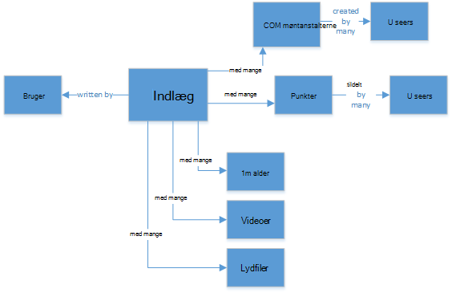
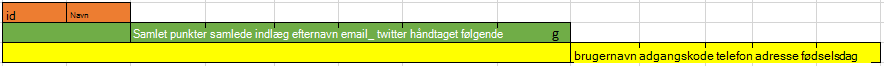
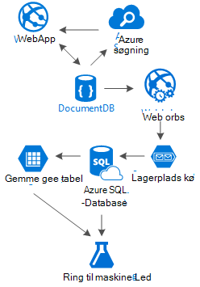

<properties 
    pageTitle="DocumentDB design mønster: sociale medier apps | Microsoft Azure" 
    description="Lær om et design mønster til sociale netværk ved at udnytte fleksibel storage for DocumentDB og andre Azure tjenester." 
    keywords="sociale medier apps"
    services="documentdb" 
    authors="ealsur" 
    manager="jhubbard" 
    editor="" 
    documentationCenter=""/>

<tags 
    ms.service="documentdb" 
    ms.workload="data-services" 
    ms.tgt_pltfrm="na" 
    ms.devlang="na" 
    ms.topic="article" 
    ms.date="09/27/2016" 
    ms.author="mimig"/>

# Gå sociale med DocumentDB

Lever i et stort omfang forbundne society betyder, at du på et tidspunkt i liv, bliver en del af et **socialt netværk**. Vi bruger sociale netværk, at holde kontakten med venner, kollegaer, familie eller nogle gange for at dele vores engagement med personer med fælles interesser.

Som teknikere eller udviklere, vi muligvis har undret dig over, hvordan disse netværk gemme og forbinde vores data, eller måske har også blevet opgave for at oprette eller udvikle et nyt sociale netværk for et bestemt niche marked vigtige. Det er, når opstår stor spørgsmålet: Sådan lagres alle disse data?

Lad os sige, at vi opretter en ny og blanke sociale netværk, hvor brugerne kan sende artikler med relaterede medier som billeder, videoer eller endda musik. Brugere kan skrive en kommentar til indlæg og give point til bedømmelser. Der vil være en feed af indlæg, som brugerne får vist og kan interagere med på landingssiden overordnede websted. Dette ikke lyde virkelig komplekse (i første omgang), men for at sikre en enkel, Lad os stopper der (Vi kunne delve til brugerdefinerede feeds, der påvirkes af relationer, men den overstiger formålet med denne artikel).

Så hvordan vi gemme dette og hvor?

Mange af du muligvis opleve på SQL-databaser eller mindst have begrebet [relationelle modeling af data](https://en.wikipedia.org/wiki/Relational_model) , og det kan være fristende at starte med at tegne nogenlunde sådan ud:

 

En perfekt standardiseret og flotte datastruktur... der ikke skalere. 

Ikke få mig forkert, jeg har arbejdet med SQL-databaser mit liv, de er fantastiske, men som hver mønster, praksis og software platformen, det er ikke perfekt til hver scenarie.

Hvorfor er SQL det bedste valg i dette scenarie? Lad os se på strukturen i en enkelt meddelelse, hvis jeg gerne vise dette indlæg i en websted eller et program, jeg skulle gøre en forespørgsel med... 8 tabel joinforbindelser (!) lige for at få vist én enkelt indlæg, nu en strøm af indlæg, der dynamisk indlæse og vises på skærmen, og du kan se, hvor jeg vil billede.

Vi kunne, naturligvis bruger en humongous forekomst af SQL med tilstrækkelig til at løse tusindvis af forespørgsler med disse mange joinforbindelser at kunne levere vores indhold, men virkelig vil vi hvorfor, når der findes en enklere løsning?

## NoSQL vej

Der er særlige graph databaser, der kan [køre på Azure](http://neo4j.com/developer/guide-cloud-deployment/#_windows_azure) , men de er ikke billige og kræver IaaS services (infrastruktur som en tjeneste, virtuelle maskiner hovedsageligt) og vedligeholdelse. Jeg vil formål i denne artikel til en lavere omkostninger løsning, der fungerer sammen for de fleste scenarier, der kører på Azure's NoSQL database [DocumentDB](https://azure.microsoft.com/services/documentdb/). Ved hjælp af en [NoSQL](https://en.wikipedia.org/wiki/NoSQL) tilgang lagring af data i JSON-format og anvende [denormalization](https://en.wikipedia.org/wiki/Denormalization)omdannes vores tidligere komplicerede indlæg til et enkelt [dokument](https://en.wikipedia.org/wiki/Document-oriented_database):

    {
        "id":"ew12-res2-234e-544f",
        "title":"post title",
        "date":"2016-01-01",
        "body":"this is an awesome post stored on NoSQL",
        "createdBy":User,
        "images":["http://myfirstimage.png","http://mysecondimage.png"],
        "videos":[
            {"url":"http://myfirstvideo.mp4", "title":"The first video"},
            {"url":"http://mysecondvideo.mp4", "title":"The second video"}
        ],
        "audios":[
            {"url":"http://myfirstaudio.mp3", "title":"The first audio"},
            {"url":"http://mysecondaudio.mp3", "title":"The second audio"}
        ]
    }

Og det kan fås med en enkelt forespørgsel og med ingen joinforbindelser. Dette er meget mere enkle og nemt, og budget-wise, det kræver færre ressourcer til at opnå en bedre resultat.

Azure DocumentDB sikrer, at alle egenskaberne, der er indekseret med [automatisk indeksering](documentdb-indexing.md), som kan endda være [defineret](documentdb-indexing-policies.md). Den skema ledig tilgang kan os med at gemme dokumenter med forskellige og dynamiske strukturer, måske i morgen vi vil indlæg, der skal have en liste over kategorier eller hashtags, der er knyttet til dem, DocumentDB håndterer de nye dokumenter med de attributter, der er tilføjet med noget ekstra arbejde, der kræves, før os.

Kommentarer i et indlæg kan behandles som lige andre indlæg med en overordnet egenskab (dette forenkler vores objekt tilknytning). 

    {
        "id":"1234-asd3-54ts-199a",
        "title":"Awesome post!",
        "date":"2016-01-02",
        "createdBy":User2,
        "parent":"ew12-res2-234e-544f"
    }

    {
        "id":"asd2-fee4-23gc-jh67",
        "title":"Ditto!",
        "date":"2016-01-03",
        "createdBy":User3,
        "parent":"ew12-res2-234e-544f"
    }

Og alle sociale interaktioner kan være gemt i et separat objekt som tællere:

    {
        "id":"dfe3-thf5-232s-dse4",
        "post":"ew12-res2-234e-544f",
        "comments":2,
        "likes":10,
        "points":200
    }

Oprettelse af feeds er bare et spørgsmål om oprettelse af dokumenter, der kan indeholde en liste over-id'er indlæg til en given relevans rækkefølge:

    [
        {"relevance":9, "post":"ew12-res2-234e-544f"},
        {"relevance":8, "post":"fer7-mnb6-fgh9-2344"},
        {"relevance":7, "post":"w34r-qeg6-ref6-8565"}
    ]

Vi kan have en "seneste" stream med indlæg, der er sorteret efter oprettelsesdato, en "populære" stream med disse indlæg med synes godt om mere i de seneste 24 timer, vi kan endda implementere en brugerdefineret stream for hver bruger, der er baseret på logik som tilhængere og interesser og det vil stadig være en liste over indlæg. Det er en noget ud af, hvordan du opretter disse lister, men læse ydeevnen bliver uhindret. Når vi få fat på en af disse lister, udstede vi en enkelt forespørgsel til DocumentDB brug af [operatoren IN](documentdb-sql-query.md#where-clause) til at hente af indlæg sider ad gangen.

Feed streams blev oprettet ved hjælp af [Azure App Services](https://azure.microsoft.com/services/app-service/) baggrundsprocesser: [Webjobs](../app-service-web/web-sites-create-web-jobs.md). Når der oprettes et indlæg, kan behandler i baggrunden udløses ved hjælp af [Azure-lager](https://azure.microsoft.com/services/storage/) [køer](../storage/storage-dotnet-how-to-use-queues.md) og Webjobs udløste ved hjælp af [Azure Webjobs SDK](../app-service-web/websites-dotnet-webjobs-sdk.md), implementere indlæg overførslen i streams baseret på vores egen brugerdefinerede logik. 

Punkter og synes godt om hen over et indlæg kan behandles i en udskudt måde ved hjælp af samme teknik til at oprette et til sidst ensartet miljø.

Tilhængere er vanskeligere. DocumentDB har en dokument størrelsesbegrænsning på 512Kb, så du kan synes om at gemme tilhængere som et dokument med denne struktur:

    {
        "id":"234d-sd23-rrf2-552d",
        "followersOf": "dse4-qwe2-ert4-aad2",
        "followers":[
            "ewr5-232d-tyrg-iuo2",
            "qejh-2345-sdf1-ytg5",
            //...
            "uie0-4tyg-3456-rwjh"
        ]
    }

Dette kan arbejde for en bruger med et par tusindtalsseparator tilhængere, men hvis nogle kendte sammenkæder vores rangordner, er denne metode til sidst der påløber kappen dokument størrelse.

Hvis du vil løse dette, kan vi bruge en blandet fremgangsmåde. Vi kan gemme antallet af tilhængere som en del af Brugerstatistik dokumentet:

    {
        "id":"234d-sd23-rrf2-552d",
        "user": "dse4-qwe2-ert4-aad2",
        "followers":55230,
        "totalPosts":452,
        "totalPoints":11342
    }

Og den faktiske graf over tilhængere kan være gemt på Azure lagerplads tabeller ved hjælp af et [lokalnummer](https://github.com/richorama/AzureStorageExtensions#azuregraphstore) , som muliggør enkel "A-følger-B" lager og hentning. Denne måde, kan vi uddelegere processen på nøjagtige tilhængere listen (når vi har brug for det) til Azure-lagertabeller, men for et opslag med hurtig tal, vi fortsætte med at bruge DocumentDB.

## "Lejder" mønster og data gentagelse

Når du har måske bemærket i JSON dokumentet, der refererer til et indlæg, er der flere forekomster af en bruger. Og du vil have gættet højre og det betyder, at de oplysninger, der repræsenterer en bruger, får denne denormalization kan være til stede i mere end ét sted.

For at gøre det muligt for hurtigere forespørgsler skal betale vi data kopiering. Problem med denne side-effekt er, at hvis ved en handling, en brugers dataændringer, vi har brug at finde alle aktiviteterne han nogensinde har og opdaterer dem alle. Ikke lyd meget praktiske, højre?

Graph databaser løser den i deres egen måde, vi til at løse det ved at identificere nøgle attributterne for en bruger, der viser vi i vores program for hver aktivitet. Hvis vi visuelt vise et indlæg i vores program og viser kun creator navn og billede, hvorfor du gemme alle brugerens data i attributten "createdBy"? Hvis for hver kommentar viser vi blot brugerens billede, behøver vi virkelig resten af sine oplysninger. Det er hvor noget jeg ringe "lejder mønster" kommer til udtryk.

Lad os brugeroplysninger som et eksempel:

    {
        "id":"dse4-qwe2-ert4-aad2",
        "name":"John",
        "surname":"Doe",
        "address":"742 Evergreen Terrace",
        "birthday":"1983-05-07",
        "email":"john@doe.com",
        "twitterHandle":"@john",
        "username":"johndoe",
        "password":"some_encrypted_phrase",
        "totalPoints":100,
        "totalPosts":24
    }
    
Ved at se på disse oplysninger, kan vi hurtigt registrere, som er vigtige oplysninger, og som derfor ikke, oprette en "lejder":

Det mindste trin kaldes en UserChunk, den minimale oplysning, der identificerer en bruger, og den bruges til kopiering af data. Ved at reducere størrelsen på de dublerede data til de oplysninger, som vi "vises", mindske vi risikoen for massive opdateringer.

Det midterste trin hedder brugeren, er det fulde data, der skal bruges på de fleste ydeevne-afhængige forespørgsler på DocumentDB, de mest anvendte og kritiske. Den indeholder de oplysninger, der er repræsenteret af en UserChunk.

Den største er den udvidede bruger. Den indeholder alle de kritiske brugeroplysninger samt andre data, der ikke kræver virkelig til at blive læst hurtigt eller det er brugen er eventuel (som logon). Disse data kan være gemt uden for DocumentDB i Azure SQL-Database eller Azure lagerplads tabeller.

Hvorfor vil vi opdele brugeren og endda gemme oplysningerne på forskellige steder? Fordi lagerplads i DocumentDB er [ikke uendelig](documentdb-limits.md) og fra en ydeevne nulpunkt visning, desto større dokumenter, de costlier forespørgsler. Holde dokumenter tynd med de rette oplysninger for at gøre alle dine ydeevne-afhængige forespørgsler på dit sociale netværk, og gemme de andre ekstra oplysninger for eventuel scenarier som fuld profil redigeringer, logon, også datamining til brugsstatistik og Big Data initiativer. Vi virkelig sig ikke hvis dataindsamling for datamining er langsommere, fordi den kører på Azure SQL-Database, vi har vedrører via, at vores brugere har en hurtig og tynd oplevelse. En bruger, der er gemt på DocumentDB, ville se således ud:

    {
        "id":"dse4-qwe2-ert4-aad2",
        "name":"John",
        "surname":"Doe",
        "username":"johndoe"
        "email":"john@doe.com",
        "twitterHandle":"@john"
    }

Og et indlæg vil se ud:

    {
        "id":"1234-asd3-54ts-199a",
        "title":"Awesome post!",
        "date":"2016-01-02",
        "createdBy":{
            "id":"dse4-qwe2-ert4-aad2",
            "username":"johndoe"
        }
    }

Og når der opstår en redigering, hvor en af egenskaber for afsnittet påvirkes, det er nemt at finde de pågældende dokumenter ved hjælp af forespørgsler, der peger på de indekserede attributter (Vælg * fra indlæg p hvor p.createdBy.id == "edited_user_id") og derefter opdatere dele.

## Søgefeltet

Brugerne kan generere, heldigvis kan en masse indhold. Vi bør kunne give mulighed for at søge efter og finde indhold, der ikke muligvis direkte i deres indholdsstrømme måske fordi vi ikke følger forfatteren eller måske vi prøver blot at finde, gamle indlæg vi har 6 måneder siden.

Thankfully, og da vi bruger Azure DocumentDB, vi nemt kan implementere en søgemaskine, ved hjælp af [Azure søge](https://azure.microsoft.com/services/search/) i et par minutter og uden at skrive en enkelt linje af kode (bortset fra tydeligt, søgeprocessen og Brugergrænsefladen).

Hvorfor er det så nemt?

Azure Søg implementerer de opkald for [indeks](https://msdn.microsoft.com/library/azure/dn946891.aspx), baggrundsprocesser, logge i dine typer datalagre og automagically tilføje, opdatere eller fjerne objekterne i indeksene. De understøtter en [Azure SQL-Database indeks](https://blogs.msdn.microsoft.com/kaevans/2015/03/06/indexing-azure-sql-database-with-azure-search/), [Azure BLOB indeks](../search/search-howto-indexing-azure-blob-storage.md) og thankfully, [Azure DocumentDB indeks](../documentdb/documentdb-search-indexer.md). Er nemt at overgangen af oplysninger fra DocumentDB til Azure søgning, som begge store oplysninger i JSON-formatet, vi skal blot [oprette vores indeks](../search/search-create-index-portal.md) og tilknytning, hvilke attributter fra vores dokumenter, vi vil indekseret og det er det, i løbet af få minutter (afhængigt af størrelsen af vores data), alle vores indholdet bliver tilgængeligt der skal søges efter, ved den bedste løsning søgning som en tjeneste i skyinfrastruktur. 

Du kan besøge [Hitchhikers vejledning til søgning](https://blogs.msdn.microsoft.com/mvpawardprogram/2016/02/02/a-hitchhikers-guide-to-search/)kan finde flere oplysninger om Azure søgning.

## Den underliggende viden

Når du gemmer alle dette indhold, der vokser og vokser hver dag, kan vi har fået tænker: Hvad kan jeg gøre med denne strøm af oplysninger fra Mine brugere?

Det er nemt at svaret: placere den for at arbejde, og Find ud fra den.

Men hvad kan vi lære? Et par nemme eksempler kan nævnes [synspunkt analyse](https://en.wikipedia.org/wiki/Sentiment_analysis)indhold anbefalinger, der er baseret på en brugers indstillinger eller endda et automatiseret indhold redaktør, der sikrer, at alt indhold udgivet af vores sociale netværk er sikkert til serien.

Nu hvor jeg har konfigureret du koblet, får du sandsynligvis tror, du har brug for nogle PhD i matematik naturvidenskab udtrække disse mønstre og oplysninger fra enkel databaser og filer, men du ville være forkerte.

[Azure Machine Learning](https://azure.microsoft.com/services/machine-learning/), en del af den [Cortana Intelligence pakke](https://www.microsoft.com/en/server-cloud/cortana-analytics-suite/overview.aspx), er det en fuldt administreret skybaseret tjeneste, hvor du kan oprette arbejdsprocesser ved hjælp af algoritmer i en enkel træk og slip-grænseflade kode din egen algoritmer i [R](https://en.wikipedia.org/wiki/R_(programming_language)) eller bruge nogle af de allerede er indbygget og klar til at bruge API'er f.eks.: [Tekst Analytics](https://gallery.cortanaanalytics.com/MachineLearningAPI/Text-Analytics-2), [Indhold redaktør](https://www.microsoft.com/moderator) eller [anbefalinger](https://gallery.cortanaanalytics.com/MachineLearningAPI/Recommendations-2).

For at opnå en af disse maskine Learning scenarier, kan vi bruge [Azure Data sø](https://azure.microsoft.com/services/data-lake-store/) til indtager oplysningerne fra forskellige kilder, og brug [U-SQL](https://azure.microsoft.com/documentation/videos/data-lake-u-sql-query-execution/) til at behandle oplysninger og generere output, der kan behandles via Azure maskine læring.

En anden tilgængelige mulighed er at bruge [Microsoft Kognitiv Services](https://www.microsoft.com/cognitive-services) til at analysere vores brugere indhold. ikke kun kan vi forstår dem for bedre (via analyse, hvad de skrive med [Tekst Analytics API](https://www.microsoft.com/cognitive-services/en-us/text-analytics-api)), men vi også kunne registrere uønskede eller fuldt indhold og handle i overensstemmelse hermed med [Computer syn API](https://www.microsoft.com/cognitive-services/en-us/computer-vision-api). Kognitiv tjenester der omfatter en masse out box løsninger, der ikke kræver en hvilken som helst form for maskine Learning viden til brug.

## Konklusion

I denne artikel forsøger at kaste nogle lys i alternativer oprette sociale netværk helt på Azure med lave omkostninger tjenester og give gode resultater ved at fremme brug af en flere lag lagerplads løsning og data fordeling kaldet "Lejder".

Sandheden er, at der ikke er nogen silver punkttegn for denne type af scenarier, er det en af synergien, der er oprettet af kombinationen af gode tjenester, der gør det muligt at opbygge gode oplevelser: hastighed og frie Azure DocumentDB at placere et godt sociale program, intelligence bag en førsteklasses søgeløsning ligesom Azure søgning fleksibilitet af Azure App Services vært ikke lige sprog agnostic programmer, men effektive baggrundsprocesser og udvidelig Azure-lager og Azure SQL-Database til lagring af store mængder data og en analytisk potens af Azure Machine Learning til at oprette viden og intelligence, der kan give feedback til vores processer og Hjælp os med at levere det rigtige indhold til de rigtige brugere.

## Næste trin

Få mere at vide om datamodeller ved at læse artiklen [modellering data i DocumentDB](documentdb-modeling-data.md) . Hvis du er interesseret i andre Brug sager for DocumentDB, kan du se [almindelige DocumentDB use cases](documentdb-use-cases.md).

Eller du kan læse mere om DocumentDB ved at følge [DocumentDB læringssti](https://azure.microsoft.com/documentation/learning-paths/documentdb/).
