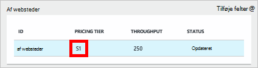
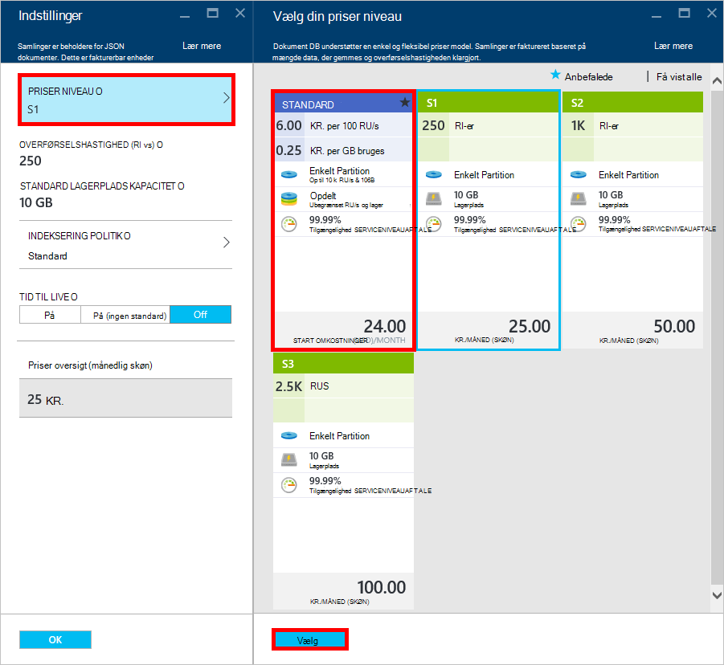
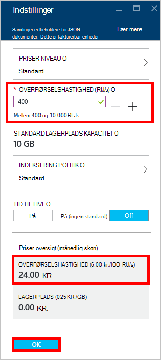
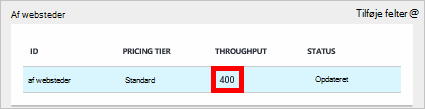

<properties 
    pageTitle="Forbedre kontoen DocumentDB S1 | Microsoft Azure" 
    description="Drage fordel af forbedrede overførsel i kontoen DocumentDB S1 ved at gøre et par enkle ændringer i portalen Azure." 
    services="documentdb" 
    authors="mimig1" 
    manager="jhubbard" 
    editor="monicar" 
    documentationCenter=""/>

<tags 
    ms.service="documentdb" 
    ms.workload="data-services" 
    ms.tgt_pltfrm="na" 
    ms.devlang="na" 
    ms.topic="article" 
    ms.date="08/25/2016" 
    ms.author="mimig"/>

# Forbedre kontoen DocumentDB

Følg disse trin for at kunne udnytte øget overførsel for kontoen Azure DocumentDB S1. Du kan øge gennemløb af din eksisterende S1-konto fra 250 [RU/s](documentdb-request-units.md) til 400 RU/s eller mere med meget for gratis!  

> [AZURE.VIDEO changedocumentdbcollectionperformance]

## Ændre til brugerdefinerede ydeevnen på portalen Azure

1. I din browser skal du gå til [**Azure-portalen**](https://portal.azure.com). 
2. Klik på **Gennemse** -> **DocumentDB (NoSQL)**, og derefter vælge DocumentDB kontoen til at ændre.   
3. Vælg databasen, til at ændre i objektiv til **databaser** , og vælg derefter samlingen med det S1 priser niveau i bladet **Database** .

      

4. Klik på **flere**i bladet **af websteder** , og klik derefter på **Indstillinger**.   
5. Klik på **Priser niveau** i bladet **Indstillinger** , og Bemærk, at månedlige estimatet for hver enkelt plan vises. Klik på **Standard**i bladet **Vælg din priser niveau** , og klik derefter på **Vælg** for at gemme ændringerne.

      

6. **Priser niveau** ændres til **Standard** , og feltet **overførselshastighed (RU/s)** vises med en standardværdi på 400 tilbage i bladet **Indstillinger** . Klik på **OK** for at gemme ændringerne. 

    > [AZURE.NOTE] Du kan angive overførselshastighed mellem 400 og 10.000 [anmode om enheder](../articles/documentdb/documentdb-request-units.md)/second (RU/s). **Oversigt over priser** nederst på siden opdateres automatisk til at levere en estimering af den månedlige pris.
    
    

8. Du kan kontrollere supercharged gennemløb af gruppen af websteder på bladet **Database** igen. 

    

Du kan finde flere oplysninger om de ændringer, der er relateret til brugerdefinerede og foruddefinerede overførselshastighed, kan du se blogindlægget [DocumentDB: alt, hvad du bør vide om at bruge de nye indstillinger i priser](https://azure.microsoft.com/blog/documentdb-use-the-new-pricing-options-on-your-existing-collections/).

## Næste trin

Hvis du beslutter, at du har brug for flere gennemløb (større end 10.000 RU/s) eller mere lagerplads (større end 10GB) kan du oprette en partitioneret af websteder. Hvis du vil oprette en partitioneret af websteder, skal du se [oprette en samling](documentdb-create-collection.md).