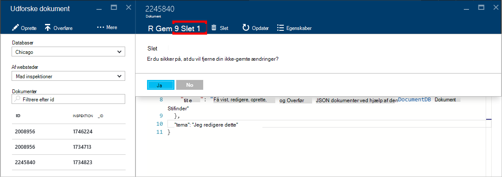

<properties
    pageTitle="DocumentDB dokument Explorer til at få vist JSON | Microsoft Azure"
    description="Få mere at vide om DocumentDB dokument Explorer, et Azure Portal værktøj til at få vist JSON, redigere, oprette og overføre JSON dokumenter med DocumentDB, en NoSQL dokument database."
        keywords="få vist json"
    services="documentdb"
    authors="kirillg"
    manager="jhubbard"
    editor="monicar"
    documentationCenter=""/>

<tags
    ms.service="documentdb"
    ms.workload="data-services"
    ms.tgt_pltfrm="na"
    ms.devlang="na"
    ms.topic="article"
    ms.date="08/30/2016"
    ms.author="kirillg"/>

# Få vist, redigere, oprette og overføre JSON dokumenter med DocumentDB dokument Stifinder

I denne artikel indeholder en oversigt over [Microsoft Azure DocumentDB](https://azure.microsoft.com/services/documentdb/) dokument Explorer, et Azure portalen værktøj, der gør det muligt at få vist, redigere, oprette, overføre og filtrere JSON dokumenter med DocumentDB. 

Bemærk, at dokumentet Explorer ikke er aktiveret på DocumentDB konti med protocol-understøttelse af MongoDB. Denne side opdateres, når denne funktion er aktiveret.

## Start dokument Explorer

1. I portalen Azure i Jumpbar, skal du klikke på **DocumentDB (NoSQL)**. Hvis **DocumentDB (NoSQL)** ikke er synlig, skal du klikke på **Flere tjenester** , og klik derefter på **DocumentDB (NoSQL)**.

2. Vælg kontonavnet. 

3. Klik på **Dokument Explorer**i menuen ressource. 
 
    

    I bladet **Dokument Explorer** rullelister **databaser** og **samlinger** er udfyldt på forhånd afhængigt af den kontekst, hvor du startede dokument Explorer. 

## Oprette et dokument

1. [Start dokument Explorer](#launch-document-explorer).

2. Klik på **Opret et dokument**i bladet **Dokument Explorer** . 

    En minimale JSON-kodestykket er angivet i bladet **dokument** .

    

2. Skriv i bladet **dokument** eller sæt ind i indholdet af det JSON-dokument, du vil oprette, og klik derefter på **Gem** for at bekræfte dit dokument til databasen og af websteder, der er angivet i bladet **Dokument Explorer** .

    

    > [AZURE.NOTE] Hvis du ikke angiver en "-id" egenskab, derefter dokumentet Explorer tilføjer et id-egenskaben og automatisk genererer en GUID som id-værdien.

    Hvis du allerede har data fra JSON filer, MongoDB, SQL Server, CSV-filer, Azure Table storage, Amazon DynamoDB, HBase, eller fra andre DocumentDB samlinger, kan du bruge Documentdbs [data overførselsværktøjet til](documentdb-import-data.md) hurtigt at importere dine data.

## Redigere et dokument

1. [Start dokument Explorer](#launch-document-explorer).

2. Redigere et eksisterende dokument, Vælg den bladet **Dokument Explorer** , redigere dokumentet i bladet **dokument** , og klik derefter på **Gem**.

    

    Hvis du redigerer et dokument og beslutter, at du vil Slet det aktuelle sæt ændringer, skal du blot klikke på **Slet** i bladet **dokument** , skal du bekræfte handlingen Slet, og den forrige tilstand for dokumentet genindlæses.

    

## Slette et dokument

1. [Start dokument Explorer](#launch-document-explorer).

2. Vælg dokumentet, i **Dokument Explorer**, klikke på **Slet**og derefter bekræfte sletningen. Når du har bekræftet, fjernet dokumentet med det samme fra listen over i dokumentet Explorer.

    

## Arbejde med dokumenter, JSON

Dokument Explorer valideret, en ny eller redigeret dokumentet indeholder gyldige JSON.  Du kan også få vist JSON fejl ved at holde musen over det forkerte afsnit for at få oplysninger om valideringsfejlen.

Desuden forhindrer dokument Explorer, at du gemme et dokument med ugyldige JSON-indhold.

Til sidst skal kan dokument Explorer du nemt få vist dialogboksen Egenskaber for system af aktuelt indlæste dokumentet ved at klikke på kommandoen **Egenskaber** .

> [AZURE.NOTE] Egenskaben tidsstempel (_ts) vises internt som epoke tid, men dokument Explorer viser værdien i et GMT format.

## Filtrere dokumenter
Dokument Explorer understøtter et antal indstillinger for navigation og avancerede indstillinger.

Som standard indlæser dokument Explorer til de første 100 dokumenter i den markerede samling af deres oprettelsesdato fra tidligste til seneste.  Du kan indlæse flere dokumenter (i batches med 100) ved at vælge indstillingen **indlæse flere** i bunden af bladet dokument Explorer. Du kan vælge, hvilke dokumenter for at indlæse gennem kommandoen **Filtrer** .

1. [Start dokument Explorer](#launch-document-explorer).

2. Klik på **Filter**øverst på bladet **Dokument Explorer** .  

    
  
3.  Filterindstillingerne vises under kommandolinjen. Giver en WHERE-delsætning og/eller delsætningen ORDER BY i filterindstillingerne, og klik derefter på **Filter**.

    

    Dokument Explorer opdaterer automatisk resultaterne med dokumenter, der svarer til filterforespørgslen. Læs mere om DocumentDB SQL-grammatikken i [SQL-forespørgsel og SQL-syntaks](documentdb-sql-query.md) artikel eller udskrive en kopi af den [SQL-forespørgsel cheat ark](documentdb-sql-query-cheat-sheet.md).

    Felterne **Database** og **samling** rullelisten kan bruges til at nemt ændre den samling, hvorfra dokumenter er i øjeblikket vises uden at lukke igen, og start dokumentet Explorer.  

    Dokument Explorer understøtter også filtrering det aktuelt indlæste sæt dokumenter efter deres id-egenskaben.  Nøjes med at skrive i dokumenter Filtrer efter id-feltet.

    

    Resultater i dokumentet Explorer er filtreret liste baseret på dine angivne kriterier.

    

    > [AZURE.IMPORTANT] Dokument Explorer filter funktionalitet kun filtrene fra ***aktuelt*** indlæst sæt dokumenter og udfører ikke en forespørgsel til den aktuelt markerede af websteder.

4. For at opdatere listen over dokumenter, der indlæses af dokument Explorer skal du klikke på **opdatere** med øverst del af bladet.

    

## Tilføj flere dokumenter

Dokument Explorer understøtter flere indtagelse af en eller flere eksisterende JSON dokumenter, op til 100 JSON-filer i handlingen.  

1. [Start dokument Explorer](#launch-document-explorer).

2. For at starte overførslen skal du klikke på **Overfør dokument**.

    

    Bladet **Overfør dokument** åbnes. 

2. Klik på knappen Gennemse for at åbne en stifindervinduet, Vælg en eller flere JSON-dokumenter til at overføre og derefter klikke på **Åbn**.

    

    > [AZURE.NOTE] Dokument Explorer understøtter i øjeblikket op til 100 JSON-dokumenter i individuelle Overfør handling.

3. Når du er tilfreds med valget, klik på knappen **Overfør** .  Dokumenterne, der føjes automatisk til gitteret dokument Explorer, og Overfør resultaterne vises som handlingen skrider frem. Importfejl rapporteres for individuelle filer.

    

4. Når handlingen er fuldført, kan du vælge op til en anden 100 dokumenter til at overføre.

## Arbejde med JSON dokumenter uden for portalen

Dokument Explorer i portalen Azure er blot en enkelt metode til at arbejde med dokumenter i DocumentDB. Du kan også arbejde med dokumenter ved hjælp af [REST-API](https://msdn.microsoft.com/library/azure/mt489082.aspx) eller [klient SDK'er](documentdb-sdk-dotnet.md). For eksempel kode, skal du se [.NET SDK dokument eksempler](documentdb-dotnet-samples.md#document-examples) og [Node.js SDK dokument eksempler](documentdb-nodejs-samples.md#document-examples).

Hvis du har brug at importere eller overføre filer fra en anden kilde (JSON-filer, MongoDB, SQL Server, CSV-filer, Azure-tabel lagerplads, Amazon DynamoDB eller HBase), kan du bruge DocumentDB [data overførselsværktøjet til](documentdb-import-data.md) hurtigt at importere dataene til DocumentDB.

## Fejlfinding i forbindelse med

**Symptom**: dokument Explorer returnerer **ikke fundet nogen dokumenter**.

**Løsning**: Sørg for, at du har valgt den korrekte abonnement, database og af websteder, som dokumenterne, der er blevet indsat. Se også for at sikre, at du arbejder i din kvoter for overførsel. Hvis du arbejder på begrænset din maksimale antal gennemløb niveau og få, nederste brugen af programmet til at betjene under det maksimale antal gennemløb kvote til samlingen.

**Forklaring**: portalen er et program som ethvert andet, foretage opkald til din DocumentDB database og af websteder. Hvis dine anmodninger er i øjeblikket er begrænset på grund af kald, der foretages fra et separat program, kan portalen også være begrænset, forårsager ressourcer, der ikke kan vises på portalen. Du kan løse problemet ved adresse årsagen til høj overførselshastighed brugen, og opdater derefter bladet portalen. Oplysninger om, hvordan måle og nederste overførselshastighed brugen kan findes i afsnittet [overførselshastighed](documentdb-performance-tips.md#throughput) i artiklen [tip om ydeevne](documentdb-performance-tips.md) .

## Næste trin

Hvis du vil vide mere om DocumentDB SQL-grammatikken understøttes i dokumentet Explorer, i [SQL-forespørgsel og SQL-syntaks](documentdb-sql-query.md) artiklen eller udskrive på [SQL-forespørgsel cheat ark](documentdb-sql-query-cheat-sheet.md).

[Læringssti](https://azure.microsoft.com/documentation/learning-paths/documentdb/) er også en nyttig ressource til at hjælpe dig, som du lære mere om DocumentDB. 
