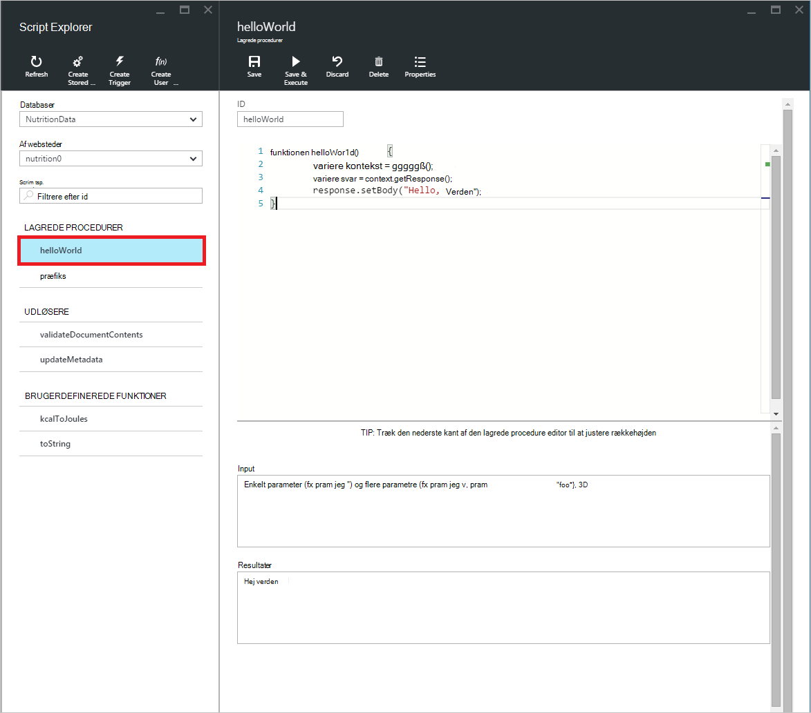

<properties
    pageTitle="DocumentDB Script Explorer, et JavaScript-redigeringsprogram | Microsoft Azure"
    description="Få mere at vide om DocumentDB Script Explorer, et værktøj til Azure Portal til at administrere DocumentDB serversiden programming elementer herunder lagrede procedurer, udløsere og brugerdefinerede funktioner."
    keywords="JavaScript-editor"
    services="documentdb"
    authors="kirillg"
    manager="jhubbard"
    editor="monicar"
    documentationCenter=""/>

<tags
    ms.service="documentdb"
    ms.workload="data-services"
    ms.tgt_pltfrm="na"
    ms.devlang="na"
    ms.topic="article"
    ms.date="08/30/2016"
    ms.author="kirillg"/>

# Oprette og køre lagrede procedurer, udløsere og brugerdefinerede funktioner med DocumentDB Script Stifinder

I denne artikel indeholder en oversigt over [Microsoft Azure DocumentDB](https://azure.microsoft.com/services/documentdb/) Script Explorer, som er en JavaScript-editor i portalen Azure, der gør det muligt at få vist og udføre DocumentDB serversiden programming elementer herunder lagrede procedurer, udløsere og brugerdefinerede funktioner. Læs mere om DocumentDB serversiden programmering i artiklen [lagrede procedurer, databaseudløsere og brugerdefinerede funktioner](documentdb-programming.md) .

## Start Script Explorer

1. I portalen Azure i Jumpbar, skal du klikke på **DocumentDB (NoSQL)**. Hvis **DocumentDB konti** ikke er synlig, skal du klikke på **Flere tjenester** , og klik derefter på **DocumentDB (NoSQL)**.

2. Klik på **Script Explorer**i menuen ressourcer.

    
 
    Felterne **Database** og **samling** rullelisten er udfyldt på forhånd afhængigt af den kontekst, hvor du starter Script Explorer.  Eksempelvis hvis du starter fra en database blade, er den aktuelle database udfyldt på forhånd.  Hvis du starter fra en samling blade, derefter er den aktuelle websteder udfyldt på forhånd.

4.  Brug felterne **Database** og **samling** rullelisten nemt ændre den samling, hvorfra scripts, som er i øjeblikket vises uden at lukke igen, og start Script Explorer.  

5. Script Explorer understøtter også filtrering det aktuelt indlæste sæt af scripts efter deres id-egenskaben.  Nøjes med at skrive i feltet filter, og resultaterne i listen Script Explorer er filtreres baseret på dine angivne kriterier.

    

    > [AZURE.IMPORTANT] Script Stifinder filtrere funktionalitet kun filtre fra ***aktuelt*** indlæst sæt af scripts og automatisk opdateres ikke den aktuelt markerede af websteder.

5. For at opdatere listen over scripts indlæst af Script Explorer skal du blot klikke på kommandoen **Opdater** i toppen af bladet.

    

## Oprette, få vist og redigere lagrede procedurer, udløsere og brugerdefinerede funktioner

Script Explorer kan du nemt udfører CRUD handlinger på DocumentDB serversiden programming elementer.  

- For at oprette et script, skal du blot klikke på den relevante oprette kommandoen i script explorer, giver et id, Angiv indholdet af scriptet og klikke på **Gem**.

    

- Når du opretter en udløser, skal du også angive handlingen udløser type og udløser

    

- For at få vist et script, skal du blot klikke på scriptet, hvor du er interesseret.

    

- Hvis du vil redigere et script, skal du blot foretage de ønskede ændringer i JavaScript'et editor og klikker på **Gem**.

    

- Hvis du vil slette et script ventende ændringer, skal du blot klikke på kommandoen **Slet** .

    

- Script Explorer kan du også nemt se egenskaber for system af aktuelt indlæste scriptet ved at klikke på kommandoen **Egenskaber** .

    

    > [AZURE.NOTE] Egenskaben tidsstempel (_ts) vises internt som epoke tid, men Script Explorer viser værdien i et GMT format.

- Hvis du vil slette et script, skal du markere det i Script Explorer og klikke på kommandoen **Slet** .

    

- Bekræft sletningen ved at klikke på **Ja** eller annullere sletningen ved at klikke på **Nej**.

    

## Udføre en lagret procedure

> [AZURE.WARNING] Udførelse af gemte procedurer i Script Explorer er endnu ikke understøttet for server side opdelt af websteder. Besøg [partitionering og skalering i DocumentDB](documentdb-partition-data.md)kan finde flere oplysninger.

Script Explorer kan du udføre serversiden lagrede procedurer fra Azure-portalen.

- Når du åbner en ny Opret gemt procedure blade, leveres et standard-script (*præfiks*) allerede. Tilføje et *id* og *input*for at køre scriptet *præfiks* eller dit eget script. Lagrede procedurer, der accepterer flere parametre, være alle input i en matrix (fx *["foo", "linjen"]*).

    

- Hvis du vil udføre en lagret procedure, klik på kommandoen **Gem og udføre** fra ruden med script editor.

    > [AZURE.NOTE] Kommandoen **Gem og udføre** gemmer den lagrede procedure før udførelse af, hvilket betyder, at den vil overskrive den tidligere gemte version af den lagrede procedure.

- Vellykket lagret procedure udførelser, har statussen *er blevet gemt og udføres den lagrede procedure* og de returnerede resultater udfyldes i ruden *resultater* .

    

- Hvis den udførelse af registrerer en fejl, udfyldes fejlen i ruden *resultater* .

    

## Arbejde med scripts uden for portalen

Script Explorer i portalen Azure er blot en enkelt metode til at arbejde med lagrede procedurer, udløsere og brugerdefinerede funktioner i DocumentDB. Du kan også arbejde med scripts med den REST-API og [klienten SDK'er](documentdb-sdk-dotnet.md). REST-API dokumentationen omfatter eksempler til at arbejde med [lagrede procedurer ved hjælp af REST](https://msdn.microsoft.com/library/azure/mt489092.aspx), [brugerdefinerede funktioner ved hjælp af REST](https://msdn.microsoft.com/library/azure/dn781481.aspx)og [Udløsere ved hjælp af REST](https://msdn.microsoft.com/library/azure/mt489116.aspx). Eksempler er også tilgængelige viser hvordan du [arbejder med scripts med C#](documentdb-dotnet-samples.md#server-side-programming-examples) og [arbejde med scripts med Node.js](documentdb-nodejs-samples.md#server-side-programming-examples).

## Næste trin

Lær mere om DocumentDB serversiden programmering i artiklen [lagrede procedurer, databaseudløsere og brugerdefinerede funktioner](documentdb-programming.md) .

[Læringssti](https://azure.microsoft.com/documentation/learning-paths/documentdb/) er også en nyttig ressource til at hjælpe dig, som du lære mere om DocumentDB.  
