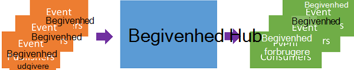
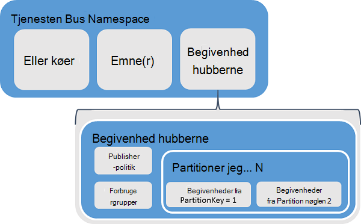
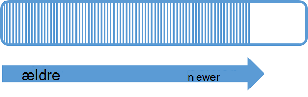
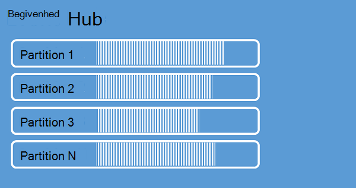
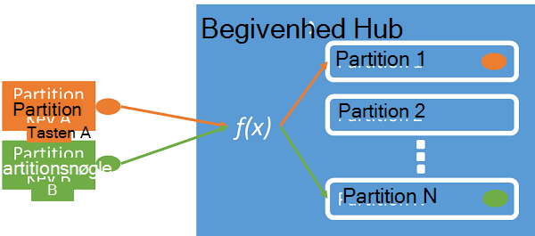
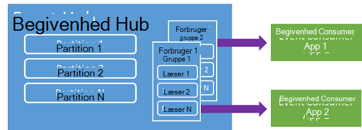
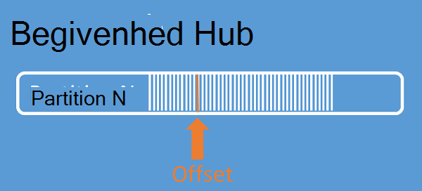
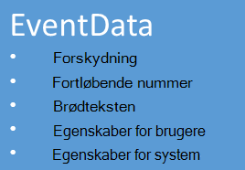

<properties 
    pageTitle="Oversigt over Azure begivenhed Hubs | Microsoft Azure"
    description="Introduktion og oversigt over Azure begivenhed Hubs."
    services="event-hubs"
    documentationCenter="na"
    authors="sethmanheim"
    manager="timlt"
    editor="" />
<tags 
    ms.service="event-hubs"
    ms.devlang="na"
    ms.topic="get-started-article"
    ms.tgt_pltfrm="na"
    ms.workload="na"
    ms.date="08/16/2016"
    ms.author="sethm" />

# Azure begivenhed Hubs oversigt

Mange moderne løsninger til hensigt at giver tilpasset kunde oplevelser eller for at forbedre produkter via fortløbende feedback og automatiseret telemetri. Disse løsninger, der står udfordring af, hvordan du sikkert og pålideligt behandle meget store mængder oplysninger fra mange samtidige udgivere. Microsoft Azure begivenhed Hubs er en administreret platform-tjeneste, som indeholder et fundament for store data indtag i en lang række forskellige scenarier. Eksempler på disse scenarier er funktionsmåde registrering i mobile-apps, trafikoplysninger fra webfarme, i game begivenhed capture i console spil, eller telemetridata, der indsamles fra industrielle computere eller forbindelse køretøjer. Den almindelige rolle, begivenhed Hubs afspilles i løsning arkitekturer er, at den fungerer som den "forside dør" for en begivenhed pipeline, ofte kaldet en *begivenhed ingestor*. En begivenhed ingestor er en komponent eller tjeneste, som er placeret mellem begivenhed udgivere og begivenhed forbrugere til decouple fremstilling af en begivenhed stream fra forbrug af disse begivenheder.

Azure begivenhed Hubs er en begivenhed, behandling af tjeneste, som indeholder begivenhed og telemetri vandindtrængen i skyen massive skaleres med lav ventetid og høj pålidelighed. Denne tjeneste, bruges sammen med andre efterfølgende tjenester, er især nyttig i programmet instrumentation, bruger oplevelse eller arbejdsproces behandling og Internet af ting (IoT) scenarier. Begivenhed Hubs giver en meddelelse stream håndtering af muligheden for, og en begivenhed Hub et objekt, der svarer til køer og emner, men det har egenskaber, der er meget forskelligt fra traditionelle enterprise messaging. Enterprise SMS situationer kræver ofte avancerede funktioner som sekvensnummerering, inaktive bogstaver, understøttelse af transaktioner og stærke levering sikkerhed i forbindelse med, mens begivenhed indtag dominerende interesse er høj overførselshastighed og behandling af fleksibilitet til begivenhed streams. Derfor begivenhed Hubs funktioner adskiller sig fra Service Bus emner ved at de er på det kraftigste forkærlighed med høj overførselshastighed og begivenhed behandling af scenarier. Som sådan implementerer begivenhed Hubs ikke nogle af funktionerne til SMS-beskeder, der er tilgængelige for emner. Hvis du skal bruge disse funktioner, forbliver emner det bedste valg.

Der oprettes en begivenhed Hub på begivenheden Hubs navneområde niveauet, svarer til Service Bus køer og emner. Begivenhed Hubs bruger AMQP og HTTP som de primære API-grænseflader. I det følgende diagram viser forholdet mellem begivenhed Hubs og Service Bus.

## Oversigt

Begivenhed Hubs indeholder meddelelse streaming gennem et partitioneret consumer mønster. Brug en [Konkurrere Consumer](https://msdn.microsoft.com/library/dn568101.aspx) model, hvor hver consumer forsøger at læse fra den samme kø eller ressource, køer og emner. Denne konkurrence for ressourcer, der resulterer i sidste ende i kompleksitet og skala begrænsninger for stream behandling af programmer. Begivenhed Hubs bruger et partitioneret consumer mønster, som læser hver consumer kun et angivet delsæt eller partition af strømmen meddelelse. Dette mønster gør det muligt for vandret skalering til behandling af hændelse og giver andre stream-fokuserede funktioner, der er tilgængelige i køer og emner.

### Partitioner

En partition er en bestemt rækkefølge af hændelser, der findes i en begivenhed Hub. Når der modtages nye begivenheder, føjes de til slutningen af denne fremgangsmåde. En partition kan betragtes som en "Anvend logfil."

Partitioner bevarer data til et tidspunkt for konfigurerede opbevaring, der er angivet på niveauet for begivenhed Hub. Denne indstilling gælder på tværs af alle partitioner i Hub. Hændelser udløbe på tidsgrundlag; Du kan ikke eksplicit slette dem. En begivenhed Hub indeholder flere partitioner. Hver partition er uafhængig og indeholder sin egen sekvens af data. Derfor kan vokse partitioner ofte til forskellig rente.

Antallet af partitioner er angivet på begivenheden Hub oprettelse af tid og skal være mellem 2 og 32 (standard er 4). Partitioner er en data organisation ordning og mere er relateret til graden af efterfølgende parallelitet påkrævet i andre programmer end til begivenhed Hubs overførselshastighed. Dette gør valg af antallet partitioner i en begivenhed-Hub, der er direkte relateret til antallet af samtidige læsere, som du forventer at har. Efter oprettelse af begivenhed Hub skal er partition antallet ikke kan ændres; Du skal overveje dette nummer med hensyn til langsigtede forventede skala. Du kan øge grænsen 32 partition ved at kontakte Service Bus teamet.

Mens partitioner kan identificeres og kan sendes til direkte, er det bedst at undgå at sende data til bestemte partitioner. I stedet kan du bruge højere niveau konstruktioner introduceret i sektionerne [begivenhed publisher](#event-publisher) og [Publisher politik](#capacity-and-security) .

I forbindelse med begivenhed Hubs kaldes meddelelser for *begivenhed data*. Begivenhed data indeholder brødteksten i begivenheden, en brugerdefineret egenskab pose og forskellige metadata om begivenheden som dens forskydning i partitionen og dets nummer i rækken stream. Partitioner er fyldt med en sekvens af begivenhed data.

## Begivenhed publisher

En hvilken som helst enhed, der sender begivenheder eller data til en begivenhed Hub er en *begivenhed publisher*. Begivenhed udgivere kan publicere hændelser ved hjælp af HTTPS eller AMQP 1.0. Begivenhed udgivere bruge et delt Access signatur (SAS) token til at identificere sig selv en begivenhed hub og kan have en entydig identitet, eller brug et almindelige SAS-token, afhængigt af scenariet krav.

Du kan finde flere oplysninger om at arbejde med SAS se [Delt Access signatur godkendelse med Service Bus](../service-bus-messaging/service-bus-shared-access-signature-authentication.md).

### Almindelige opgaver i publisher

I dette afsnit beskrives almindelige opgaver for begivenhed udgivere.

#### Få fat på et SAS token

Delte Access signatur (SAS) er godkendelsesmetoden for begivenhed Hubs. Service Bus indeholder SAS politikker navneområde og begivenhed Hub niveau. Et SAS token er dannet ud fra en SAS nøgle og er en SHA hashværdi for en URL-adresse, kodet i et bestemt format. Brug navnet på tasten (politik) og tokenet, Service Bus genoprette giver resultat og dermed godkende afsenderen. Normalt er SAS tokens for begivenhed udgivere oprettet med kun **sende** rettigheder på en bestemt begivenhed Hub. Denne SAS token URL-adressen ordning er grundlaget for publisher identifikation introduceret i politikken publisher. Du kan finde flere oplysninger om at arbejde med SAS se [Delt Access signatur godkendelse med Service Bus](../service-bus-messaging/service-bus-shared-access-signature-authentication.md).

#### Publicere en begivenhed

Du kan udgive en begivenhed via AMQP 1.0 eller HTTPS. Service Bus indeholder en [EventHubClient](https://msdn.microsoft.com/library/microsoft.servicebus.messaging.eventhubclient.aspx) klasse til publicering begivenheder til en begivenhed Hub fra .NET klienter. Du kan bruge alle AMQP 1.0-klienter, som [Apache Qpid](http://qpid.apache.org/)for andre eksekverbar kode og platforme. Du kan udgive begivenheder enkeltvis eller batches. En enkelt publikation (begivenhed data forekomst) har en begrænsning på 256KB, uanset om det er en enkelt begivenhed eller en gruppe. Publicering af hændelser, der er større end det medfører en fejl. Det er en god fremgangsmåde for udgivere til at være klar over af partitioner inden for den begivenhed Hub og kun angive en *partition nøgle* (indført i næste afsnit) eller deres identitet via deres SAS token.

Vælge mellem at bruge AMQP eller HTTPS er specifikke for scenariet brugen. AMQP kræver, at oprettelsen af en fast tovejs socket i tilføjelse til transport sikkerhed (TLS) eller SSL/TLS. Det kan være en kostbar handling med hensyn til netværkstrafik, men kun sker der i starten af en AMQP session. HTTPS har en mindre første Ressourceforbrug, men det kræver flere SSL spild for hver anmodning. Udgivere, der ofte publicerer begivenheder, tilbyder AMQP ydeevne, forsinkelse og overførselshastighed spare.

### Partitionsnøgle

En Partitionsnøgle er en værdi, der bruges til at kortlægge indgående begivenhed data til bestemte partitioner med henblik på organisering af data. Tasten partition er en afsender leveret værdi, der overføres til en begivenhed Hub. Det er behandlet via en statisk hashing-funktion, der er resultatet af som opretter en partition tildeling. Hvis du ikke angiver en Partitionsnøgle, når du udgiver en begivenhed, bruges en round robin opgave. Når du bruger partition taster, er begivenhed udgiveren kun opmærksom på partition nøglen, ikke den partition, som hændelserne, der er publiceret. Denne afkobling nøgle og partition insulates afsenderen fra behøver at vide for meget om efterfølgende behandling og opbevaring af begivenheder. Partition taster er vigtige for at organisere data til efterfølgende behandling, men er grundlæggende vedrører partitioner sig selv. En-enhed eller bruger entydige identitet udgør en god Partitionsnøgle, men andre attributter som Geografi kan også bruges til at gruppere relaterede begivenheder i en enkelt partition. Følgende billede viser begivenhed afsendere med partition taster til at fastgøre til partitioner.

Begivenhed Hubs sikrer, at alle hændelser, der deler den samme partition nøgleværdi leveres i rækkefølge, og til samme partition. Det vigtigste er, hvis partitionsnøgler bruges med publisher politikker, der er beskrevet i næste afsnit, derefter udgiverens identitet og værdien af tasten partition skal stemme overens. Ellers, opstår der en fejl.

### Hændelser

Enhver enhed, der læser begivenhed data fra en hændelse Hub er en begivenhed forbruger. Alle begivenhed forbrugere Læs begivenhed strømmen gennem partitioner i en forbruger gruppe. Hver partition har kun én aktive læser ad gangen. Alle begivenhed Hubs forbrugere at oprette forbindelse via AMQP 1.0 sessionen, hvori hændelser leveres, når de bliver tilgængelige. Klienten behøver ikke at afstemning for datatilgængelighed.

#### Forbrugergrupper

Udgiv/Abonner ordningen af begivenhed Hubs er aktiveret via consumer grupper. En forbruger gruppe er en visning (stat, placering eller forskydning) af en hel begivenhed Hub. Forbruger grupper Aktivér flere arket programmer til hver har en separat visning af strømmen begivenhed, og at læse strømmen uafhængigt af hinanden i deres eget tempo og med deres egen forskydning. I en stream behandling arkitektur, passer hver efterfølgende programmet til en forbruger gruppe. Hvis du vil skrive begivenhed data til længerevarende opbevaring, er dette lagerplads writer program en forbruger gruppe. Behandling af komplekse hændelse udføres af en anden, separat consumer gruppe. Du kan kun få adgang til partitioner via en forbruger gruppe. Der er altid en standardgruppe med forbrugere i en begivenhed-Hub, og du kan oprette op til 20 consumer grupper for et almindelige trin begivenhed Hub.

Følgende er eksempler på consumer gruppe URI konferencen:

    //<my namespace>.servicebus.windows.net/<event hub name>/<Consumer Group #1>
    //<my namespace>.servicebus.windows.net/<event hub name>/<Consumer Group #2>

Følgende billede viser begivenhed forbrugerne inden for forbrugergrupper.

#### Stream forskyder

En forskydning er placeringen af en begivenhed i en partition. Du kan betragte en forskydning som en klientsiden markør. Forskydningen er en byte nummerering af begivenheden. Dette gør det muligt for en begivenhed consumer (læser) til at angive et punkt i streame, de vil begynde at læse begivenheder. Du kan angive forskydningen, som et tidsstempel eller en forskydning værdi. Forbrugere er ansvarlig for lagring af deres egne forskydningsværdierne uden for tjenesten begivenhed Hubs.

I en partition omfatter hver enkelt hændelse en forskydning. Denne forskydning bruges af forbrugerne til at vise placeringen i rækkefølgen for en given partition begivenhed. Forskydning kan sendes til begivenhed hubben som enten et tal eller et tidsstempel værdi, når en læser opretter forbindelse.

#### Checkpointing

*Checkpointing* er en proces, som læsere mærket eller bekræfte deres placering i en sekvens med partition begivenhed. Checkpointing er ansvarlig for forbrugerne og forekommer på grundlag per partition i en forbruger gruppe. Det betyder, at for hver gruppe, forbrugere, hver partition læser skal holde styr på den aktuelle placering i streame og kan give tjenesten, når den finder datastrømmen fuldført. Hvis en læser afbryder forbindelsen til en partition, når forbindelsen genoprettes den begynder at læse på det kontrolpunkt, der tidligere blev sendt af sidste læseren af denne partition i den pågældende consumer gruppe. Når læseren opretter forbindelse, sender denne forskydning til begivenhed hubben til at angive det sted, hvor du begynder at læse. Du kan bruge checkpointing til begge hændelser, der er markeret som "afsluttet" på denne måde ved efterfølgende programmer, og til at levere fleksibilitet i tilfælde af en failover mellem læsere, der kører på forskellige computere. Fordi begivenhed data bevares for det opbevaring interval, der er angivet på det tidspunkt begivenhed hubben er oprettet, er det er muligt at vende tilbage til ældre data ved at angive en lavere forskydning fra denne checkpointing proces. Checkpointing aktiverer via denne funktion kan både failover fleksibilitet og kontrolleret begivenhed stream genafspilning.

#### Almindelige forbrugere opgaver

I dette afsnit beskrives almindelige opgaver for begivenhed Hubs begivenhed forbrugere eller læsere. Alle begivenhed Hubs forbrugere at oprette forbindelse via AMQP 1.0. AMQP 1.0 er en session og tilstand-aware tovejs kommunikationskanal. Hver partition har en AMQP 1.0 link session, der letter transport af hændelser, der er adskilt af partition.

##### Oprette forbindelse til en partition

For at kunne bruge begivenheder fra en hændelse-Hub, skal en forbruger oprette forbindelse til en partition. Som nævnt tidligere kan du altid har adgang til partitioner gennem en forbruger gruppe. Som en del af partitioneret consumer modellen, skal kun en enkelt læser være aktiv på en partition på én gang i en forbruger gruppe. Det er almindelig praksis, når der oprettes forbindelse direkte til partitioner, der skal bruge en leasingskontrakter ordning for at koordinere læser forbindelser til bestemte partitioner. Denne måde, det er muligt for hver partition i en forbruger gruppe skal have kun én aktive læser. Administrere placering i rækkefølgen til en læser er en vigtig opgave, der opnås gennem checkpointing. Denne funktionalitet er forenklet ved hjælp af klassen [EventProcessorHost](https://msdn.microsoft.com/library/microsoft.servicebus.messaging.eventprocessorhost.aspx) til .NET-klienter. [EventProcessorHost](https://msdn.microsoft.com/library/microsoft.servicebus.messaging.eventprocessorhost.aspx) er en agent for intelligent forbrugere og er beskrevet i næste afsnit.

##### Læs begivenheder

Når en AMQP 1.0 session og link er åbnet for en bestemt partition, leveres begivenheder til AMQP 1.0 klienten af tjenesten begivenhed Hubs. Denne levering funktion gør det muligt for højere overførselshastighed og kortere ventetid end hente-baserede mekanismer som HTTP GET. Hændelser, der er sendt til klienten, indeholder hver begivenhed data forekomst vigtige metadata som forskydning og sekvens tal, der bruges til at lette checkpointing fra begivenhed rækkefølgen.

Det er din ansvaret for at styre denne forskydning på en måde, bedste muliggør administration af opgavefremdrift i behandling af strømmen.

## Kapacitet og sikkerhed

Begivenhed Hubs er en meget SVG parallelle arkitektur for stream vandindtrængen. Der er flere vigtige aspekter overvejelser i forbindelse til dimensionering og skalering en løsning, der er baseret på begivenheden Hubs som f.eks. Først af disse kapacitet kontrolelementer kaldes *overførselshastighed enheder*, der er beskrevet i følgende afsnit.

### Overførselshastighed enheder

Overførselshastighed kapaciteten af begivenhed Hubs styres af overførselshastighed enheder. Overførselshastighed enheder er allerede købte enheder af kapacitet. En enkelt overførselshastighed enhed omfatter følgende:

- Vandindtrængen: Op til 1 MB til hver anden eller 1000 begivenheder sekundet.

- Udgangspunkt: Op til 2 MB sekundet.

Vandindtrængen er begrænset til mængden af kapacitet, der leveres af antallet af overførselshastighed købte enheder. Sende data over denne beløb resultater i en "kvote overskredet" undtagelse. Dette beløb er enten 1 MB til hver anden eller 1000 begivenheder sekundet, afhængigt af hvad der kommer først. Udgangspunkt ikke medfører variere den benyttede undtagelser, men er begrænset til mængden dataoverførsel i henhold til de købte overførselshastighed enheder: 2 MB sekundet per overførselshastighed enhed. Hvis du modtager publicering rente undtagelser eller forventer at se højere udgangspunkt, skal du kontrollere hvor mange overførselshastighed enheder, du har købt til navneområdet som begivenhed hubben blev oprettet. Du kan justere indstillingen på siden **navneområder** under fanen **skala** i [Azure klassisk portal][]for at få flere overførselshastighed enheder. Du kan også ændre denne indstilling, ved hjælp af Azure-API'er.

Mens partitioner er en data-organisation som repræsenterer, findes overførselshastighed enhederne kun en kapacitet konceptet. Overførselshastighed enheder er faktureret i timen og er udfyldt købes. Når du har købt, faktureres overførselshastighed enheder til et minimum af en time. Op til 20 overførselshastighed enheder kan købes for en begivenhed Hubs navneområde, og der er en Azure-Kontogrænse på 20 overførselshastighed enheder. Disse overførselshastighed enheder deles på tværs af alle begivenhed hubber i en given navneområde.

Overførselshastighed enheder er klargjort på grundlag bedste indsats og altid muligvis ikke øjeblikkelig købes. Hvis du har brug for en bestemt kapacitet, anbefales det, at du køber disse overførselshastighed enheder forvejen. Hvis du kræver mere end 20 overførselshastighed enheder, kan du kontakte Azure support for at købe flere overførselshastighed enheder på grundlag anvendelsen i blokke på 20 op til de første 100 overførselshastighed enheder. Ud over, hvordan du kan købe blokke med 100 overførselshastighed enheder.

Det anbefales, at du omhyggeligt saldo overførselshastighed enheder og partitioner for at opnå optimal Skaler med begivenhed Hubs. En enkelt partition har en maksimale skala på én overførselshastighed enhed. Antallet af overførselshastighed enheder skal være mindre end eller lig med antallet af partitioner i en begivenhed Hub.

Detaljerede prisoplysninger i [Begivenhed Hubs priser](https://azure.microsoft.com/pricing/details/event-hubs/).

### Publisher-politik

Begivenhed Hubs gør det muligt for findelt kontrol over begivenhed udgivere gennem *publisher politikker*. Publisher politik er et sæt af Runtime-funktioner, der er udviklet til at lette stort antal uafhængige begivenhed udgivere. Med politikker for publisher bruger hver publisher sin egen entydigt id, når der udgives begivenheder på en begivenhed Hub, kan du bruge følgende metode:

    //<my namespace>.servicebus.windows.net/<event hub name>/publishers/<my publisher name>

Du behøver ikke at oprette publisher navne forvejen, men de skal svare til SAS tokenet bruges ved udgivelse af en begivenhed for at sikre, at uafhængige publisher identiteter. Se [Delt Access signatur godkendelse med Service Bus](../service-bus-messaging/service-bus-shared-access-signature-authentication.md)kan finde flere oplysninger om SAS. Når du bruger publisher politikker, angives værdien **PartitionKey** til publisher-navn. Hvis du vil fungere korrekt, der skal svare til disse værdier.

## Oversigt

Azure begivenhed Hubs indeholder en hyper-skala begivenhed og telemetri processing-tjeneste, som kan bruges til almindelige programmet og bruger arbejdsproces overvågning på en hvilken som helst skala. Mulighed for at give udgivelse abonnement af funktioner med lav ventetid og massive skaleres begivenhed hub fungerer som "til Rampe" for Big Data. Med publisher-baseret identitet og lister over tilbagekaldte certifikater udvides disse funktioner til almindelige Internet ting scenarier. Du kan finde flere oplysninger om begivenhed Hubs udviklingsprogrammer, [begivenhed Hubs programming vejledning](event-hubs-programming-guide.md).

## Næste trin

Nu hvor du har lært om begivenhed Hubs begreber, kan du gå videre til følgende scenarier:

- Introduktion til en [begivenhed Hubs selvstudium].
- En komplet [Northwind, der bruger begivenhed Hubs].

[Azure klassisk portal]: http://manage.windowsazure.com
[Begivenhed Hubs selvstudium]: event-hubs-csharp-ephcs-getstarted.md
[eksempelprogram, der bruger begivenhed Hubs]: https://code.msdn.microsoft.com/windowsazure/Service-Bus-Event-Hub-286fd097
