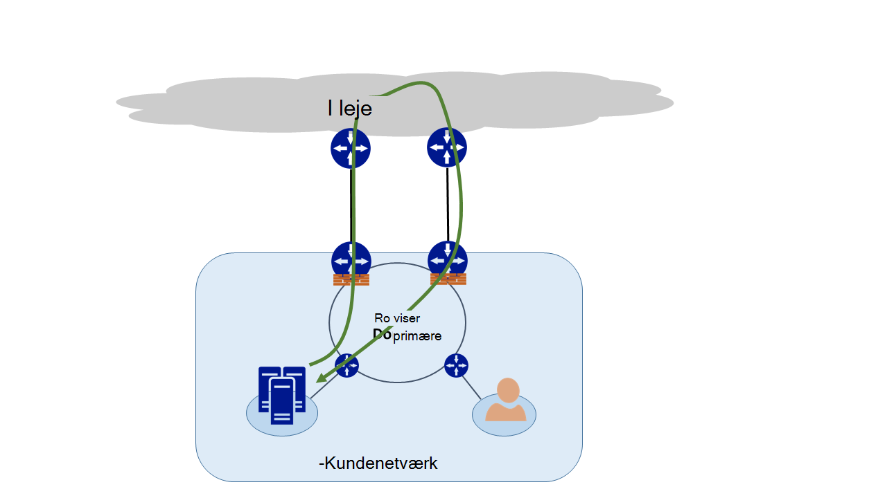
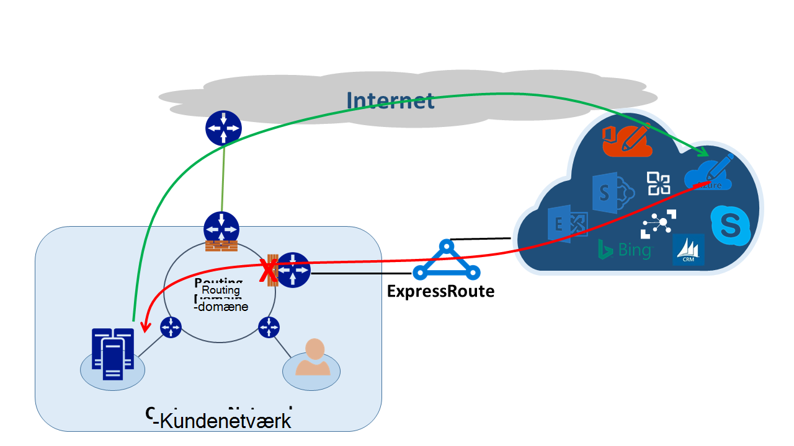
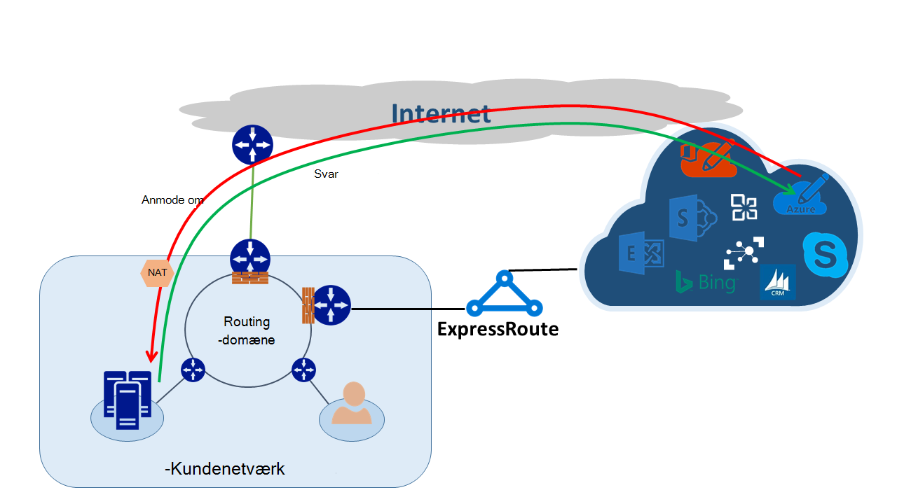

<properties
   pageTitle="Asymmetrisk routing | Microsoft Azure"
   description="I denne artikel fører dig gennem de problemer, der muligvis vises en kunde med asymmetrisk routing i et netværk med flere links til en destination."
   documentationCenter="na"
   services="expressroute"
   authors="osamazia"
   manager="carmonm"
   editor=""/>
<tags
   ms.service="expressroute"
   ms.devlang="na"
   ms.topic="get-started-article"
   ms.tgt_pltfrm="na"
   ms.workload="infrastructure-services"
   ms.date="10/10/2016"
   ms.author="osamazia"/>

# Asymmetrisk rute med flere netværksstier

I denne artikel forklares det, hvordan fremad og vend tilbage netværkstrafik kan tage forskellige omdirigerer, når flere stier findes mellem netværkskilde- og destinationstabellerne.

Det er vigtigt at forstå to begreber at forstå asymmetrisk routing. En er effekten af flere netværksstier. Den anden er hvordan enheder, som en firewall, beholde tilstand. Denne type enheder kaldes med høj sikkerhed enheder. En kombination af disse to faktorer opretter scenarier, i hvilket netværk afbrydes trafik ved en med høj sikkerhed enhed, fordi den med høj sikkerhed enhed ikke kunne registrere, trafik kommer med selve enheden.

## Flere netværksstier

Når et virksomhedsnetværk indeholder kun et link til internettet via deres internetudbyder, varer al trafik til og fra internettet den samme sti. Firmaer køber ofte, flere kredsløb, som redundante stier til at forbedre netværk oppetiden. Når dette sker, er det muligt, at trafik, der går uden for netværket, til internettet, går gennem et link, og den returnerede trafikken går gennem et andet link. Dette er ofte kaldes asymmetrisk routing. Omvendt netværkstrafik tager i asymmetrisk rute, en anden sti fra den oprindelige flow.

Selvom den primært forekommer på internettet, gælder asymmetrisk routing også for andre kombinationer af forskellige stier. Det gælder, for eksempel både en internetsti og en privat sti, som du gå til den samme destination og til flere private stier, der går til samme destination.

Hver router langs måde, fra kilde til destination, beregner den bedste sti for at få en destination. Routeren bestemmelse af bedste mulige sti er baseret på to primære faktorer:

-   Routing mellem eksterne netværk er baseret på en routing-protokol, kant Gateway Protocol (BGP). BGP tager reklamer fra tilstødende netværk og kører dem gennem en række trin til at bestemme den bedste stien til den ønskede destination. Den bedste sti gemmes i dens routing-tabellen.
-   Længden af en undernetmaske, der er knyttet til en rute påvirker routing stier. Hvis en router modtager flere reklamer for den samme IP-adresse, men med forskellige undernetmasker, foretrækker router annonce med en længere undernetmaske, da det kan betragtes som en mere specifik rute.

## Med høj sikkerhed enheder

Routere Kig på IP-headeren af en pakke til routing formål. Visse enheder se endnu bedre i pakken. Typisk disse enheder se på Layer4 (Transmission Control Protocol eller TCP; eller brugerdatagramprotokol eller UDP) eller endda Layer7 (programlag) sidehoveder. Disse typer af enheder er enten sikkerhedsenheder eller båndbredde optimering enheder. 

En firewall er et almindeligt eksempel på en enhed med høj sikkerhed. En firewall tillader eller afviser en pakke til passerer gennem dets grænseflader, der er baseret på forskellige felter som protokol, TCP/UDP-port og URL-adressen sidehoveder. Dette niveau af pakke inspektion indsætter en tungt behandling af belastning på enheden. For at forbedre ydeevnen, inspicerer firewallen første pakken med et forløb. Hvis det er muligt pakken fortsætte, bevarer flow oplysningerne i dens tabel. Alle efterfølgende pakker, der er relateret til dette flow er tilladt baseret på den første bestemmelse. En pakke, der er en del af et eksisterende flow kan ankommer til firewallen. Hvis firewallen har ingen foregående tilstandsoplysninger om det, udelader firewallen pakken.

## Asymmetrisk rute med ExpressRoute

Når du opretter forbindelse til Microsoft via Azure ExpressRoute, sådan Netværksændringerne ud:

-   Du har flere forbindelser til Microsoft. Et link er eksisterende forbindelse til internettet, og den anden er via ExpressRoute. Nogle trafik til Microsoft muligvis gå via internettet, men kommer tilbage via ExpressRoute eller omvendt.
-   Du får vist mere specifikke IP-adresser via ExpressRoute. Så for trafik fra dit netværk til Microsoft for tjenester, der tilbydes via ExpressRoute, foretrækker routere altid ExpressRoute.

Du kan finde den effekt, der har disse to ændringer på et netværk, Lad os se på nogle scenarier. Som et eksempel, der kun ét kredsløb til internettet, og du forbruge alle Microsoft-tjenester via internettet. Trafik fra dit netværk til Microsoft og tilbage kører på tværs linket samme Internet og passerer gennem firewallen. Firewallen poster strømmen, som den ser den første pakke og returnerede pakker er tilladt, fordi strømmen findes i tabellen tilstand.

Derefter skal du slå ExpressRoute og forbruge tjenester, der tilbydes af Microsoft over ExpressRoute. Alle andre tjenester fra Microsoft er brugt via internettet. Du kan installere en separat firewall på din kant, der er forbundet til ExpressRoute. Microsoft anmelder mere specifikke præfikser til dit netværk over ExpressRoute til bestemte tjenester. Infrastrukturen routing vælger ExpressRoute som den foretrukne sti for disse præfikser. Hvis du ikke reklame din offentlige IP-adresser til Microsoft over ExpressRoute kommunikerer Microsoft med dit offentlige IP-adresser via internettet. Videresende trafik fra dit netværk til Microsoft bruger ExpressRoute og omvendt trafik fra Microsoft bruger internettet. Når firewallen på kanten registrerer en response-pakken til et rutediagram, der ikke findes i tabellen tilstand, udelader den returnerede trafik.

Hvis du vælger at bruge samme netværk adresse oversættelse (NAT) puljen for ExpressRoute og til internettet, får du vist lignende problemer med klienterne i dit netværk på private IP-adresser. Anmodninger om tjenester som Windows Update gå via internettet, da IP-adresser for disse tjenester ikke meddeles via ExpressRoute. Den returnerede trafik kommer dog tilbage via ExpressRoute. Hvis Microsoft modtager en IP-adresse med samme undernetmasken fra internettet og ExpressRoute, foretrækker ExpressRoute via internettet. Hvis en firewall eller en anden med høj sikkerhed enhed, som findes på dit netværk kant og modstående ExpressRoute indeholder ingen forudgående oplysninger om strømmen, udelader de pakker, der hører til flow.

## Asymmetrisk routing løsninger

Du har to primære muligheder for at løse problemet med asymmetrisk routing. En er gennem routing, og den anden er ved hjælp af kilde-baserede NAT (SNAT).

### Routing

Sørg for, at din offentlige IP-adresser er reklame for relevante WAN-netværk (WAN) links. Eksempelvis hvis du vil bruge internettet til godkendelsestrafik og ExpressRoute til din mail trafik, skal du ikke offentliggør din Active Directory Federation Services (AD FS) offentlige IP-adresser over ExpressRoute. På samme måde, skal du sørge for ikke at få vist et lokalt AD FS server til IP-adresser, der router modtager over ExpressRoute. Omdirigerer blev modtaget via ExpressRoute er mere specifikke, så de foretage ExpressRoute foretrukne stien til godkendelsestrafik til Microsoft. Derved asymmetrisk routing.

Hvis du vil bruge ExpressRoute til godkendelse, skal du kontrollere, at du reklame AD FS offentlige IP-adresser over ExpressRoute uden NAT. Denne måde, trafik, der stammer fra Microsoft og går til et lokalt AD FS server handler om ExpressRoute. Returnere trafik fra kunde til Microsoft bruger ExpressRoute, fordi det er den foretrukne rute via internettet.

### Kilde-baserede NAT

Der er en anden måde at løse asymmetrisk routing problemer ved hjælp af SNAT. For eksempel, har du ikke annonceret den offentlige IP-adresse på en server, lokalt Simple Mail Transfer Protocol (SMTP) over ExpressRoute fordi du vil bruge internettet til denne type kommunikation. En anmodning, der stammer fra med Microsoft og går derefter videre til lokale SMTP-serveren kører på tværs af internettet. Du SNAT den indgående anmodning til en intern IP-adresse. Omvendt trafik fra SMTP-serveren går til kant firewallen (som du bruger til NAT) i stedet for via ExpressRoute. Returtypen trafikken går tilbage via internettet.

## Asymmetrisk routing registrering

Traceroute er den bedste måde at sikre dig, at din netværkstrafik er gå på tværs forventede stien. Hvis du forventer trafik fra lokale SMTP-serveren til Microsoft for at tage Internet stien, er den forventede traceroute SMTP-serveren til Office 365. Resultatet har valideret, trafik faktisk forlader netværket mod internettet og ikke mod ExpressRoute.
