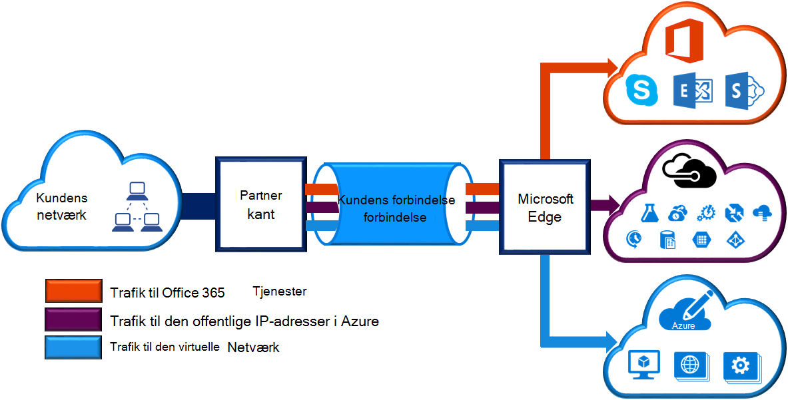
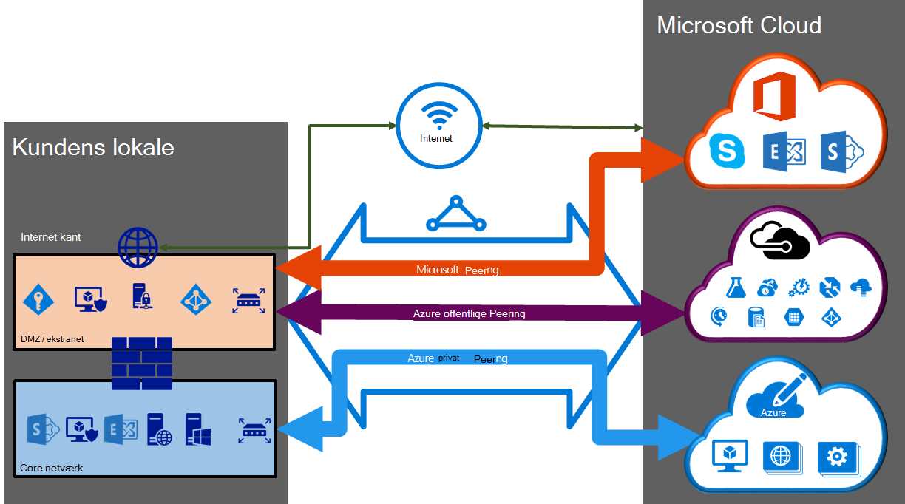

<properties 
   pageTitle="ExpressRoute kredsløb og routing domæner | Microsoft Azure"
   description="Denne side indeholder en oversigt over ExpressRoute kredsløb og routing domæner."
   documentationCenter="na"
   services="expressroute"
   authors="cherylmc"
   manager="carmonm"
   editor=""/>
<tags 
   ms.service="expressroute"
   ms.devlang="na"
   ms.topic="article" 
   ms.tgt_pltfrm="na"
   ms.workload="infrastructure-services" 
   ms.date="10/10/2016"
   ms.author="cherylmc"/>

# ExpressRoute kredsløb og routing domæner

 Du skal bestille et *ExpressRoute kredsløb* til at oprette forbindelse infrastrukturen i det lokale miljø til Microsoft via en forbindelse. Figuren nedenfor indeholder en logisk repræsentation af forbindelsen mellem din WAN og Microsoft.

## ExpressRoute kredsløb

Et *ExpressRoute kredsløb* repræsenterer en logisk forbindelse mellem din lokale infrastruktur og Microsofts skytjenester via en forbindelse. Du kan bestille flere ExpressRoute kredsløb. Hvert kredsløb kan være i samme eller forskellige områder og kan være forbundet til deres lokale gennem forskellige connectivity udbydere. 

ExpressRoute kredsløb Knyt ikke for en hvilken som helst fysiske enheder. Et kredsløb er entydigt identificeret med en standard GUID kaldet som en tjeneste nøgle (s-nøgle). Nøglen tjenesten er den eneste oplysning mellem Microsoft, provideren connectivity, og du har udvekslet. S-tasten er ikke en hemmeligt af sikkerhedsmæssige årsager. Der findes en 1:1 tilknytning mellem et ExpressRoute kredsløb og s-nøgle.

Et ExpressRoute kredsløb kan have op til tre uafhængige peerings: Azure offentlige, Azure privat, og Microsoft. Hver peering er et par af uafhængige BGP sessioner dem konfigureret give til høj tilgængelighed. Der er en 1: n (1 < = N < = 3) tilknytning mellem et ExpressRoute kredsløb og routing domæner. Et ExpressRoute kredsløb kan have en, to eller alle tre peerings aktiveret per ExpressRoute kredsløb.
 
Hvert kredsløb har en fast båndbredde (50 Mbps 100 Mbps 200 Mbps, 500 Mbps, 1 Gbps, og 10 Gbps) og er knyttet til en udbyder af connectivity og en peering placering. Den båndbredde, du vælger er deles på tværs af alle peerings for kredsløbet. 

### Kvoter, grænser og begrænsninger

Standardkvotaer og begrænsninger gælder for alle ExpressRoute kredsløb. Referere til siden [Azure-abonnement og begrænsninger for tjenesten, kvoter, og begrænsninger](../azure-subscription-service-limits.md) for opdaterede oplysninger om kvoter.

## ExpressRoute routing domæner

Et ExpressRoute kredsløb har flere routing domæner, der er knyttet til den: Azure offentlige, Azure privat, og Microsoft. Hver af de routing domæner er konfigureret identisk på et par routere (i aktiv-aktiv eller indlæse dele konfiguration) til høj tilgængelighed. Azure services er kategoriseret som *Azure offentlige* og *private Azure* til at repræsentere den IP-adresse, vælge en adresse til farveskemaer.

### Privat peering

Azure udregne tjenesterne, nemlig virtuelle maskiner (IaaS) og skytjenester (PaaS), der er installeret, inden for et virtuelt netværk kan forbindes via private peering domænet. Privat peering domænet er anses for at være en der er tillid til udvidelse af netværket core til Microsoft Azure. Du kan konfigurere tovejs-forbindelsen mellem core netværket og Azure virtuelle netværk (VNets). Denne peering, kan du oprette forbindelse til virtuelle computere og tjenester direkte på deres private IP-adresser i skyen.  

Du kan oprette forbindelse mere end én virtuelt netværk til private peering domænet. Gennemse [ofte stillede spørgsmål om siden](expressroute-faqs.md) oplysninger om grænser og begrænsninger. Du kan besøge siden [Azure-abonnement og begrænsninger for tjenesten, kvoter, og begrænsninger](../azure-subscription-service-limits.md) for opdaterede oplysninger på begrænsninger.  Se siden [Routing](expressroute-routing.md) finde detaljerede oplysninger om konfigurationen af routing.

### Offentlige peering

Tjenester som Azure-lager, SQL-databaser og websteder tilbydes på offentlige IP-adresser. Du kan oprette forbindelse til services på offentlige IP-adresser, herunder VIPs for dine tjenester i skyen, til den offentlige peering routing-domæne privat. Du kan oprette forbindelse til offentlige peering domænet til din DMZ og oprette forbindelse til alle Azure tjenester på deres offentlige IP-adresser fra din WAN uden at skulle oprette forbindelse via internettet. 

Forbindelse startes til Microsoft Azure services altid fra din WAN. Microsoft Azure tjenester vil ikke kunne starte forbindelser til dit netværk via denne routing-domæne. Når offentlige peering er aktiveret, vil du kunne oprette forbindelse til alle Azure tjenester. Vi kan ikke du selektivt Vælg tjenester, som vi annoncere omdirigerer til. Du kan gennemse listen over præfikser vi annoncere til dig via denne peering på siden [Microsoft Azure Datacenter IP-intervaller](http://www.microsoft.com/download/details.aspx?id=41653) . Siden opdateres ugentligt.

Du kan angive brugerdefinerede distribuere filtre i dit netværk til at bruge kun de omdirigerer, du har brug for. Se siden [Routing](expressroute-routing.md) finde detaljerede oplysninger om konfigurationen af routing. Du kan angive brugerdefinerede distribuere filtre i dit netværk til at bruge kun de omdirigerer, du har brug for. 

Gå til [ofte stillede spørgsmål om siden](expressroute-faqs.md) kan finde flere oplysninger på tjenester understøttes via det offentlige peering routing-domæne. 
 
### Microsoft peering

[AZURE.INCLUDE [expressroute-office365-include](../../includes/expressroute-office365-include.md)]

Forbindelse til alle andre Microsoft online services (såsom Office 365-tjenester) bliver via Microsoft peering. Vi aktivere tovejs-forbindelsen mellem dine WAN og Microsoft cloud tjenester via Microsoft peering routing domænet. Du skal kun oprette forbindelse til Microsofts skytjenester via offentlige IP-adresser, der er ejet af dig eller udbyderen connectivity, og du skal overholde de definerede regler. Se siden [ExpressRoute forudsætninger](expressroute-prerequisites.md) for flere oplysninger.

Se [ofte stillede spørgsmål om side](expressroute-faqs.md) for flere oplysninger om tjenester, der understøttes, omkostninger og oplysninger om konfiguration. Se siden [ExpressRoute placeringer](expressroute-locations.md) for at få oplysninger på listen over connectivity udbydere tilbyder Microsoft peering support.

## Sammenligning af routing domæne

Tabellen nedenfor sammenligner de tre routing domæner.

||**Privat Peering**|**Offentlige Peering**|**Microsoft Peering**|
|---|---|---|---|
|**Maks. # præfikser understøttes per peering**|4000 som standard 10.000 med ExpressRoute Premium|200|200|
|**IP-adresseområder understøttes**|En gyldig IPv4-adresse i din WAN.|Offentlige IPv4-adresser ejes af dig eller udbyderen connectivity.|Offentlige IPv4-adresser ejes af dig eller udbyderen connectivity.|
|**SOM tal krav**|Private og offentlige som tal. Du skal eje offentligheden som tal, hvis du vælger at bruge en. | Private og offentlige som tal. Du skal dog bevise ejerskabet af offentlige IP-adresser.| Private og offentlige som tal. Du skal dog bevise ejerskabet af offentlige IP-adresser.|
|**Routing Interface IP-adresser**|RFC1918 og offentlige IP-adresser|Offentlige IP-adresser for dig er registreret i routing registre.| Offentlige IP-adresser for dig er registreret i routing registre.|
|**MD5-Hash support**| Ja|Ja|Ja|

Du kan vælge at aktivere en eller flere af de routing domæner som en del af deres ExpressRoute kredsløb. Du kan vælge at har alle routing domæner flytte til den samme VPN, hvis du vil kombinere dem til en enkelt routing-domæne. Du kan også indsætte dem på forskellige routing domæner, svarende til diagrammet. Anbefalet konfiguration er, at private peering er tilsluttet direkte til core netværket, og den offentlige og Microsoft peering links er tilsluttet din DMZ.
 
Hvis du vælger at lade alle tre peering sessioner, skal du have tre par af BGP sessioner (et par for hver peering type). BGP session par giver et meget tilgængelige link. Hvis du opretter forbindelse via lag 2 connectivity udbydere, skal du være ansvarlig for konfiguration og administration af routing. Du kan få mere at vide ved at gennemgå [arbejdsprocesser](expressroute-workflows.md) til konfiguration af ExpressRoute.

## Næste trin

- Finde en tjenesteudbyder af. Se [ExpressRoute tjenesteudbydere og placeringer](expressroute-locations.md).
- Sørg for, at alle forudsætninger er opfyldt. Se [ExpressRoute forudsætninger](expressroute-prerequisites.md).
- Konfigurere ExpressRoute forbindelsen.
    - [Oprette et ExpressRoute kredsløb](expressroute-howto-circuit-classic.md)
    - [Konfigurere routing (kredsløb peerings)](expressroute-howto-routing-classic.md)
    - [Sammenkæde en VNet med et ExpressRoute kredsløb](expressroute-howto-linkvnet-classic.md)
