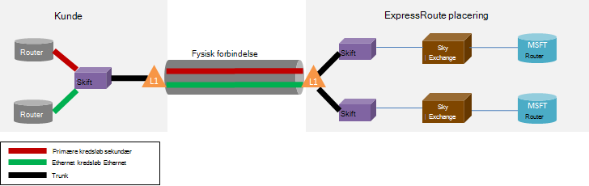

<properties
   pageTitle="ExpressRoute ofte stillede spørgsmål"
   description="ExpressRoute ofte stillede spørgsmål indeholder oplysninger om understøttes Azure Services, omkostninger, Data og forbindelser, SERVICENIVEAUAFTALE, udbydere og placeringer, båndbredde og flere tekniske detaljer."
   documentationCenter="na"
   services="expressroute"
   authors="cherylmc"
   manager="carmonm"
   editor=""/>
<tags
   ms.service="expressroute"
   ms.devlang="na"
   ms.topic="article" 
   ms.tgt_pltfrm="na"
   ms.workload="infrastructure-services"
   ms.date="10/10/2016"
   ms.author="cherylmc"/>

# ExpressRoute ofte stillede spørgsmål

## Hvad er ExpressRoute?
ExpressRoute er en Azure-tjeneste, hvor du kan oprette private forbindelser mellem Microsoft datacentre og infrastruktur, der er i din virksomhed eller i en outsourcing facilitet. ExpressRoute forbindelser ikke gå via offentlige internettet og tilbyder højere sikkerhed, pålidelighed og hastigheder med lavere latenstider end typisk forbindelser via internettet.

### Hvad er fordelene ved at bruge ExpressRoute og private netværksforbindelser?
ExpressRoute forbindelser ikke gå via offentlige internettet, og tilbyder højere sikkerhed, pålidelighed og hastigheder med lavere og ensartede latenstider end typisk forbindelser via internettet. I nogle tilfælde ved hjælp af ExpressRoute forbindelser til at overføre data mellem lokale enheder og Azure kan generere betydeligt omkostninger fordele.

### Hvilke Microsofts skytjenester understøttes over ExpressRoute?
ExpressRoute understøtter de fleste Microsoft Azure-tjenester i dag herunder Office 365.  Søg efter opdateringer på snart generelt tilgængelig.

### Hvor er tjenesten?
Se denne side for tjenesten placering og tilgængelighed: [ExpressRoute partnere og placeringer](expressroute-locations.md).

### Hvordan kan jeg bruge ExpressRoute til at oprette forbindelse til Microsoft, hvis jeg ikke har partnerskaber med en af ExpressRoute carrier partnerne?
Du kan vælge en internationale carrier og lander Ethernet-forbindelser til en af de understøttede exchange udbyder placeringer. Du kan derefter peer-med Microsoft på udbyder placeringen. Markér den sidste del af [ExpressRoute partnere og placeringer](expressroute-locations.md) til at se, om din tjenesteudbyder findes i et af exchange steder. Du kan derefter bestille et ExpressRoute kredsløb via tjenesteudbyder at oprette forbindelse til Azure.

### Hvor meget koster ExpressRoute?
Markér [priser detaljer](https://azure.microsoft.com/pricing/details/expressroute/) for prisoplysninger.

### Hvis jeg betale for et ExpressRoute kredsløb af en bestemt båndbredde, VPN-forbindelsen jeg købe fra mit netværkstjenesteudbyder behøver at være den samme hastighed?
Nej. Du kan købe en VPN-forbindelse med en hvilken som helst hastighed fra din udbyder. Din forbindelse til Azure dog begrænset til den ExpressRoute kredsløb båndbredde, du køber.

### Skal jeg anvende muligheden for at burst op til højere hastigheder, hvis det er nødvendigt, hvis jeg betale for et ExpressRoute kredsløb for en given båndbredde?
Ja. ExpressRoute kredsløb er konfigureret til at understøtte tilfælde, hvor du kan burste op til to gange grænsen båndbredde du udtaget til gratis. Kontakt din tjenesteudbyder, hvis de understøtter denne egenskab.

### Kan jeg bruge den samme private netværksforbindelse med virtuelt netværk og andre Azure tjenester samtidigt?
Ja. Et ExpressRoute kredsløb én gang konfiguration, kan du få adgang til tjenester i et virtuelt netværk og andre Azure tjenester samtidigt. Du opretter forbindelse til virtuelle netværk private peering stien og andre tjenester over via offentlige peering stien.

### Tilbyder ExpressRoute en serviceaftale (SLA)?
Se [ExpressRoute SLA siden](https://azure.microsoft.com/support/legal/sla/) kan finde flere oplysninger.

## Understøttede tjenester
Mest Azure services understøttes over ExpressRoute.

- Forbindelse til virtuelle computere og skytjenester, der er implementeret i virtuelle netværk, understøttes via private peering stien.
- Azure websteder understøttes via offentlige peering stien.
- IoT Hub understøttes via offentlige peering stien.
- Office 365 understøttes via Microsoft peering stien.
- Alle andre tjenester er tilgængelige via offentlige peering stien. Undtagelserne er som følger:

    **Følgende tjenester understøttes ikke:**

    - LEVERANDØR(ER)
    - Visual Studio Team Services test af belastning
    - Multi-Factor Authentication
    - Trafik Manager

## Data og forbindelser

### Er der begrænsninger på mængden data, som jeg kan overføre ved hjælp af ExpressRoute?
Vi ikke angive en grænse for mængden dataoverførsel. Referere til [priser detaljer](https://azure.microsoft.com/pricing/details/expressroute/) for oplysninger om båndbredde satser.

### Hvilke forbindelseshastigheder understøttes af ExpressRoute?
Understøttede båndbredde tilbud:

| 50 Mbps, 100 Mbps, 200 Mbps, 500 Mbps, 1Gbps, 2 Gbps, 5 Gbps, 10Gbps |

### Hvilke tjenesteudbydere findes der?
Se [ExpressRoute partnere og placeringer](expressroute-locations.md) til listen over tjenesteudbydere og placeringer.

## Tekniske detaljer

### Hvad er de tekniske krav til at oprette forbindelse til min lokale placering til Azure?
Se [ExpressRoute forudsætninger side](expressroute-prerequisites.md) for at se krav.

### Er forbindelser til ExpressRoute overflødige?
Ja. Hvert Express distribuere kredsløb har et overflødige par på tværs af forbindelser, der er konfigureret til at levere høj tilgængelighed.

### Mister jeg connectivity Hvis en af kæderne ExpressRoute mislykkes?
Du vil ikke miste forbindelse, hvis en af de cross forbindelser mislykkes. En overflødige forbindelse er tilgængelig til at understøtte belastning på netværket. Desuden kan du oprette flere kredsløb flyttet til at opnå manglende spændstighed peering.

### Hvis jeg er ikke samtidig findes i en sky exchange og min udbyder tilbyder punkt til punkt-forbindelse, skal jeg Bestil to fysiske forbindelser mellem min lokale netværk og Microsoft? 
Nej, du skal kun bruge én fysisk forbindelse, hvis din tjenesteudbyder kan etablere to Ethernet virtuelle kredsløb over den fysiske forbindelse. Den fysiske forbindelse (f.eks. en optisk fiber) er afsluttet på et lag 1 (L1)-enhed (se billedet nedenfor). De to Ethernet virtuelle kredsløb er mærket med forskellige VLAN id'er, én for det primære kredsløb og én til sekundært. Disse VLAN-id'er er i den ydre 802.1Q Ethernet sidehoved. Indre 802.1Q Ethernet sidehoved (ikke vist) er knyttet til et bestemt [ExpressRoute routing-domæne](expressroute-circuit-peerings.md). 

### Kan jeg Udvid en af mine VLAN'er til Azure ved hjælp af ExpressRoute?
Nej. Vi understøtter ikke lag 2 connectivity udvidelser til Azure.

### Kan jeg have mere end én ExpressRoute kredsløb i mit abonnement?
Ja. Du kan have mere end én ExpressRoute kredsløb i dit abonnement. Standardgrænsen for antallet af dedikeret kredsløb er indstillet til 10. Du kan kontakte Microsoft Support for at øge grænsen, hvis det er nødvendigt.

### Kan jeg have ExpressRoute kredsløb fra forskellige tjenesteudbydere?
Ja. Du kan have ExpressRoute kredsløb med mange tjenesteudbydere. Hvert ExpressRoute kredsløb knyttes til kun én tjenesteudbyder.

### Hvordan opretter jeg forbindelse min virtuelle netværk til en ExpressRoute kredsløb
De grundlæggende trin er beskrevet herunder.

- Du skal oprette et ExpressRoute kredsløb og have udbyderen af aktivere den.
- Du eller udbyderen, der skal konfigurere den BGP peering (s).
- Du skal knytte det virtuelle netværk til ExpressRoute kredsløb.

Du kan få flere oplysninger i [ExpressRoute arbejdsprocesser for klargøring af kredsløb og kredsløb tilstand](expressroute-workflows.md) .

### Er der connectivity grænser for min ExpressRoute kredsløb?
Ja. [ExpressRoute partnere og placeringer](expressroute-locations.md) side indeholder en oversigt over connectivity grænserne for en ExpressRoute kredsløb. Det er begrænset til et enkelt geopolitiske område til et ExpressRoute kredsløb. Forbindelse kan udvides til at cross geopolitiske områder ved at aktivere funktionen ExpressRoute premium.

### Kan jeg oprette et link til mere end én virtuelt netværk til en ExpressRoute kredsløb?
Ja. Du kan sammenkæde op til 10 virtuelle netværk til en ExpressRoute kredsløb.

### Jeg har flere Azure abonnementer, der indeholder virtuelle netværk. Kan jeg oprette forbindelse virtuelle netværk, der findes i separate abonnementer til en enkelt ExpressRoute kredsløb?
Ja. Du kan give op til 10 andre Azure abonnementer til brug af et enkelt ExpressRoute kredsløb. Denne grænse forbedres ved at aktivere funktionen ExpressRoute premium.

Få mere at vide, se [dele en ExpressRoute kredsløb på tværs af flere abonnementer](expressroute-howto-linkvnet-arm.md).

### Er virtuelle netværk, der er forbundet til det samme kredsløb isolerede fra hinanden?
Nej. Alle virtuelle netværk, der er sammenkædet med det samme ExpressRoute kredsløb er en del af den samme routing-domæne og kan ikke adskilt fra hinanden fra et dirigere perspektiv. Hvis du skal bruge distribuere isolationsniveauet, skal du oprette et separat ExpressRoute kredsløb.

### Kan jeg have et virtuelt netværk, der er forbundet med mere end én ExpressRoute kredsløb?
Ja. Du kan sammenkæde et enkelt virtuelt netværk med op til 4 ExpressRoute kredsløb. De skal være bestilt via 4 forskellige [ExpressRoute placeringer](expressroute-locations.md).

### Kan jeg få adgang til internettet fra min virtuelle netværk, der er knyttet til ExpressRoute kredsløb?
Ja. Hvis du ikke har annonceret standard omdirigerer (0.0.0.0/0) eller internet distribuere præfikser via BGP-session, vil du kunne oprette forbindelse til internettet fra et virtuelt netværk, der er knyttet til et ExpressRoute kredsløb.

### Kan jeg blokere forbindelse til internettet med virtuelle netværk, der er knyttet til ExpressRoute kredsløb?
Ja. Du kan annoncere standard omdirigerer (0.0.0.0/0) Hvis du vil blokere alle forbindelse til internettet virtuelle maskiner implementeret i et virtuelt netværk og dirigere al trafik ud via ExpressRoute kredsløb. Bemærk, at hvis du annoncere standard omdirigerer, vi tvinge trafik til tjenester, der tilbydes over offentlige peering (såsom Azure-lager og SQL DB) tilbage til din virksomhed. Du er nødt til at konfigurere din routere for at returnere trafik til Azure via offentlige peering stien eller via internettet.

### Kan virtuelle netværk, der er sammenkædet med det samme ExpressRoute kredsløb tale med hinanden?
Ja. Virtuelle maskiner implementeret i virtuelle netværk, der er forbundet med det samme ExpressRoute kredsløb kan kommunikere med hinanden.

### Kan jeg bruge til websted forbindelse til virtuelle netværk sammen med ExpressRoute?
Ja. ExpressRoute kan fungere sammen med VPN til-websted.

### Kan jeg flytte et virtuelt netværk fra websted til websted / punkt-til-site konfiguration bruge ExpressRoute?
Ja. Du er nødt til at oprette en ExpressRoute gateway i netværket virtuel. Der vil være en lille nedetid, der er knyttet til processen.

### Hvad har jeg brug for at oprette forbindelse til Azure lager over ExpressRoute?
Du skal oprette et ExpressRoute kredsløb og konfigurere omdirigerer for offentlige peering.

### Er der begrænsninger på antallet af omdirigerer jeg kan annoncere?
Ja. Vi accepterer op til 4000 distribuere præfikser for private peering og 200 for offentlige peering og Microsoft peering. Du kan øge dette til 10.000 omdirigerer til private peering, hvis du aktiverer funktionen ExpressRoute premium.

### Er der begrænsninger på IP-områder, jeg kan annoncere over BGP session?
Vi ikke kan acceptere privat præfikser (RFC1918) i den offentlige og Microsoft peering BGP-session.

### Hvad sker der, hvis jeg overskrider BGP begrænser?
BGP sessioner fjernes. De nulstilles, når præfiks antallet går under grænsen.

### Hvad er ExpressRoute BGP venteposition tid? Kan den justeres?
Hold tidspunkt er 180. Heller meddelelser sendes hver 60 sekunder. Disse er faste indstillinger i Microsoft-side, der ikke kan ændres.

### Når jeg får besked standardruten (0.0.0.0/0) min virtuelle netværk, kan jeg kan ikke aktivere Windows, der kører på min Azure FOS. Hvordan til jeg løse dette?
Følgende trin til at genkende aktiveringsanmodningen Azure:

1. Oprette offentlige peering for din ExpressRoute kredsløb.
2. Udføre en DNS-opslag, og find **kms.core.windows.net** IP-adresse
3. Gør derefter et af følgende to elementer, så nøgleadministrationstjeneste kan genkende, aktiveringsanmodningen kommer fra Azure og vil imødekomme anmodningen.
    - Omdirigere trafikken til IP-adresse (fået i trin 2) tilbage til Azure via det offentlige peering på dit lokale netværk.
    - Har din bemærkninger udbyder hår-pinkode trafik tilbage til Azure via det offentlige peering.

### Kan jeg ændre båndbredden for et ExpressRoute kredsløb?
Ja. Du kan øge båndbredden for et ExpressRoute kredsløb uden at det. Du skal følge op på udbyderen forbindelse for at sikre, at de opdaterer throttles i deres netværk til at understøtte båndbredde øge. Du kan dog ikke kunne reducere båndbredden for et ExpressRoute kredsløb. Skulle nederste båndbredden vil betyde, at en rives ned og fritid af et ExpressRoute kredsløb.

### Hvordan ændrer jeg et ExpressRoute kredsløb båndbredde?
Du kan opdatere båndbredden for den ExpressRoute kredsløb, ved hjælp af update dedikeret kredsløb API og PowerShell-cmdlet.

## ExpressRoute Premium

### Hvad er ExpressRoute premium?
ExpressRoute premium er en samling af funktioner, der vises nedenfor.

 - Øget routing tabel grænse fra 4000 omdirigerer for 10.000 omdirigerer til private peering.
 - Øget antallet af VNets, der kan forbindes til ExpressRoute kredsløb (standard er 10). Se tabellen nedenfor for at få mere at vide.
 - Global forbindelse via Microsoft core netværk. Du kan nu sammenkæde en VNet i ét geopolitiske område med et ExpressRoute kredsløb i et andet område. **Eksempel:** Du kan sammenkæde en VNet, der er oprettet i Europa vest til en ExpressRoute kredsløb, der er oprettet i Silicon Valley.
 - Forbindelse til Office 365-tjenester og CRM Online.

### Hvor mange VNets kan jeg oprette et link til en ExpressRoute kredsløb, hvis jeg har aktiveret ExpressRoute premium?
I tabellen nedenfor vises ExpressRoute grænserne og antallet af VNets per ExpressRoute kredsløb.

[AZURE.INCLUDE [expressroute-limits](../../includes/expressroute-limits.md)]

### Hvordan aktiverer jeg ExpressRoute premium?
ExpressRoute premium-funktioner kan aktiveres, når funktionen er aktiveret og kan blive lukket ned ved at opdatere tilstanden kredsløb. Du kan aktivere ExpressRoute premium på klokkeslættet for oprettelsen af kredsløb eller kan ringe til opdatering dedikeret kredsløb API / PowerShell-cmdlet til at aktivere ExpressRoute premium.

### Hvordan deaktiverer jeg ExpressRoute premium?
Du kan deaktivere ExpressRoute premium ved at ringe til opdateringen dedikeret kredsløb API / PowerShell-cmdlet, skal du sikre dig, at du har skaleret forbindelsen, skal opfylde standard begrænsningerne, før du deaktiverer ExpressRoute premium. Vi mislykkes anmodning om at deaktivere ExpressRoute premium, hvis din anvendelsen skaleres standard grænserne.

### Kan jeg frit vælge de funktioner, jeg vil fra funktionssæt premium?
Nej. Du vil ikke kunne vælge de funktioner, du har brug for. Vi Aktiver alle funktioner, når du slår ExpressRoute premium.

### Hvor meget koster ExpressRoute premium?
Referere til [priser detaljer](https://azure.microsoft.com/pricing/details/expressroute/) for omkostninger.

### Skal jeg betale for ExpressRoute premium ud over standard ExpressRoute gebyrer?
Ja. ExpressRoute premium gebyrer anvende oven på ExpressRoute kredsløb afgifts- og gebyrer, der kræves af provideren connectivity.

## ExpressRoute og Office 365-tjenester og CRM Online

[AZURE.INCLUDE [expressroute-office365-include](../../includes/expressroute-office365-include.md)]

### Hvordan opretter jeg et ExpressRoute kredsløb at oprette forbindelse til Office 365-tjenester og CRM Online?

1. Gennemgå siden [ExpressRoute forudsætninger side](expressroute-prerequisites.md) for at sikre, at du opfylder kravene.
2. Gennemgå listen over tjenesteudbydere og placeringer på [ExpressRoute partnere og placeringer](expressroute-locations.md) for at sikre, at dine connectivity behov er opfyldt.
3. Planlægge dine krav til kapacitet ved at gennemgå [netværksplanlægning og justering af ydeevnen for Office 365](http://aka.ms/tune/).
4. Følg trinnene i de nedenfor for at konfigurere connectivity [ExpressRoute arbejdsprocesser for klargøring af kredsløb og kredsløb stater](expressroute-workflows.md)arbejdsprocesser.

>[AZURE.IMPORTANT] Sørg for, at du har aktiveret ExpressRoute premium tilføjelsesprogram, når du konfigurerer forbindelse til Office 365-tjenester og CRM Online.

### Har jeg brug for at aktivere Azure offentlige Peering til at oprette forbindelse til Office 365-tjenester og CRM Online?
Nej, skal du kun aktivere Microsoft Peering. Godkendelsestrafik til Azure AD sendes via Microsoft Peering. 

### Min eksisterende ExpressRoute kredsløb kan understøtte forbindelse til Office 365-tjenester og CRM Online?
Ja. Din eksisterende ExpressRoute kredsløb kan være konfigureret til at understøtte forbindelse til Office 365-tjenester. Sørg for, at du har tilstrækkelig kapacitet til at oprette forbindelse til Office 365-tjenester, og Sørg for, at du har aktiveret premium tilføjelsesprogram. [Netværksplanlægning og justering af ydeevnen for Office 365](http://aka.ms/tune/) hjælper dig med at planlægge din connectivity behov. Se også [oprette og redigere et ExpressRoute kredsløb](expressroute-howto-circuit-classic.md).

### Hvilke Office 365, kan få adgang til tjenester via en ExpressRoute forbindelse?

Se siden med [Office 365 URL-adresser og IP-adresseområder](http://aka.ms/o365endpoints) for en opdateret listen over tjenester, der understøttes over ExpressRoute.

### Hvor meget koster ExpressRoute til Office 365-tjenester og CRM Online omkostninger?
Office 365-tjenester og CRM Online kræver premium tilføjelsesprogram til være aktiveret. [Priser oplysningssiden](https://azure.microsoft.com/pricing/details/expressroute/) indeholder oplysninger om omkostninger til ExpressRoute.

### Hvilke områder understøttes ExpressRoute til Office 365 i?
Se i [ExpressRoute partnere og placeringer](expressroute-locations.md) for flere oplysninger på listen over partnere og steder, hvor ExpressRoute understøttes.

### Kan jeg få adgang til Office 365 via internettet selvom ExpressRoute blev konfigureret for min organisation?
Ja. Office 365-tjenesten slutpunkter er tilgængelige via internettet, selvom ExpressRoute er blevet konfigureret til dit netværk. Hvis du er på en placering, der er konfigureret til at oprette forbindelse til Office 365-tjenesterne via ExpressRoute, kan du oprette forbindelse via ExpressRoute.

### Kan Dynamics AX Online åbnes via en ExpressRoute forbindelse?
Nej, det er ikke understøttet.
