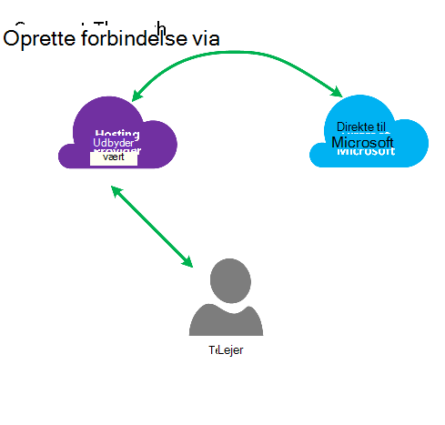
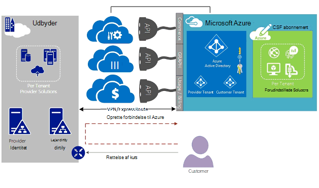
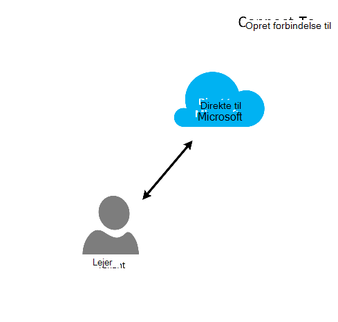
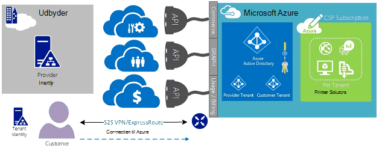
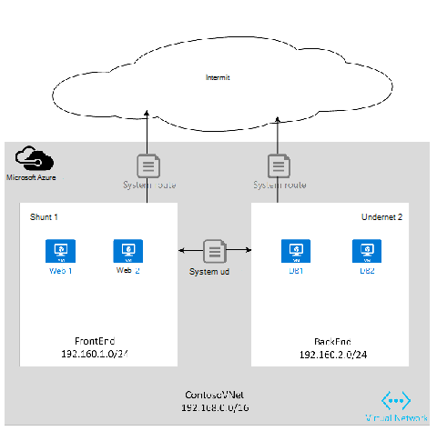

<properties
   pageTitle="Azure ExpressRoute til skyen løsningsudbydere | Microsoft Azure"
   description="I denne artikel indeholder oplysninger til skyen tjenesteudbydere, vil inkorporere Azure tjenester og ExpressRoute til deres tilbud."
   documentationCenter="na"
   services="expressroute"
   authors="richcar"
   manager="carmonm"
   editor=""/>
<tags
   ms.service="expressroute"
   ms.devlang="na"
   ms.topic="get-started-article"
   ms.tgt_pltfrm="na"
   ms.workload="infrastructure-services"
   ms.date="10/10/2016"
   ms.author="richcar"/>

# ExpressRoute til skyen løsningsudbydere (CSP)

Microsoft yder Hyper-skala tjenester til traditionel forhandlere og forhandlere (CSP) for at kunne hurtigt Klargør nye tjenester og løsninger til dine kunder uden at investere i udvikling af disse nye tjenester. Hvis du vil tillade skyen løsning udbyder (CSP) muligheden for at administrere direkte disse nye tjenester, indeholder Microsoft-programmer og API'er, der tillader Konferencetjenesteudbyderen til at administrere Microsoft Azure ressourcer på vegne af dine kunder. En af disse ressourcer er ExpressRoute. ExpressRoute kan Konferencetjenesteudbyderen tilsluttes eksisterende kunderessourcer til Azure tjenester. ExpressRoute er et link til høj hastighed privat kommunikation til tjenester i Azure. 

ExpresRoute består af et par kredsløb for høj tilgængelighed, der er knyttet til en enkelt kunde-abonnementer og ikke kan deles af flere forskellige kunder. Hvert kredsløb skal afsluttes i en anden router til at vedligeholde høj tilgængelighed.

>[AZURE.NOTE] Der er båndbredde og forbindelse caps på ExpressRoute, hvilket betyder, at store/komplekse installationer kræver flere ExpressRoute kredsløb for en enkelt kunde.

Microsoft Azure indeholder en stigende række tjenester, du kan tilbyde til dine kunder.  Til bedste få fordel af disse tjenester kræver, at afkrydsningsfeltet Brug ExpressRoute forbindelser til at levere høj hastighed lav ventetid adgang til Microsoft Azure-miljø.

## Microsoft Azure management
Microsoft yder CSP'er med API'er til at administrere Azure kunde abonnementer ved at tillade programmeringsmæssig integration med dine egne systemer til administration af tjenesten. Understøttede funktioner kan findes [her](https://msdn.microsoft.com/library/partnercenter/dn974944.aspx).

## Microsoft Azure ressourcestyring
Afhængigt af den kontrakt, du har med kunden bestemmer hvordan abonnementet vil blive administreret. Konferencetjenesteudbyderen direkte kan administrere oprettelse og vedligeholdelse af ressourcer eller kunden kan stadig har kontrollen over Microsoft Azure-abonnement og oprette de Azure ressourcer, som de skal bruge. Hvis din kunde administrerer oprettelse af ressourcer i deres Microsoft Azure-abonnement de bruger en af to modeller: model "Opret forbindelse via" eller "Direkte til" model. Disse modeller er beskrevet mere detaljeret i de følgende afsnit.  

### Oprette forbindelse via model

  

Konferencetjenesteudbyderen opretter i modellen Opret forbindelse via en direkte forbindelse mellem din datacenter og kundens Azure abonnement. Direkte forbindelsen er oprettet ved hjælp af ExpressRoute, forbinder dit netværk med Azure. Kunden opretter derefter forbindelse til netværket. Dette scenarie kræver, at kunden passerer gennem CSP netværket for at få adgang til Azure tjenester. 

Hvis din kunde har andre Azure-abonnementer ikke administreres af den du, bruger de offentlige internettet eller deres egne private forbindelse til at oprette forbindelse til disse tjenester, der er klargjort under abonnementets ikke CSP. 

CSP administrere Azure services, forudsættes det, at Konferenceudbyderen har en tidligere eksisterende kunde identitet store, vil replikeres til Azure Active Directory til administration af deres CSP abonnement via Administrate-On-Behalf-Of (AOBO). Vigtige drivere til dette scenario omfatter, hvor en given partner eller tjenesteudbyder har en eksisterende relation med kunden, kunden forbrug udbydertjenester i øjeblikket eller partneren har ønske om at angive en kombination af udbyder hostet og Azure-hostet løsninger til at levere fleksibilitet og adresse kunde udfordringer, der kan være opfyldt ved CSP alene. Denne model illustreres i **figur**, herunder.

### Oprette forbindelse til model

I modellen Opret forbindelse til udbyderen af opretter en direkte forbindelse mellem deres kundens datacenter og CSP klargjort Azure abonnementet ved hjælp af ExpressRoute over kundens (kunde) netværk.

>[AZURE.NOTE] Kunden skal for ExpressRoute til at oprette og vedligeholde ExpressRoute kredsløb.  

Dette scenarie connectivity kræver, at kunden forbinder direkte via en kundenetværket opnås adgang til CSP-administreret Azure abonnement, ved hjælp af en direkte netværksforbindelse, der er oprettet, ejes og administreres helt eller delvist af kunden. En kunde identitet store etableret for disse kunder, forudsættes det, udbyderen, der ikke er i øjeblikket, og udbyderen, der vil hjælpe kunden i replikering deres aktuelle Identificer lager til Azure Active Directory til administration af deres abonnement via AOBO. Vigtige drivere til dette scenario omfatter hvor en given partner eller tjenesteudbyder har en eksisterende relation med kunden, kunden forbrug udbydertjenester i øjeblikket, eller partneren har gerne Tilbyd tjenester, der er baseret på Azure-hostet løsninger uden brug af en eksisterende udbyder datacenter eller infrastruktur alene.

Valget mellem disse to indstilling er baseret på kundens behov og din aktuelle skal oplyse Azure tjenester. Oplysninger om disse-modeller og den tilknyttede rollebaseret adgang styre, netværk og identitet designs behandles i detaljer i følgende links:
-   **Rolle baseret Access kontrolelement (RBAC)** – RBAC er baseret på Azure Active Directory.  Finde flere oplysninger om Azure RBAC [her](../active-directory/role-based-access-control-configure.md).
-   **Netværk** – omhandler de forskellige emner af netværk i Microsoft Azure.
-   **Azure Active Directory (AAD)** – AAD indeholder identitet management til Microsoft Azure og 3 part SaaS programmer. Du kan finde flere oplysninger om Azure AD se [her](https://azure.microsoft.com/documentation/services/active-directory/).  

## Netværk hastigheder
ExpressRoute understøtter netværk hastigheder fra 50 Mb/s til 10Gb/s. Dette giver mulighed for kunder til at købe mængden netværksbåndbredde, der kræves for deres unikke miljø.

>[AZURE.NOTE] Netværksbåndbredde øges efter behov uden at afbryde kommunikationen, men for at reducere netværket hastighed kræver afbrydelse af kredsløbet og genopretter den på den nederste netværkshastighed.  

ExpressRoute understøtter flere vNets til en enkelt ExpressRoute kredsløb forbindelsen til bedre udnyttelse af hurtigere forbindelser. Et enkelt ExpressRoute kredsløb kan deles af flere Azure abonnementer ejes af den samme kunde.

## Konfiguration af ExpressRoute
ExpressRoute kan være konfigureret til at understøtte tre typer trafik ([routing domæner](#ExpressRoute-routing-domains)) over et enkelt ExpressRoute kredsløb. Denne trafik er adskilt i Microsoft peering, Azure offentlige peering og private peering. Du kan vælge et eller alle typer trafik sendes via et enkelt ExpressRoute kredsløb eller bruge flere ExpressRoute kredsløb afhængigt af størrelsen på ExpressRoute kredsløb og isolationsniveauet, der kræves, før din kunde. Sikkerhed stilling af kunden er ikke muligt trafik offentlige og private trafik til gennemgang over det samme kredsløb.

### Oprette forbindelse via model
Du skal være ansvarlig for alle netværk fundament til at oprette forbindelse til dine kunder datacenter ressourcer til abonnementerne Azure som vært i en konfiguration med Opret forbindelse til. Hver af kundens, vil bruge Azure-funktioner skal deres egne ExpressRoute forbindelse, som vil blive administreret af den dig. Du bruger de samme metoder, der er kunden bruger til at levere ExpressRoute kredsløb. Du vil følge de samme trin, der er beskrevet i artiklen [ExpressRoute arbejdsprocesser](./expressroute-workflows.md) for klargøring af kredsløb og kredsløb stater. Du kan derefter konfigurere kant Gateway Protocol (BGP) omdirigerer for at styre den trafik, der flyder mellem lokale netværk og Azure vNet.

### Oprette forbindelse til model
I en Opret forbindelse til konfiguration kunden allerede har en eksisterende forbindelse til Azure eller starter en forbindelse til internetudbyderen sammenkædning ExpressRoute fra din kundes egen datacenter direkte til Azure, i stedet for datacentret. For at starte processen klargøring, vil din kunde Følg trinnene, som beskrevet i modellen Opret forbindelse via ovenfor. Når kredsløbet har oprettet din kunde skal konfigurere lokale routerne for at kunne få adgang til både netværket og Azure vNets.

Du kan hjælpe med at konfigurere forbindelsen og konfiguration af omdirigerer for at tillade ressourcerne i din datacenter(s) til at kommunikere med klientressourcer i dit datacenter eller med de ressourcer, der er hostet i Azure.

## ExpressRoute routing domæner
ExpressRoute indeholder tre routing domæner: offentlige og private og Microsoft peering. Hver af de routing domæner er konfigureret med identiske routere i aktiv-aktiv konfiguration for høj tilgængelighed. Få mere at vide på ExpressRoute routing domæner se [her](./expressroute-circuit-peerings.md).

Du kan definere brugerdefinerede omdirigerer filtre, så kun de (eller veje) du vil tillade eller har brug for. Du kan finde flere oplysninger eller for at se, hvordan du har foretaget disse ændringer artiklen: [Opret og rediger rute for en ExpressRoute kredsløb, ved hjælp af PowerShell](./expressroute-howto-routing-classic.md) få mere at vide om routing filtre.

>[AZURE.NOTE] Forbindelsen skal være via en offentlige IP-adresse, der er ejet af kunden eller CSP til Microsoft og offentlige Peering og skal overholde alle definerede regler. Finde yderligere oplysninger finder du på siden [ExpressRoute forudsætninger](expressroute-prerequisites.md) .  

## Routing
ExpressRoute opretter forbindelse til de Azure netværk via Azure virtuelle netværksgateway. Netværk gateways muliggøre routing til Azure virtuelle netværk.

Oprette virtuelle Azure-netværk, oprettes der også en routing standardtabel til vNet til at dirigere trafik til/fra-undernet i vNet. Hvis tabellen standard rute er tilstrækkelig for brugerdefineret løsningen kan omdirigerer oprettes for at omdirigere udgående trafik til brugerdefineret anvendelser eller blok omdirigerer til bestemte undernet eller eksterne netværk.

### Standard routing
Distribuere standardtabel indeholder følgende omdirigerer:

- Routing i et undernet
- Undernet-undernet inden for det virtuelle netværk
- På internettet
- Virtuelt netværk til virtuelle netværk ved hjælp af VPN-gateway
- Virtuelt netværk-til-lokale netværk ved hjælp af en VPN- eller ExpressRoute gateway

  

### Brugerdefinerede routing (UDR)
Brugerdefinerede omdirigerer tillader styring af trafik udgående fra det tildelte undernet til andre undernet i det virtuelle netværk eller over en af de andre foruddefinerede gateways (ExpressRoute; internettet eller VPN). Tabellen standard system routing kan erstattes med en brugerdefineret routing tabel, der erstatter Standardtabellen routing med brugerdefinerede omdirigerer. Med brugerdefinerede routing kunder Opret bestemte omdirigerer til anvendelser som firewalls eller uautoriseret adgang registrering anvendelser, eller Bloker adgang til bestemte undernet fra det undernet, der er vært for den brugerdefinerede distribuere. Se for en oversigt over brugerdefineret omdirigerer [her](../virtual-network/virtual-networks-udr-overview.md). 

## Sikkerhed
Afhængigt af hvilken model er i brug, Opret forbindelse til eller oprette forbindelse via, er kunden definerer sikkerhedspolitikkerne i deres vNet eller indeholder sikkerheden politik for krav til Konferencetjenesteudbyderen til at definere til deres vNets. Kan defineres følgende sikkerhedskriterier for:

1.  **Kunde isolationsniveauet** – feltet Azure platform indeholder kunde isolationsniveauet ved at gemme kunde-ID og vNet oplysninger i en sikker database, som bruges til at omfatter hver kunde trafik i en GRE tunnel.
2.  Der er **Netværk sikkerhed gruppe (NSG)** regler til at definere tilladt trafik til og fra undernet i vNets i Azure. Som standard indeholder NSG blokeringsregler til at blokere trafik fra internettet til vNet og tillade, at regler for trafik inden for en vNet. Se for flere oplysninger om netværk sikkerhedsgrupper [her](https://azure.microsoft.com/blog/network-security-groups/).
3.  **Tving tunnelføring** – dette er en indstilling for at omdirigere bundet internettrafik kommer i Azure at blive omdirigeret over ExpressRoute forbindelsen til det på det lokale miljø datacenter. Se for flere oplysninger om tvungen tunnelføring [her](./expressroute-routing.md#advertising-default-routes).  

4.  **Kryptering** – også selvom ExpressRoute kredsløb dedikeret til en bestemt kunde, er der mulighed, udbyderen af det netværk kan være opfyldt, så en person til at undersøge pakke trafik. Du kan løse dette potentiale ved en kunde eller CSP kan kryptere trafik via forbindelsen ved at definere IPSec-tunnel-tilstand politikker for al trafik der flyder mellem den lokale ressourcer og Azure ressourcer (se til valgfrit tunneltilstand IPSec for kunde 1 i figur 5: ExpressRoute sikkerhed, ovenfor). Den anden mulighed er at bruge en firewall anvendelse på de enkelte ExpressRoute kredsløb slutpunkt. Dette kræver yderligere 3 part firewall FOS/anvendelser skal være installeret på begge ender til at kryptere trafikken over ExpressRoute kredsløb.

  

## Næste trin
Tjenesten skyen løsningsudbyder giver dig en metode til at øge din værdi til dine kunder uden brug af dyr infrastruktur og muligheden for køb, samtidig med at din position som primær outsourcing udbyder. Nem integration med Microsoft Azure kan gøres gennem CSP API, så du kan integrere styring af Microsoft Azure i din eksisterende management strukturer.  

Yderligere oplysninger finder du på følgende links:

[Microsoft Cloud Solution Provider program](https://partner.microsoft.com/en-US/Solutions/cloud-reseller-overview).  
[Klar til at transact som en skybaseret løsningsudbyder](https://partner.microsoft.com/en-us/solutions/cloud-reseller-pre-launch).  
[Microsoft Cloud Solution Provider ressourcer](https://partner.microsoft.com/en-us/solutions/cloud-reseller-resources).
