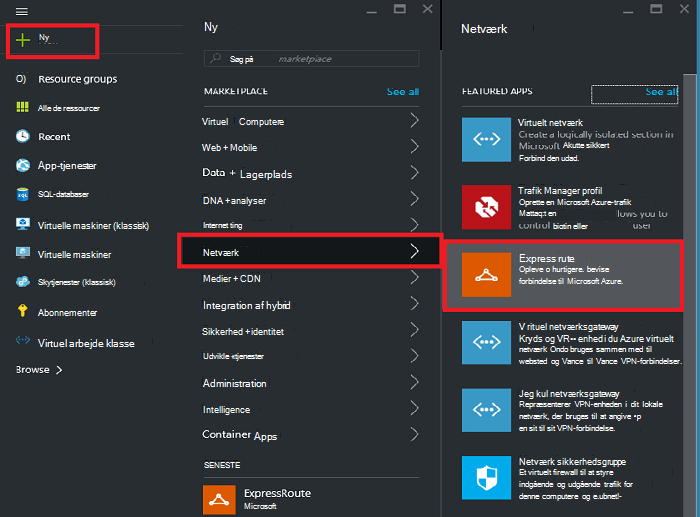
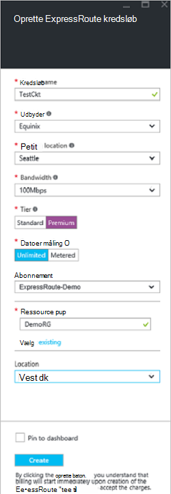
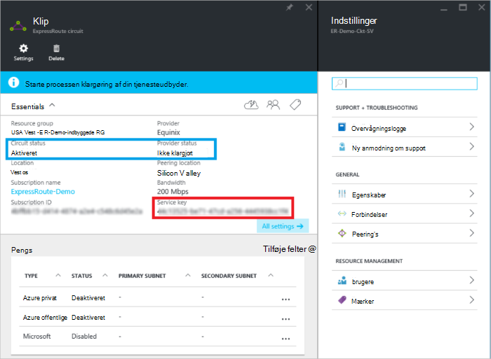
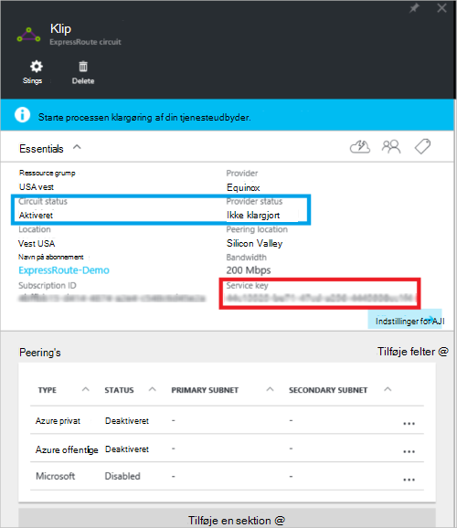
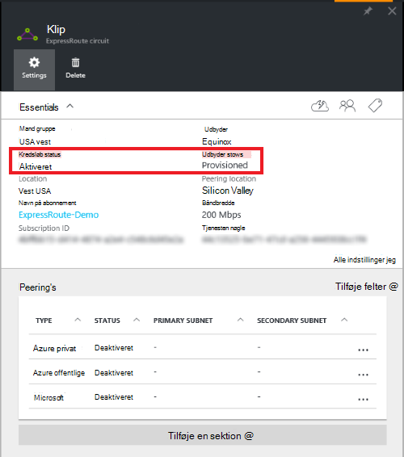

<properties
   pageTitle="Oprette og redigere et ExpressRoute kredsløb ved hjælp af Ressourcestyring og portalen Azure | Microsoft Azure"
   description="I denne artikel beskrives, hvordan du opretter, klargøre, bekræfte, opdatere, slette og deprovision et ExpressRoute kredsløb."
   documentationCenter="na"
   services="expressroute"
   authors="cherylmc"
   manager="carmonm"
   editor=""
   tags="azure-resource-manager"/>
<tags
   ms.service="expressroute"
   ms.devlang="na"
   ms.topic="article"
   ms.tgt_pltfrm="na"
   ms.workload="infrastructure-services"
   ms.date="10/10/2016"
   ms.author="cherylmc"/>

# Oprette og redigere et ExpressRoute kredsløb

> [AZURE.SELECTOR]
[Azure Portal - ressourcestyring](expressroute-howto-circuit-portal-resource-manager.md)
[PowerShell - ressourcestyring](expressroute-howto-circuit-arm.md)
[PowerShell - klassisk](expressroute-howto-circuit-classic.md)

I denne artikel beskrives, hvordan du opretter et Azure ExpressRoute kredsløb ved hjælp af portalen Azure og implementeringsmodel Azure ressourcestyring. Følgende trin også viser, hvordan du kontrollere status for kredsløbet, opdatere, eller slette og deprovision den.

**Om Azure-installation modeller**

[AZURE.INCLUDE [vpn-gateway-clasic-rm](../../includes/vpn-gateway-classic-rm-include.md)] 

## Inden du går i gang

- Gennemse [forudsætninger](expressroute-prerequisites.md) og [arbejdsprocesser](expressroute-workflows.md) , inden du starter konfigurationen.
- Sørg for, at du har adgang til [Azure-portalen](https://portal.azure.com).
- Sørg for, at du har tilladelse til at oprette nye netværk ressourcer. Kontakt din kontoadministrator, hvis du ikke har de rette tilladelser.

## Oprette og klargøre et ExpressRoute kredsløb

### 1. log på portalen Azure

Gå til [Azure-portalen](http://portal.azure.com) i en browser, og log på med din Azure-konto.

### 2. Opret et nyt ExpressRoute kredsløb

>[AZURE.IMPORTANT] Din ExpressRoute kredsløb vil blive faktureret fra det tidspunkt, hvor en tjeneste nøgle er udstedt. Sørg for, at du udfører denne handling, når provideren connectivity er klar til at klargøre kredsløbet.

1. Du kan oprette et ExpressRoute kredsløb ved at vælge muligheden for at oprette en ny ressource. Klik på **Ny** > **netværk** > **ExpressRoute**, som vist på følgende billede:

    

2. Når du klikker på **ExpressRoute**, kan du se **oprette ExpressRoute kredsløb** blade. Når du er at udfylde værdierne på denne blade, skal du kontrollere, at du angive den korrekte SKU niveau og data måling.

    - **Niveau** bestemmer, om en ExpressRoute standard eller et ExpressRoute premium tilføjelsesprogram er aktiveret. Du kan angive **Standard** for at hente standard SKU eller **Premium** til premium-tilføjelsesprogrammet.

    - **Data måling** bestemmer typen fakturering. Du kan angive **betalte** for en forbrugsafregnet dataabonnement og **ubegrænset** for en ubegrænset dataabonnement. Bemærk, at du kan ændre typen fakturering fra **betalte** til **ubegrænset**, men du kan ikke ændre typen fra **ubegrænset** til **betalte**.

    

>[AZURE.IMPORTANT] Vær opmærksom på, at den Peering placering angiver den [fysiske placering](expressroute-locations.md) hvor du peering med Microsoft. Dette er **ikke** tilknyttet "Placering" ejendom, der refererer til den Geografi, hvor provideren Azure netværk ressource er placeret. Mens de ikke er forbundet, er det en god ide at vælge en udbyder af netværk ressource geografisk tæt Peering placeringen af kredsløbet. 

### 3. se kredsløb og egenskaber

**Få vist alle kredsløb**

Du kan få vist alle de kredsløb, du har oprettet ved at vælge **alle de ressourcer** i menuen venstre side.
    

**Få vist egenskaber**

    You can view the properties of the circuit by selecting it. On this blade, note the service key for the circuit. You must copy the circuit key for your circuit and pass it down to the service provider to complete the provisioning process. The circuit key is specific to your circuit.

### 4. sende tasten tjeneste til udbyderen af forbindelse til klargøring

På denne blade oplysninger **udbyder status** på den aktuelle tilstand for klargøring i tjenesteudbyder side. **Kredsløb status** indeholder tilstanden i Microsoft-side. Finde flere oplysninger om kredsløb klargøring stater, i artiklen i [arbejdsprocesser](expressroute-workflows.md#expressroute-circuit-provisioning-states) .

Når du opretter et nyt ExpressRoute kredsløb, bliver kredsløbet i tilstanden følgende:

Udbyder status: ikke klargjort 
Kredsløb status: aktiveret

Kredsløbet ændres til tilstanden følgende, når provideren connectivity er ved at aktivere det for dig:

Status for udbyder: klargøring 
Kredsløb status: aktiveret

Du kan bruge et ExpressRoute kredsløb, skal det være i tilstanden følgende:

Status for udbyder: klargjort 
Kredsløb status: aktiveret

### 5. regelmæssigt kontrollere status og tilstanden for tasten kredsløb

Du kan få vist egenskaberne for det kredsløb, som du er interesseret i, ved at markere den. Kontrollere **status for udbyder** , og Sørg for, at den er flyttet til **Provisioned** , før du fortsætter.

### 6. Opret din routing konfiguration

Se artiklen [konfigurationen af ExpressRoute kredsløb routing](expressroute-howto-routing-portal-resource-manager.md) til at oprette og redigere kredsløb peerings trinvise vejledninger.

>[AZURE.IMPORTANT] Disse instruktioner gælder kun for kredsløb, der er oprettet med tjenesteudbydere, der tilbyder lag 2 forbindelsestjenester. Hvis du bruger en tjenesteudbyder, der indeholder administreret lag 3 tjenester (normalt en IP VPN, som MPLS), udbyderen connectivity skal konfigurere og administrere routing for dig.

### 7. sammenkæde et virtuelt netværk med et ExpressRoute kredsløb

Dernæst skal sammenkæde et virtuelt netværk til din ExpressRoute kredsløb. Brug [sammenkædning virtuelle netværk til ExpressRoute kredsløb](expressroute-howto-linkvnet-arm.md) artiklen, når du arbejder med implementeringsmodel ressourcestyring.

## Hentning af status for et ExpressRoute kredsløb

Du kan få vist status for et kredsløb ved at markere den. 

## Ændre et ExpressRoute kredsløb

Du kan redigere visse egenskaber for et ExpressRoute kredsløb uden at påvirke connectivity. Du kan ikke ændre egenskaber for ExpressRoute kredsløb ved hjælp af portalen Azure på nuværende tidspunkt. Du kan dog bruge PowerShell til at ændre egenskaber for kredsløb. Du kan finde flere oplysninger i afsnittet [ændre et ExpressRoute kredsløb ved hjælp af PowerShell](expressroute-howto-circuit-arm.md#modify).

Du kan gøre følgende med ingen nedetid:

- Aktivere eller deaktivere et ExpressRoute premium tilføjelsesprogram for din ExpressRoute kredsløb.

- Øge båndbredden for din ExpressRoute kredsløb. Bemærk, at nedgradere båndbredden for et kredsløb ikke understøttes. 

- Ændre vha planen fra Forbrugsafregnede Data til ubegrænset Data. Bemærk, at ændre den måling planlægge fra ubegrænset Data til Forbrugsafregnede Data understøttes ikke.

-  Du kan aktivere og deaktivere **Tillad klassisk handlinger**.

Se [ExpressRoute ofte stillede spørgsmål om](expressroute-faqs.md)kan finde flere oplysninger om grænser og begrænsninger.

## Ophævelse af klargøring og sletning af et ExpressRoute kredsløb

Du kan slette din ExpressRoute kredsløb ved at vælge ikonet **Slet** . Bemærk følgende:

- Du skal fjerne sammenkædningen alle virtuelle netværk fra ExpressRoute kredsløbet. Hvis handlingen mislykkes, skal du kontrollere, om nogen virtuelle netværk er kædet sammen med kredsløbet.

- Hvis ExpressRoute kredsløb-udbyder klargøring tjenestetilstand er **artikel Provisioning** eller **Provisioned** skal du arbejde med din udbyder og deprovision kredsløb på deres side. Vi fortsætter med at reservere ressourcer, som du faktureres før udbyderen af er fuldført ophævelse af klargøring kredsløbet og giver os.

- Du kan derefter slette kredsløbet, hvis udbyderen af har fjernet det kredsløb (-udbyder klargøring tjenestetilstand er indstillet til **ikke klargjort**). Dette standser fakturering for kredsløbet

## Næste trin

Når du opretter din kredsløb, skal du sørge for, at du gøre følgende:

- [Oprette og redigere distribution til din ExpressRoute kredsløb](expressroute-howto-routing-portal-resource-manager.md)
- [Sammenkæde netværket virtuel til din ExpressRoute kredsløb](expressroute-howto-linkvnet-arm.md)
